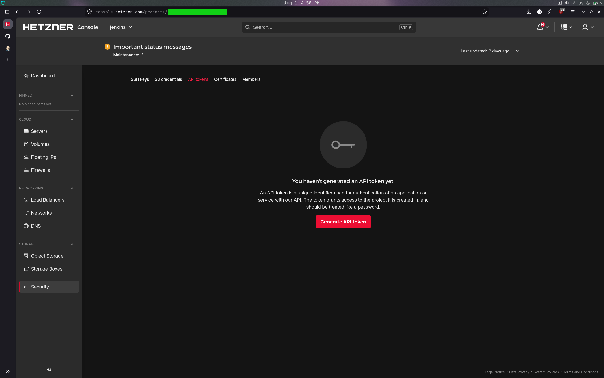
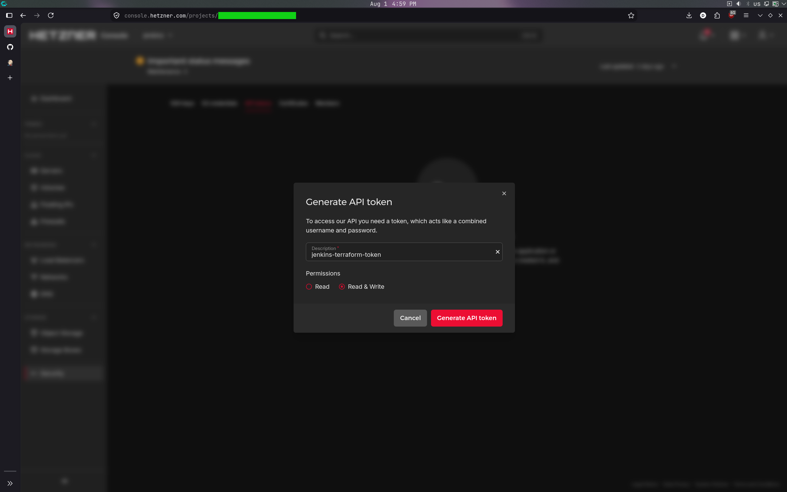

## Introduction

Running Jenkins agents 24/7 is a waste of resources if you only run builds a few times a day. By combining **Terraform** (to build the foundation) with the **Jenkins Hetzner Cloud Plugin**, you can create a CI/CD environment that automatically spawns VMs when a build is queued and permanently deletes them when the build finishes.

Here is the complete step-by-step guide to building this architecture.


**Prerequisites**

* A Hetzner Cloud account
* Basic knowledge of Linux command line, Jenkins, and Terraform
* Terraform installed locally
* Hcloud CLI installed locally

## Step 1 - Generate SSH Keys (Local Terminal)

You need two SSH key pairs: one for you to access the Jenkins Controller, and one for the Jenkins Controller to access the temporary build agents.

Open your local terminal and generate them:

```bash
# 1. Key for you to manage the main Jenkins Controller
ssh-keygen -t ed25519 -f ~/.ssh/hetzner_controller_key -C "admin@jenkins-controller" -N ""

# 2. Key for Jenkins to securely SSH into the ephemeral agents
ssh-keygen -t ed25519 -f ~/.ssh/hetzner_agent_key -C "jenkins@ephemeral-agent" -N ""
```

## Step 2 - Create the Project & API Token (Hetzner Console)

Terraform and Jenkins both need an API token to communicate with Hetzner.

1. Log into the **Hetzner Cloud Console**.
2. Click **+ New Project** and name it `jenkins`.
3. Select the new project and go to **Security** > **API Tokens** in the left sidebar.



4. Click **Generate API Token**.
5. Name it `jenkins-terraform-token` and set permissions to **Read & Write**.



6. **Copy the token immediately** and save it somewhere safe. You will not see it again.

## Step 3 - Write the Terraform Configuration

Terraform creates the private network, firewalls, and the Jenkins Controller VM. It also installs Java 21 and Jenkins automatically via cloud-init. All Jenkins configuration (plugins, credentials, cloud setup) is done manually through the UI after the server boots.

Create a new directory on your local machine, navigate into it, and create the following two files:

### `variables.tf`

```bash
variable "hcloud_token" {
  description = "Your Hetzner Cloud API Token"
  type        = string
  sensitive   = true
}

variable "controller_ssh_pub" {
  description = "Path to the public key for the Jenkins Controller"
  default     = "~/.ssh/hetzner_controller_key.pub"
}
```

### `main.tf`

This file provisions the network, firewalls, and the controller server. It uses `cloud-init` to automatically install Java 21 and Jenkins on the controller when it boots.

> **Note:** The configuration provided below is a template for showcase purposes. Feel free to change things to better suit your needs. For example, you can:
> * First, update the `location`, `server_type`, or `image` for the Jenkins Controller for your specific use case.
> * Then, for more advanced setups, update this Terraform template with additional infrastructure or configuration for your use case (e.g., adding an Nginx reverse proxy, etc.).
> * Restrict the source IPs for port 22 in the `jenkins-controller-firewall` to your own IP for better security.

```bash
terraform {
  required_providers {
    hcloud = {
      source  = "hetznercloud/hcloud"
      version = "~> 1.45"
    }
  }
}

provider "hcloud" {
  token = var.hcloud_token
}

resource "hcloud_ssh_key" "admin_key" {
  name       = "jenkins-admin-key"
  public_key = file(var.controller_ssh_pub)
}

resource "hcloud_network" "jenkins_net" {
  name     = "jenkins-network"
  ip_range = "10.0.0.0/16"
}

resource "hcloud_network_subnet" "jenkins_subnet" {
  network_id   = hcloud_network.jenkins_net.id
  type         = "cloud"
  network_zone = "eu-central"
  ip_range     = "10.0.1.0/24"
}

resource "hcloud_firewall" "agent_fw" {
  name = "jenkins-agent-firewall"
  rule {
    direction = "in"
    protocol  = "tcp"
    port      = "22"
    source_ips = ["${hcloud_server.jenkins_controller.ipv4_address}/32"]
  }
}

resource "hcloud_firewall" "controller_fw" {
  name = "jenkins-controller-firewall"
  rule {
    direction = "in"
    protocol  = "tcp"
    port      = "22"
    source_ips = ["0.0.0.0/0"] # For production, restrict to your home/office IP
  }
}

resource "hcloud_server" "jenkins_controller" {
  name        = "jenkins-controller"
  image       = "ubuntu-24.04"
  server_type = "cx23"
  location    = "fsn1"
  ssh_keys    = [hcloud_ssh_key.admin_key.id]
  firewall_ids = [hcloud_firewall.controller_fw.id]
  
  network {
    network_id = hcloud_network.jenkins_net.id
    ip         = "10.0.1.100" #agents will get ips from 10.0.1.1 up to 10.0.1.99 -> space for 99 agents
  }


  user_data = <<-EOF
    #!/bin/bash
    set -e

    # Install Java 21 and Jenkins
    apt-get update
    apt-get install -y fontconfig openjdk-21-jre-headless

    curl -fsSL https://pkg.jenkins.io/debian/jenkins.io-2026.key | tee /usr/share/keyrings/jenkins-keyring.asc > /dev/null
    echo deb [signed-by=/usr/share/keyrings/jenkins-keyring.asc] https://pkg.jenkins.io/debian binary/ | tee /etc/apt/sources.list.d/jenkins.list > /dev/null

    apt-get update
    apt-get install -y jenkins
    systemctl enable --now jenkins
  EOF
}

output "jenkins_public_ip" {
  value       = hcloud_server.jenkins_controller.ipv4_address
  description = "The public IP of your Jenkins controller. Create an SSH tunnel to this IP, then access Jenkins at http://localhost:8080 (or your custom port)."
}
```

## Step 4 - Deploy the Infrastructure

In your terminal, inside the directory where you saved the Terraform files, run:

```bash
export TF_VAR_hcloud_token="YOUR_HETZNER_API_TOKEN"

terraform init
terraform apply -auto-approve
```

Once completed, Terraform will output your `jenkins_public_ip` (e.g., `198.51.100.10`).

> **Note:** Cloud-init takes a few minutes to finish installing Jenkins after the server is created. Wait 2-3 minutes before trying to access the URL. You can check the status by SSHing in and running `cloud-init status`.

### Step 4.1 - Upload the Agent SSH Key to Hetzner

The ephemeral agents need the agent SSH public key injected at creation time. Upload it:

```bash
hcloud ssh-key create --name jenkins-agent-key --public-key-from-file ~/.ssh/hetzner_agent_key.pub
```

### Step 4.2 - Access Jenkins via SSH Port Forwarding

For security reasons, our Terraform firewall configuration intentionally blocks direct public access to port `8080`. By using SSH port forwarding, you can securely access the Jenkins Web UI over an encrypted tunnel without exposing it to the public internet, protecting it from unauthorized access and potential attacks.

If you have redeployed the controller (e.g., after `terraform destroy` and `terraform apply`), the server's host key will have changed. Clear the old key first:

```bash
ssh-keygen -R <YOUR_JENKINS_IP>
```

Open an SSH tunnel to forward the Jenkins web UI to your local machine:

```bash
ssh -i ~/.ssh/hetzner_controller_key -L 8080:localhost:8080 root@<YOUR_JENKINS_IP>
```

> **Tip:** If local port 8080 is already in use, pick a different local port:
> ```bash
> ssh -i ~/.ssh/hetzner_controller_key -L 9090:localhost:8080 root@<YOUR_JENKINS_IP>
> ```
> Then access Jenkins at `http://localhost:9090` instead.

While the SSH session is open, grab the initial admin password:

```bash
cat /var/lib/jenkins/secrets/initialAdminPassword
```
