## Introduction

> **Note:** This tutorial is more of a showcase. Use this to test the setup, adapt it, and use it however you like!

Running Jenkins agents 24/7 is a waste of resources if you only run builds a few times a day. By combining **Terraform** (to build the foundation) with the **Jenkins Hetzner Cloud Plugin**, you can create a CI/CD environment that automatically spawns VMs when a build is queued and permanently deletes them when the build finishes.

For reference, see [GitHub Jenkins](https://github.com/jenkinsci/jenkins) and [GitHub Hetzner cloud integration for Jenkins](https://github.com/jenkinsci/hetzner-cloud-plugin).

Here is the complete step-by-step guide to building this architecture.

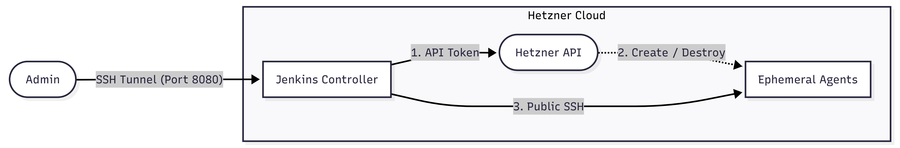

**Prerequisites**

* A [Hetzner Cloud](https://console.hetzner.com/) account
* Basic knowledge of Linux command line, Jenkins, and Terraform
* [Terraform installed](https://developer.hashicorp.com/terraform/install) locally
* [Hcloud CLI installed](https://github.com/hetznercloud/cli/blob/main/docs/tutorials/setup-hcloud-cli.md#1-install-the-hcloud-cli) locally and [context set up](https://github.com/hetznercloud/cli/blob/main/docs/tutorials/setup-hcloud-cli.md#3-create-a-context)

## Step 1 - Generate SSH Keys (Local Terminal)

You need two SSH key pairs: 

* One for you to access the Jenkins Controller
* One for the Jenkins Controller to access the temporary build agents

Open your local terminal and generate them:

```bash
# 1. Key for you to manage the main Jenkins Controller
ssh-keygen -t ed25519 -f ~/.ssh/hetzner_controller_key -C "admin@jenkins-controller" -N ""

# 2. Key for Jenkins to securely SSH into the ephemeral agents
ssh-keygen -t ed25519 -f ~/.ssh/hetzner_agent_key -C "jenkins@ephemeral-agent" -N ""
```

## Step 2 - Create the Project & API Token (Hetzner Console)

Terraform and Jenkins both need an API token to communicate with Hetzner.

1. Log into the **[Hetzner Console]()**.
2. Click **+ New Project** and name it `jenkins`.
3. Select the new project and go to **Security** > **API Tokens** in the left sidebar. (see official [getting started](https://docs.hetzner.com/cloud/api/getting-started/generating-api-token))
4. Click **Generate API Token** and set:
   * Name: `jenkins-terraform-token`
   * Permissions: **Read & Write**
6. **Copy the token immediately** and save it somewhere safe. You will not see it again.

## Step 3 - Write the Terraform Configuration

Terraform creates the private network, firewalls, and the Jenkins Controller VM. It also installs Java 21 and Jenkins automatically via cloud-init. All Jenkins configuration (plugins, credentials, cloud setup) is done manually through the UI after the server boots.

Create a new directory on your local machine, navigate into it, and create the following two files:

### `variables.tf`

```bash
variable "hcloud_token" {
  description = "Your Hetzner Cloud API Token"
  type        = string
  sensitive   = true
}

variable "controller_ssh_pub" {
  description = "Path to the public key for the Jenkins Controller"
  default     = "~/.ssh/hetzner_controller_key.pub"
}
```

### `main.tf`

This file provisions the network, firewalls, and the controller server. It uses `cloud-init` to automatically install Java 21 and Jenkins on the controller when it boots.

> **Note:** The configuration provided below is a template for showcase purposes. Feel free to change things to better suit your needs. For example, you can:
> * First, update the `location`, `server_type`, or `image` for the Jenkins Controller for your specific use case.
> * Then, for more advanced setups, update this Terraform template with additional infrastructure or configuration for your use case (e.g., adding an Nginx reverse proxy, etc.).
> * Restrict the source IPs for port 22 in the `jenkins-controller-firewall` to your own IP for better security.

For reference, see [hcloud versions](https://registry.terraform.io/providers/hetznercloud/hcloud/latest), [install Jenkins](https://www.jenkins.io/doc/book/installing/linux/#debian-java), and [install Terraform Hetzner Cloud (hcloud) provider](https://registry.terraform.io/providers/hetznercloud/hcloud/latest/docs).

```bash
terraform {
  required_providers {
    hcloud = {
      source  = "hetznercloud/hcloud"
      version = "~> 1.68"
    }
  }
}

provider "hcloud" {
  token = var.hcloud_token
}

resource "hcloud_ssh_key" "admin_key" {
  name       = "jenkins-admin-key"
  public_key = file(var.controller_ssh_pub)
}

resource "hcloud_network" "jenkins_net" {
  name     = "jenkins-network"
  ip_range = "10.0.0.0/16"
}

resource "hcloud_network_subnet" "jenkins_subnet" {
  network_id   = hcloud_network.jenkins_net.id
  type         = "cloud"
  network_zone = "eu-central"
  ip_range     = "10.0.1.0/24"
}

resource "hcloud_firewall" "agent_fw" {
  name = "jenkins-agent-firewall"
  rule {
    direction = "in"
    protocol  = "tcp"
    port      = "22"
    source_ips = ["${hcloud_server.jenkins_controller.ipv4_address}/32"]
  }
}

resource "hcloud_firewall" "controller_fw" {
  name = "jenkins-controller-firewall"
  rule {
    direction = "in"
    protocol  = "tcp"
    port      = "22"
    source_ips = ["0.0.0.0/0"] # For production, restrict to your home/office IP
  }
}

resource "hcloud_server" "jenkins_controller" {
  name        = "jenkins-controller"
  image       = "ubuntu-26.04"
  server_type = "cx23"
  location    = "hel1"
  ssh_keys    = [hcloud_ssh_key.admin_key.id]
  firewall_ids = [hcloud_firewall.controller_fw.id]
  
  network {
    network_id = hcloud_network.jenkins_net.id
    ip         = "10.0.1.100" #agents will get ips from 10.0.1.1 up to 10.0.1.99 -> space for 99 agents
  }


  user_data = <<-EOF
    #!/bin/bash
    set -e
    
    # Wait for network connectivity
    until curl -fsS https://pkg.jenkins.io/ >/dev/null; do
      echo "Waiting for network..."
      sleep 5
    done
    
    # Install Java 21 and Jenkins
    apt-get update
    apt-get install -y fontconfig openjdk-21-jre-headless

    curl -fsSL https://pkg.jenkins.io/debian/jenkins.io-2026.key | tee /usr/share/keyrings/jenkins-keyring.asc > /dev/null
    echo deb [signed-by=/usr/share/keyrings/jenkins-keyring.asc] https://pkg.jenkins.io/debian binary/ | tee /etc/apt/sources.list.d/jenkins.list > /dev/null

    apt-get update
    apt-get install -y jenkins
    systemctl enable --now jenkins
  EOF
}

output "jenkins_public_ip" {
  value       = hcloud_server.jenkins_controller.ipv4_address
  description = "The public IP of your Jenkins controller. Create an SSH tunnel to this IP, then access Jenkins at http://localhost:8080 (or your custom port)."
}
```

## Step 4 - Deploy the Infrastructure

In your terminal, inside the directory where you saved the Terraform files, run:

```bash
export TF_VAR_hcloud_token="YOUR_HETZNER_API_TOKEN"

terraform init
terraform plan
terraform apply -auto-approve
```

Once completed, Terraform will output your `jenkins_public_ip` (e.g., `198.51.100.10`).

> **Note:** Cloud-init takes a few minutes to finish installing Jenkins after the server is created. Wait 2-3 minutes before trying to access the URL. You can check the status by SSHing in and running:
> ```bash
> ssh -i ~/.ssh/hetzner_controller_key root@<ip_address>
> cloud-init status
> ```
> If the status is "done", you can run `jenkins --version` to verify that Jenkins is installed.

### Step 4.1 - Access Jenkins via SSH Port Forwarding

For security reasons, our Terraform firewall configuration intentionally blocks direct public access to port `8080`. By using SSH port forwarding, you can securely access the Jenkins Web UI over an encrypted tunnel without exposing it to the public internet, protecting it from unauthorized access and potential attacks.

If you have redeployed the controller (e.g., after `terraform destroy` and `terraform apply`), the server's host key will have changed. Clear the old key first:

```bash
ssh-keygen -R <YOUR_JENKINS_IP>
```

Open an SSH tunnel to forward the Jenkins web UI to your local machine:

```bash
ssh -i ~/.ssh/hetzner_controller_key -L 8080:localhost:8080 root@<YOUR_JENKINS_IP>
```

> **Tip:** If local port 8080 is already in use, pick a different local port:
> ```bash
> ssh -i ~/.ssh/hetzner_controller_key -L 9090:localhost:8080 root@<YOUR_JENKINS_IP>
> ```
> Then access Jenkins at `http://localhost:9090` instead.

While the SSH session is open, grab the initial admin password:

```bash
cat /var/lib/jenkins/secrets/initialAdminPassword
```

## Step 5 - Initial Jenkins Setup & Plugin Installation (UI)

1. Open **`http://localhost:8080`** in your browser and paste the admin password.
   
   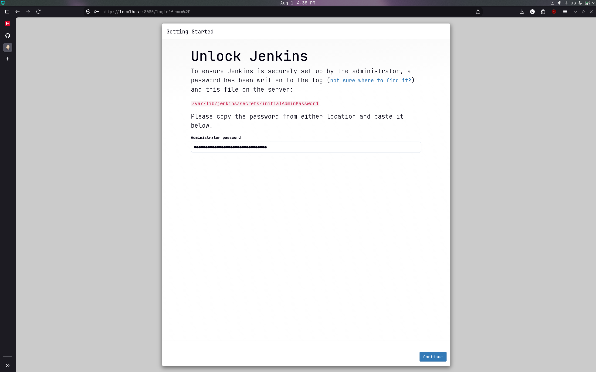

2. Click **Install suggested plugins**, create your admin user, and finish the setup wizard.
   
   
   
   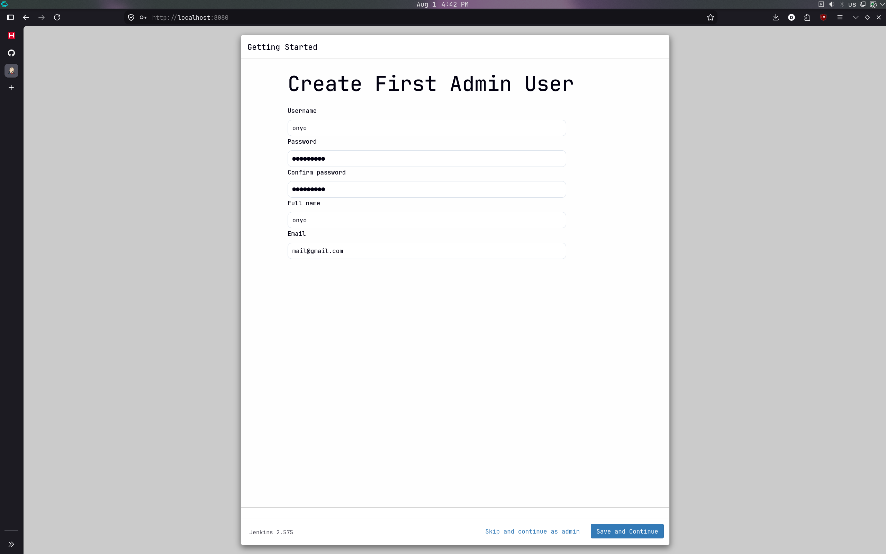

3. Once on the dashboard, you'll find a settings symbol in the top right. Go to **Manage Jenkins** > **Plugins** > **Available plugins**.
4. Search for **Hetzner Cloud**, check the box, and click **Install**.
   
   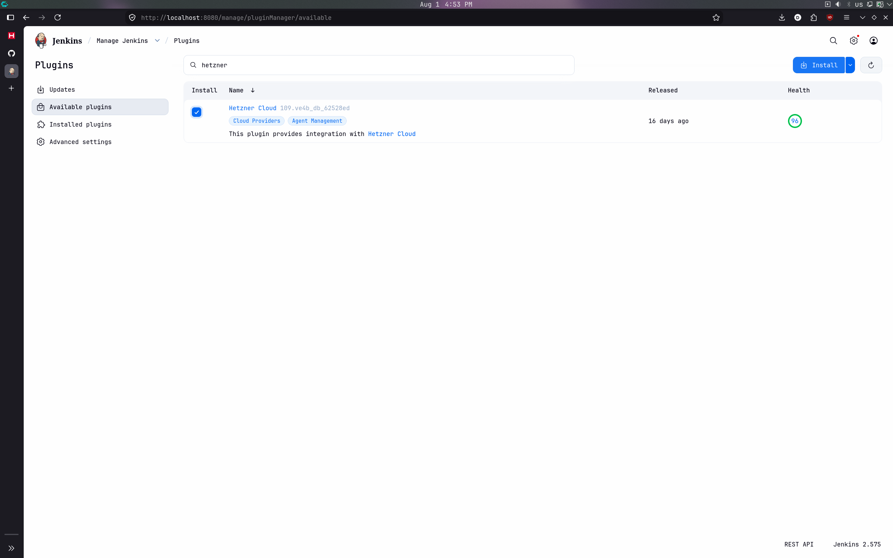

5. Restart Jenkins when prompted and log back in.

## Step 6 - Add Credentials (UI)

Jenkins needs the Hetzner API token to provision VMs, and the Agent SSH key to log into them.

1. Go to **Manage Jenkins** > **Credentials** > **System** > **Global credentials** > **Add Credentials**.

2. **Add the API Token:**
   * Kind: **Secret text**
   * Secret: *Paste your Hetzner API token here*
   * ID: `hetzner-api-token`
   * Click **Create**.
   
   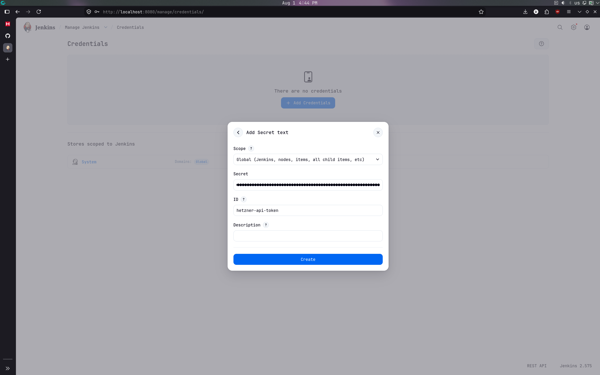

3. **Add the SSH Key:**
   * Kind: **SSH Username with private key**
   * ID: `hetzner-agent-key`
   * Username: `root`
   * Private Key: Click **Enter directly** and paste the *entire* contents of your local `~/.ssh/hetzner_agent_key` file (including the `BEGIN` and `END` lines).
   * Click **Create**.
   
   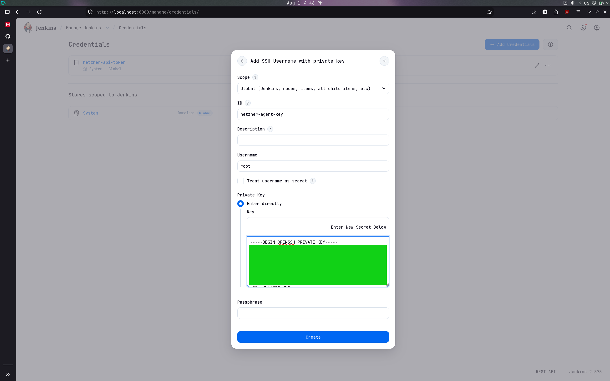

## Step 7 - Configure the Dynamic Cloud Integration (UI)

Now we tell Jenkins how to spin up the agents.

> **Important:** The Hetzner Cloud plugin requires **numeric IDs**, not resource names, for Image, Network, and Firewall fields. Use the `hcloud` CLI to look them up:
>
> ```bash
> hcloud image list --type system -o columns=id,name | grep ubuntu-26.04
> hcloud network list -o columns=id,name
> hcloud firewall list -o columns=id,name
> ```

1. Go to **Manage Jenkins** > **Clouds** > **New cloud**.
2. Name it `hetzner-dynamic`, select **Hetzner**, and click **Create**.
   
   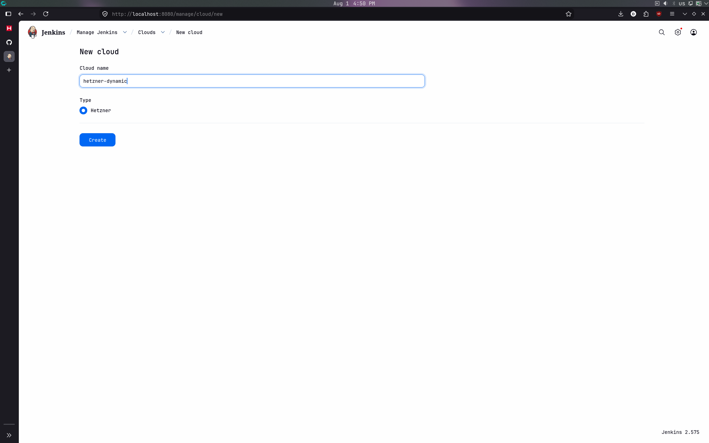

3. Select your `hetzner-api-token` from the dropdown and click **Test Connection** to verify it works.
4. Set **Instance Cap** to a reasonable number (e.g., `3`) to prevent runaway provisioning if agents fail to connect. 
5. Scroll down and click **Add Server Template**.
   
   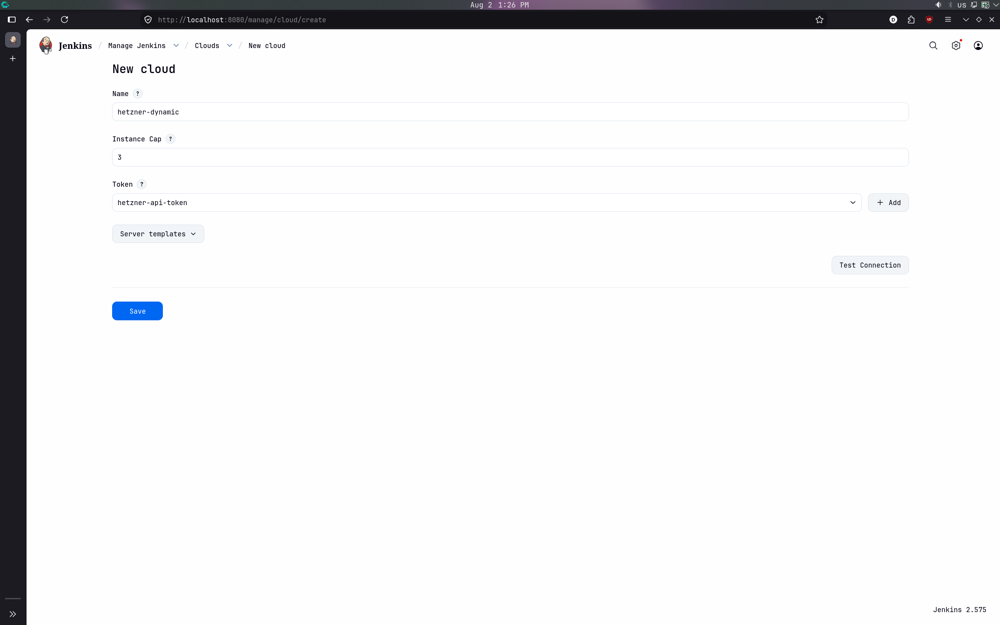

   > **Note:** The configuration below is just an example demonstrating a workflow with a cap of 3 agents and 1 executor per agent. You should configure the instance cap, server size, and executor count based on your actual pipeline requirements and team size.
   
   Fill it out exactly like this:
   
   <table style="table-layout: fixed;">
   <tr><td>Name:</td>
       <td><code>ubuntu-builder</code></td>
       <td>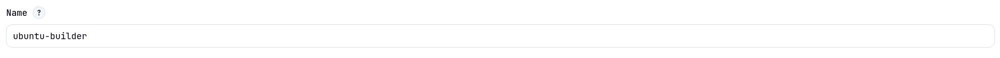</td>
       </tr>
   <tr><td>Connection to agents:</td>
       <td>Connect via SSH as root using private/public IPv4<br>(Communication between the Jenkins controller and agents is done through public IPv4 SSH. In theory, this can also be done within the internal network, but I didn't manage to get it working)</td>
       <td>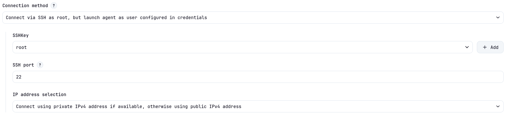</td>
       </tr>
   <tr><td>Labels:</td>
       <td><code>hetzner-ephemeral</code> (This is the keyword your pipelines will use)</td>
       <td>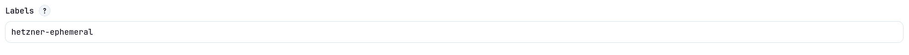</td>
       </tr>
   <tr><td>Image ID:</td>
       <td>(The numeric ID from <code>hcloud image list</code>).</td>
       <td>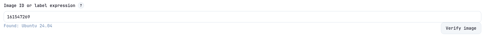</td>
       </tr>
   <tr><td>Server Type:</td>
       <td><code>cx23</code> (Verify availability in your location with <code>hcloud server-type list</code>).</td>
       <td>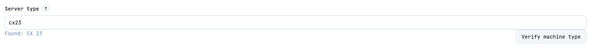</td>
       </tr>
   <tr><td>Location:</td>
       <td><code>hel1</code></td>
       <td>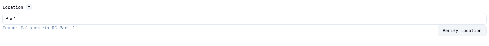</td>
       </tr>
   <tr><td>Network ID:</td>
       <td>(The numeric ID from <code>hcloud network list</code>).</td>
       <td>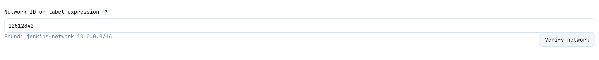</td>
       </tr>
   <tr><td>Firewall ID:</td>
       <td>(The numeric ID from <code>hcloud firewall list</code>).</td>
       <td>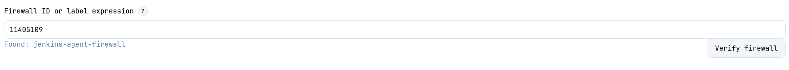</td>
       </tr>
   <tr><td>Remote FS Root:</td>
       <td><code>/root</code> (The default <code>/home/jenkins</code> does not exist on a bare Ubuntu image).</td>
       <td>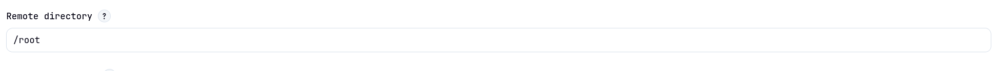</td>
       </tr>
   <tr><td>Shutdown policy and Idle Timeout:</td>
       <td>Removes server after its idle for period of time.<br><code>2</code> (Jenkins will wait 2 minutes after a build finishes before destroying the VM).</td>
       <td>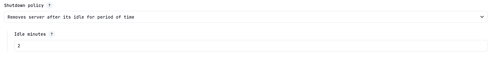</td>
       </tr>
   <tr><td>Primary IP:</td>
       <td>Set to <b>Default Behavior</b></td>
       <td>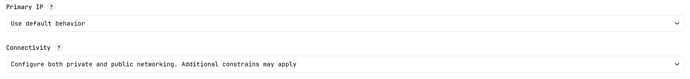</td>
       </tr>
   <tr><td>User Data script<br>(Jenkins agents need Java to run):</td>
       <td colspan="2"><pre style="box-sizing: border-box; overflow: auto;"><code>
#!/bin/bash
apt-get update &amp;&amp; apt-get install -y fontconfig openjdk-21-jre-headless
       </code></pre>
       </td>
       </tr>
   </table>


6. Click **Save**.

## Step 8 - Test the Dynamic Scaling!

Let's watch the magic happen.

1. On the Jenkins dashboard, click **New Item / Create a job**, name it `Test-Pipeline`, select **Pipeline**, and click OK.
   
   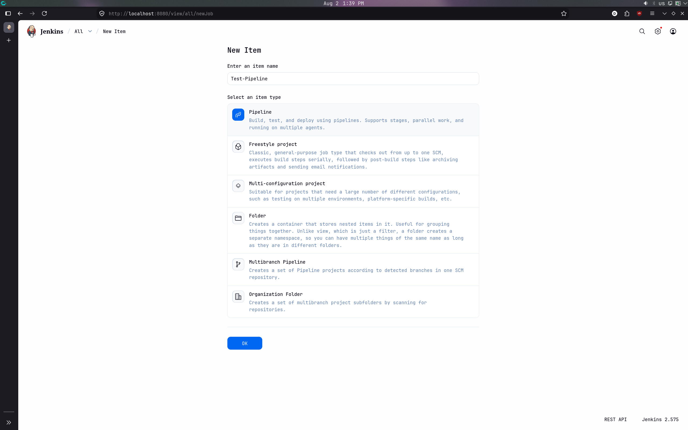

2. Scroll down to the Pipeline script section and paste this:
   
   ```groovy
   pipeline {
           agent none
           stages {
               stage('Parallel Build') {
                   parallel {
                       stage('Agent 1') {
                           agent { label 'hetzner-ephemeral' }
                           steps {
                               sh 'echo "Agent 1: $(hostname)"'
                               sh 'uname -a'
                               sleep 60
                           }
                       }
                       stage('Agent 2') {
                           agent { label 'hetzner-ephemeral' }
                           steps {
                               sh 'echo "Agent 2: $(hostname)"'
                               sh 'uname -a'
                               sleep 60
                           }
                       }
                       stage('Agent 3') {
                           agent { label 'hetzner-ephemeral' }
                           steps {
                               sh 'echo "Agent 3: $(hostname)"'
                               sh 'uname -a'
                               sleep 60
                           }
                       }
                   }
               }
           }
       }
   ```

3. Click **Save** and then, in the left menu bar, **Build Now**.
   
   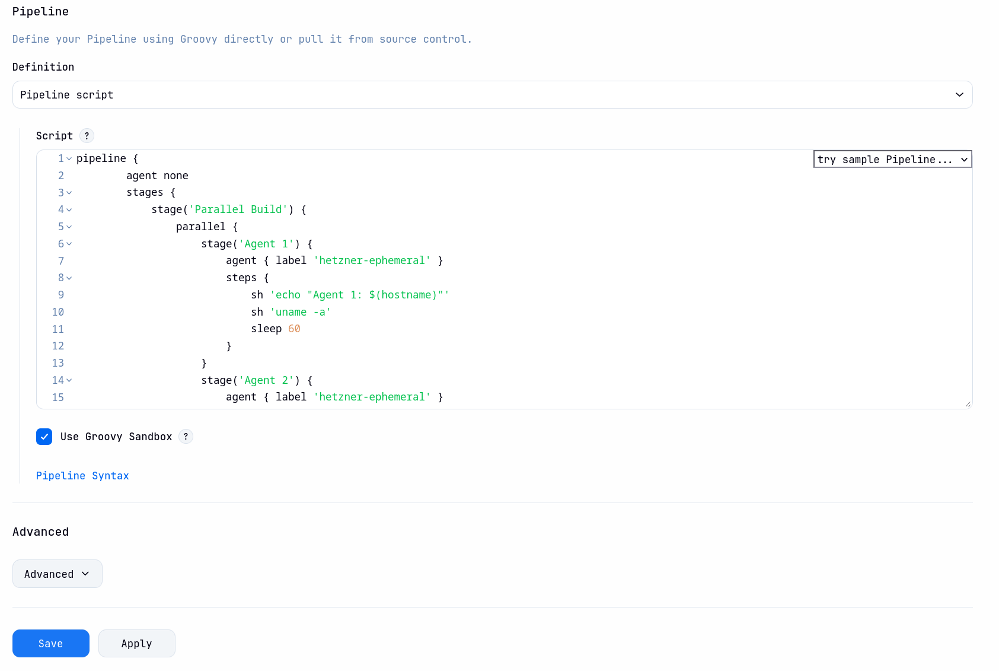

**What is happening?**
Look at the bottom left of your Jenkins dashboard under "Build Executor Status." You will see an executor spinning up one by one. If you open your Nodes Tab at `http://localhost:8080/computer/`, you will physically see the new `cx23` instances being created. If not, go to [Step 9 - Troubleshooting](#step-9---troubleshooting).

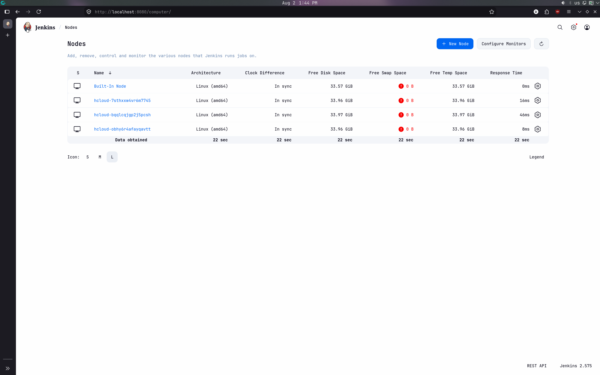

Jenkins will run the build, print the some linux/hardware stats, and finish (see `http://localhost:8080/job/Test-Pipeline/1/console`).

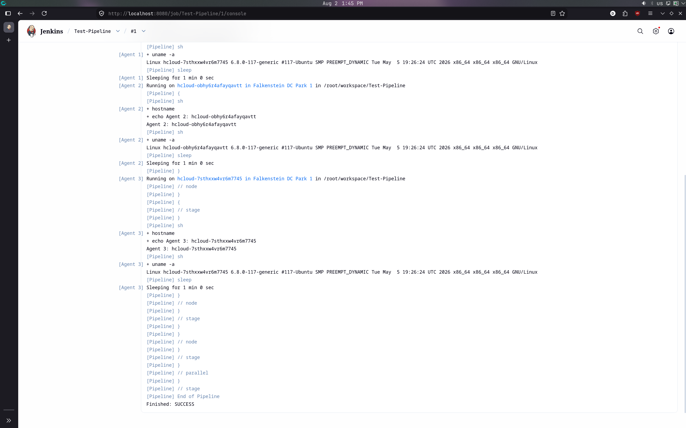

Two minutes later, the retention policy will trigger, and the server will automatically vanish from your Hetzner account, stopping the billing clock.

## Step 9 - Troubleshooting

If anything fails, go to this URL for more information about the error message:

```http
http://localhost:8080/cloud/hetzner-dynamic
```

<br>

* **Pipeline Stuck** (HTTP 409 Conflict)
  
  If your pipeline hangs in the queue without provisioning agents, an orphaned SSH key might be blocking the plugin.
  
  **Cause:** The [Hetzner Cloud Plugin](https://plugins.jenkins.io/hetzner-cloud/) automatically creates and manages its own SSH key. If you previously ran `terraform destroy` and recreated the environment, the old key is left behind in Hetzner. When the new Jenkins server tries to register its key, the API rejects it. (Note: Do not manually upload an agent SSH key).
  
  **Solution:**
  1. Go to your Hetzner Cloud Console -> **Security** -> **SSH Keys**.
  2. Delete any leftover Jenkins SSH keys from previous runs.
  3. Re-trigger the pipeline.

## Step 10 - Cleanup (Don't leave the controller running!)

When you are done experimenting with this tutorial, do not leave the main Jenkins Controller running. Go back to your local terminal and run:

```bash
terraform destroy -auto-approve
```

This will instantly tear down the network, the firewall, and the Controller VM. Your Hetzner account is now perfectly clean again. Note that the nodes created via Jenkins will still be in your Hetzner account. You can remove them manually when you're done.

## Conclusion

In this tutorial, you learned how to automatically provision Jenkins build agents on Hetzner Cloud using Terraform and the Jenkins Hetzner Cloud plugin. This allows you to efficiently use cloud resources, ensuring that agents are only spun up when a build is requested and then destroyed immediately after to save costs.

Please note that this tutorial covers just the first steps to create the foundational infrastructure. The next part of the journey is actually connecting all of this to your GitHub or GitLab repositories so that code pushes can trigger these agents automatically! (Note: This will likely require adapting the infrastructure slightly, such as adding an Nginx reverse proxy or modifying the firewall to allow webhook traffic).

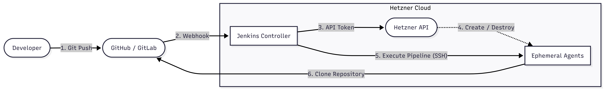

**Next steps:**

* Connect your new infrastructure to GitHub/GitLab to trigger automatic builds
* Review the [Jenkins Hetzner Cloud Plugin documentation](https://plugins.jenkins.io/hetzner-cloud/) for more in-depth information about plugin features and advanced configuration
* Explore more complex Jenkins pipeline setups
* Configure advanced network layouts and firewalls
* Try spinning up different types of Hetzner servers based on job labels

##### License: MIT

<!--

Contributor's Certificate of Origin

By making a contribution to this project, I certify that:

(a) The contribution was created in whole or in part by me and I have
    the right to submit it under the license indicated in the file; or

(b) The contribution is based upon previous work that, to the best of my
    knowledge, is covered under an appropriate license and I have the
    right under that license to submit that work with modifications,
    whether created in whole or in part by me, under the same license
    (unless I am permitted to submit under a different license), as
    indicated in the file; or

(c) The contribution was provided directly to me by some other person
    who certified (a), (b) or (c) and I have not modified it.

(d) I understand and agree that this project and the contribution are
    public and that a record of the contribution (including all personal
    information I submit with it, including my sign-off) is maintained
    indefinitely and may be redistributed consistent with this project
    or the license(s) involved.

Signed-off-by: Victor-Daniel Luca daniluca091@gmail.com 

-->
