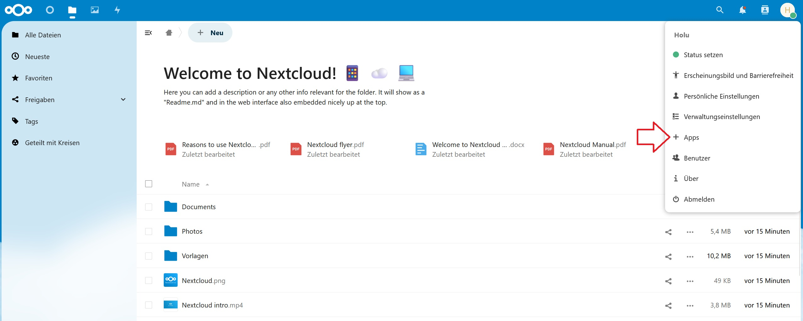
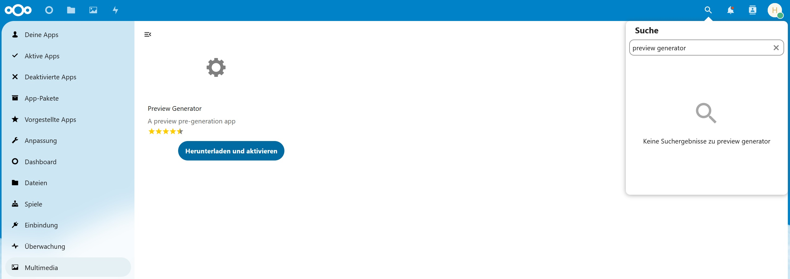
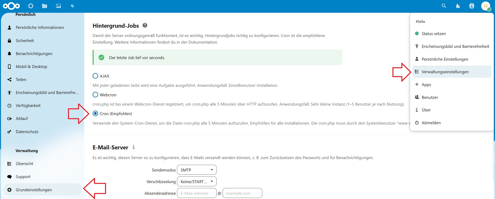

## Einführung

Nextcloud ist eine selbstgehostete File-Cloud, die aber dank ihrer Entwicklung über die Jahre durch Apps und der Community immer mehr Features dazu bekommen hat. Zu dieser Cloud gibt es auch eine Nextcloud-App für alle gängigen Betriebssysteme, um Uploads und Downloads zu vereinfachen.

Ich selbst nutze viel Nextcloud und habe seit langem eine gute Instanz am laufen. Ich erkläre hier Schritt für Schritt, wie man mit diesen 4 Dateien eine schnelle und zuverlässige Nextcloud-Instanz starten kann.

| Konfigurationsdateien für | Beschreibung |
| ------------------------- | ------------ |
| NGINX-Webserver           | In der Konfigurationsdatei werden die einzelnen `server`-Blöcke bestimmt. Ein `server`-Block enthält unter anderem den Hostnamen (z.B. example.com) und den Port (z.B. 443). |
| Docker Compose            | Wird hier genutzt, um Container für Nextcloud und PostgreSQL zu erstellen. |
| Nextcloud                 | Kann bearbeitet werden, um Leistung und Funktion zu optimieren. |
| Fail2ban                  | Fail2Ban ist eine Intrusion Prevention Software (IPS), die darauf abzielt, verdächtige Aktivitäten auf einem Server zu erkennen und nach Bedarf IP-Adressen zu blockieren oder andere vordefinierte Maßnahmen zu ergreifen. |

**Voraussetzungen**

* Einen Linux-Server
  * Ubuntu 20.04-22.04 oder Debian 11-12
  * Bei diesem Setup mit Docker sollte man keine Container-Virtualisierung haben, da es bei manchen Lösungen nicht möglich ist, Docker richtig zu nutzen.
* Da wir PostgreSQL benutzen und ffmpeg für Video-Previews benötigen, wäre folgende Zusammenstellung eine optimale Voraussetzung für das System:<br>
  * 4 CPU-Kerne<br>
  * 8 bis 12 GB RAM<br>
  * 250 GB SSD
* Eine TLD-Domain

## Schritt 1 - Vorbereitung

* **Paketlisten und System aktualisieren**<br>
  Wenn das System frisch installiert ist, sollte man dieses zunächst einmal aktualisieren:
  ```bash
  apt update && apt upgrade -y
  ```
  Oft sollte man den Server einmal neu starten, falls Kernel-Updates dabei waren.

<br>

* **Webserver installieren**<br>
  Jetzt installieren wir unseren Webserver. In diesem Tutorial liegt nur der Webserver extern im Host. Man könnte ihn auch hinzufügen, aber ich gehe nach meinem Setup vor. Ebenfalls installieren wir den Certbot für unser SSL-Zertifikat:
  ```bash
  apt install certbot nginx python3-certbot-nginx -y
  ```

<br>

* **Docker installieren**<br>
  Wichtig zu beachten: Wenn wir jetzt Docker über das offizielle Docker-Repository installieren, lauten alle Compose-Befehle nicht `docker-compose`, sondern `docker compose` mit einem Leerzeichen statt einem Minuszeichen.
  ```bash
  curl -sSL https://get.docker.com/ | CHANNEL=stable bash
  ```

## Schritt 2 - Nginx & SSL-Einrichtung

Jetzt, nachdem wir alles vorbereitet haben, indem wir die benötigten Systemkomponenten installiert haben, fangen wir mit der Einrichtung des Webservers an.

Als allererstes entfernen wir die Nginx-Standardwebsite aus dem `sites-available`- und dem `sites-enabled`-Ordner.

```bash
rm /etc/nginx/sites-available/default && rm /etc/nginx/sites-enabled/default
```

Jetzt können die entsprechenden DNS-Einträge für die Domain erstellt werden. Für IPv4 einen A-Eintrag auf eure IP-Adresse mit der gewünschten Subdomain und für IPv6 einen AAAA-Eintrag auf dieselbe Subdomain. Beispiel:

| Typ     | Domain      | IP-Adresse    |
| ------- | ----------- | ------------- |
| A       | example.com | `<your_ipv4>` |
| AAAA    | example.com | `<your_ipv6>` |

### Schritt 2.1 - SSL-Zertifikat erstellen

Jetzt erstellen wir unser SSL-Zertifikat mit folgendem Befehl:

```bash
certbot certonly
```

* **Option wählen**<br>
  Es ist möglich das über das nginx-Plugin zu machen oder einen temporären Webserver zu starten. In unserem Fall wählen wir den temporären Webserver, da wir noch keine Webserver-Konfigurationsdatei haben.

<br>

* **E-Mail-Adresse angeben und Geschäftsbedingungen bestätigen**<br>
  Als nächstes wird nach einer E-Mail-Adresse gefragt. Danach kommen noch zwei Geschäftsbedingungen. Sofern du damit einverstanden bist, kannst du diesen mit "y" zustimmen.

<br>

* **Domain angeben**<br>
  Nun solltet eine Domain/Subdomain eingeben werden, wie z.B. `example.com`.
  
  Wenn dies ohne Fehler verläuft, erscheint ein etwas längeren Text. Weiter unten davon wird der Pfad zu den Zertifikaten angezeigt (z.B. `/etc/letsencrypt/live/example.com/<file>.pem`).

### Schritt 2.2 - Webserver einrichten

Jetzt kommen wir zur Erstellung der Webserver-Konfigurationsdatei mitsamt des `server`-Blocks für Nextlcoud im `nginx/sites-enabled`-Ordner.

* **Webserver-Konfigurationsdatei erstellen**
  
  ```bash
  nano /etc/nginx/sites-available/nextcloud.conf
  ```
  
  Dort fügen wir jetzt Folgendes ein:
  
  > Ersetze `example.com` mit deiner eigenen Domain.

  ```conf
  map $http_upgrade $connection_upgrade {
          default upgrade;
          '' close;
  }
  
  server {
          listen 80;
          listen [::]:80;
          server_name example.com;
          # enforce https
          return 301 https://$server_name:443$request_uri;
  }
  
  server {
          listen 443 ssl http2;
          listen [::]:443 ssl http2;
          server_name example.com;
  
          # Use Mozilla's guidelines for SSL/TLS settings
          # https://mozilla.github.io/server-side-tls/ssl-config-generator/
          # NOTE: some settings below might be redundant
          ssl_certificate /etc/letsencrypt/live/example.com/fullchain.pem;    # managed by Certbot
          ssl_certificate_key /etc/letsencrypt/live/example.com/privkey.pem;  # managed by Certbot
  
          ssl_session_timeout 1d;
          ssl_session_cache shared:MozSSL:10m; # about 40000 sessions
          ssl_session_tickets off;
  
          ssl_protocols TLSv1.2 TLSv1.3;
          ssl_ciphers ECDHE-ECDSA-AES128-GCM-SHA256:ECDHE-RSA-AES128-GCM-SHA256:ECDHE-ECDSA-AES256-GCM-SHA384:ECDHE-RSA-AES256-GCM-SHA384:ECDHE-ECDSA-CHACHA20-POLY1305:ECDHE-RSA-CHACHA20-POLY1305:DHE-RSA-AES128-GCM-SHA256:DHE-RSA-AES256-GCM-SHA384:DHE-RSA-CHACHA20-POLY1305;
          ssl_prefer_server_ciphers on;
  
          # Remove X-Powered-By, which is an information leak
          fastcgi_hide_header X-Powered-By;
  
          # Path to the root of your installation

          location = /robots.txt {
                  allow all;
                  log_not_found off;
                  access_log off;
          }

          # The following 2 rules are only needed for the user_webfinger app.
          # Uncomment it if you're planning to use this app.
          #rewrite ^/.well-known/host-meta /public.php?service=host-meta last;
          #rewrite ^/.well-known/host-meta.json /public.php?service=host-meta-json last;
  
          # The following rule is only needed for the Social app.
          # Uncomment it if you're planning to use this app.
          #rewrite ^/.well-known/webfinger /public.php?service=webfinger last;
  
          location = /.well-known/carddav {
                  return 301 $scheme://$host:$server_port/remote.php/dav;
          }
          location = /.well-known/caldav {
                  return 301 $scheme://$host:$server_port/remote.php/dav;
          }
  
          # set max upload size
          client_max_body_size 512M;
          fastcgi_buffers 64 4K;
  
          # Enable gzip but do not remove ETag headers
          gzip on;
          gzip_vary on;
          gzip_comp_level 4;
          gzip_min_length 256;
          gzip_proxied expired no-cache no-store private no_last_modified no_etag auth;
          gzip_types application/atom+xml application/javascript application/json application/ld+json application/manifest+json application/rss+xml application/vnd.geo+json application/vnd.ms-fontobject application/x-font-ttf application/x-web-app-manifest+json application/xhtml+xml application/xml font/opentype image/bmp image/svg+xml image/x-icon text/cache-manifest text/css text/plain text/vcard text/vnd.rim.location.xloc text/vtt text/x-component text/x-cross-domain-policy;
  
          # Uncomment if your server is build with the ngx_pagespeed module
          # This module is currently not supported.
          #pagespeed off;
          include snippets/headers.conf;
          location / {
                  proxy_pass http://127.0.0.1:8881$request_uri;
                  proxy_set_header CF-IPCountry $http_cf_ipcountry;
                  proxy_set_header X-Robots-Tag "noindex, nofollow, nosnippet, noarchive, none";
                  proxy_set_header X-Forwarded-For $proxy_add_x_forwarded_for;
                  proxy_set_header X-Forwarded-Port $server_port;
                  proxy_set_header X-Forwarded-Scheme $scheme;
                  proxy_set_header X-Forwarded-Proto $scheme;
                  proxy_set_header X-Real-IP $remote_addr;
                  proxy_set_header Accept-Encoding "";
                  proxy_set_header Host $host;
                  proxy_cache_key $scheme://$host$uri$is_args$query_string;
                  proxy_cache_valid 200 10m;
                  proxy_cache_bypass $arg_should_bypass_cache;
                  proxy_cache_use_stale error timeout http_500 http_502 http_503 http_504 http_429;
                  proxy_cache_lock on;
                  client_body_buffer_size 512k;
                  proxy_read_timeout 86400s;
                  add_header Strict-Transport-Security "max-age=31536000; includeSubDomains; preload";
                  client_max_body_size 0;
  
                  # Websocket
                  proxy_http_version 1.1;
                  proxy_set_header Upgrade $http_upgrade;
                  proxy_set_header Connection $connection_upgrade;
          }
  
          location /.well-known/carddav {
                  return 301 $scheme://$host/remote.php/dav;
          }
  
          location /.well-known/caldav {
                  return 301 $scheme://$host/remote.php/dav;
          }
  
          location /.well-known/webfinger{
                  return 301 $scheme://$http_host/index.php/.well-known/webfinger;
          }
  
          location /.well-known/nodeinfo{
                  return 301 $scheme://$http_host/index.php/.well-known/nodeinfo;
          }
  }
  ```
  Mit der Zeile `proxy_pass http://127.0.0.1:8881$request_uri;` wird der eingehende Traffic an die im `server`-Block bestimmte Adresse, hier `https://example.com:443`, an den Nextcloud-Container weitergeleitet, welcher in "Schritt 3" mit Port 8881 erstellt wird.

<br>

* **Header-Daten-Datei erstellen**
  
  Jetzt erstellen wir einen Ordner namens "Snippets" und fügen darin unsere Header-Daten ein. Diese können wir in der obenstehenden `nextcloud.conf`-Datei über "include" einbinden. Dadurch muss man nicht in jedem `server`-Block immer dasselbe schreiben, sondern kann einfach die Datei einbinden.
  
  ```bash
  mkdir /etc/nginx/snippets
  nano /etc/nginx/snippets/headers.conf
  ```
  
  Dort fügen wir jetzt Folgendes ein:
  
  ```conf
  #
  # Add headers to serve security related headers
  #  
  # HSTS (ngx_http_headers_module is required)
  add_header Strict-Transport-Security "max-age=63072000; includeSubdomains; preload;" always; 
  #add_header X-Content-Type-Options "nosniff" always;
  #add_header X-XSS-Protection "1; mode=block" always;
  #add_header X-Robots-Tag none always;
  #add_header X-Download-Options noopen always;
  #add_header X-Permitted-Cross-Domain-Policies none always;
  #add_header Referrer-Policy no-referrer always;
  #add_header X-Frame-Options "SAMEORIGIN" always;
  
  add_header Referrer-Policy                      "no-referrer"       always;
  add_header X-Content-Type-Options               "nosniff"           always;
  add_header X-Download-Options                   "noopen"            always;
  add_header X-Frame-Options                      "SAMEORIGIN"        always;
  add_header X-Permitted-Cross-Domain-Policies    "none"              always;
  add_header X-Robots-Tag                         "noindex, nofollow" always;
  add_header X-XSS-Protection                     "1; mode=block"     always;
  
  # Remove X-Powered-By, which is an information leak
  fastcgi_hide_header X-Powered-By;
  ```

<br>

* **Webserver neustarten**
  
  Wenn in der Webserver-Konfigurationsdatei die Beispiel-Domain `example.com` bereits mit der eigenen Domain ersetzt wurde, kann der Webserver neu gestartet werden.
  ```bash
  ln -s /etc/nginx/sites-available/nextcloud.conf /etc/nginx/sites-enabled/nextcloud.conf
  nginx -t
  systemctl restart nginx
  ```

## Schritt 3 - Docker Compose

Jetzt erstellen wir unseren Compose-Datei und passen die Nextcloud-Einstellungen an.

Dafür erstellen wir einen Ordner, in dem unsere Daten am Ende drinnen liegen.

```bash
mkdir /home/nextcloud
```

* **Docker Compose-Datei erstellen**
  ```bash
  nano /home/nextcloud/docker-compose.yaml
  ```
  Dort fügen wir jetzt Folgendes ein:
  
  > Ersetze `example.com` mit deiner eigenen Domain und passe die Daten für die Datenbank (PostgreSQL) nach Bedarf an. Für den Redis-Server muss nichts angepasst werden.
  
  ```yaml
  version: '3'
  
  services:
    db:
      image: postgres:alpine
      restart: always
      networks:
        - cloud
      environment:
        - PUID=1000
        - PGID=1000
        - TZ=Europe/Berlin
      volumes:
        - ./db:/var/lib/postgresql/data:Z
      env_file:
        - db.env
  
    app:
      image: elestio/nextcloud:latest
      restart: always
      networks:
        - cloud
      ports:
        - "8881:80"
      links:
        - ncredis
      volumes:
        - ./nextcloud:/var/www/html
        - ./apps:/var/www/html/custom_apps
        - ./config:/var/www/html/config
        - ./data:/var/www/html/data
        - ./ffmpeg:/usr/bin/ffmpeg
      environment:
        - PUID=1000
        - PGID=1000
        - TZ=Europe/Berlin
        - REDIS_HOST=ncredis
        - POSTGRES_HOST=db
        - POSTGRES_PASSWORD=ncpassword
        - POSTGRES_DB=nextcloud
        - POSTGRES_USER=nextcloud
        - NEXTCLOUD_TRUSTED_DOMAINS=example.com
        - OVERWRITEPROTOCOL=https
        - PHP_UPLOAD_LIMIT=10240M
        - APACHE_BODY_LIMIT=0
  
    ncredis:
      image: redis:7.2.4-bookworm
      container_name: ncredis
      networks:
        - cloud
      volumes:
        - ./redis-dump:/data
  
  networks:
    cloud:
      name: cloud
      driver: bridge
  ```

  In der obenstehenden Webserver-Konfigurationsdatei aus "Schritt 2" wird der eingehende Traffic an `https://example.com:443` nach `http://127.0.0.1:8881` weitergeleitet. Das heißt, der Nextcloud-Container muss vom Host aus wie hier angegeben über Port 8881 erreichbar sein.

<br>

* **`env`-Datei erstellen**
  
  Jetzt erstellen wir noch eine ENV-Datei für PostgreSQL, damit beim Start der Benutzer und die Tabelle erstellt werden. Bitte tragt genau das Gleiche ein wie im Compose-File, sonst wird die Installation nicht auf Anhieb funktionieren.
  ```bash
  nano /home/nextcloud/db.env
  ```
  Dort fügen wir jetzt Folgendes ein:
  ```env
  POSTGRES_PASSWORD=ncpassword
  POSTGRES_DB=nextcloud
  POSTGRES_USER=nextcloud
  
  REDIS_HOST=ncredis
  REDIS_PASSWORD=
  ```

<br>

* **ffmpeg hinzufügen**
  
  Jetzt müssen wir nur noch ffmpeg hinzufügen, und wir wären startklar.
  
  ```bash
  cd /tmp
  wget https://johnvansickle.com/ffmpeg/releases/ffmpeg-release-amd64-static.tar.xz
  tar xf ffmpeg-release-amd64-static.tar.xz
  cp /tmp/ffmpeg-6.1-amd64-static/ffmpeg /home/nextcloud/ffmpeg
  chmod u+x /home/nextcloud/ffmpeg
  cd /home/nextcloud
  ```

<br>

* **Nextcloud starten**
  
  Jetzt können wir unsere Nextcloud starten, damit Datenbanken erstellt werden und die Ordnerstruktur erstellt wird. Wir starten jedoch den Container nicht im Detached-Modus:
  
  ```bash
  docker compose up
  ```

<br>

* **Domain öffnen und Admin-Benutzer erstellen**

  Nach einigen Sekunden sollte die Domain erreichbar sein, um mit dem Nextcloud-Setup fortzusetzen und einen Admin-Benutzer zu erstellen. 

<br>

* **Container stoppen**
  
  Nachdem der Admin-Benutzer erstellt wurde, stoppe den Container wieder.
  Nutze dafür die Tastenkombination `strg`/`ctrl` + `C`.
  
  Mit folgendem Befehl kann der Status der Container geprüft werden:
  
  ```bash
  docker container ls -a
  ```

## Schritt 4 - Finetuning

An sich läuft die Nextcloud jetzt, aber wir wollen die Leistung und Funktion noch optimieren.

**Auf dem Server:**

* **`config.php` bearbeiten**
  ```bash
  nano /home/nextcloud/config/config.php
  ```
  In der letzten Zeile steht `);`. Füge direkt darüber folgende Zeilen ein:
  ```php
    'activity_expire_days' => 14,
    'auth.bruteforce.protection.enabled' => true,
    'blacklisted_files' => 
    array (
      0 => '.htaccess',
      1 => 'Thumbs.db',
      2 => 'thumbs.db',
    ),
    'cron_log' => true,
    'default_phone_region' => 'DE',
    'defaultapp' => 'files',
    'enable_previews' => true,
    'enabledPreviewProviders' => 
    array (
      0 => 'OC\\Preview\\PNG',
      1 => 'OC\\Preview\\JPEG',
      2 => 'OC\\Preview\\GIF',
      3 => 'OC\\Preview\\BMP',
      4 => 'OC\\Preview\\XBitmap',
      5 => 'OC\\Preview\\Movie',
      6 => 'OC\\Preview\\PDF',
      7 => 'OC\\Preview\\MP3',
      8 => 'OC\\Preview\\TXT',
      9 => 'OC\\Preview\\MarkDown',
    ),
    'filesystem_check_changes' => 0,
    'filelocking.enabled' => 'true',
    'integrity.check.disabled' => false,
    'knowledgebaseenabled' => false,
    'loglevel' => 2,
    'logtimezone' => 'Europe/Berlin',
    'log_rotate_size' => '104857600',
    'preview_max_x' => 1024,
    'preview_max_y' => 768,
    'preview_max_scale_factor' => 1,
    'profile.enabled' => false,
    'trashbin_retention_obligation' => 'auto, 7',
    'maintenance_window_start' => 1,
  );
  ```
  
  <blockquote>
  <details>
  
  <summary>Gesamte Beispiel-Datei ausklappen</summary>
  
  <ul>
  
  ```php
  <?php
  $CONFIG = array (
    'htaccess.RewriteBase' => '/',
    'memcache.local' => '\\OC\\Memcache\\APCu',
    'apps_paths' =>
    array (
      0 =>
      array (
        'path' => '/var/www/html/apps',
        'url' => '/apps',
        'writable' => false,
      ),
      1 =>
      array (
        'path' => '/var/www/html/custom_apps',
        'url' => '/custom_apps',
        'writable' => true,
      ),
    ),
    'memcache.distributed' => '\\OC\\Memcache\\Redis',
    'memcache.locking' => '\\OC\\Memcache\\Redis',
    'redis' =>
    array (
      'host' => 'ncredis',
      'password' => '',
      'port' => 6379,
    ),
    'overwriteprotocol' => 'https',
    'upgrade.disable-web' => true,
    'instanceid' => 'ocXXXXXXXXXXX',
    'passwordsalt' => 'XXXXXXXXXXXXXXXXXXXXXXXXXXXX',
    'secret' => 'XXXXXXXXXXXXXXXXXXXXXXXXX',
    'trusted_domains' =>
    array (
      0 => 'cloud.XXXXXXX',
    ),
    'datadirectory' => '/var/www/html/data',
    'dbtype' => 'pgsql',
    'version' => '27.1.7.2',
    'overwrite.cli.url' => 'https://cloud.XXXXXXXXXXXXXX',
    'dbname' => 'nextcloud',
    'dbhost' => 'db',
    'dbport' => '',
    'dbtableprefix' => 'oc_XXXX',
    'dbuser' => 'XXXXXXX',
    'dbpassword' => 'XXXXXXX',
    'installed' => true,
    'activity_expire_days' => 14,
    'auth.bruteforce.protection.enabled' => true,
    'blacklisted_files' =>
    array (
      0 => '.htaccess',
      1 => 'Thumbs.db',
      2 => 'thumbs.db',
    ),
    'cron_log' => true,
    'default_phone_region' => 'DE',
    'defaultapp' => 'files',
    'enable_previews' => true,
    'enabledPreviewProviders' =>
    array (
      0 => 'OC\\Preview\\PNG',
      1 => 'OC\\Preview\\JPEG',
      2 => 'OC\\Preview\\GIF',
      3 => 'OC\\Preview\\BMP',
      4 => 'OC\\Preview\\XBitmap',
      5 => 'OC\\Preview\\Movie',
      6 => 'OC\\Preview\\PDF',
      7 => 'OC\\Preview\\MP3',
      8 => 'OC\\Preview\\TXT',
      9 => 'OC\\Preview\\MarkDown',
    ),
    'filesystem_check_changes' => 0,
    'filelocking.enabled' => 'true',
    'integrity.check.disabled' => false,
    'knowledgebaseenabled' => false,
    'loglevel' => 2,
    'logtimezone' => 'Europe/Berlin',
    'log_rotate_size' => '104857600',
    'preview_max_x' => 1024,
    'preview_max_y' => 768,
    'preview_max_scale_factor' => 1,
    'profile.enabled' => false,
    'trashbin_retention_obligation' => 'auto, 7',
    'maintenance_window_start' => 1,
  );
  ```
  
  </ul>
  </details>
  </blockquote>

<br>

* **Cronjobs für die Nextcloud erstellen**
  
  Aus meiner Erfahrung heraus reicht es, diese im Host-System zu erstellen, weil die Nextcloud-Images nicht alle Cronjobs vorinstalliert haben. Außerdem sind wir sowieso mit Absicht eine Version hinter der Aktuellsten, da es noch Bugs gibt und nicht alle Apps auf die neuste Version angepasst sind.
  
  Cron ist nicht bei jedem Anbieter vorinstalliert und muss daher in manchen Fällen erst installiert werden.
  
  ```bash
  apt install cron -y
  crontab -e
  ```
  
  Es kann zwischen vim und nano gewählt werden.
  
  Nun fügen wir folgende Cronjobs ein:
  
  ```bash
  */5 * * * * docker exec -u www-data cloud-app-1 php cron.php
  0 */4 * * * docker exec -u www-data cloud-app-1 php occ preview:generate-all
  ```

<br>

* **Docker Container starten**
  
  Nun starten wir unseren Docker-Container wieder, diesmal jedoch im Hintergrund (detached):
  ```bash
  docker compose up -d
  ```
  Anschließend sollte Nextcloud wieder über die Domain erreichbar sein.

-----------------

**In der Nextcloud-Weboberfläche:**

* Klappe oben rechts das Benutzermenü aus und wähle "Apps".  
  

* Navigiere auf der linken Bildschirmseite zu "Multimedia" und installiere den "Preview Generator". Über die Suche oben rechts kannst du es dir direkt anzeigen lassen.  
  

* Zur Kontrolle kann auf der Konfigurationsseite überprüft werden, ob Cron im Tab "Grundeinstellungen" aktiviert ist.  
  
  
  Optional kann man einen E-Mail-Server hinzufügen für Funktionen wie zum Beispiel "Passwort vergessen" oder E-Mail-Benachrichtigungen.

Jetzt nur noch ein Schritt: Fail2Ban installieren und es direkt auf die Nextcloud anpassen.

## Schritt 5 - Fail2Ban & UFW

Zurück auf dem Server, installiere nun Fail2Ban zusammen mit UFW und erstelle die Konfiguration.

* **Fail2Band und UFW installieren**
  ```bash
  apt update && apt install -y fail2ban && systemctl enable fail2ban.service
  ```

* **Filter für Nextcloud in der Fail2Ban-Konfiguration erstellen**
  ```bash
  cat <<EOF >>/etc/fail2ban/filter.d/nextcloud.conf
  [Definition]
  _groupsre = (?:(?:,?\s*"\w+":(?:"[^"]+"|\w+))*)
  failregex = ^\{%(_groupsre)s,?\s*"remoteAddr":"<HOST>"%(_groupsre)s,?\s*"message":"Login failed:
              ^\{%(_groupsre)s,?\s*"remoteAddr":"<HOST>"%(_groupsre)s,?\s*"message":"Trusted domain error.
  datepattern = ,?\s*"time"\s*:\s*"%%Y-%%m-%%d[T ]%%H:%%M:%%S(%%z)?"
  EOF
  ```

* **Jail für Nextcloud in der Fail2Ban-Konfiguration erstellen**
  ```bash
  cat <<EOF >>/etc/fail2ban/jail.d/nextcloud.local
  [nextcloud]
  backend = auto
  enabled = true
  port = 80,443
  protocol = tcp
  filter = nextcloud
  maxretry = 5
  bantime = 3600
  findtime = 36000
  logpath = /home/nextcloud/data/nextcloud.log
  EOF
  ```

* **Fail2Ban neustarten, damit die Änderungen übernommen werden**
  ```bash
  service fail2ban restart
  ```
  Um zu überprüfen, ob Fail2Ban korrekt konfiguriert ist und auf fehlgeschlagene Login-Versuche reagiert, kann man den Status des Nextcloud-Jails überprüfen:
  ```bash
  fail2ban-client status nextcloud
  ```

* **Ports freigeben**<br>
  Aus Sicherheitsgründen wird empfohlen immer eine Firewall zu verwenden. In diesem Fall nutzen wir UFW. Wir müssen die Ports in der Firewall freigeben, damit sowohl der Webserver als auch SSH erreichbar sind. Für den Webserver wird in der Regel Port 80 für HTTP und Port 443 für HTTPS verwendet. Für SSH ist der Standardport 22.  
  Ports freigeben:
  ```bash
  ufw allow 80/tcp
  ufw allow 443/tcp
  ufw allow 22/tcp
  ```
  Danach UFW aktivieren:
  ```bash
  ufw enable
  ```

## Ergebnis

Ich hoffe, dieses kleine Tutorial hat euch geholfen, ein einfaches und schnelles Nextcloud-Setup zu installieren. Und wer mich kennt, weiß, dass bald ein Video-Tutorial dazu folgen wird, basierend auf dieser Anleitung. Dies werde ich dann nachträglich hinzufügen.
