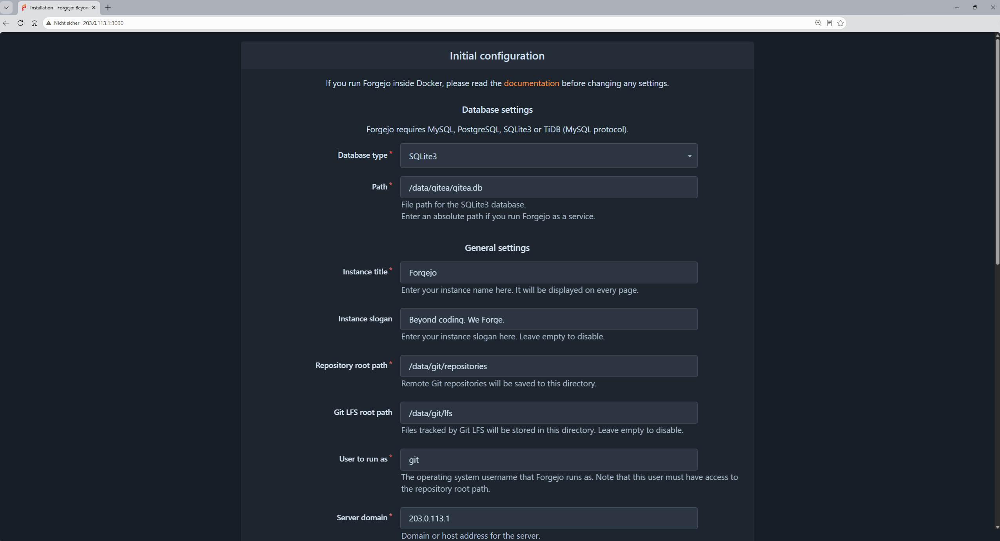
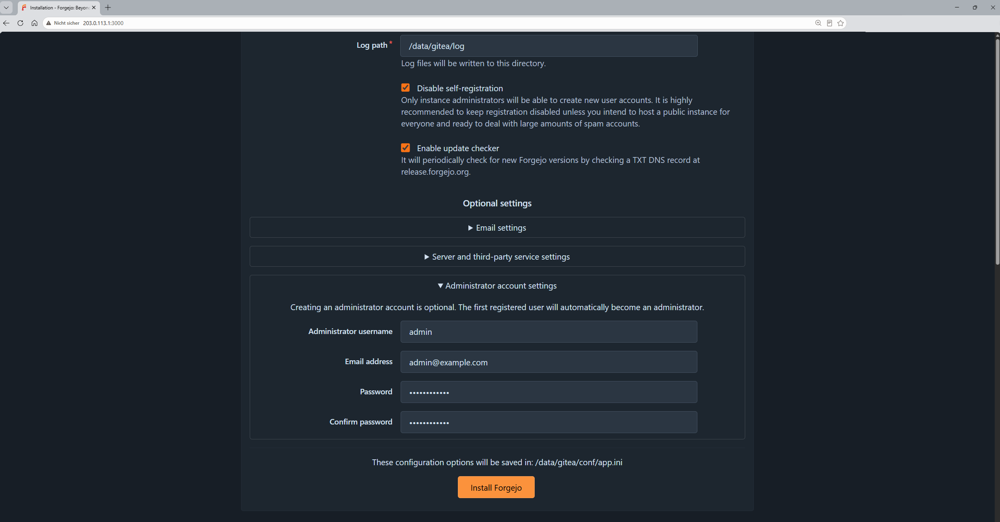
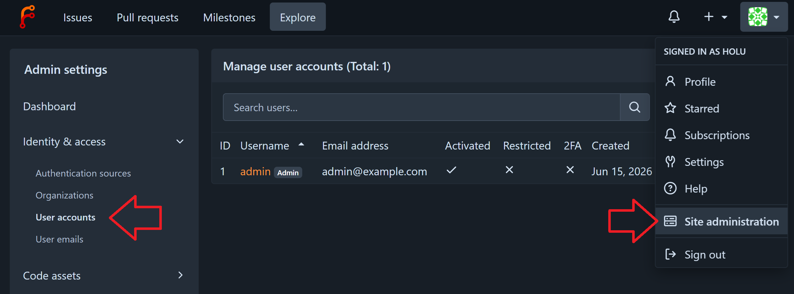

## Introduction

Forgejo is an [open-source platform](https://codeberg.org/forgejo/forgejo) for managing Git repositories. This tutorial shows step-by-step how to install and configure Forgejo via Docker on a cloud server with Debain 13.

**Prerequisites**

* 1 server (e.g. with [Hetzner](https://docs.hetzner.com/cloud/servers/getting-started/creating-a-server))
  * Debian 13
  * Access to the root user or a user with sudo permissions

**Example terminology**

* Username: `holu`
* Email: `email@example.com`
* Server: `<203.0.113.1>`

## Step 1 - Connect via SSH

If you don't have an SSH key yet, create one now on your local machine:

```bash
ssh-keygen -t ed25519 -C "email@example.com"
```

The key is saved in `~/.ssh/id_ed25519.pub`. Add the content of this file in Hetzner Console in "Security" » "Add SSH key" so that you can use it later to connect to your server.


Now create a server in Hetzner Console. Select Debian 13 as the OS image and the SSH key you just added. After the server is created, you get its IP address.


Now connect to the server. Open a terminal and run the following command. Replace `203.0.113.1` with the actual IP address of your server:

```bash 
ssh root@203.0.113.1 -p 22
```

## Step 2 - Update the system

Once you're connected to the server, make sure that the system is up-to-date by running these commands:

```bash
sudo apt update
sudo apt upgrade -y
```

These commands update the package list and install the latest versions of packages on your server.

## Step 3 - Install Docker

Forgejo needs Docker to run the application in containers. Install Docker with the following commands as explained in the [official documentation](https://docs.docker.com/engine/install/debian/#install-using-the-repository):

```bash
# Add Docker's official GPG key:
sudo apt update
sudo apt install ca-certificates curl
sudo install -m 0755 -d /etc/apt/keyrings
sudo curl -fsSL https://download.docker.com/linux/debian/gpg -o /etc/apt/keyrings/docker.asc
sudo chmod a+r /etc/apt/keyrings/docker.asc

# Add the repository to Apt sources:
sudo tee /etc/apt/sources.list.d/docker.sources <<EOF
Types: deb
URIs: https://download.docker.com/linux/debian
Suites: $(. /etc/os-release && echo "$VERSION_CODENAME")
Components: stable
Architectures: $(dpkg --print-architecture)
Signed-By: /etc/apt/keyrings/docker.asc
EOF

sudo apt update
sudo apt install docker-ce docker-ce-cli containerd.io docker-buildx-plugin docker-compose-plugin -y
```

After the installation, check if Docker was installed as expected by running this command:

```bash
sudo systemctl status docker
```

If Docker was installed successfully, the output should show that the Docker service is active and running.

<blockquote>
<details>
<summary>Click here to expand an example output</summary>

```shellsession
holu@example-server:~$ sudo systemctl status docker
● docker.service - Docker Application Container Engine
     Loaded: loaded (/usr/lib/systemd/system/docker.service; enabled; preset: enabled)
     Active: active (running) since Mon 2026-06-16 09:53:17 UTC; 16s ago
 Invocation: 0d4362e8d4fe443b82ab32bb44d415ca
TriggeredBy: ● docker.socket
       Docs: https://docs.docker.com
   Main PID: 5592 (dockerd)
      Tasks: 10
     Memory: 28.5M (peak: 30.6M)
        CPU: 312ms
     CGroup: /system.slice/docker.service
             └─5592 /usr/bin/dockerd -H fd:// --containerd=/run/containerd/containerd.sock

Jun 16 09:53:16 example-server dockerd[5592]: time="2026-06-16T09:53:16.841295340Z" level=info msg="Deleting nftabl>
Jun 16 09:53:16 example-server dockerd[5592]: time="2026-06-16T09:53:16.857299194Z" level=info msg="Deleting nftabl>
Jun 16 09:53:17 example-server dockerd[5592]: time="2026-06-16T09:53:17.258842559Z" level=info msg="Loading contain>
Jun 16 09:53:17 example-server dockerd[5592]: time="2026-06-16T09:53:17.264163432Z" level=info msg="Docker daemon" >
Jun 16 09:53:17 example-server dockerd[5592]: time="2026-06-16T09:53:17.264254553Z" level=info msg="Initializing bu>
Jun 16 09:53:17 example-server dockerd[5592]: time="2026-06-16T09:53:17.273451918Z" level=warning msg="git source c>
Jun 16 09:53:17 example-server dockerd[5592]: time="2026-06-16T09:53:17.278429176Z" level=info msg="Completed build>
Jun 16 09:53:17 example-server dockerd[5592]: time="2026-06-16T09:53:17.288867661Z" level=info msg="Daemon has comp>
Jun 16 09:53:17 example-server dockerd[5592]: time="2026-06-16T09:53:17.288964362Z" level=info msg="API listen on />
Jun 16 09:53:17 example-server systemd[1]: Started docker.service - Docker Application Container Engine.
```

</blockquote>
</details>

If Docker isn't running, you can start it with this command:

```bash
sudo systemctl start docker
```

Now add your user to the Docker group:

```bash
sudo usermod -aG docker holu
```

End the connection to the server and reconnect afterwards to update your user's groups. You can run `groups` to check if "docker" is listed.

## Step 4 - Install Forgejo

Now that Docker is installed, you can install Forgejo. First, create a directory for Forgejo and change into the new directory:

```bash
mkdir forgejo
cd forgejo
```

The following command downloads version 15 of the [Forgejo Docker image](https://codeberg.org/forgejo/-/packages/container/forgejo/versions).

```bash
docker pull codeberg.org/forgejo/forgejo:15
```

Now create a file called `docker-compose.yml` to configure the Forgejo instance. Add the following content:

```yaml
networks:
  forgejo:
    external: false

services:
  server:
    image: codeberg.org/forgejo/forgejo:15
    container_name: forgejo
    environment:
      - USER_UID=1000
      - USER_GID=1000
    restart: always
    networks:
      - forgejo
    volumes:
      - ./forgejo:/data
      - /etc/localtime:/etc/localtime:ro
    ports:
      - '3000:3000'
      - '222:22'
```

This configuration creates a Docker container for Forgejo that can be accessed via port 3000 for the web user interface and via port 222 for SSH connections. Forgejo data is stored in `./forgejo` on your server so that it is retained even after the container is restarted. `USER_UID` and `USER_GID` specify the user IDs and group IDs under which Forgejo runs inside the container.

Save the file and run this command to start the Forgejo container:

```bash
docker compose up -d
```

The command above starts the Forgejo container in the background. You can check the status of the container with the following command:

```bash
docker ps -a
```

If the container was started successfully, it should be listed as a running container.

## Step 5 - Access the Forgejo user interface

Now that the Forgejo container is running, you can access the user interface. Open a web browser and enter the IP address of your server followed by `:3000`, e.g. `http://203.0.113.1:3000`. You should see the login page of Forgejo.



You can keep the default values because Forgejo automatically uses SQLite as database.
Click on the bottom option "Administrator account settings" and create a new admin account by providing a user name, email address and password.



Finally, click on "Install Forgejo" to complete the installation. You will be logged in automatically and can start with managing your Git repositories.

To add more users:

* Klick on the user icon in the top right
* In the drop-down menu that opens, click on "Site administration"
* In the left menu bar, go to "Identity & access" » "User accounts"



## Conclusion

You now have a running Forgejo instance. Next, you can set up:

|          | Description |
| -------- | ----------- |
| Firewall | Configure a firewall to deny all incoming traffic by default and only allow required ports (e.g., Forgejo web UI and SSH access). |
| [Reverse proxy](https://forgejo.org/docs/latest/admin/setup/reverse-proxy/?utm_source=chatgpt.com#basic-http) | Set up a reverse proxy to make Forgejo accessible via a domain name instead of an IP and port (e.g. `git.example.com`). |
| [SSL certificate](https://forgejo.org/docs/latest/admin/setup/reverse-proxy/?utm_source=chatgpt.com#https) (HTTPS) | Enable HTTPS by issuing and configuring an SSL/TLS certificate for secure, encrypted access to Forgejo. Remember to edit the value of "ROOT_URL" in `~/forgejo/forgejo/gitea/conf/app.ini` and run `docker restart forgejo` |

##### License: MIT

<!--

Contributor's Certificate of Origin

By making a contribution to this project, I certify that:

(a) The contribution was created in whole or in part by me and I have
    the right to submit it under the license indicated in the file; or

(b) The contribution is based upon previous work that, to the best of my
    knowledge, is covered under an appropriate license and I have the
    right under that license to submit that work with modifications,
    whether created in whole or in part by me, under the same license
    (unless I am permitted to submit under a different license), as
    indicated in the file; or

(c) The contribution was provided directly to me by some other person
    who certified (a), (b) or (c) and I have not modified it.

(d) I understand and agree that this project and the contribution are
    public and that a record of the contribution (including all personal
    information I submit with it, including my sign-off) is maintained
    indefinitely and may be redistributed consistent with this project
    or the license(s) involved.

Signed-off-by: Maximilian Feix <contact@maxi-test.de> 

-->
