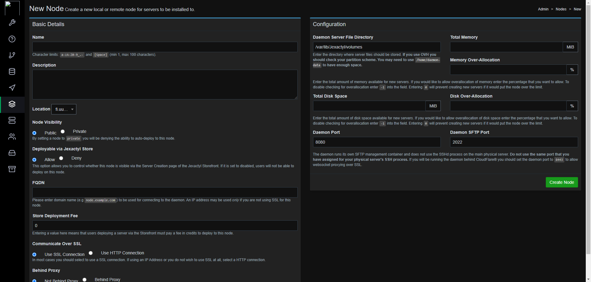

## Introduction

This tutorial will teach you how to install the Jexactyl Panel using the official installation steps.

> **WARNING:** Currently, there is no official way to uninstall it completely without wiping your server.

**Disclaimer 1:** I do not own this game panel nor do I take responsibility for any damage done to your system. I recommend you take a backup of your server.

**Disclaimer 2:** This tutorial is for installing only the panel!

**Prerequisites**

* Server with Ubuntu or Debian
   * Root access or access to a user with sudo permissions
   * You cannot have had Pterodactyl/Jexactyl or anything related to it installed to this system before.

This tutorial was tested with **Ubuntu 22.04 / 24.04** and **Debian 12**, however this tutorial should also work with older versions.

## Step 1 - Installing the panel

### Step 1.1 - Installing prerequisites

First, you need to install the prerequisites. The following commands will setup the dependencies of Jexactyl on your server. They are very similar to Pterodactyl.

These commands install the Redis and MariaDB repositories, then php version 8.1, the required extensions for it and finally, NGINX (Engine-X!!) as the web server.

If you're on Ubuntu, make sure you are logged in as root. If you aren't, type `sudo su` and enter your sudo password.

* Ubuntu 20.04 or below
  ```bash
  apt update && apt -y install software-properties-common curl apt-transport-https ca-certificates gnupg
  LC_ALL=C.UTF-8 add-apt-repository -y ppa:ondrej/php
  curl -sS https://downloads.mariadb.com/MariaDB/mariadb_repo_setup | sudo bash
  ```

* Ubuntu 22.04 or above
  ```bash
  apt update && apt -y install software-properties-common curl apt-transport-https ca-certificates gnupg
  LC_ALL=C.UTF-8 add-apt-repository -y ppa:ondrej/php
  ```
* Debian 12
  ```bash
  sudo apt update && sudo apt -y install software-properties-common curl apt-transport-https ca-certificates gnupg
  # Import the GPG key for the PHP repository and add the PHP repository to your system.
  sudo sh -c 'echo "deb https://packages.sury.org/php/ $(lsb_release -sc) main" > /etc/apt/sources.list.d/php.list' 
  sudo wget -qO - https://packages.sury.org/php/apt.gpg -O /etc/apt/trusted.gpg.d/sury-php.gpg
  ```

<br>

If you're using root, you can now go back to your sudo user. If you used `sudo su` to switch to the root user, run `exit` to end the session with root.

The next steps are the same for all distributions:

```bash
# Import the GPG key for the redis repository and add the redis repository to your system.
curl -fsSL https://packages.redis.io/gpg | sudo gpg --dearmor -o /usr/share/keyrings/redis-archive-keyring.gpg
echo "deb [signed-by=/usr/share/keyrings/redis-archive-keyring.gpg] https://packages.redis.io/deb $(lsb_release -cs) main" | sudo tee /etc/apt/sources.list.d/redis.list

sudo apt update && sudo apt -y install php8.1 php8.1-{cli,gd,mysql,pdo,mbstring,tokenizer,bcmath,xml,fpm,curl,zip} mariadb-server nginx tar unzip git redis-server
curl -sS https://getcomposer.org/installer | sudo php -- --install-dir=/usr/local/bin --filename=composer
```

To check if everything was installed successfully, you can run:

```bash
php -v && php -m
nginx -v
mariadb --version
composer --version
```

If the system can't find the command, you can run `export PATH=$PATH:/usr/sbin` to add the path and check again.

### Step 1.2 - Downloading the jexactyl files

You will have to create the required directory and enter it to install and extract the panel:

```bash
sudo mkdir -p /var/www/jexactyl
cd /var/www/jexactyl
```

Now, you can download and extract the files using the following commands:

```bash
sudo curl -Lo panel.tar.gz https://github.com/jexactyl/jexactyl/releases/latest/download/panel.tar.gz
sudo tar -xzvf panel.tar.gz
sudo chmod -R 755 storage/* bootstrap/cache/
```

## Step 2 - Setting up the database

Next, you will have to configure the database. If you followed this tutorial, you should have MariaDB installed on your system. You can setup the database by running the commands below.

These commands will only allow the `jexactyl` user to be accessed by localhost, aka the current server. You can also rename `panel` to something like `gamepanel`, `jexactyl`, anything! Just make sure to change it in the configuration earlier and in the GRANT command as it's very important.

> Replace `yourPassword` with a secure password.

```bash
# Login to MySQL/MariaDB
sudo mariadb -u root -p

# Remember to change 'yourPassword' below with a unique password
CREATE USER 'jexactyl'@'127.0.0.1' IDENTIFIED BY 'yourPassword';
CREATE DATABASE panel;
GRANT ALL PRIVILEGES ON panel.* TO 'jexactyl'@'127.0.0.1' WITH GRANT OPTION;
exit
```

Make sure you note down the password as you will need it again in "Step 4"!

## Step 3 - Setting up the environment configuration

Next, you will have to configure basic settings such as creating the first user. For this, make sure you're still in the `/var/www/jexactyl` directory.

* Copy the example file.
  
  The `.env.example` file contains the skeleton of the configuration, mainly just empty values, we'll fill them later.
  
  ```bash
  sudo cp .env.example .env
  ```

<br>

* Setup the `Composer` dependencies.
  
  Composer is a dependency manager for PHP. It's used a lot for Laravel applications, which Jexactyl, Pterodactyl and the new Pelican panel are built in.
  
  ```bash
  sudo composer install --no-dev --optimize-autoloader
  ```

<br>

* Generate the encryption key.
  
  If you lose it, you will not be able to access the Panel data anymore, be careful. You can generate it using:
  ```bash
  sudo php artisan key:generate --force
  ```

<br>

* Setup the environment:
  ```bash
  sudo php artisan p:environment:setup
  ```
  
  For most of the settings, you can use the default / recommended option. When it asks about the application URL, you can enter a domain or an IP address. However, it is strongly recommended to enter a domain. "Step 5" below explains how to create and use an SSL certificate, so if you have a domain, you can put `https` in front of it.

<br>

* Setup the database on the panel:
  ```bash
  sudo php artisan p:environment:database
  ```

  "Step 2" explained how to setup the database with the default values (`jexactyl`, `127.0.0.1`, `panel`). You can hit enter to confirm the default values. When it asks about the database password, enter whatever you set for `yourPassword` in "Step 2".

  If you changed the database name/username when you were creating the username and database in MySQL, you will need to enter it here!

<br>

* Setup the email service (Optional)
  
  You can optionally setup the email service if you have a custom service that is not PHP.
  
  ```bash
  sudo php artisan p:environment:mail # Not required to run the Panel.
  ```

<br>

* Migrate the database to apply all required patches.
  
  These patches will also add the default Game Eggs, such as Minecraft, Rust, etc.

  ```bash
  sudo php artisan migrate --seed --force
  ```

<br>

* Create the first user
  
  Creating the first user is easy. You can do so by running the following command and responding to the questions:
  
  > Make sure you set admin as `yes`, the default is `no`. However you will need to be able to login and create other users somehow!
  ```bash
  sudo php artisan p:user:make
  ```

<br>

* Give your webserver permission to access the web directory.
  
  ```bash
  sudo chown -R www-data:www-data /var/www/jexactyl/*
  ```

## Step 4 - System Queue Worker

In this step, you will have to setup the queue worker which handles background tasks.
It also handles scheduling, such as running commands in a game server, or having a restart schedule. 
Maybe even a Rust Wipe script!

The service will be placed in `/etc/systemd/system` as it's the folder for services created by the user.

Create the file `/etc/systemd/system/jexactyl.service` using sudo and add the following content:

```bash
# Jexactyl Queue Worker File
# ----------------------------------

[Unit]
Description=Jexactyl Queue Worker

[Service]
User=www-data
Group=www-data
Restart=always
ExecStart=/usr/bin/php /var/www/jexactyl/artisan queue:work --queue=high,standard,low --sleep=3 --tries=3
StartLimitInterval=180
StartLimitBurst=30
RestartSec=5s

[Install]
WantedBy=multi-user.target
```

To ensure it starts on boot and to start it right now, you can use `sudo systemctl enable jexactyl --now`. `--now` Makes sure it gets started too.

## Step 5 - Setting up the webserver

In this tutorial, I will be using the NGINX web server with SSL. First you will have to download certbot and it's NGINX plugin. You can do so using the following commands:

```bash
sudo apt install -y certbot python3-certbot-nginx
```

Certbot uses LetsEncrypt SSL, which is a free Certificate Authority as TLS certificates are quite pricy normally!

Once it is downloaded, run the following command:

> Replace the example domain with your own!

```bash
certbot certonly --standalone -d example.com
```

We'll use `certonly --standalone` as our configuration has it's own SSL parameters which would be deleted if we used the NGINX without SSL configuration and then had Certbot add the SSL server directive.

Next, you will have to remove the default config so it can be replaced with the new one:
```bash
sudo rm /etc/nginx/sites-available/default && sudo rm /etc/nginx/sites-enabled/default
```

Now, create the new file `/etc/nginx/sites-available/panel.conf` using sudo and add the following content:

The guide would be too long to explain every directive in the NGINX configuration, so you can refer to the [nginx documentation](https://nginx.org/en/docs/) for more information.

> Replace `example.com` with your own domain!

```conf
server {
    listen 80;
    server_name example.com;
    return 301 https://$server_name$request_uri;
}

server {
    listen 443 ssl http2;
    server_name example.com;

    root /var/www/jexactyl/public;
    index index.php;

    access_log /var/log/nginx/jexactyl.app-access.log;
    error_log  /var/log/nginx/jexactyl.app-error.log error;

    # allow larger file uploads and longer script runtimes
    client_max_body_size 100m;
    client_body_timeout 120s;

    sendfile off;

    # SSL Configuration
    ssl_certificate /etc/letsencrypt/live/example.com/fullchain.pem;
    ssl_certificate_key /etc/letsencrypt/live/example.com/privkey.pem;
    ssl_session_cache shared:SSL:10m;
    ssl_protocols TLSv1.2 TLSv1.3;
    ssl_ciphers "ECDHE-ECDSA-AES128-GCM-SHA256:ECDHE-RSA-AES128-GCM-SHA256:ECDHE-ECDSA-AES256-GCM-SHA384:ECDHE-RSA-AES256-GCM-SHA384:ECDHE-ECDSA-CHACHA20-POLY1305:ECDHE-RSA-CHACHA20-POLY1305:DHE-RSA-AES128-GCM-SHA256:DHE-RSA-AES256-GCM-SHA384";
    ssl_prefer_server_ciphers on;

    add_header X-Content-Type-Options nosniff;
    add_header X-XSS-Protection "1; mode=block";
    add_header X-Robots-Tag none;
    add_header Content-Security-Policy "frame-ancestors 'self'";
    add_header X-Frame-Options DENY;
    add_header Referrer-Policy same-origin;

    location / {
        try_files $uri $uri/ /index.php?$query_string;
    }

    location ~ \.php$ {
        fastcgi_split_path_info ^(.+\.php)(/.+)$;
        fastcgi_pass unix:/run/php/php8.1-fpm.sock;
        fastcgi_index index.php;
        include fastcgi_params;
        fastcgi_param PHP_VALUE "upload_max_filesize = 100M \n post_max_size=100M";
        fastcgi_param SCRIPT_FILENAME $document_root$fastcgi_script_name;
        fastcgi_param HTTP_PROXY "";
        fastcgi_intercept_errors off;
        fastcgi_buffer_size 16k;
        fastcgi_buffers 4 16k;
        fastcgi_connect_timeout 300;
        fastcgi_send_timeout 300;
        fastcgi_read_timeout 300;
        include /etc/nginx/fastcgi_params;
    }

    location ~ /\.ht {
        deny all;
    }
}
```

<blockquote>
<details>
<summary>Click here to view a configuration file without a domain and without an SSL certificate</summary>

```conf
server {
        listen 80 default_server;
        listen [::]:80 default_server;
    root /var/www/jexactyl/public;
    index index.php;
    access_log /var/log/nginx/jexactyl.app-access.log;
    error_log  /var/log/nginx/jexactyl.app-error.log error;
    # allow larger file uploads and longer script runtimes
    client_max_body_size 100m;
    client_body_timeout 120s;
    sendfile off;
    add_header X-Content-Type-Options nosniff;
    add_header X-XSS-Protection "1; mode=block";
    add_header X-Robots-Tag none;
    add_header Content-Security-Policy "frame-ancestors 'self'";
    add_header X-Frame-Options DENY;
    add_header Referrer-Policy same-origin;

    location / {
        try_files $uri $uri/ /index.php?$query_string;
    }
    
    location ~ \.php$ {
        fastcgi_split_path_info ^(.+\.php)(/.+)$;
        fastcgi_pass unix:/run/php/php8.1-fpm.sock;
        fastcgi_index index.php;
        include fastcgi_params;
        fastcgi_param PHP_VALUE "upload_max_filesize = 100M \n post_max_size=100M";
        fastcgi_param SCRIPT_FILENAME $document_root$fastcgi_script_name;
        fastcgi_param HTTP_PROXY "";
        fastcgi_intercept_errors off;
        fastcgi_buffer_size 16k;
        fastcgi_buffers 4 16k;
        fastcgi_connect_timeout 300;
        fastcgi_send_timeout 300;
        fastcgi_read_timeout 300;
        include /etc/nginx/fastcgi_params;
    }
    
    location ~ /\.ht {
        deny all;
    }
}
```

</details>
</blockquote>

Use the following commands to create a link, test the configuration file and, if everything is OK, restart NGINX:
```bash
sudo ln -s /etc/nginx/sites-available/panel.conf /etc/nginx/sites-enabled/panel.conf
sudo nginx -t
sudo systemctl restart nginx
```

## Step 6 - Login

You can now go to your domain and login! To login, use the user data you setup for the new admin user in "Step 3". After you've logged in as admin, click on the gear symbol to switch to the settings page.


## Step 7 - Setting up a node

This installation will be on the same machine as the node. However this may not be what you always want, so make sure you run the commands on the right machine!

### Step 7.1 - Creating the location

Click on the icon that looks like an arrow. It should be named `Locations`.


On the top right, there's a `Create New` button. Click it and it should look like this:


Enter a short code, I usually go for the ISO 3166-1 alpha-2 (2 letter country code) name, then the state/province (if applicable), then three letters from the city (HEL for Helsinki, ASH for Ashburn, etc).

The description can and probably should be the full location name, to avoid issues!

### Step 7.2 - Creating the node

Once it's created, head over to the `Nodes` tab. In the left menu bar, you can find it directly under the "Locations" icon. 

Click `Create New`. Don't get intimidated! I will cover every part of the node creation!



| Option      | Explanation |
| ----------- | ----------- |
| Name        | I usually use the location and then a number, like 01, 10, 20, etc. |
| Description | This can be anything but I recommend having the specifications of the server inside. |
| FQDN        | This can be a new subdomain, or the same one as the panel. It should be a domain, though. If you set an IP address, you have to change `Communicate Over SSL` to "Use HTTP Connection". |

If you followed the first part of the guide, you should be restricted to SSL connections only, which is what I recommend for a proper experience!

In the right section, you need to set the memory and disk space of your server. If you want to assign more ram and storage than you have, you can add an Overallocation percentage. The ports can be changed but you need to make sure that they're open in the firewall!

### Step 7.3 - Adding ports

After creating the node, you need to add ports. For the IP address, just set it to the node's IP. The IP Alias should be the subdomain, but you can set it to anything. Some people set it to `private` to try hiding the IP, however you can always just find the IP in the `Network` tab of the server.

You can enter ports in ranges, like 25565-25585, or single ports such as `25565,25577,25599`. I usually just add 25565-25585 to start off, then go up by 10-20.


### Step 7.4 - Downloading and creating

Once the ports are added, go into the configuration tab at the top and click `Generate token`. Save the command for later.


At the time of writing this guide, Jexactyl uses the Pterodactyl Wings daemon, so we can just use these commands to install it:

```bash
# Install docker so that we can create the containers for each server
sudo curl -sSL https://get.docker.com/ | CHANNEL=stable bash
# Enable it on boot so that we don't need to do anything to it
sudo systemctl enable --now docker
# Create the directory, download the file and mark it as executable
sudo mkdir -p /etc/jexactyl
sudo curl -L -o /usr/local/bin/wings "https://github.com/pterodactyl/wings/releases/latest/download/wings_linux_$([[ "$(uname -m)" == "x86_64" ]] && echo "amd64" || echo "arm64")"
sudo chmod u+x /usr/local/bin/wings
sudo ln -s /etc/jexactyl /etc/pterodactyl
```

Then run the command you saved earlier. You should get this at the end of the output:

```text
Successfully configured wings.
```

### Step 7.5 - Creating the service

To be able to run it on startup, we need to create a service, like the jexactyl one.

Create the new file `/etc/systemd/system/wings.service` using sudo.

Enter the following content in it:

```conf
[Unit]
Description=Pterodactyl Wings Daemon
After=docker.service
Requires=docker.service
PartOf=docker.service

[Service]
User=root
WorkingDirectory=/etc/pterodactyl
LimitNOFILE=4096
PIDFile=/var/run/wings/daemon.pid
ExecStart=/usr/local/bin/wings
Restart=on-failure
StartLimitInterval=180
StartLimitBurst=30
RestartSec=5s

[Install]
WantedBy=multi-user.target
```

Then run `sudo systemctl enable --now wings`, to run it on startup.

You should see a green heart beating on the left side of the name. If not, you should check the JavaScript console and the Network tab to see what's causing the issue.

## Conclusion

Good job, you've successfully installed the panel and setup a node on the same server!
You can now create servers!


##### License: MIT

<!--

Contributor's Certificate of Origin

By making a contribution to this project, I certify that:

(a) The contribution was created in whole or in part by me and I have
    the right to submit it under the license indicated in the file; or

(b) The contribution is based upon previous work that, to the best of my
    knowledge, is covered under an appropriate license and I have the
    right under that license to submit that work with modifications,
    whether created in whole or in part by me, under the same license
    (unless I am permitted to submit under a different license), as
    indicated in the file; or

(c) The contribution was provided directly to me by some other person
    who certified (a), (b) or (c) and I have not modified it.

(d) I understand and agree that this project and the contribution are
    public and that a record of the contribution (including all personal
    information I submit with it, including my sign-off) is maintained
    indefinitely and may be redistributed consistent with this project
    or the license(s) involved.

Signed-off-by: Ssmidge (adrian.trifonov@gmail.com)

-->
