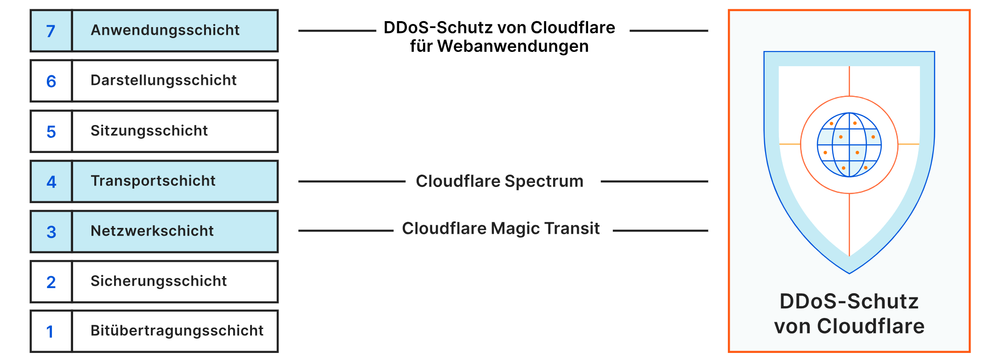

## Einleitung

Dieses Tutorial erklärt, wie man auf einem Game-Server zum Schutz vor DDoS-Angriffen eine einfache Firewall einrichtet und die Anzahl der Anfragen beschränkt. Dabei ist zu beachten, dass der Game-Server selbst mit diesen Einstellungen nicht sicher vor DDoS-Angriffen ist. Eine sichere Firewall kann aber zumindest die Angriffsfläche reduzieren und das Begrenzen der Anfragen kann den Server vor dem Überlasten schützen.

> **Wichtiger Hinweis:**<br>
> Dieses Tutorial kann bei kleinen DDoS-Angriffen helfen. Wenn du aber bereits im Voraus schwerwiegende DDoS-Angriffe erwartest, werden die Einstellungen aus diesem Tutorial nicht ausreichen. In diesen Fällen sollte sichergestellt werden, dass die notwendige Hardware vorhanden ist und dass zusätzliche Sicherheitsmaßnahmen eingerichtet wurden.

Dieses Tutorial erklärt, wie man eine Firewall und das Begrenzen der Anfragen direkt auf dem Game-Server einrichtet. Wenn möglich, sollten diese Maßnahmen aber im besten Fall auf einem Reverse-Proxy-Server eingerichtet werden. Ohne einem Reverse-Proxy geht der gesamte Traffic direkt an den Game-Server und der Server muss beides verarbeiten, das Spiel und das Blockieren/Akzeptieren eingehender Anfragen. Wenn die Anzahl der eingehenden Anfragen sehr hoch ist, kann das auf dem Server unnötig zusätzliche Last verursachen. Mit einem Reverse-Proxy muss der Server nur die Anfragen verarbeiten, die vom Reverse-Proxy-Server akzeptiert und an den Game-Server weitergeleitet wurden.

<blockquote>

<details>

<summary>Hinweis bezüglich Cloudflare-DDoS-Schutz</summary>

Cloudflare bietet einen [kostenlosen Service zum Abwehren von DDoS-Angriffen](https://www.cloudflare.com/de-de/application-services/products/ddos-for-web/). Die Regeln zielen allerdings auf Layer-7-Angriffe ab und sind daher nicht sehr hilfreich bei Game-Servern. Game-Server nutzen normalerweise TCP/UDP und brauchen einen Layer-4-Schutz. Layer-4-Schutz ist nur in Cloudflare Spectrum enthalten, was nicht kostenlos genutzt werden kann.



> *Quelle: [Cloudflare » DDoS](https://www.cloudflare.com/de-de/ddos/)*

</details>

</blockquote>

<br>

**Voraussetzungen:**

* Server mit Ubuntu<br>
  *Dieses Tutorial wurde an Ubuntu 22.04 getestet, es sollte aber auch mit anderen Versionen funktionieren.*

Für dieses Tutorial gibt es keine Voraussetzungen. Aus Sicherheitsgründen werden aber folgende Einstellungen empfohlen:

| Empfohlene Einstellungen     | Tutorial                                              |
| ---------------------------- | ----------------------------------------------------- |
| Root-Benutzer deaktiviert    | *[Ersteinrichtung eines Servers mit Ubuntu](/tutorials/howto-initial-setup-ubuntu/de#schritt-7---root-zugriff-deaktivieren)* |
| SSH-Key                      | *[SSH-Key einrichten](/tutorials/howto-ssh-key/de)*   |
| Sichere SSH-Einstellungen    | *[Absicherung des SSH Dienstes](/tutorials/securing-ssh/de)* |
| SSL (Domain nötigt)          | *["Let's Enrypt"-Zertifikat unter Ubuntu hinzufügen](/tutorials/add-ssl-certificate-with-lets-encrypt-to-nginx-on-ubuntu-20-04)* `EN` |
| Nicht-Standard-Port          | *Siehe Tutorials für [Minecraft](/tutorials/make-a-minecraft-server#step-5---using-a-different-port) (`EN`) and [Mindustry](/tutorials/setup-mindustry-server/de#schritt-6---einen-anderen-port-verwenden)* |

<br>

**Beispiel-Benennungen:**

* Game-Server
  * Hostname: `<your_host>`
  * Game-Port: `<your_game_port>`
  * SSH-Port: `22`
* Spieler-IPs: `<203.0.113.1>` `<198.51.100.1>`

## Schritt 1 - Firewall einrichten

Aus Sicherheitsgründen sollte die Firewall standardmäßig den gesamten eingehenden Traffic blockieren. Zusätzlich können Ausnahmen festgelegt werden, welche bestimmte Protokolle/Ports erlauben, um sich auf dem Server anzumelden (SSH) oder sich mit dem Spiel zu verbinden (TCP/UDP). Wenn du deine Firewall noch mehr absichern willst, kannst du zusätzlich einzelne IP-Adressen festlegen, die als einzige Zugriff erhalten sollen. Anfragen von allen anderen IPs werden automatisch abgelehnt. Dieses Tutorial erklärt wie man den gesamten eingehenden Traffic blockiert und:

* **Jedem** Zugriff auf den Game-Port erlaubt
* **Nur ausgewählten IPs** Zugriff auf den Game-Port erlaubt

Standardmäßig wir unter Ubuntu die `ufw`-Firewall genutzt. Dieses Tutorial verwendet `iptables`. Achte darauf, am besten nur eine Firewall zu verwenden. Es wird nicht empfohlen, mehrere verschiedene Firewalls gleichzeitig zu nutzen, da die Regeln dieser Firewalls sich widersprechen könnten und das zu ungewollten Konflikten führen könnte.

> Eine Einführung in `iptables` für Anfänger ist hier verfügbar: "[Einrichtung eines Paketfilters auf Linux](/tutorials/iptables/de)"

Mit folgendem Befehl kann geprüft werden, ob es bereits Regeln gibt:

```bash
sudo iptables -L
```

Wenn die Firewall noch keine Regeln hat, können diese jetzt hinzugefügt werden. Wenn die Standard-Policy für eingehenden Traffic auf "DROP" gesetzt wird, werden sofort alle Verbindungen beendet. Aus diesem Grund ist es wichtig erst SSH-Verbindungen zu erlauben, damit man sich auch anschließend noch mit dem Server verbinden kann.

Wenn du nicht den Standard-Port für SSH verwendest, ersetze `22` entsprechend in den folgenden Befehlen.

```bash
# SSH-Verbindungen erlauben
sudo iptables -A INPUT -p tcp --dport 22 -j ACCEPT  # Für IPv4-Adressen
sudo ip6tables -A INPUT -p tcp --dport 22 -j ACCEPT # Für IPv6-Adressen

# Kommunikation auf dem Localhost erlauben
sudo iptables -A INPUT -i lo -j ACCEPT
sudo iptables -A OUTPUT -o lo -j ACCEPT
sudo ip6tables -A INPUT -i lo -j ACCEPT
sudo ip6tables -A OUTPUT -o lo -j ACCEPT

# Den eingehenden Traffic von bereits hergestellten Verbindungen erlauben
sudo iptables -A INPUT -m conntrack --ctstate ESTABLISHED,RELATED -j ACCEPT  # Für IPv4-Adressen
sudo ip6tables -A INPUT -m conntrack --ctstate ESTABLISHED,RELATED -j ACCEPT # Für IPv6-Adressen

# Den gesamten eingehenden Traffic blockieren
sudo iptables -P INPUT DROP                         # Für IPv4-Adressen
sudo ip6tables -P INPUT DROP                        # Für IPv6-Adressen
```

Jetzt da die Firewall eingerichtet wurde, muss noch der Game-Port geöffnet werden.

* **Nur ausgewählten IPs Zugriff auf den Game-Port erlauben**<br>
  Wenn du die IP-Adressen der Spieler kennst und sich diese IP-Adressen nicht ändern, kannst du ausschließlich diesen IPs den Zugriff erlauben:
  ```bash
  sudo iptables -A INPUT -s <203.0.113.1>,<198.51.100.1> -p tcp --dport <your_game_port> -j ACCEPT
  sudo iptables -A INPUT -s <203.0.113.1>,<198.51.100.1> -p udp --dport <your_game_port> -j ACCEPT
  ```
  > Ersetze `<203.0.113.1>` und `<198.51.100.1>` mit deinen eigenen Spieler-IPs und `<your_game_port>` mit deinem eigenen Game-Port.

* **Jedem Zugriff auf den Game-Port erlauben**<br>
  Mit dieser Regel kann jeder auf dein Spiel zugreifen:
  ```bash
  sudo iptables -A INPUT -p tcp --dport <your_game_port> -j ACCEPT
  sudo iptables -A INPUT -p udp --dport <your_game_port> -j ACCEPT
  ```
  > Ersetze `<your_game_port>` mit deinem eigenen Game-Port.

Die neue Regel sollte jetzt hinzugefügt worden sein. Mit `sudo iptables -L` kann man sich die Regeln listen lassen.

Die Regeln werden nicht automatisch dauerhaft gespeichert und verschwinden mit dem nächsten Neustart. Um die Regeln dauerhaft zu speichern, installiere:
```bash
sudo apt update && sudo apt install iptables-persistent
```
Jetzt speichere deine Regeln:
```bash
sudo iptables-save | sudo tee /etc/iptables/rules.v4
sudo ip6tables-save | sudo tee /etc/iptables/rules.v6
```

Wenn der Server das nächste mal neustartet, werden die Regeln, die in diesen Dateien gespeichert wurden automatisch wieder angewendet. Wenn du weitere iptables-Regeln hinzufügst, müssen die `iptables-save`-Befehle erneut ausgeführt werden, um die Dateien zu aktualisieren.

> Um eine Regel zu löschen, können folgenden Befehle genutzt werden:
> ```bash
> sudo iptables -L --line-numbers       # Alle Regeln nummeriert listen
> sudo iptables -D INPUT <line-number>  # Eine INPUT-Regel durch Angabe der Zeile löschen
> ```

## Schritt 2 - Anzahl der Anfragen begrenzen

Die bisherigen Firewall-Regeln erhöhen bereits die Sicherheit. Den Game-Port öffentlich erreichbar zu lassen bietet allerdings eine mögliche Angriffsfläche. Mit iptables und Fail2Ban ist es möglich die Anzahl der Anfragen, die auf diesen Port eingehen dürfen zu beschränken.

Es wird erklärt wie man:

* Die Anzahl der Anfragen pro IP begrenzt
* Die Anzahl der Anfragen aller IPs zusammen begrenzt

### Schritt 2.1 - Die Anzahl der Anfragen pro IP begrenzen

<details>

<summary>Hier klicken, um nur iptables zu verwenden</summary>

**Mit iptables**

Wenn man ausschließlich iptables verwendet, ohne Fail2Ban, kann nur eine Regel zum Begrenzen der Anfragen festgelegt werden. Du musst also entscheiden, ob du die Anzahl der Anfragen pro IP beschränken willst oder die Anfragen aller IPs zusammen. Beides geht nicht. Folgende Schritte erklären, wie man die Anfragen pro IP begrenzt.

* **Prüfen in welcher Zeile die Game-Port-Regel steht**<br>
  Wenn eine Anfrage reinkommt, prüft iptables die Regeln von oben nach unten und verwendet immer die erste Regel, die zutrifft. Aus diesem Grund muss die Regel, die die Anzahl der Anfragen begrenzt vor der Regel gelistet werden, die den gesamten eingehenden Traffic auf den Game-Port erlaubt:
  ```bash
  sudo iptables -L --line-numbers        # Prüfe in welcher Zeile die Regel steht "ACCEPT anywhere tcp dpt:<your_game_port>"
  ```

* **Die erlaubte Anzahl an Anfragen begrenzen**<br>
  Füge die folgenden iptables-Regeln hinzu. Die zweite Regel erlaubt 7 Anfragen innerhalb von 30 Sekunden. Wenn eine einzelne IP innerhalb von 30 Sekunden mehr als 7 Anfragen hintereinander schickt, kann diese erst wieder eine Anfrage schicken, wenn die 30 Sekunden vorbei sind. In den folgenden 30 Sekunden kann die IP wieder 7 neue Anfragen schicken. Um ein anderes Limit zu setzen, müssen die Werte `30` und `7` entsprechend angepasst werden.
  ```bash
  sudo iptables -I INPUT -p tcp --dport <your_game_port> -m conntrack --ctstate NEW -m recent --set
  sudo iptables -I INPUT -p tcp --dport <your_game_port> -m conntrack --ctstate NEW -m recent --update --seconds 30 --hitcount 7 -j DROP
  ```
  Mit den obenstehenden Befehlen wird die neue Regel in der ersten Zeile hinzugefügt. Wenn die neue Regel in einer bestimmten Zeile hinzugefügt werden soll, kann folgender Befehl genutzt werden:
  ```bash
  sudo iptables -I INPUT <line-number> <rate-limit-rule>
  ```
  Wenn du eine bestimmte Zeile angibst, achte darauf, dass die Limit-Regel über der Regel steht, die den gesamten eingehenden Traffic erlaubt. Wenn eine Anfrage reinkommt, werden alle Regeln von oben nach unten geprüft. Sobald eine Regel zutrifft, wird diese verwendet. Wenn `-p tcp --dport <your_game_port> -j ACCEPT` ganz oben steht, werden alle Anfragen zugelassen und die Limit-Regel wird ignoriert. Wenn `--seconds 30 --hitcount 7 -j DROP` zuerst kommt und eine Anfrage dieses Limit erreicht hat, wird diese abgewiesen. Wenn diese IP noch keine 7 Anfragen geschickt hat, wird die Regel aus Schritt 1, die den gesamten Traffic erlaubt, angewendet.

* **Die Regel dauerhaft speichern**<br>
  iptables-Regeln werden nicht automatisch dauerhaft gespeichert. Um die Regel dauerhaft zu verwenden, muss die `/etc/iptables/rules.v4`-Datei aktualisiert werden:
  ```bash
  sudo iptables-save | sudo tee /etc/iptables/rules.v4
  ```
  Wenn der Server das nächste mal neustartet, werden die Regeln, die in dieser Datei gespeichert wurden automatisch wieder angewendet.

<br>

**Mit Fail2Ban**

</details>

Dieser Schritt verwendet Fail2Ban um die Anzahl der Anfragen zu beschräken und iptables, um die eingehenden Anfragen zu dokumentieren.

* **Fail2Ban installieren**<br>
  Bevor du loslegst, solltest du prüfen ob iptables und Fail2Ban beide verfügbar sind. Mit `systemctl status fail2ban` kannst du dir den Status von Fail2Ban anzeigen lassen. Unter Ubuntu installieren:
  ```bash
  apt install fail2ban
  systemctl enable --now fail2ban
  ```
  > Beachte, dass Fail2Ban automatisch SSH-Regeln nutzt.

<br>

* **Anfragen mit iptables dokumentieren**
  ```bash
  sudo iptables -I INPUT -p tcp --dport <your_game_port> -m conntrack --ctstate NEW -j LOG --log-level 6 --log-prefix "GameServerAccess: "
  ```
  Iptables dokumentiert nun alle Zugriffsversuche auf den TCP-Port `<your_game_port>` in der `/var/log/syslog`-Datei. Wenn du dir die Datei ansiehst, sollte vor jedem Versuch auf den Game-Port zuzugreifen `GameServerAccess: ` stehen.
  
  Die Regel dauerhaft speichern:
  ```bash
  sudo iptables-save | sudo tee /etc/iptables/rules.v4
  ```

<br>

* **Filter hinzufügen**<br>
  In der `/var/log/syslog`-Datei sind nur die Einträge relevant, vor denen `GameServerAccess: ` steht. Erstelle die folgende Datei, damit Fail2Ban die Einträge danach filtert:
  ```bash
  sudo nano /etc/fail2ban/filter.d/gameserveraccess.conf
  ```
  Füge den Inhalt hinzu:
  ```conf
  [Definition]
  failregex = GameServerAccess: .* SRC=<HOST>
  ignoreregex =
  ```

<br>

* **Fail2Ban-Eintrag hinzufügen**<br>
  Bestimme die Anzahl der Anfragen, die pro IP erlaubt sein sollen und lege fest, wie lange eine IP blockiert werden soll, wenn dieses Limit erreicht wurde. Mit `logpath` legst du fest wo Fail2Ban überprüfen kann, wann und wie oft eine IP bereits Anfragen geschickt hat. Durch den Filter, der eben erstellt wurde, überwacht Fail2Ban nur die IPs, die mit `GameServerAccess: ` dokumentiert wurden.
  ```bash
  sudo nano /etc/fail2ban/jail.local
  ```
  Füge den Inhalt hinzu:
  ```conf
  [game-server]
  enabled = true
  filter = gameserveraccess
  logpath = /var/log/syslog
  maxretry = 7
  findtime = 30
  bantime = 120
  ```
  > Wenn du die `gameserveraccess.conf`-Datei anders genannt hast, passe den Verweis auf `gameserveraccess` entsprechend an.

  Die obere Konfiguration erlaubt pro IP 7 Anfragen innerhalb von 30 Sekunden. Wenn eine IP dieses Limit überschreitet, wird diese für 120 Sekunden blockiert. Wenn du ein anderes Limit festlegen möchtest, passe die Werte `7`, `30` und `120` entsprechend an.

<br>

Wenn alles gespeichert wurde, kann Fail2Ban neugestartet werden:

```bash
sudo systemctl restart fail2ban
```

--------------------------------------

### Schritt 2.2 - Die Anzahl der Anfragen aller IPs zusammen begrenzen

Bei iptables ist es mit dem `limit`-Modul möglich die Gesamtzahl aller neuen Verbindungen innerhalb eines bestimmten Zeitraums zu begrenzen. Bei dem `limit`-Modul legen die Optionen `--limit` und `--limit-burst` den Zeitraum und den Limitparameter fest:

|                         |             | Beschreibung       |
| ----------------------- | ----------- | ------------------ |
| Zeitraum<br>`--limit`   | z.B. 2/min  | In diesem Beispiel liegt der Zeitraum bei einer halben Minute, was 30 Sekunden entspricht. Während des ersten Zyklus von 30 Sekunden, werden durch den unteren Limitparameter insgesamt 100 Anfragen erlaubt. Nachdem ein Zyklus endet, wird die erlaubte Zahl nicht auf das Gesamtlimit von 100 zurückgesetzt. Stattdessen steigt der Parameter um eins. Wenn der Parameter bereits bei 100 liegt, steigt dieser nicht weiter an. |
| Limitparameter<br>`--limit-burst` | z.B. 100 | In diesem Beispiel liegt die höchste Anzahl an Anfragen, die innerhalb eines Zyklus von 30 Sekunden angenommen werden bei 100. Nachdem ein Zyklus endet, wird der Parameter NICHT auf 100 zurückgesetzt. Wenn innerhalb des ersten Zyklus bereits 100 Anfragen reinkommen, werden im folgenden Zyklus quasi keine weiteren Anfragen angenommen. Nach jedem Zyklus steigt der Parameter aber um eins. Das bedeutet, wenn man innerhalb eines einzelnen Zyklus das Limit erreicht, wird im folgenden Zyklus nur eine Anfrage angenommen. Wenn in den folgenden 100 Zyklen keine Anfragen reinkommen, liegt der Parameter wieder bei 100. Es werden nie mehr als 100 Anfragen angenommen. |

* **Alte Firewall-Regel löschen**<br>
  Wenn du den Game-Port in "Schritt 1" bereits für alle geöffnet hast, kannst du die Regel jetzt löschen. Mit den neuen Regeln zum Beschränken der Anfragen wird diese Regel nicht mehr benötigt.
  ```bash
  sudo iptables -L --line-numbers       # Prüfe in welcher Zeile die Regel steht "ACCEPT anywhere tcp dpt:<your_game_port>"
  sudo iptables -D INPUT <line-number>  # Lösche die Regel, die den gesamten eingehenden Traffic zum Game-Port erlaubt
  ```

* **Neue Regeln hinzufügen**<br>
  Führe die untenstehenden Befehle aus, um einen Limit-Parameter von 100 festzulegen und einen Zeitraum von einer halben Minute (30 Sekunden). Wenn du ein anderes Limit festlegen möchtest, passe die Werte `100` und `2/min` entsprechend an.
  ```bash
  sudo iptables -A INPUT -p tcp --dport <your_game_port> -m conntrack --ctstate NEW -m limit --limit 2/min --limit-burst 100 -j ACCEPT
  sudo iptables -A INPUT -p tcp --dport <your_game_port> -m conntrack --ctstate NEW -j DROP
  ```
  
  <br>

  Mit der ersten Regel wird der Zugriff auf den Server erlaubt. Diese Regel wird auf alle Anfragen angewendet, die innerhalb des festgelegten Limits liegen. Sobald das Limit überschritten wird, wird die Regel nicht mehr angewendet.
  
  <br>

  Die zweite Regel blockiert den Zugriff auf den Server. Diese Regel wird angewendet, wenn die erste Regel nicht mehr angewendet wird.
  
  <br>

* **Die Regel dauerhaft speichern**<br>
  iptables-Regeln werden nicht automatisch dauerhaft gespeichert. Um die Regel dauerhaft zu verwenden, muss die `/etc/iptables/rules.v4`-Datei aktualisiert werden:
  ```bash
  sudo iptables-save | sudo tee /etc/iptables/rules.v4
  ```
  Wenn der Server das nächste mal neustartet, werden die Regeln, die in dieser Datei gespeichert wurden automatisch wieder angewendet.

## Schritt 3 - Anfragen ohne SYN-Flag blockieren

Sobald das Limit aus "Schritt 2" erreicht ist, kann niemand mehr auf den TCP-Port `your_game_port` zugreifen. Solange das Limit noch nicht erreicht ist, kann allerdings jeder darauf zugreifen. Das schließt beides mit ein, legitime Anfrage und solche mit schädlicher Absicht. Die folgende Regel blockiert neue Verbindungen ohne SYN-Flag:

```bash
sudo iptables -I INPUT -p tcp ! --syn -m conntrack --ctstate NEW -j DROP
```

Anschließend sollten die iptables-Regeln wieder gespeichert werden:

```bash
sudo iptables-save | sudo tee /etc/iptables/rules.v4
```

## Ergebnis

Beachte, dass diese Einstellungen noch nicht ausreichen, um einen DDoS-Angriff komplett abzuwehren, und dass die Sicherheit mit weiteren Einstellungen noch deutlich erhöht werden kann. Die Einstellungen aus diesem Tutorial bieten aber zumindest einen ersten Schutz gegen DDoS-Angriffe, auf dem man gut aufbauen kann.

Man sollte nicht nur auf einen DDoS-Angriff vorbereitet sein, sondern man sollte auch wissen, wenn der Server tatsächlich unter einem Angriff steht. Dafür sollte man seinen Server am besten überwachen und Benachrichtigungen einrichten (z.B. mit [Prometheus](/tutorials/install-and-configure-prometheus-stack/de)).

##### License: MIT

<!--

Contributor's Certificate of Origin

By making a contribution to this project, I certify that:

(a) The contribution was created in whole or in part by me and I have
    the right to submit it under the license indicated in the file; or

(b) The contribution is based upon previous work that, to the best of my
    knowledge, is covered under an appropriate license and I have the
    right under that license to submit that work with modifications,
    whether created in whole or in part by me, under the same license
    (unless I am permitted to submit under a different license), as
    indicated in the file; or

(c) The contribution was provided directly to me by some other person
    who certified (a), (b) or (c) and I have not modified it.

(d) I understand and agree that this project and the contribution are
    public and that a record of the contribution (including all personal
    information I submit with it, including my sign-off) is maintained
    indefinitely and may be redistributed consistent with this project
    or the license(s) involved.

Signed-off-by: Svenja Michal

-->
