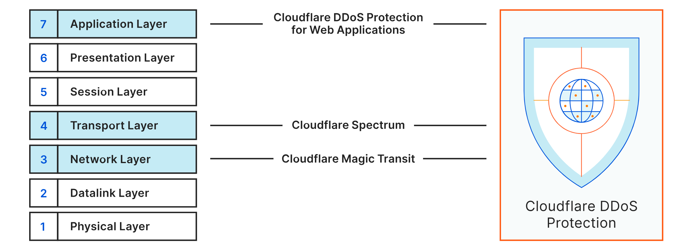

## Introduction

This tutorial explains how to protect your game server from DDoS attacks by setting up a very basic firewall and rate limiting. Please note that even with these settings, you server will not be save from DDoS attacks. However, a secure firewall can minimize the attack surface, and rate limiting rules can help prevent your server from overloading.

> **Important note:**<br>
> This tutorial might help with some minor DDoS attacks but it will not be enough if you are already expecting serious DDoS attacks. In those cases, you should make sure you have the appropriate hardware and you should take more advanced measures.

This tutorial explains how to setup a firewall and rate limiting directly on the game server. However, if you can setup a reverse proxy server, it is recommended to do so. Without a reverse proxy, the entire traffic goes directly to the game server and the server has to handle both the game and blocking/accepting incoming requests. If the number of requests is very high, this can cause unnecessary additional load on the server. With a reverse proxy, the server only needs to handle requests that were accepted and forwarded by the reverse proxy server.

<blockquote>

<details>

<summary>Note about Cloudflare DDoS protection</summary>

Cloudflare offers a [free service to mitigate DDoS attacks](https://www.cloudflare.com/application-services/products/ddos-for-web). However, the rulesets are made for layer 7 attacks and are therefore not very helpful for game servers. Game servers usually use TCP/UDP and need layer 4 protection. Layer 4 protection is only included in Cloudflare Spectrum, which is not available for free.



> *Source: [Cloudflare » DDoS](https://www.cloudflare.com/ddos/)*

</details>

</blockquote>

<br>

**Prerequisites:**

* Server with Ubuntu<br>
  *This tutorial was tested with Ubuntu 22.04 but it should also work with other versions.*

There are no other prerequisites for this tutorial. However, for security reasons, the following settings are recommended:

| Recommended settings         | Tutorial                                              |
| ---------------------------- | ----------------------------------------------------- |
| Root user disabled           | *[Initial Server Setup with Ubuntu](/tutorials/howto-initial-setup-ubuntu#step-7---deactivating-root-login)* |
| SSH key                      | *[Setting up an SSH key](/tutorials/howto-ssh-key)*   |
| Secure SSH settings          | *[Securing the SSH service](/tutorials/securing-ssh)* |
| SSL (domain required)        | *[Add Let's Enrypt certificate on Ubuntu](/tutorials/add-ssl-certificate-with-lets-encrypt-to-nginx-on-ubuntu-20-04)* |
| Non-standard ports           | *See tutorials for [Minecraft](/tutorials/make-a-minecraft-server#step-5---using-a-different-port) and [Mindustry](/tutorials/setup-mindustry-server#step-6---using-a-different-port)* |

<br>

**Example terminology:**

* Game server
  * Hostname: `<your_host>`
  * Game port: `<your_game_port>`
  * SSH port: `22`
* Player IPs: `<203.0.113.1>` `<198.51.100.1>`

## Step 1 - Firewall

For security reasons, you should have a firewall that blocks all incoming traffic by default. You can then add exceptions to allow access to the protocols/ports needed to login on the server (SSH) and to connect to the game (TCP/UDP). If you want to strengthen your firewall even further, you can additionally specify IP addresses that should be the only ones to be granted access. Requests that come from any other IP addresses will be dropped automatically. This tutorial explains how to block all incoming traffic and:

* Allow **everyone** access to the game port
* Allow **only selected IPs** access to the game port

The default firewall on Ubuntu is `ufw`. This tutorial uses `iptables`. Make sure you only use one firewall. It is not recommended to use several different firewalls because the rules of those firewalls could contradict each other and lead to confusion.

> An `iptables` beginners guide is available here: "[Setting up a packet filter on Linux](/tutorials/iptables)"

To check if you already have any rules, you can use:

```bash
sudo iptables -L
```

If the firewall doesn't have any rules yet, you can add them now. When you set the default policy for incoming traffic to "DROP", it will immediately end all connections. Because of this, you need to make sure you allow SSH connections first, so that you can still access your server.

If you are not using the default SSH port, make sure to replace `22` accordingly in the commands below.

```bash
# Allow SSH connections
sudo iptables -A INPUT -p tcp --dport 22 -j ACCEPT  # For IPv4 addresses
sudo ip6tables -A INPUT -p tcp --dport 22 -j ACCEPT # For IPv6 addresses

# Allow communication on the localhost
sudo iptables -A INPUT -i lo -j ACCEPT
sudo iptables -A OUTPUT -o lo -j ACCEPT
sudo ip6tables -A INPUT -i lo -j ACCEPT
sudo ip6tables -A OUTPUT -o lo -j ACCEPT

# Allow incoming traffic for established connections
sudo iptables -A INPUT -m conntrack --ctstate ESTABLISHED,RELATED -j ACCEPT  # For IPv4 addresses
sudo ip6tables -A INPUT -m conntrack --ctstate ESTABLISHED,RELATED -j ACCEPT # For IPv6 addresses

# Block all incoming traffic
sudo iptables -P INPUT DROP                         # For IPv4 addresses
sudo ip6tables -P INPUT DROP                        # For IPv6 addresses
```

Now that the firewall is set up, you can open your game port.

* **Allow only selected IPs access to the game port**<br>
  If you know the IPs of the players who will join the game and the IPs will not change, you can grant access to those IPs only:
  ```bash
  sudo iptables -A INPUT -s <203.0.113.1>,<198.51.100.1> -p tcp --dport <your_game_port> -j ACCEPT
  sudo iptables -A INPUT -s <203.0.113.1>,<198.51.100.1> -p udp --dport <your_game_port> -j ACCEPT
  ```
  > Replace `<203.0.113.1>` and `<198.51.100.1>` with your own player IPs and `<your_game_port>` with your own game port.

* **Allow everyone access to the game port**<br>
  With this rule, everyone can access your game:
  ```bash
  sudo iptables -A INPUT -p tcp --dport <your_game_port> -j ACCEPT
  sudo iptables -A INPUT -p udp --dport <your_game_port> -j ACCEPT
  ```
  > Replace `<your_game_port>` with your own game port.

The new rules should now be added. You can use `sudo iptables -L` to view them.

The rules are not persistent by default and they will disappear with the next reboot. To make them persistent, install:
```bash
sudo apt update && sudo apt install iptables-persistent
```
Now save your rules:
```bash
sudo iptables-save | sudo tee /etc/iptables/rules.v4
sudo ip6tables-save | sudo tee /etc/iptables/rules.v6
```

Next time you reboot your server, the rules saved in the file will apply again. When you add new iptables rules, you need to run the `iptables-save` command again to update the files.

> To delete rules, you can use the following commands:
> ```bash
> sudo iptables -L --line-numbers       # List all rules with numbers
> sudo iptables -D INPUT <line-number>  # Delete an INPUT rule by specifying the number
> ```

## Step 2 - Rate limiting

Setting up the firewall as explained in "Step 1" already helps increase security. However, exposing the game port to the public presents a possible attack surface. Iptables and Fail2Ban make it possible to limit the number of requests that are allowed.

It is explained how to:

* Limit the number of request per IP
* Limit the number of request of all IPs combined

### Step 2.1 - Limit number of requests per IP

<details>

<summary>Click here if you want to use iptables only</summary>

**Via iptables**

Please note that you can only setup one rate limiting rule if you use iptables only. You need to choose to either limit requests per IP OR of all IPs combined. You can't do both. Follow the steps below to limit requests per IP.

* **Check game port rule line**<br>
  Iptables always uses the first rule that matches, going from top to bottom. This means the limit rules need to come before the rule that accepts all incoming traffic to your game port. Find out in which line the rule is that allows incoming requests to your game port:
  ```bash
  sudo iptables -L --line-numbers        # Get the line number of "ACCEPT anywhere tcp dpt:<your_game_port>"
  ```

* **Add rate limiting rule**<br>
  Add the following iptables rules. The second rule allows 7 requests within 30 seconds. If an IP makes 7 requests in a row, it will have to wait until the 30 seconds are over before it can make 7 more requests. If you want to set a different limit, you can replace the values `30` and `7` accordingly.
  ```bash
  sudo iptables -I INPUT -p tcp --dport <your_game_port> -m conntrack --ctstate NEW -m recent --set
  sudo iptables -I INPUT -p tcp --dport <your_game_port> -m conntrack --ctstate NEW -m recent --update --seconds 30 --hitcount 7 -j DROP
  ```
  The command above adds the new rule in the first line. If you want to add the new rule in a specific line, you can use:
  ```bash
  sudo iptables -I INPUT <line-number> <rate-limit-rule>
  ```
  If you do specify the line, make sure the rate limit rule is ABOVE the rule that allows all incoming requests. When a request comes in, all rules are checked starting from the top. As soon as the request matches a rule, this rule will be applied. If you put `-p tcp --dport <your_game_port> -j ACCEPT` at the top, all requests will be accepted and the rules below will be ignored. If `--seconds 30 --hitcount 7 -j DROP` comes first and the request matches the rule, it will be declined. If the IP has not made 7 requests yet, the rule below, the one you added in Step 1 and allows access, will be applied.

* **Make the rules persistent**<br>
  `iptables` rules are not persistent by default. To make the rules persistent, you need to update the `/etc/iptables/rules.v4` file:
  ```bash
  sudo iptables-save | sudo tee /etc/iptables/rules.v4
  ```
  Next time you reboot your server, the rules saved in the file will apply again.

<br>

**Via Fail2Ban**

</details>

This step uses Fail2Ban to limit requests, and iptables to log requests.

* **Install Fail2Ban**<br>
  Before you start, you should make sure iptables and Fail2Ban are both available. You can use `systemctl status fail2ban` to check if Fail2Ban is running. Install on Ubuntu:
  ```bash
  apt install fail2ban
  systemctl enable --now fail2ban
  ```
  > Note that Fail2Ban automatically enables SSH rules.

<br>

* **Tell iptables to log access attempts**
  ```bash
  sudo iptables -I INPUT -p tcp --dport <your_game_port> -m conntrack --ctstate NEW -j LOG --log-level 6 --log-prefix "GameServerAccess: "
  ```
  Iptables now logs all attempts to access TCP port `<your_game_port>` in the `/var/log/syslog` file. When you view the file, you will see that all attempts to access the game port are given the prefix `GameServerAccess: `.
  
  Make the rule persistent:
  ```bash
  sudo iptables-save | sudo tee /etc/iptables/rules.v4
  ```

<br>

* **Add a filter**<br>
  In the `/var/log/syslog` file, only the entries with the prefix `GameServerAccess: ` are relevant. Create the following file to tell Fail2Ban to filter out those entries:
  ```bash
  sudo nano /etc/fail2ban/filter.d/gameserveraccess.conf
  ```
  Add content:
  ```conf
  [Definition]
  failregex = GameServerAccess: .* SRC=<HOST>
  ignoreregex =
  ```

<br>

* **Add Fail2Ban entry**<br>
  Tell Fail2Ban to limit the number of requests per IP and set a ban time for those IPs that exceed the limit. `logpath` tells Fail2Ban where to get the IPs from. The filter we just created tells Fail2Ban to only monitor IPs that were logged with the prefix `GameServerAccess: `.
  ```bash
  sudo nano /etc/fail2ban/jail.local
  ```
  Add content:
  ```conf
  [game-server]
  enabled = true
  filter = gameserveraccess
  logpath = /var/log/syslog
  maxretry = 7
  findtime = 30
  bantime = 120
  ```
  > If you gave the `gameserveraccess.conf` file a different name, replace the filter reference `gameserveraccess` accordingly.

  The setting above allows each IP to make 7 requests within 30 seconds. If an IP exceeds this limit, it will be blocked for 120 seconds. If you want to set a different limit, you can replace the values `7`, `30`, and `120` accordingly.

<br>

When everything is set, restart Fail2Ban:

```bash
sudo systemctl restart fail2ban
```

--------------------------------------

### Step 2.2 - Limit number of requests of all IPs combined

With iptables you can use the `limit` module to limit the total number of new connections within a certain time frame. When you use the `limit` module, the options `--limit` and `--limit-burst` set a time cycle and a limit parameter:

|                         |             | Description        |
| ----------------------- | ----------- | ------------------ |
| Time cycle<br>`--limit` | e.g. 2/min | In this example, the time cycle is half a minute which equals to 30 seconds. During the first time cycle, the example limit parameter below allows a total of 100 requests. When the time cycle ends, the parameter is NOT set back to 100. Instead, the parameter goes up by one. If the parameter is already at 100, the parameter does not go up by 1. |
| Limit parameter<br>`--limit-burst` | e.g. 100 | In this example, the highest possible number of requests that can be made within a single time cycle is 100. When the time cycle ends, the parameter is NOT set back to 100. If 100 requests are made within the first time cycle, there are basically no requests left for the next time cycle. However, the parameter does go up by 1 every time a new time cycle starts. This means, if you reach the parameter within a single time cycle, you can make 1 request in the following time cycle. If no requests come in for the following 100 time cycles, the parameter is back to 100. It is never possible to make more than 100 requests. |

* **Delete old firewall rule**<br>
  If you already opened the game port to everyone in "Step 1", you can delete the rule now. With the rate limiting rules below, you don't need this rule anymore.
  ```bash
  sudo iptables -L --line-numbers       # Get the line number of "ACCEPT anywhere tcp dpt:<your_game_port>"
  sudo iptables -D INPUT <line-number>  # Delete the rule that accepts all incoming requests to your game port
  ```

* **Add new rules**<br>
  Run the commands below to set a limit parameter of 100 and a time cycle of half a minute (30 seconds). If you want to set different limits, you can replace the values `100` and `2/min` accordingly.
  ```bash
  sudo iptables -A INPUT -p tcp --dport <your_game_port> -m conntrack --ctstate NEW -m limit --limit 2/min --limit-burst 100 -j ACCEPT
  sudo iptables -A INPUT -p tcp --dport <your_game_port> -m conntrack --ctstate NEW -j DROP
  ```
  
  <br>

  The first rule grants access to the server. This rule applies to all requests within the set limit. Once the limit is reached, the rule no longer matches.
  
  <br>

  The second rule denies access to the server. This rule applies when the first rule no longer matches.
  
  <br>

* **Make the rules persistent**<br>
  `iptables` rules are not persistent by default. To make the rules persistent, you need to update the `/etc/iptables/rules.v4` file:
  ```bash
  sudo iptables-save | sudo tee /etc/iptables/rules.v4
  ```
  Next time you reboot your server, the rules saved in the file will apply again.

## Step 3 - Blocking rules

When the rate limit from "Step 2" is reached, no one can access TCP port `your_game_port`. However, as long as the requests are within the limit all requests are granted access. This includes both legitimate requests and those that aren't legitimate. The following rule drops new connections without SYN flag:

```bash
sudo iptables -I INPUT -p tcp ! --syn -m conntrack --ctstate NEW -j DROP
```

When everything is done, you should save your rules again:

```bash
sudo iptables-save | sudo tee /etc/iptables/rules.v4
```

## Conclusion

Please note that these settings are not enough to prevent DDoS attacks entirely and that there is always room to improve security with more DDoS mitigation settings. However, with the settings provided in this tutorial, you now have a first defense line against DDoS attacks and something to build on.

Next to being prepared for a DDoS attack, you'll probably also want to know when your server actually is under attack. For this purpose, it is best to monitor the server traffic and to setup alerting (e.g. with [Prometheus](/tutorials/install-and-configure-prometheus-stack)).

##### License: MIT

<!--

Contributor's Certificate of Origin

By making a contribution to this project, I certify that:

(a) The contribution was created in whole or in part by me and I have
    the right to submit it under the license indicated in the file; or

(b) The contribution is based upon previous work that, to the best of my
    knowledge, is covered under an appropriate license and I have the
    right under that license to submit that work with modifications,
    whether created in whole or in part by me, under the same license
    (unless I am permitted to submit under a different license), as
    indicated in the file; or

(c) The contribution was provided directly to me by some other person
    who certified (a), (b) or (c) and I have not modified it.

(d) I understand and agree that this project and the contribution are
    public and that a record of the contribution (including all personal
    information I submit with it, including my sign-off) is maintained
    indefinitely and may be redistributed consistent with this project
    or the license(s) involved.

Signed-off-by: Svenja Michal

-->
