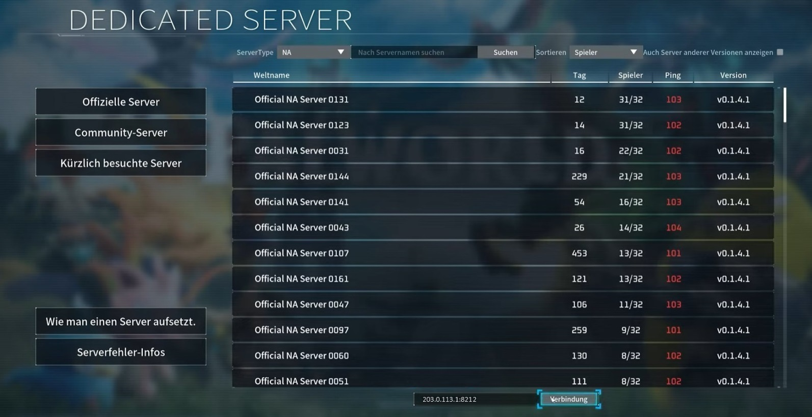

## Einführung

In diesem Tutorial wird erklärt, wie man ein Palworld-Mehrspielerspiel auf einem Server mit Ubuntu oder Debian hostet. Es wird gezeigt, wie man das Spiel auch dann weiterlaufen lassen kann, wenn die Verbindung zum Server bereits beendet wurde und wie man den Port ändert.

**Palworld spielen:**

Palworld wird mit der [Desktop-Version](https://store.steampowered.com/app/1623730/Palworld/) auf dem lokalen Gerät gespielt. Wenn man den Palworld-Launcher öffnet, kann man einem Mehrspielerspiel entweder über einen Einladungscode (In-Game Palworld-Server) beitreten oder über eine öffentliche IP-Adresse (Dedicated-Palworld-Server). In diesem Tutorial wird erklärt, wie man einen **Dedicated-Palworld-Server** einrichtet.

| In-Game Palworld-Server   | Dedicated-Palworld-Server |
| ------------------------- | ------------------------- |
| <ul><li>Über **Einladungscode** mit Spielern teilen</li><li>Bis zu **4** Spieler</li><li>Spieler können dem Spiel nur beitreten, wenn der Host online ist</li><li>In-Game-Welt, die im Palworld Launcher mit "Spiel beginnen" erstellt wird</li></ul> | <ul><li>Über **öffentliche IP** mit Spielern teilen</li><li>Bis zu **32** Spieler</li><li>Spieler können dem Spiel jederzeit beitreten</li><li>Welt wird auf einer eigenen Maschine/Server gehostet</li></ul> |

**Voraussetzungen**

* **Ein lokales Gerät** » um sich mit dem Spiel zu verbinden
* **Einen Server** mit Ubuntu/Debian » um das Spiel zu hosten
  * Zugriff auf den root-Benutzer oder einen Benutzer mit sudo-Rechten.
  * Bevor man auf dem Server das erste Spiel startet, sollten mindestens die ersten Basiseinstellungen einschließlich einer Firewall bereits vorgenommen worden sein. Für weitere Informationen, siehe:<br>[Ersteinrichtung eines Servers mit Ubuntu](/tutorials/howto-initial-setup-ubuntu/de)<br>
    Könnte ebenfalls interessant sein: [Game-Server vor DDoS-Angriffen schützen](https://community.hetzner.com/tutorials/game-server-ddos-protection/de) (optional)
  * `steamcmd` muss bereits installiert sein (siehe "[Installation von SteamCMD](https://community.hetzner.com/tutorials/install-steamcmd/de)")
  * Genug RAM (min. 8 GB). Umso mehr Mods und Spieler, umso mehr RAM wird benötigt.

**Beispiel-Benennungen**

* `203.0.113.1` » Öffentliche IP des Servers
* `palserver` » Beispiel-Benutzer auf dem Server

## Schritt 1 - Den Server vorbereiten

* **Neuen Benutzer hinzufügen**
  
  Erstelle einen neuen Benutzer namens "palserver":
  ```bash
  adduser palserver
  ```
  Gib ein sicheres Passwort an. Mit der Enter-Taste kannst du "name", "number" und "phone" überspringen.
  
  Der neue Benutzer kann jetzt der sudo-Gruppe hinzugefügt werden:
  ```bash
  usermod -aG sudo palserver
  ```
  > Es ist empfohlen dem Benutzer einen [SSH-Key hinzuzufügen und Passwort-Login zu blockieren](https://community.hetzner.com/tutorials/howto-initial-setup-ubuntu/de#schritt-4---authentifizierung).

  Wechsle mit diesem Befehl zum Benutzer "palserver":
  ```bash
  su - palserver
  ```

<br>

* **Zugriff auf den Game-Port erlauben**
  
  Wenn auf dem Server eine Firewall eingerichtet wurde, muss diese so angepasst werden, dass Zugriff auf den Game-Port erlaubt ist. Ansonsten kann sich das lokale Gerät nicht mit dem Server verbinden.
  
  Der Standard-Port von Palworld-Servern ist `8211`. Um einen Game-Server vor DDoS-Angriffen zu schützen, wird unter anderem empfohlen nicht den Standard-Port zu verwenden. In diesem Tutorial wird daher erklärt, wie man den Standard-Port ändert und stattdessen `8212` verwendet. Wenn du den Standard-Port verwenden möchtest, ersetze den Port in den folgenden Befehlen entsprechend.
  
  | Beschreibung                                      | Port   |
  | ------------------------------------------------- | ------ |
  | Standard-Game-Port von Palworld                  | 8211   |
  | Game-Port, der in diesem Tutorial verwendet wird | 8212   |
  
  Es gibt verschiedene Firewall-Tools. In diesem Tutorial werden erklärt:

  <br>
  
  <details>
  <summary>UFW » Standard-Firewall-Tool für Ubuntu</summary>
  
  * **Aktuelle Firewall-Einstellungen anzeigen**<br>
    Um zu prüfen, ob die `ufw` Firewall aktiv ist und ob bereits Regeln hinzugefügt wurden, kann dieser Befehl genutzt werden:
    ```bash
    sudo ufw status
    ```
    <blockquote><details>
    <summary>Beispiel-Output anzeigen</summary>

    ```shellsession
    palserver@ubuntu-server:~# ufw status
    Status: active
    
    To                         Action      From
    --                         ------      ----
    OpenSSH                    ALLOW       Anywhere
    OpenSSH (v6)               ALLOW       Anywhere (v6)
    ```

    </details></blockquote>

  * **Port 8212 TCP und UDP erlauben**<br>
    Wenn die Firewall aktiv ist, kann man mit diesen beiden Befehlen den eingehenden Traffic zu Port 8212 TCP und UDP erlauben:
    ```bash
    sudo ufw allow proto tcp to any port 8212
    sudo ufw allow proto udp to any port 8212
    ```
    > Wenn du den Standard-Port verwenden möchtest, ersetze 8212 mit 8211.

  * **Neue Firewall-Einstellungen anzeigen**<br>
    Die neuen Regeln sollten jetzt hinzugefügt sein. Zum Prüfen:
    ```bash
    sudo ufw status
    ```
    <blockquote><details>
    <summary>Beispiel-Output anzeigen</summary>

    ```shellsession
    palserver@ubuntu-server:~# sudo ufw status
    Status: active
    
    To                         Action      From
    --                         ------      ----
    OpenSSH                    ALLOW       Anywhere
    8212/tcp                   ALLOW       Anywhere
    8212/udp                   ALLOW       Anywhere
    OpenSSH (v6)               ALLOW       Anywhere (v6)
    8212/tcp (v6)              ALLOW       Anywhere (v6)
    8212/udp (v6)              ALLOW       Anywhere (v6)
    ```

    </details></blockquote>

  -------------

  <br>

  </details>
  <details>
  <summary>Hetzner Cloud Firewall</summary>

  Dieser Schritt ist nur relevant, wenn man einen Server bei Hetzner Cloud besitzt, auf den eine Hetzner Cloud Firewall angewendet wird. Um die Firewall-Regeln zu bearbeiten, muss man in der [Cloud Console](https://console.hetzner.cloud/projects) die Firewall auswählen und im Firewall-Menüpunkt "Regeln" die folgenden "eingehenden" Regeln hinzufügen:

  > Wenn du den Standard-Port verwenden möchtest, ersetze 8212 mit 8211.

  | IPs                                     |Protokoll| Port |Portbereich|
  | --------------------------------------- | ------- | ---- | --------- |
  | <kbd>Any IPv4</kbd> <kbd>Any IPv6</kbd> | TCP     | 8212 |           |
  | <kbd>Any IPv4</kbd> <kbd>Any IPv6</kbd> | UDP     | 8212 |           |

  -------------

  <br>

  </details>

  **Hinweis:** Wenn eine andere Firewall verwendet wird, sollte auch dort der **eingehende Traffic** zu Port 8212 TCP und UDP erlaubt werden. Wenn du den Standard-Port verwenden möchtest, muss du stattdessen Port 8211 TCP und UDP erlauben.

## Schritt 2 - Palworld installieren

Jetzt da der Server bereit ist, kann Palworld installiert werden. Stelle dafür sicher, dass wie in den Voraussetzungen angegeben, [SteamCMD installiert](https://community.hetzner.com/tutorials/install-steamcmd/de) ist.

| Name                      | Steam-ID | Anonyme Anmeldung |
| ------------------------- | -------- | ----------------- |
| Palworld Dedicated Server | 2394010  | Ja                |

-----------------

Um Palworld zu installieren, muss man:

* Neuen Ordner für die Palworld-Dateien erstellen, die Rechte anpassen und den Ordner öffnen
  ```bash
  mkdir PalworldServer && chown palserver:palserver PalworldServer && cd PalworldServer
  ```

<br>

* Palworld-Server-Dateien herunterladen
  ```bash
  steamcmd +login anonymous +force_install_dir ~/PalworldServer +app_update 2394010 validate +quit
  ```
  Mit `ls -al` kann im `~/PalworldServer`-Ordner geprüft werden, ob die Dateien nun auf dem Server sind.

<br>

* `steamclient.so`-Datei für eine 64-Architektur hinzufügen<br>
  Während der Installation von Palworld wird eine `steamclient.so`-Datei für 32 Bit heruntergeladen. Bevor man Palworld starten kann, muss eine `steamclient.so`-Datei für 64 Bit in dem `.steam/sdk64`-Ordner gespeichert werden.
  ```bash
  mkdir -p ~/.steam/sdk64
  cp ~/PalworldServer/linux64/steamclient.so ~/.steam/sdk64
  ```

## Schritt 3 - Benutzerdefinierte Einstellungen und Port verwenden

Standardmäßg wird für Palworld Port 8211 verwendet. Eine Liste aller Standardoptionen kann in der Datei `~/PalworldServer/DefaultPalWorldSettings.ini` eingesehen werden. Um andere Werte als die Standardwerte zu verwenden, müssen die entsprechenden Optionen in dieser Datei hinzugefügt werden:
```
~/PalworldServer/Pal/Saved/Config/LinuxServer/PalWorldSettings.ini
```
Wenn du alle Standardwerte anpassen möchtest, kann du den gesamten Inhalt von `DefaultPalWorldSettings.ini` in die `PalWorldSettings.ini`-Datei kopieren und die Werte entsprechend bearbeiten. Im folgenden Beispiel wird lediglich der Standard-Name und -Port geändert und ein Passwort hinzugefügt. Zum jetzigen Zeitpunkt (Anfang 2024) gibt es beim Dedicated-Palworld-Server Probleme mit einem Speicherleck. Eine Möglichkeit zu versuchen dem Problem entgegenzuwirken ist es "Raids" und "Login Penalties" zu deaktivieren. Im folgenden Beispiel werden diese daher ebenfalls deaktiviert.

* **PalWorldSettings-Datei bearbeiten**
  ```bash
  mkdir -p ~/PalworldServer/Pal/Saved/Config/LinuxServer
  nano ~/PalworldServer/Pal/Saved/Config/LinuxServer/PalWorldSettings.ini
  ```

* **Passwort hinzufügen, Port und Name ändern, Raid und Login Penalties deaktivieren**
  ```ini
  [/Script/Pal.PalGameWorldSettings]
  OptionSettings=(ServerName="Test Palworld Server",ServerPassword="YourPassword",PublicPort=8212,bEnableInvaderEnemy=False,bEnableNonLoginPenalty=False)
  ```
  > Ersetze `YourPassword` mit einem richtigen Passwort.
  
  Nutze `CTRL`+`X`, um die Datei zu speichern, `Y` zum Bestätigen und `ENTER`, um die Datei zu schließen.

Weitere Information bezüglich der verschiedenen Optionen gibt es in [dieser Dokumentation](https://tech.palworldgame.com/settings-and-operation/configuration/).

## Schritt 4 - Palworld-Server starten

Nun kann das Spiel gestartet werden. Momentan wird das Spiel automatisch beendet, sobald man die Verbindung zum Server schließt. Eine Möglichkeit das Spiel weiterlaufen zu lassen, ist das `screen`-Tool. Mit **screen** ist es möglich innerhalb einer externen Terminal-Sitzung eine separate virtuelle Terminal-Sitzung zu starten.

Wenn man die externe Terminal-Sitzung beendet, läuft die virtuelle Terminal-Sitzung (screen-Sitzung) trotzdem weiter. Wenn man sich das nächste Mal wieder mit dem Server verbindet, ist die screen-Sitzung weiterhin verfügbar.

<blockquote>

<details>

<summary>Screen installieren</summary>

Wenn "screen" noch nicht installiert ist, kann es jetzt installiert werden mit:

```bash
sudo apt update && sudo apt install screen -y
```

---------

</details>

</blockquote>

Um ein Palworld-Spiel in einer screen-Sitzung auf dem Server zu starten, muss man:

* **Die Sitzung starten**
  ```bash
  screen -S palworld-screen
  ```
  > `palworld-screen` kann mit einem beliebigen Namen ersetzt werden.

* **Den Palworld-Ordner öffnen**<br>
  Öffne den Ordner, in dem die Palworld-Server-Dateien gespeichert wurden. In diesem Tutorial wurde dieser Pfad verwendet:
  ```bash
  cd ~/PalworldServer
  ```

* **Palworld starten**<br>
  ```bash
  ./PalServer.sh
  ```

## Schritt 5 - screen-Sitzung verwalten

Die screen-Sitzung kann man mit der Tastenkombination `ctrl`+`A` gefolgt von `D` verlassen. Die screen-Sitzung selbst wird damit nicht beendet und das Spiel bleibt weiterhin erreichbar.

Mit folgenden Befehlen kann man die Palworld screen-Sitzung erneut öffnen oder Änderungen vornehmen:

* Alle "Screens" listen
  ```bash
  screen -list
  ```
  > Der Screen, der gerade für Palworld erstellt wurde, sollte hier auch gelistet werden.

* In eine laufende screen-Sitzung wechseln
  ```bash
  screen -dr palworld-screen
  ```
  > Wenn ein anderer Name verwendet wurde, muss `palworld-screen` entsprechend angepasst werden.

* Screen-Sitzung löschen<br>
  ```bash
  screen -X -S palworld-screen quit
  ```
  > **Hinweis:** Damit wird das Palworld-Spiel beendet und die screen-Sitzung ist anschließend nicht mehr verfügbar.

## Schritt 6 - Palworld-Server automatisch neustarten

Anstelle den Palworld-Server direkt zu starten, kann man diesen auch über ein Skript starten, welches den Palworld-Server automatisch neustartet, wenn dieser unerwartet stoppt.

Wenn du die Palworld screen-Situng verlassen hast, kannst du diese mit `screen -dr palworld-screen` wieder öffnen. Mit `ctrl`+`c` wird das Palworld-Spiel gestoppt.

* Shell-Skript erstellen:
  
  Mit folgendem Befehl wird ein neues Shell-Skript unter demselben Pfad gespeichert wie die Palworld-Server-Dateien, in diesem Beispiel der `~/PalworldServer`-Ordner.
  ```bash
  cat <<'EOF' >> ~/PalworldServer/run.sh
  #!/bin/bash
  
  while true; do
      ./PalServer.sh
      for i in 3 2 1; do
          echo "The server will restart in $i second(s), CTRL-C to cancel."
          sleep 1
      done
  done
  
  EOF
  ```

* Skipt ausführbar machen:
  ```bash
  chmod +x ~/PalworldServer/run.sh
  ```

* Palworld-Server starten:
  ```bash
  ./run.sh
  ```

Falls der Palworld-Server unerwartet stoppt, wird dieser automatisch neugestartet.

## Schritt 7 - Dem Palworld-Server beitreten

Öffne den Palworld-Launcher auf deinem lokalen Gerät.

* Wähle `Mehrspieler starten` aus
  
  

* Gib in der unteren Eingabe die IP-Adresse deines Servers an. Der Port sollte am Ende der IP-Adresse angegeben werden, getrennt durch einen Doppelpunkt: `<server-ip>:<port>`, z.B. `203.0.113.1:8211`
  
  Wenn der Palworld-Server lokal gehostet wird, kann der Localhost angegeben werden: `127.0.0.1:<port>`
  
  

* Nachdem die IP und der Port angegeben wurden, kann "Verbindung" ausgewählt werden.

Du solltest jetzt mit deinem Spiel verbunden werden.

## Ergebnis

Im vorangegangenen Tutorial wurde erklärt, wie man ein Palworld-Spiel auf einem Server hosten kann. Als nächsten Schritt kann die IP-Adresse mit Freunden geteilt werden. In der `PalWorldSettings.ini`-Datei können wie oben bereits erwähnt noch weitere Einstellungen personalisiert werden. Zum jetzigen Zeitpunkt (Anfang 2024) gibt es wie in [Schritt 3](#schritt-3---benutzerdefinierte-einstellungen-und-port-verwenden) bereits erwähnt beim Dedicated-Palworld-Server Probleme mit einem Speicherleck. Aus diesem Grund wird empfohlen den Server regelmäßig neuzustarten, z.B. alle 8 Stunden (siehe beispielsweise [diesen Reddit-Post](https://www.reddit.com/r/Palworld/comments/1awg99o/dedicated_server_restartbackupupdate_script/)).

##### License: MIT

<!--

Contributor's Certificate of Origin

By making a contribution to this project, I certify that:

(a) The contribution was created in whole or in part by me and I have
    the right to submit it under the license indicated in the file; or

(b) The contribution is based upon previous work that, to the best of my
    knowledge, is covered under an appropriate license and I have the
    right under that license to submit that work with modifications,
    whether created in whole or in part by me, under the same license
    (unless I am permitted to submit under a different license), as
    indicated in the file; or

(c) The contribution was provided directly to me by some other person
    who certified (a), (b) or (c) and I have not modified it.

(d) I understand and agree that this project and the contribution are
    public and that a record of the contribution (including all personal
    information I submit with it, including my sign-off) is maintained
    indefinitely and may be redistributed consistent with this project
    or the license(s) involved.

Signed-off-by: Svenja Michal

-->
