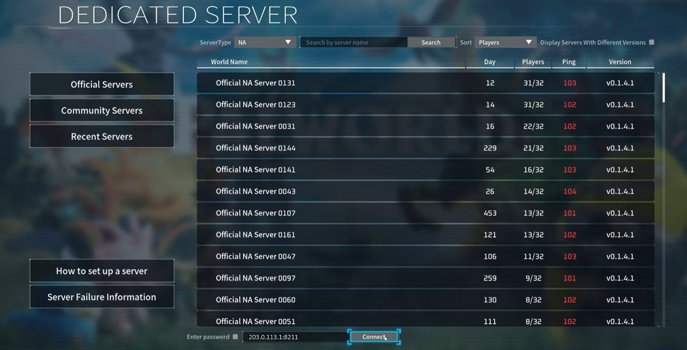

## Introduction

This tutorial explains how to host a Palworld multiplayer game on a server with Ubuntu or Debian. It also shows how to keep the game running after the connection to the server was closed and how to change the port.

**Playing Palworld:**

Palworld is played with the [desktop release](https://store.steampowered.com/app/1623730/Palworld/) on the local device. When you open the Palworld launcher, you can join a multiplayer game either via an invite code (in-game Palworld server) or via a public IP address (dedicated Palworld server). This tutorial explains how to setup a **dedicated Palworld server**.

| In-game Palworld servers | Dedicated Palworld servers  |
| ------------------------ | ------------------------ |
| <ul><li>Shared with players via **invite code**</li><li>Up to **4** players</li><li>Players can only join the game when the host is online</li><li>In-game world that is created with "Start Game" in the Palworld launcher</li></ul> | <ul><li>Shared with players via **public IP**</li><li>Up to **32** players</li><li>Players can always join the game</li><li>World hosted on your own machine/server</li></ul> |

**Prerequisites**

* **One local device** » to connect to the game
* **One server** with Ubuntu or Debian » to host the game
  * You need access to the root user or a user with sudo permissions.
  * Before you start a game on the server, you should make at least some basic configuration, including a firewall. For more information, see:<br>[Initial Server Setup with Ubuntu](https://community.hetzner.com/tutorials/howto-initial-setup-ubuntu#introduction)<br>
    You might also want to check out: [Protect game servers from DDoS attacks](https://community.hetzner.com/tutorials/game-server-ddos-protection) (optional)
  * You need to have `steamcmd` installed (see "[Installation of SteamCMD](https://community.hetzner.com/tutorials/install-steamcmd)")
  * Enough RAM (8 GB at the very least). The more mods or players, the higher RAM you'll need.

**Example terminology**

* `203.0.113.1` » Example public IP of the remote server
* `palserver` » Example user on the remote server

## Step 1 - Getting the server ready

* **Add a new user**
  
  Run this command to create a new user called "palserver":
  ```bash
  adduser palserver
  ```
  You will be asked to enter a password. Make sure to choose a secure one! You can press enter to skip name, number and phone.
  
  You can now add the new user to the sudo group:
  ```bash
  usermod -aG sudo palserver
  ```
  > It is recommended to add an [SSH key and disable password login](https://community.hetzner.com/tutorials/howto-initial-setup-ubuntu#step-4---authentication).

  Run this command to switch to the user "palserver":
  ```bash
  su - palserver
  ```

<br>

* **Enable access to the game port**
  
  If you have a firewall on your server, make sure it allows the game port TCP and UDP so that your local device can connect to the game hosted on your server.
  
  The default port for Palworld servers is `8211`. To mitigate DDoS attacks, it is recommended to use a different port. This tutorial explains how to change the port from the default port to `8212`. If you plan to use the default port, replace the port in the commands below accordingly.
  
  | Description                              | Port   |
  | ---------------------------------------- | ------ |
  | Default Palworld game port               | 8211   |
  | Palworld game port used in this tutorial | 8212   |
  
  There are several different firewall tools. This tutorial covers:

  <br>
  
  <details>
  <summary>UFW » Default firewall configuration tool for Ubuntu</summary>
  
  * **View current firewall settings**<br>
    To check if the `ufw` firewall is active and if you already have any rules, you can use:
    ```bash
    sudo ufw status
    ```
    <blockquote><details>
    <summary>View example output</summary>

    ```shellsession
    palserver@ubuntu-server:~# ufw status
    Status: active
    
    To                         Action      From
    --                         ------      ----
    OpenSSH                    ALLOW       Anywhere
    OpenSSH (v6)               ALLOW       Anywhere (v6)
    ```

    </details></blockquote>

  * **Allow port 8212 TCP and UDP**<br>
    If the firewall is active, run these commands to allow incoming traffic to port 8212 TCP and UDP:  
    ```bash
    sudo ufw allow proto tcp to any port 8212
    sudo ufw allow proto udp to any port 8212
    ```
    > If you plan to use the default port, replace 8212 with 8211.

  * **View new firewall settings**<br>
    The new rules should now be added. To check, use:
    ```bash
    sudo ufw status
    ```
    <blockquote><details>
    <summary>View example output</summary>

    ```shellsession
    palserver@ubuntu-server:~# sudo ufw status
    Status: active
    
    To                         Action      From
    --                         ------      ----
    OpenSSH                    ALLOW       Anywhere
    8212/tcp                   ALLOW       Anywhere
    8212/udp                   ALLOW       Anywhere
    OpenSSH (v6)               ALLOW       Anywhere (v6)
    8212/tcp (v6)              ALLOW       Anywhere (v6)
    8212/udp (v6)              ALLOW       Anywhere (v6)
    ```

    </details></blockquote>

  -------------

  <br>

  </details>
  <details>
  <summary>Hetzner Cloud Firewall</summary>

  This is only relevant if your remote server is a Hetzner Cloud server and you have a Hetzner Cloud Firewall applied to it. To edit your Firewall rules, open [Cloud Console](https://console.hetzner.cloud/projects) and select your Firewall. In the Firewall menu "Rules", add the following "inbound" rules:

  > If you plan to use the default port, replace 8212 with 8211.

  | IPs                                     |Protocol| Port |Port range|
  | --------------------------------------- | ------ | ---- | -------- |
  | <kbd>Any IPv4</kbd> <kbd>Any IPv6</kbd> | TCP    | 8212 |          |
  | <kbd>Any IPv4</kbd> <kbd>Any IPv6</kbd> | UDP    | 8212 |          |

  -------------

  <br>

  </details>

  **Note:** If you're using a different firewall, make sure it allows **incoming traffic** to port 8212 TCP and UDP. If you plan to use the default port, you need to allow port 8211 TCP and UDP instead.

## Step 2 - Installing Palworld

Now that the server is ready, you can install Palworld with steamcmd. For this, make sure [steamcmd is installed](https://community.hetzner.com/tutorials/install-steamcmd) as mentioned in the prerequisites.

| Name                      | Steam ID | Anonymous Login |
| ------------------------- | -------- | --------------- |
| Palworld Dedicated Server | 2394010  | Yes             |

-----------------

To install Palworld, do the following:

* Create a new directory for the Palworld files, change the permissions, and change into the new directory
  ```bash
  mkdir PalworldServer && chown palserver:palserver PalworldServer && cd PalworldServer
  ```

<br>

* Download the Palworld server files
  ```bash
  steamcmd +login anonymous +force_install_dir ~/PalworldServer +app_update 2394010 validate +quit
  ```
  In `~/PalworldServer`, use `ls -al` to check if the files are now available on your server.

<br>

* Add a `steamclient.so` file for 64 architecture.<br>
  When you install Palworld, it downloads a `steamclient.so` file for 32 bit. Before you start Palworld, you need to provide a `steamclient.so` file for 64 bit in the `.steam/sdk64` directory.
  ```bash
  mkdir -p ~/.steam/sdk64
  cp ~/PalworldServer/linux64/steamclient.so ~/.steam/sdk64
  ```

## Step 3 - Adding custom settings and custom port

By default, the Palworld game is always started on port 8211. You can find an overview with all default game options in `~/PalworldServer/DefaultPalWorldSettings.ini`. If you want to use other values than the default values, you need to add the respective options in this file:
```
~/PalworldServer/Pal/Saved/Config/LinuxServer/PalWorldSettings.ini
```
If you want to change all default settings, you can copy the entire content of `DefaultPalWorldSettings.ini` into `PalWorldSettings.ini` and edit the values as needed. In the following example, we will only change the default name and port, and add a password. At the time of writing, the dedicated Palworld server has memory leak issues. To minimize those issues, it can help to disable raids and login penalties, so we will do this too.

* **Edit the settings file**
  ```bash
  mkdir -p ~/PalworldServer/Pal/Saved/Config/LinuxServer
  nano ~/PalworldServer/Pal/Saved/Config/LinuxServer/PalWorldSettings.ini
  ```

* **Add a password, the new port and name, and disable raids and login penalties**
  ```ini
  [/Script/Pal.PalGameWorldSettings]
  OptionSettings=(ServerName="Test Palworld Server",ServerPassword="YourPassword",PublicPort=8212,bEnableInvaderEnemy=False,bEnableNonLoginPenalty=False)
  ```
  > Replace `YourPassword` with an actual password.

  Use `ctrl`+`X` to save the file, `Y` to confirm and `ENTER` to close the file.

For more information, check out the [documentation about the different options](https://tech.palworldgame.com/settings-and-operation/configuration/).

## Step 4 - Starting your Palworld server

Now that everything is ready, you can start the game. If you start the Palworld server in a normal terminal session, the game will end as soon as you end the connection to your remote server. One way to keep the game running is to use the `screen` tool. **Screen** allows you to start separate virtual terminal sessions in one remote terminal session.

When you end your remote terminal session, the virtual terminal session (screen session) will stay open. When you start a new remote terminal session, you will see that the screen session is still there.

<blockquote>

<details>

<summary>Install screen</summary>

If you don't have screen installed yet, you can install it now with:

```bash
sudo apt update && sudo apt install screen -y
```

---------

</details>

</blockquote>

To start a Palworld game in a screen session, do the following:

* **Start the session**
  ```bash
  screen -S palworld-screen
  ```
  > You can replace `palworld-screen` with any other name for your screen.

* **Go to the Palworld directory**<br>
  Open the directory in which you saved the server files of Palworld. If you used the example path from this tutorial, you can open it with:
  ```bash
  cd ~/PalworldServer
  ```

* **Start Palworld**<br>
  ```bash
  ./PalServer.sh
  ```

## Step 5 - Managing the screen session

You can use the key combination `ctrl`+`A` followed by `D` to exit the screen session. This will not end the screen session and the game will continue to run.

To go back to the Palworld screen session or to make any other changes, you can use these commands:

* List all screens
  ```bash
  screen -list
  ```
  > The screen you just created should also be listed here.

* Go back to your running screen session
  ```bash
  screen -dr palworld-screen
  ```
  > If you used a different name, replace `palworld-screen` with your screen name.

* Delete the screen session<br>
  ```bash
  screen -X -S palworld-screen quit
  ```
  > **Note:** This will end the Palworld game and the screen session will no longer be available.

## Step 6 - Auto-restarting your Palworld server

You can create a script to auto-restart the server if it crashes.

If you left the Palworld screen session, use `screen -dr palworld-screen` to go back. You can use `ctrl`+`c` to stop the Palworld game.

* Create the shell script:
  
  Enter the command below to save a new shell script in the same path as your Palworld server files, in this example the `~/PalworldServer` directory.
  ```bash
  cat <<'EOF' >> ~/PalworldServer/run.sh
  #!/bin/bash
  
  while true; do
      ./PalServer.sh
      for i in 3 2 1; do
          echo "The server will restart in $i second(s), CTRL-C to cancel."
          sleep 1
      done
  done
  
  EOF
  ```

* Make the script executable:
  ```bash
  chmod +x ~/PalworldServer/run.sh
  ```

* Start the Palworld server:
  ```bash
  ./run.sh
  ```

If the Palworld server crashes, it will automatically restart.

## Step 7 - Joining your Palworld server

Open the Palworld launcher on your local device.

* Select `Join Multiplayer Game`
  
  

* Enter your server's IP address at the bottom. You should add the port at the end of the IP address separated by a colon: `<server-ip>:<port>`, e.g. `203.0.113.1:8211`
  
  If you are hosting the Palworld server locally, you can use: `127.0.0.1:<port>`
  
  

* After you entered the server IP and port, select "Connect".

It should now build a connection to your game.

## Conclusion

In this tutorial, you learned how to set up a server to host a Palworld game. Next, you can share the IP address of your server with friends, so that you can start playing together. To set up more custom settings, you can edit the `PalWorldSettings.ini` file as mentioned above. At the time of writing, there is a memory leak issue with the dedicated Palworld server as mentioned in [Step 3](#step-3---adding-custom-settings-and-custom-port). Because of this, it is recommended to regularly restart the server, e.g. every 8 hours (see [this reddit post](https://www.reddit.com/r/Palworld/comments/1awg99o/dedicated_server_restartbackupupdate_script/) for example).

##### License: MIT

<!--

Contributor's Certificate of Origin

By making a contribution to this project, I certify that:

(a) The contribution was created in whole or in part by me and I have
    the right to submit it under the license indicated in the file; or

(b) The contribution is based upon previous work that, to the best of my
    knowledge, is covered under an appropriate license and I have the
    right under that license to submit that work with modifications,
    whether created in whole or in part by me, under the same license
    (unless I am permitted to submit under a different license), as
    indicated in the file; or

(c) The contribution was provided directly to me by some other person
    who certified (a), (b) or (c) and I have not modified it.

(d) I understand and agree that this project and the contribution are
    public and that a record of the contribution (including all personal
    information I submit with it, including my sign-off) is maintained
    indefinitely and may be redistributed consistent with this project
    or the license(s) involved.

Signed-off-by: Svenja Michal

-->
