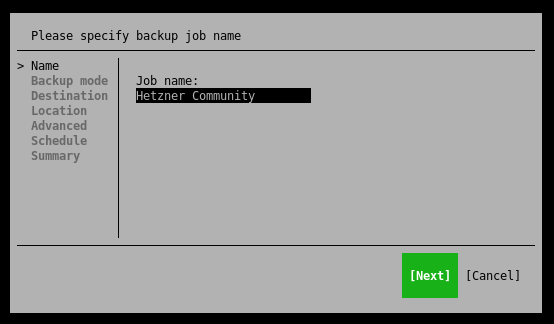
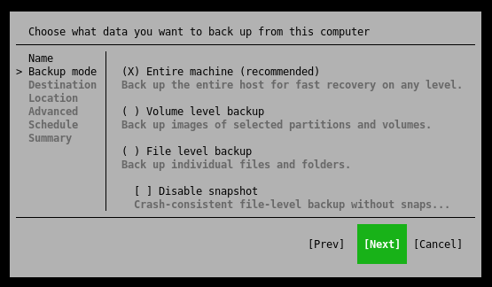
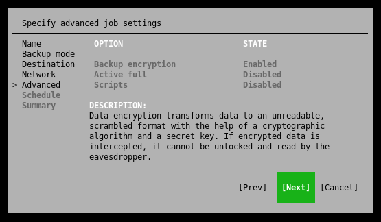

## Einführung

Der Veeam Agent für Linux ist eine gute Option um damit zu beginnen, Backups Ihres Servers beziehungsweise Ihrer Daten zu erstellen.

Bevor Sie beginnen, werfen Sie gern auch einen Blick auf die [Übersicht dieser Artikel-Serie](/tutorials/getting-started-with-veeam/de) und dessen Informationen.

**Voraussetzungen**

* Ein Unix/Linux-Server welcher gesichert werden soll (Administrative Rechte werden benötigt)
* Anmeldung für ein kostenloses Konto bei [veeam.com](https://login.veeam.com) (zum Download von Veeam)
* Ausreichend Festplattenspeicher oder Netzwerkspeicher um Backups zu speichern

**Verfügbarkeit**

Basierend auf den Informationen im April 2022, ist der Veeam Agent für Linux für folgende Betriebssysteme verfügbar (x64 und x86):

* Debian 9.0 – 11.1
* Ubuntu 14.04, 16.04, 18.04, 20.04, 20.10, 21.04, 21.10
* RHEL 6.0 – 8.5
* CentOS 7.0 – 8.5
* Oracle Linux 6 – 8.5 (RHCK)
* Oracle Linux 6 (starting from UEK R2) – Oracle Linux 8 (up to UEK R6 U2, kernel version 5.4.17-2102)
* SLES 11 SP4, 12 SP2 – 15 SP3
* SLES for SAP 11 SP4, 12 SP2 – 15 SP3
* Fedora 33, 34, 35
* openSUSE Leap 15.2 – 15.3
* openSUSE Tumbleweed

## Schritt 1 - Anmeldung für ein Veeam-Konto

Um mit dem Download und der Installation des Veeam Agent für Linux fortzufahren, ist ein kostenloses Konto bei [veeam.com] (https://login.veeam.com) erforderlich.

Sie können ein kostenloses Konto unter [veeam.com/signin.html](https://www.veeam.com/signin.html) registrieren.

Sobald Sie die Registrierung abgeschlossen haben, erhalten Sie Zugriff auf die Download-Seite des Veeam Agent für Linux und können mit Schritt 2 fortfahren.

## Schritt 2 - Herunterladen des Veeam Agent für Linux

### Schritt 2.1 - Das Veeam Software Repository Installationspaket

Bitte prüfen Sie vor der Installation, dass Ihr verwendetes Betriebssystem in der oben genannten Kompatibilitätsliste aufgezählt ist.

Nachdem Sie sich mit Ihrem Veeam-Konto angemeldet haben, laden Sie bitte das Veeam Software Repository Installationspaket herunter.

Bitte beachten Sie, dass es sich bei Veeam um eine proprietäre Software handelt welche nicht direkt aus den offiziellen Paketquellen Ihres Betriebssystems oder über einen Direktdownload installiert werden kann.

Zur Installation von Veeam muss das Veeam Software Repository Installationspaket verwendet werden. Leider kann das entsprechende Paket nur über eine Authentifizierung heruntergeladen werden, sodass ein direkter Download über curl oder wget nicht möglich ist.

Sie finden die Download-Dateien unter [veeam.com/de/linux-backup-free-download.html](https://www.veeam.com/de/linux-backup-free-download.html). Wählen Sie dann die Datei für Ihr Betriebssystem aus und laden Sie sie auf Ihren Computer herunter.

### Schritt 2.2 - Übertragen Sie das Paket auf Ihren Server

In diesem Tutorial verwenden wir das Konsolenprogramm `scp`, um das Veeam Software Repository Installationspaket von unserem Computer auf unseren Server zu übertragen.

Wenn auf Ihrem Computer `scp` nicht installiert ist oder Sie Windows verwenden, können Sie die Datei mit einem Programm wie [CyberDuck](https://cyberduck.io/sftp/) oder [FileZilla](https://filezilla-project.org/) über SFTP (über SSH) übertragen.

Um das Paket von unserem Computer auf den Server zu übertragen, können Sie den folgenden Befehl verwenden. Bitte passen Sie die Beispielargumente entsprechend an Ihren Server an:

```console
$ scp veeam-release* <holu>@<your_host>:/root/.
```

Bitte stellen Sie sicher, dass Sie Ihren Benutzernamen, den Hostnamen Ihres Servers und auch den korrekten Dateinamen des heruntergeladenen Pakets angeben.

### Schritt 2.3 - Installieren des Veeam Software Repository Installationspakets

Jetzt können wir mit der Installation des Veeam Software Repository Installationspakets fortfahren. Melden Sie sich dazu mit Ihrem Root-Benutzer per SSH auf Ihrem Server an.

Unten finden Sie die Befehle zum Installieren des Veeam Software Repository Installationspakets, verwenden Sie die Befehle, die für Ihr Betriebssystem zutreffen:

**Debian / Ubuntu**

```console
$ dpkg -i ./veeam-release* 
$ apt-get update
```

**CentOS / RHEL / Oracle Linux / Fedora**

```console
$ rpm -ivh ./veeam-release*
$ yum check-update
```

**openSUSE / SLES**

```console
$ zypper in ./veeam-release*
$ zypper refresh
```

Nachdem das Veeam Software Repository Installationspaket erfolgreich installiert wurde, können wir mit dem nächsten Schritt fortfahren, um Veeam final zu installieren.

## Schritt 3 - Installieren des Veeam Agent für Linux 

Unten aufgeführt finden Sie die Installationsbefehle sowie weitere relevante Informationen für bestimmte Betriebssysteme. Fahren Sie mit den für Sie zutreffenden Anweisungen fort:

**Debian**

```console
$ apt-get install veeam
```

**Ubuntu**

```console
$ apt-get install veeam
```

**Wichtig:** **Ubuntu 20.04 und 20.10** mit **Kernel-Version 5.8 oder höher** erfordern das veeam-nosnap Paket anstelle des normalen Pakets. Wenn Sie Veeam Agent für Linux installieren möchten, verwenden Sie stattdessen den folgenden Befehl:

```console
$ apt-get install veeam-nosnap
```

**CentOS / RHEL / Fedora**

```console
$ yum install veeam
```

**openSUSE Tumbleweed**

```console
$ zypper in veeam
```

**openSUSE Leap 15.2 / SLES with Default kernel**

```console
$ zypper in veeamsnap-kmp-default
$ zypper in veeam
```

Informationen zu anderen SLES-Versionen mit anderen Kerneln finden Sie in den offiziellen Installationsanweisungen unter [helpcenter.veeam.com/docs/agentforlinux/userguide/installation_process.html](https://helpcenter.veeam.com/docs/agentforlinux/userguide/installation_process.html?ver=50)

**Installation von zusätzlichen Softwarepaketen**

Um den vollen Funktionsumfang von Veeam nutzen zu können, sollten Sie sicherstellen, dass die folgenden Softwarepakete auf Ihrem System installiert sind. Alternativ können Sie sie mit dem folgenden Befehl nachinstallieren (für Debian/Linux).

* `dkms`, Unterstützung für dynamische Kernel-Module, [github.com/dell/dkms](https://github.com/dell/dkms)
* `cifs-utils`, Gemeinsame Dienstprogramme des Internet-Dateisystems, [samba.org/~jlayton/cifs-utils](https://www.samba.org/~jlayton/cifs-utils/)
* `squashfs-tools`, Tool zum Erstellen und Anhängen an squashfs-Dateisysteme, [github.com/plougher/squashfs-tools](https://github.com/plougher/squashfs-tools)
* `xorriso`, Befehlszeilen-ISO-9660- und Rock-Ridge-Manipulationstool, [dev.lovelyhq.com/libburnia/web/wiki](https://dev.lovelyhq.com/libburnia/web/wiki)
* `genisoimage`, Erstellt ISO-9660-CD-ROM-Dateisystem-Images, [github.com/Distrotech/cdrkit](https://github.com/Distrotech/cdrkit)
* `linux-headers-$(uname -r)`, Installieren der Linux-Kernel-Header, um das Snapshot-Modul für Veeam zu nutzen

```console
$ apt-get install dkms cifs-utils squashfs-tools xorriso linux-headers-$(uname -r)
```

_Wenn Sie eine andere Linux-Distribution als Debian oder Ubuntu verwenden, passen Sie den Befehl bitte entsprechend Ihrem Paketmanager an._

## Schritt 4 - Erste Schritte mit dem Veeam Agent für Linux

Nachdem Sie die Installation wie zuvor beschrieben erfolgreich abgeschlossen haben, können wir mit der Erstellung unseres Backup-Jobs mit Veeam fortfahren.

**Hinweis:** _In der kostenlosen Version von Veeam (wie in diesem Artikel beschrieben) können Sie nur einen einzigen Backup-Job erstellen. Für mehr Jobs oder zusätzliche Funktionalität ist eine entsprechende Lizenz erforderlich._

Um die Veeam-Benutzeroberfläche zu öffnen, geben Sie den folgenden Befehl in der Befehlszeile ein.

Um durch die Benutzeroberfläche von Veeam zu navigieren, verwenden Sie die Pfeiltasten zwischen den einzelnen Optionen und die Tabulatortaste, um zwischen den Bestätigungsoptionen zu wechseln.

```console
$ veeam
```

### Schritt 4.1 - Erstmalige Einrichtung

_Disclaimer: Die folgenden Werte können natürlich jederzeit an die eigenen Bedürfnisse und die Anwendung angepasst werden und stellen ausschließlich Empfehlungen von mir dar._

**Lizenzvereinbarungen**

Wenn Sie die Veeam-Benutzeroberfläche zum ersten Mal öffnen, werden Sie aufgefordert, dem [Veeam Endbenutzer-Lizenzvertrag (EULA)] (https://www.veeam.com/eula.html) und den Bedingungen der Drittanbieter-Software zuzustimmen.


Nachdem Sie beiden Punkten mit der Leertaste zugestimmt haben, können Sie mit der Eingabetaste zum nächsten Punkt wechseln.

**Benutzerdefiniertes Wiederherstellungsimage**

Als Nächstes werden wir vom Setup-Assistenten gefragt, ob die Treiber des Servers in das Veeam-Wiederherstellungsimage aufgenommen werden sollen. Ich empfehle Ihnen, diese Option zu nutzen, um Verzögerungen im Falle einer vollständigen Systemwiederherstellung zu vermeiden. Für die Option, die Erstellung eines Images, werden zusätzliche Pakete benötigt. Eine Anleitung dazu finden Sie im oberen Teil dieses Artikels.


Danach können Sie über die Benutzeroberfläche einen Speicherort für das benutzerdefinierte Image auswählen. Die Erstellung des Images kann einige Minuten dauern. 

Wenn Sie die folgende Fehlermeldung `ISO: FATAL ERROR:write_file: failed to create file /tmp/veeam/livecd-..., because Too many open files` erhalten, lesen Sie bitte die Details unter [veeam.com/kb4121](https://www.veeam.com/kb4121) um, diesen Fehler zu beheben.

**Lizenzdatei für Veeam Agent für Linux bereitstellen**

Da wir Veeam in der kostenlosen Variante verwenden, können Sie diesen Punkt überspringen und direkt mit der Eingabetaste fortfahren.


### Schritt 4.2 - Erstellen eines Backup-Jobs

Sobald Sie die Ersteinrichtung abgeschlossen haben, sehen Sie die Hauptübersicht der Veeam-Benutzeroberfläche. Normalerweise können Sie alle Backups auf einen Blick sehen. Da jedoch noch kein Backup-Job erstellt wurde, drücken wir die Taste C (Configure), um einen zu erstellen.

**Benennen eines Backup-Jobs**

Zunächst werden wir aufgefordert, einen Namen für den neuen Backup-Job zu vergeben. Dieser Name ist später auch Teil des Backup-Repositorys und kann nicht mehr geändert werden.



**Auswählen eines Backup-Modus**

Veeam bietet verschiedene Modi zur Durchführung eines Backups. Im Folgenden finden Sie eine kurze Übersicht über diese Arten:

* **Gesamte Maschine (empfohlen)**  
Sichern Sie den gesamten Host für eine schnelle Wiederherstellung auf jeder Ebene.
* **Backup auf Volumenebene**  
Sichern Sie Images ausgewählter Partitionen und Volumes.
* **Backup auf Dateiebene**  
Sichern Sie einzelne Dateien und Verzeichnisse.

Sie sollten den Modus wählen, der für Ihren Anwendungsfall geeignet ist. Wenn Sie sich jedoch nicht sicher sind, können Sie mit dem Modus "Gesamter Rechner (empfohlen)" nichts falsch machen.

Beachten Sie auch, dass Sie je nach Sicherungsmodus entsprechend viel Speicherplatz zur Verfügung haben müssen. Eine allgemeine Empfehlung ist mindestens die Gesamtgröße der verfügbaren Festplatten.



**Auswählen eines Ziels**

In diesem Beitrag werden wir uns die folgenden beiden Storage-Optionen für Backups genauer ansehen.

Die Option "Veeam Backup & Replication" ist nicht relevant, da diese Option einen zusätzlichen Server erfordert.

**Option 1 - Verwendung eines lokalen Speichers (Sicherung auf einem lokal angeschlossenen Speichergerät)**

Wenn Sie diese Option wählen, benötigen Sie eine zusätzliche Festplatte, die entweder fest in Ihrem Server installiert oder über USB angeschlossen ist.

Diese Option sollten Sie auch wählen, wenn Ihr Backupspeicher nicht über SMB oder NFS erreichbar ist und daher von Ihnen manuell im System gemountet werden muss, z.B. Block Devices, Amazon S3 oder ähnliches. 

Bitte stellen Sie sicher, dass Sie genügend freien Speicherplatz für Ihre Backups haben. Die Anzahl der Wiederherstellungspunkte gibt an, wie viele Tage ein Punkt für die Wiederherstellung zurückgehalten wird.


**Option 2 - Netzwerkspeicher nutzen (Sicherung auf einem Netzwerkspeicher (SMB oder NFS))**

Mit dieser Option können Sie z.B. [von Hetzner gemieteten Backup-Speicherplatz oder eine StorageBox](https://www.hetzner.com/storage/storage-box) über Samba einbinden.

Natürlich ist es auch möglich, eine beliebige NFS- oder Samba-Freigabe zu verwenden.

Die Anzahl der Wiederherstellungspunkte gibt an, wie viele Tage ein Punkt zur Wiederherstellung zurückgehalten wird.


**Erweiterte Job-Einstellungen**

Nun ist es an der Zeit, zusätzliche Optionen für unseren Backup-Job festzulegen, falls gewünscht.

Je nachdem, ob die Optionen für Sie nützlich sind, sollten Sie sie aktivieren und entsprechend einrichten. 

Ich empfehle Ihnen, die Backup-Verschlüsselung zu aktivieren und zu verwenden, damit Ihre Backups vor Dritten oder unbefugtem Zugriff sicher sind.



**Zeitplan**

In diesem Abschnitt können Sie festlegen, zu welchem Zeitpunkt der Veeam Agent automatisch ein Backup durchführen soll (falls gewünscht).


**Zusammenfassung**

Sie haben es fast geschafft. Zum Schluss sehen Sie eine Übersicht mit den wichtigsten Informationen zu Ihrem Backup-Job. 


Ich empfehle Ihnen, den Punkt "Job jetzt starten" ausgewählt zu lassen, damit ein erstes Backup durchgeführt werden kann. Nachdem Sie den Job-Konfigurator abgeschlossen haben, landen Sie wieder in der Standardübersicht der Veeam-Benutzeroberfläche.

**Bitte beachten Sie, dass das Backup je nach Datenstand bzw. Speicherplatzbelegung entsprechend lange dauern kann.**

### Schritt 5 - Veeam Übersicht

Nachdem nun ein Backup-Job erstellt wurde, sollte die erste Sicherung beginnen. Mit den Pfeiltasten können Sie innerhalb der Terminalanwendung navigieren, um den Backup-Job auszuwählen, über den Sie weitere Informationen wünschen.

Wenn das Backup noch läuft, erhalten Sie einige nützliche Informationen über den Status des Backup-Jobs.


Nach Abschluss eines Backups bleiben alle Statusinformationen erhalten und können jederzeit in der Anwendung eingesehen werden.


### Schritt 6 - Starten eines Backups

Natürlich können Sie auch jederzeit manuell ein Backup starten, um die aktuellen Daten Ihres Servers zu sichern. 

Wechseln Sie dazu innerhalb der Veeam-Benutzeroberfläche mit der "S"-Taste in das Startmenü. Sie können dann mit der Enter-Taste ein Teil-Backup durchführen oder mit der F-Taste ein Voll-Backup starten.

## Fazit

Herzlichen Glückwunsch, Sie können nun einfach und schnell Backups Ihres Servers erstellen. Einzelheiten zur Wiederherstellung von Dateien oder eines ganzen Servers wurden aufgrund ihrer Komplexität in einem anderen Artikel behandelt.

### Zusätzliche Informationen

Die offizielle Anleitung zur Installation von Veeam Agent für Linux finden Sie auch im Veeam Help Center: [helpcenter.veeam.com/docs/agentforlinux/userguide/installation_process.html](https://helpcenter.veeam.com/docs/agentforlinux/userguide/installation_process.html?ver=50)

##### License: MIT

<!--

Contributor's Certificate of Origin

By making a contribution to this project, I certify that:

(a) The contribution was created in whole or in part by me and I have
    the right to submit it under the license indicated in the file; or

(b) The contribution is based upon previous work that, to the best of my
    knowledge, is covered under an appropriate license and I have the
    right under that license to submit that work with modifications,
    whether created in whole or in part by me, under the same license
    (unless I am permitted to submit under a different license), as
    indicated in the file; or

(c) The contribution was provided directly to me by some other person
    who certified (a), (b) or (c) and I have not modified it.

(d) I understand and agree that this project and the contribution are
    public and that a record of the contribution (including all personal
    information I submit with it, including my sign-off) is maintained
    indefinitely and may be redistributed consistent with this project
    or the license(s) involved.

Signed-off-by: Marcel Deglau <marcel.deglau@hetzner.com>

-->
