## Introduction

The Veeam Agent for Linux is a great option to getting started with backup your data.

Before getting started, please also see the [series index](/tutorials/getting-started-with-veeam/) and their information.

**Prerequisites**

* Any Linux/Unix server you want to backup (administrative rights are required)
* Sign-up for a free account at [veeam.com](https://login.veeam.com) (to download Veeam)
* Enough drive space or network storage for storing your Veeam backup files

**Availability**

Based on April 2022 data, Veeam Agent for Linux is available on the following operating systems (x64 and x86):

* Debian 9.0 – 11.1
* Ubuntu 14.04, 16.04, 18.04, 20.04, 20.10, 21.04, 21.10
* RHEL 6.0 – 8.5
* CentOS 7.0 – 8.5
* Oracle Linux 6 – 8.5 (RHCK)
* Oracle Linux 6 (starting from UEK R2) – Oracle Linux 8 (up to UEK R6 U2, kernel version 5.4.17-2102)
* SLES 11 SP4, 12 SP2 – 15 SP3
* SLES for SAP 11 SP4, 12 SP2 – 15 SP3
* Fedora 33, 34, 35
* openSUSE Leap 15.2 – 15.3
* openSUSE Tumbleweed

## Step 1 - Sign-up for a Veeam account

In order to go on with the download and installation of the Veeam Agent for Linux, a free account at [veeam.com](https://login.veeam.com) is required.

You can register a free account at [veeam.com/signin.html](https://www.veeam.com/signin.html).

Once you completed the registration, you have access to the download page of the Veeam Agent for Linux and can continue with step 2.

## Step 2 - Download the Veeam Agent for Linux

### Step 2.1 - The Veeam Software Repository Installation Package

Please make sure that the operating system you are using is listed in the availability list above.

After you log in to Veeam, you can download the Veeam software repository installation package to use them.

Please note that Veeam is proprietary software, which cannot be downloaded directly from the official package repositories or via download link to your server.

It is necessary to use the Veeam software repository installation package to install Veeam. Unfortunately, the corresponding package can only be downloaded using authentication, so a direct download via curl or wget is not possible.

You can find the download files located at [veeam.com/de/linux-backup-free-download.html](https://www.veeam.com/de/linux-backup-free-download.html). Then select the download file for your operating system and download it to your computer.

### Step 2.2 - Transfer the Package to your Server

In this tutorial we use the console program `scp` to transfer the Veeam software repository installation package from our computer to our server.

If your computer does not have `scp` installed or if you are using Windows, you can upload the file to your server using a transfer program like [CyberDuck](https://cyberduck.io/sftp/) or [FileZilla](https://filezilla-project.org/) via SFTP (over SSH).

To transfer the package from our computer to the server you can use the following command. Please adjust the sample arguments accordingly to your server:

```console
$ scp veeam-release* <holu>@<your_host>:/root/.
```

Please make sure, you adjust your username, hostname of your server and also the correct file name of the downloaded package.

### Step 2.3 - Install the Veeam Software Repository Installation Package

Now we can go ahead with the installation of the Veeam Software Repository Installation Package. To do this, log in to your server via SSH with your root user.

Below you will find the commands to install the Veeam Software Repository Installation Package, use the commands that apply to your operating system:

**Debian / Ubuntu**

```console
$ dpkg -i ./veeam-release* 
$ apt-get update
```

**CentOS / RHEL / Oracle Linux / Fedora**

```console
$ rpm -ivh ./veeam-release*
$ yum check-update
```

**openSUSE / SLES**

```console
$ zypper in ./veeam-release*
$ zypper refresh
```

After the Veeam Software Repository Installation Package has been successfully installed, we can proceed to the next step to install Veeam finial.

## Step 3 - Install the Veeam Agent for Linux

Listed down below you can find the installation commands and also further relevant information for specific operating system. Continue with the instructions which are appropriate for you:

**Debian**

```console
$ apt-get install veeam
```

**Ubuntu**

```console
$ apt-get install veeam
```

**Important:** **Ubuntu 20.04 and 20.10** with **kernel version 5.8 or higher** require the veeam-nosnap package instead of the normal package. If you want to install Veeam Agent for Linux, use the following command instead:

```console
$ apt-get install veeam-nosnap
```

**CentOS / RHEL / Fedora**

```console
$ yum install veeam
```

**openSUSE Tumbleweed**

```console
$ zypper in veeam
```

**openSUSE Leap 15.2 / SLES with Default kernel**

```console
$ zypper in veeamsnap-kmp-default
$ zypper in veeam
```

For any other SLES version with different kernels please see the official installation instructions at [helpcenter.veeam.com/docs/agentforlinux/userguide/installation_process.html](https://helpcenter.veeam.com/docs/agentforlinux/userguide/installation_process.html?ver=50)

**Install additional software packages**

In order to use the full functionality of Veeam, you should make sure that the following two software packages are installed in your system. Alternatively, you can post-install them using the command below (for Debian/Linux).

* `dkms`, Dynamic Kernel Module Support, [github.com/dell/dkms](https://github.com/dell/dkms)
* `cifs-utils`, Common Internet File System utilities, [samba.org/~jlayton/cifs-utils](https://www.samba.org/~jlayton/cifs-utils/)
* `squashfs-tools`, Tool to create and append to squashfs filesystems, [github.com/plougher/squashfs-tools](https://github.com/plougher/squashfs-tools)
* `xorriso`, Command line ISO-9660 and Rock Ridge manipulation tool, [dev.lovelyhq.com/libburnia/web/wiki](https://dev.lovelyhq.com/libburnia/web/wiki)
* `genisoimage`, Creates ISO-9660 CD-ROM filesystem images, [github.com/Distrotech/cdrkit](https://github.com/Distrotech/cdrkit)
* `linux-headers-$(uname -r)`, Install Linux Kernel Headers for taking advantage of snapshot module for Veeam

```console
$ apt-get install dkms cifs-utils squashfs-tools xorriso linux-headers-$(uname -r)
```

_If you are using a Linux distribution other than Debian or Ubuntu, please adjust the command according to your package manager._

## Step 4 - Getting Started with Veeam Agent for Linux

After you have successfully completed the installation as described before, we can proceed to create our backup job with Veeam.

**Note:** _In the free version of Veeam (as described in this article) you can only create a single backup job. For more jobs or additional functionality, a corresponding license is required._

To open the Veeam configuration interface, enter the following command on the command line.

To navigate through Veeam's user interface use the Arrow keys between each option and Tab key to switch between confirmation options.

```console
$ veeam
```

### Step 4.1 - First-Time Setup

_Disclaimer: The following values can of course be adapted to your own needs and the application at any time and represent exclusively recommendations from me._

**License Agreements**

When you open the Veeam user interface for the first time, you will be asked to agree to [Veeam End User License Agreement (EULA)](https://www.veeam.com/eula.html) and the terms of third-party software.

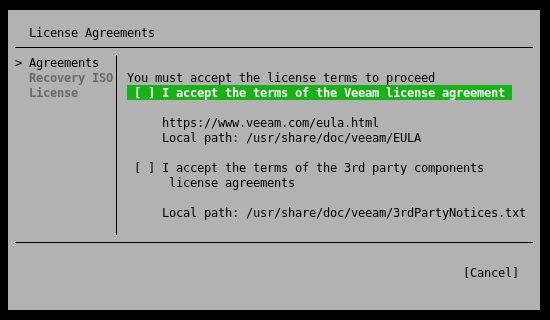

After you have agreed to both points by means of the space bar, you can switch to the next point by means of the Enter key.

**Custom Recovery Media**

Next, the setup wizard asks us if we want to include the server's drivers in the Veeam recovery image. I recommend you to enable this option to avoid delays in case of a complete system recovery. For the option, the creation of an image, additional packages are needed. You can find instructions on how to do this in the upper section of this manual.

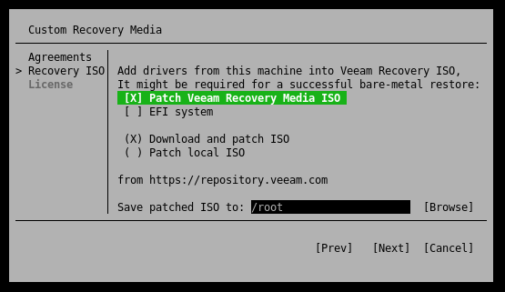

After that, you can select a location for the customized image via the user interface. The creation of the customized recovery image may take a few minutes. 

If you experience the following error message `ISO: FATAL ERROR:write_file: failed to create file /tmp/veeam/livecd-..., because Too many open files`, please refer to [veeam.com/kb4121](https://www.veeam.com/kb4121) for brief instructions on how to fix the problem.

**Provide license file for Veeam Agent for Linux**

Due to the fact that we use Veeam in the free variant, you can skip this point and proceed directly by pressing the Enter key to finish.

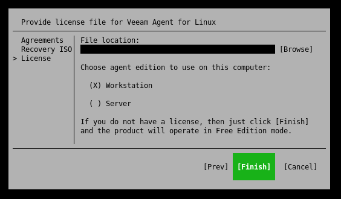

### Step 4.2 - Create the Backup Job

Once you have completed the First-Time Setup, you will see the main overview of the Veeam user interface. Normally, you can see all backups at a glance. However, since no backup job has been created yet, we proceed by pressing the C (Configure) key to create one.

**Naming a Backup**

First, we are prompted to assign a name to the new backup job. This name is later also part of the backup repository and cannot be changed anymore.

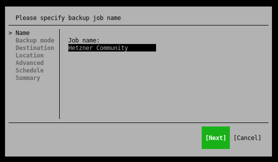

**Selecting Backup Mode**

Veeam offers different modes to perform a backup. Below is a brief overview of these modes:

* **Entire machine (recommended)**  
Back up the entire host for fast recovery on any level.
* **Volume level backup**  
Back up images of selected partitions and volumes.
* **File level backup**  
Back up individual files and folders.

You should choose the mode that suits your use case. However, if you are not sure, you cannot go wrong with the "Entire machine (recommended)" mode.

Also note that depending on the backup mode, you will have enough disk space available accordingly. A general recommendation is at least the total size of the available hard disks.

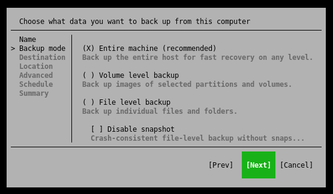

**Choose a Destination**

In this post, we will take a closer look at the following two backup storage options.

The "Veeam Backup & Replication" option is not relevant, as this option requires an additional server.

**Option 1 - Using Local Storage (Back up to a locally attached storage device)**

If you choose this option, you will need an additional hard disk, which is either permanently installed in your server or connected via USB.

You should also choose this option if your backup space is not accessible via SMB or NFS and therefore has to be mounted manually by you in the system, e.g. Block Devices, Amazon S3 or similar. 

Please make sure that you have enough free disk space for your backups. The number of restore points indicates how many days a point is held back for recovery.

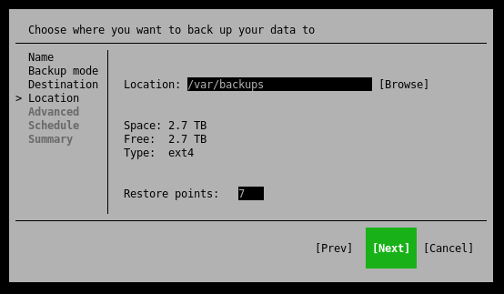

**Option 2 - Using Network Storage (Back up to a network location (SMB or NFS))**

This option allows you to integrate [backup space rented from Hetzner or a StorageBox](https://www.hetzner.com/storage/storage-box) via Samba, for example.

Of course, it is also possible to use any kind of NFS or Samba share here.

The number of restore points indicates how many days a point is held back for recovery.

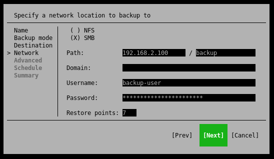

**Advanced Job Settings**

Now it's time to set additional options for our backup job, if desired.

Depending on whether the options are useful for you, you should enable them and set them up accordingly. 

I recommend that you enable and use backup encryption so that your backups are safe from third parties or unauthorized access.

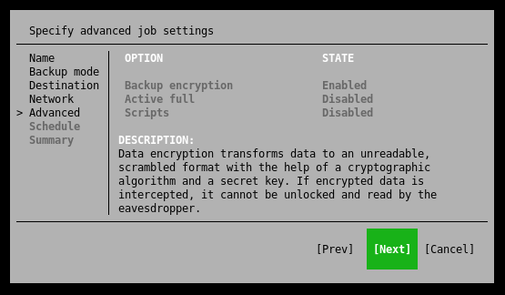

**Schedule**

In this section you can specify at what time the Veeam Agent should automatically (if desired) perform a backup.


**Summary**

You have almost made it. Finally, you will see an overview with the most important information about your backup job. 

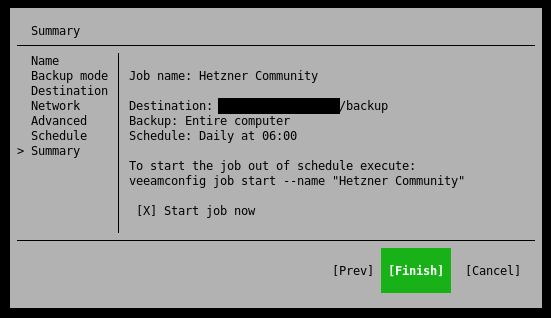

I would recommend that you leave the "Start job now" item selected so that an initial backup can be performed. After you have completed the job configurator, you will end up back in the standard overview of the Veeam console application.

**Please note that depending on the data status or storage space used, the backup will take a corresponding amount of time.**

### Step 5 - Veeam Overview

Now that a backup job has been created, the initial backup should start. Using the arrow-keys you can navigate within the terminal application to select the backup job you want more information about.

If the backup is still running, you will get some useful information about the status of the backup job.

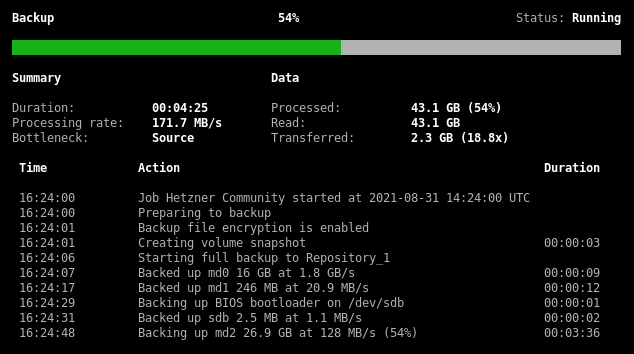

Once a backup has been completed, all status information is still retained and can be viewed in the application at any time.

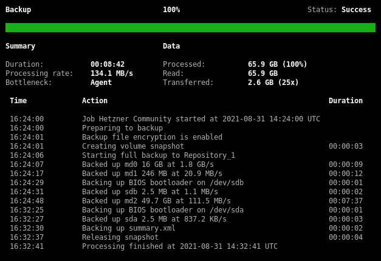

### Step 6 - Starting a Backup

Of course, you can also start a backup manually at any time to save the current data of your server. 

To do this, use the "S" key to switch to the start menu within the Veeam console application. You can then use the Enter button to perform a partial backup or the "F" key to start a full backup.

## Conclusion

Congratulations, you can now easily and quickly create backups of your server. Details on how to restore files or an entire server were covered in another article due to its complexity.

### Additional Information

You can also find the official guide of Installing Veeam Agent for Linux in the Veeam Help Center: [helpcenter.veeam.com/docs/agentforlinux/userguide/installation_process.html](https://helpcenter.veeam.com/docs/agentforlinux/userguide/installation_process.html?ver=50)

##### License: MIT

<!--

Contributor's Certificate of Origin

By making a contribution to this project, I certify that:

(a) The contribution was created in whole or in part by me and I have
    the right to submit it under the license indicated in the file; or

(b) The contribution is based upon previous work that, to the best of my
    knowledge, is covered under an appropriate license and I have the
    right under that license to submit that work with modifications,
    whether created in whole or in part by me, under the same license
    (unless I am permitted to submit under a different license), as
    indicated in the file; or

(c) The contribution was provided directly to me by some other person
    who certified (a), (b) or (c) and I have not modified it.

(d) I understand and agree that this project and the contribution are
    public and that a record of the contribution (including all personal
    information I submit with it, including my sign-off) is maintained
    indefinitely and may be redistributed consistent with this project
    or the license(s) involved.

Signed-off-by: Marcel Deglau <marcel.deglau@hetzner.com>

-->
