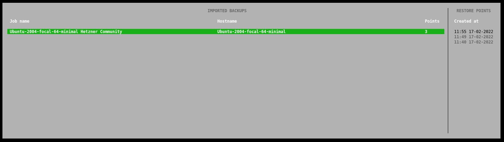

## Einführung

Der Veeam Agent für Linux ist eine gute Option um damit zu beginnen, Backups Ihres Servers beziehungsweise Ihrer Daten zu erstellen.

Bevor Sie beginnen, werfen Sie gern auch einen Blick auf die [Übersicht dieser Artikel-Serie](/tutorials/getting-started-with-veeam/de) und dessen Informationen.

In diesem Artikel möchte ich Ihnen erläutern, wie es möglich ist, Dateien aus Backups, die Sie mit Veeam erstellt haben, wiederherzustellen.

**Voraussetzungen**

* Ein Unix/Linux-Server, auf dem Sie bereits Backups mit Veeam erstellt haben und nun Dateien davon wiederherstellen möchten

## Schritt 1 - Auswählen eines Backups

Um die Wiederherstellung von Dateien aus einem Backup zu starten, öffnen Sie bitte die Benutzeroberfläche von Veeam mit dem Befehl: `veeam`.

Navigieren Sie dann mit der Taste "R" zum Menü Wiederherstellung. Hier haben Sie nun die Möglichkeit, Backup-Punkte auszuwählen, um die zu diesem Zeitpunkt gesicherten Daten wiederherzustellen oder auf sie zuzugreifen.

## Schritt 2 - Durchsuchen Ihrer Backups/Daten

Nachdem wir einen Sicherungspunkt ausgewählt haben, hängt Veeam die Daten dieses Snapshots in das Verzeichnis `/mnt/backup` ein.

Wir haben nun die Möglichkeit, direkt über die Shell auf unsere Backup-Dateien zuzugreifen und sie an einen beliebigen Ort zu kopieren.

## Schritt 3 - Schließen des Mount-Points

Nachdem Sie Ihre Dateien verwendet/kopiert haben, empfehle ich Ihnen, den Einhängepunkt des Backups zu schließen.

Sie können dies tun, indem Sie die Benutzeroberfläche von Veeam mit `veeam` öffnen und die Taste `u` für "unmount" drücken. 

## Fazit

Herzlichen Glückwunsch, Sie haben erfolgreich Dateien aus einem Backup wiederhergestellt. In einem weiteren Artikel dieser Reihe werden wir uns mit der Möglichkeit befassen, einen Server auf Bare-Metal-Ebene wiederherzustellen.

### Zusätzliche Informationen

Sie können auch die offizielle Anleitung zur Wiederherstellung von Dateien und Ordnern im Veeam Help Center finden: [helpcenter.veeam.com/docs/agentforlinux/userguide/baremetal_files_restore.html](https://helpcenter.veeam.com/docs/agentforlinux/userguide/baremetal_files_restore.html?ver=50)

##### License: MIT

<!--

Contributor's Certificate of Origin

By making a contribution to this project, I certify that:

(a) The contribution was created in whole or in part by me and I have
    the right to submit it under the license indicated in the file; or

(b) The contribution is based upon previous work that, to the best of my
    knowledge, is covered under an appropriate license and I have the
    right under that license to submit that work with modifications,
    whether created in whole or in part by me, under the same license
    (unless I am permitted to submit under a different license), as
    indicated in the file; or

(c) The contribution was provided directly to me by some other person
    who certified (a), (b) or (c) and I have not modified it.

(d) I understand and agree that this project and the contribution are
    public and that a record of the contribution (including all personal
    information I submit with it, including my sign-off) is maintained
    indefinitely and may be redistributed consistent with this project
    or the license(s) involved.

Signed-off-by: Marcel Deglau <marcel.deglau@hetzner.com>

-->
