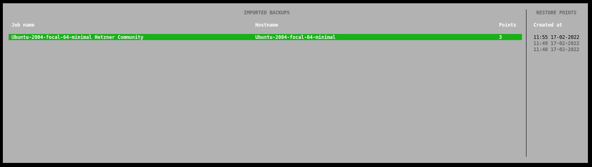

## Introduction

The Veeam Agent for Linux is a great option to getting started with backup your data.

Before getting started, please also see the [series index](/tutorials/getting-started-with-veeam/) and their information.

Within this article I would like to introduce you how it is possible to restore files from backups you had created with Veeam.

**Prerequisites**

* A Unix/Linux server on which you have already created backups with Veeam and now want to restore files from it

## Step 1 - Select a Backup-Point

To start restoring files from a backup, please open the Veeam terminal interface with the command: `veeam`.

Then navigate to the Recovery menu using the 'R' key. Here you now have the option to select backup points to restore the data backed up at that time or to access them.

## Step 2 - Browse Your Backups/Data

After we select a backup point, Veeam mounts the data of this snapshot to the `/mnt/backup` directory.

We now have the possibility to access our backup files directly via the shell and copy them to any location.

## Step 3 - Closing the Mount-Point

After you have used/copied your files I recommend you to close the mount point of the backup.

You can do this by opening the Veeam Terminal Interface using `veeam` and now pressing the `U` key for unmount. 

## Conclusion

Congratulations, you have successfully restored files from a backup. In another article from this series, we will look at the option to restore a server on bare-metal level.

### Additional Information

You can also find the official guide of Restoring Files and Folders in the Veeam Help Center: [helpcenter.veeam.com/docs/agentforlinux/userguide/files_restore_gui.html](https://helpcenter.veeam.com/docs/agentforlinux/userguide/files_restore_gui.html?ver=50)

##### License: MIT

<!--

Contributor's Certificate of Origin

By making a contribution to this project, I certify that:

(a) The contribution was created in whole or in part by me and I have
    the right to submit it under the license indicated in the file; or

(b) The contribution is based upon previous work that, to the best of my
    knowledge, is covered under an appropriate license and I have the
    right under that license to submit that work with modifications,
    whether created in whole or in part by me, under the same license
    (unless I am permitted to submit under a different license), as
    indicated in the file; or

(c) The contribution was provided directly to me by some other person
    who certified (a), (b) or (c) and I have not modified it.

(d) I understand and agree that this project and the contribution are
    public and that a record of the contribution (including all personal
    information I submit with it, including my sign-off) is maintained
    indefinitely and may be redistributed consistent with this project
    or the license(s) involved.

Signed-off-by: Marcel Deglau <marcel.deglau@hetzner.com>

-->
