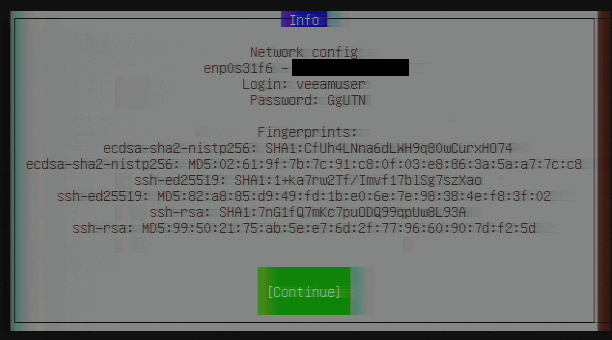
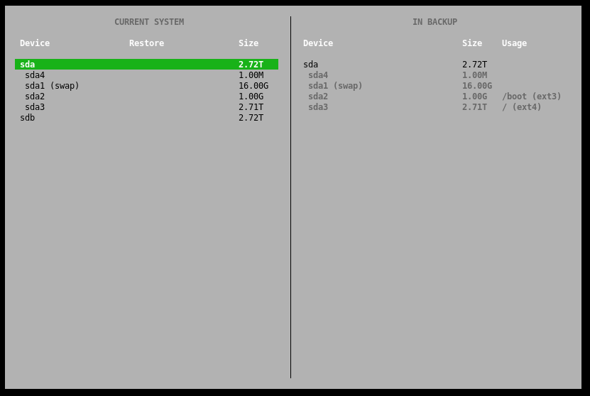

## Einführung

Aufgrund verschiedener Ereignisse kann es erforderlich sein, einen Linux-Server auf die Bare-Metal-Ebene wiederherzustellen.

Zum Beispiel, wenn systemrelevante Komponenten betroffen sind und Sie keine Möglichkeit haben, den [Veeam Agent für Linux](/tutorials/getting-started-with-veeam/restoring-files-with-the-veeam-agent-for-linux/de) zu verwenden.

Bevor Sie beginnen, werfen Sie gern auch einen Blick auf die [Übersicht dieser Artikel-Serie](/tutorials/getting-started-with-veeam/de) und dessen Informationen.

**Voraussetzungen**

* Ein Unix/Linux-Server, auf dem Sie bereits Backups mit Veeam erstellt haben und nun Dateien davon wiederherstellen möchten

## Schritt 1 - Erste Schritte mit dem Veeam Recovery Image

Um die Wiederherstellung auf Bare-Metal-Ebene durchzuführen, benötigen Sie das Veeam Recovery Image oder auch Veeam Recovery Media genannt.

Wenn Sie das Image nicht zur Hand haben, können Sie es jederzeit unter [veeam.com/linux-backup-download.html](https://www.veeam.com/linux-backup-download.html) im Bereich "Zusätzliche Downloads" herunterladen (Veeam-Konto erforderlich).

Kopieren Sie dann das Image mit einem Tool Ihrer Wahl auf einen USB-Stick. Für die Verwendung auf einem dedizierten Hetzner-Root-Server können Sie das Image beim Support einreichen, wenn Sie eine KVM-Konsole anfordern; weitere Informationen finden Sie in den Hetzner Docs: [docs.hetzner.com/robot/dedicated-server/maintainance/kvm-console/](https://docs.hetzner.com/robot/dedicated-server/maintainance/kvm-console/#using-a-usb-stick)

Booten Sie nun beim nächsten Serverstart direkt vom USB-Stick, um die Live-Umgebung des Images zu laden.

## Schritt 2 - Zugriff auf die Wiederherstellungsumgebung

Sobald das Live-Image erfolgreich gestartet wurde, wird als erstes automatisch ein SSH-Server aktiviert und das Netzwerk über DHCP konfiguriert. 

Danach erhalten Sie vom Server zufällige Anmeldedaten, wie im folgenden Beispiel dargestellt:



Mit diesen Zugangsdaten können Sie sich über SSH mit dem Server verbinden und müssen die Kontrolle über das Backup nicht über die lokale Bildschirmausgabe vornehmen. Hier ist ein Beispielbefehl für die Verbindung zum Server:

```console
$ ssh veeamuser@<your_host>
```

## Schritt 3 - Wiederherstellung eines Sicherungspunktes

Um fortzufahren, lesen Sie bitte die Lizenzbedingungen von Veeam, die bei der Anmeldung über SSH oder lokal angezeigt werden, und stimmen Sie diesen zu.

Danach sehen Sie ein Auswahlmenü, in dem Sie den Punkt "Restore Volumes" auswählen sollten. Danach erscheint eine Auswahl des Storage-Providers, auf dem Sie Ihre Backups gespeichert haben. Wählen Sie aus der Liste den Eintrag aus, der auf Ihren Fall zutrifft. Wir verwenden in diesem Fall einen freigegebenen Ordner - bitte geben Sie nun die erforderlichen Zugangsdaten für den Zugriff auf Ihre Backups ein.

Nachdem die Verbindung zum Storage-Provider erfolgreich hergestellt wurde, erhalten Sie eine Auswahl an Backups, die mit Veeam kompatibel sind. Wählen Sie in diesem Schritt das entsprechende Backup mit der Dateiendung *.vbm aus.



Nach Auswahl der wiederherzustellenden Partitionen kann der Wiederherstellungsprozess gestartet werden. Ähnlich wie bei der Erstellung eines Backups erhalten Sie anschließend eine Übersicht über den aktuellen Status der Wiederherstellung.

## Schritt 4 - Abschluss der Wiederherstellung

Die Datenwiederherstellung kann je nach ausgewähltem Speicherendpunkt und Datengröße mehrere Stunden dauern.

Wenn die Wiederherstellung erfolgreich abgeschlossen ist, können Sie den Computer über das Auswahlmenü neu starten. Je nachdem, welche Partitionen Sie wiederhergestellt haben, startet der Server wieder ohne Probleme oder benötigt eventuell ein Update des Bootloaders, um wieder korrekt zu starten.

## Fazit

Bitte beachten Sie, dass eine erfolgreiche Datenwiederherstellung von mehreren Faktoren abhängt und dieser Leitfaden nur grundlegende Wiederherstellungsfunktionen aufzeigen soll.

### Zusätzliche Informationen

Sie können auch das offizielle Handbuch der Veeam Recovery Media im Veeam Help Center finden: [helpcenter.veeam.com/docs/agentforwindows/userguide/recovery_media.html](https://helpcenter.veeam.com/docs/agentforwindows/userguide/recovery_media.html?ver=50)

##### License: MIT

<!--

Contributor's Certificate of Origin

By making a contribution to this project, I certify that:

(a) The contribution was created in whole or in part by me and I have
    the right to submit it under the license indicated in the file; or

(b) The contribution is based upon previous work that, to the best of my
    knowledge, is covered under an appropriate license and I have the
    right under that license to submit that work with modifications,
    whether created in whole or in part by me, under the same license
    (unless I am permitted to submit under a different license), as
    indicated in the file; or

(c) The contribution was provided directly to me by some other person
    who certified (a), (b) or (c) and I have not modified it.

(d) I understand and agree that this project and the contribution are
    public and that a record of the contribution (including all personal
    information I submit with it, including my sign-off) is maintained
    indefinitely and may be redistributed consistent with this project
    or the license(s) involved.

Signed-off-by: Marcel Deglau <marcel.deglau@hetzner.com>

-->
