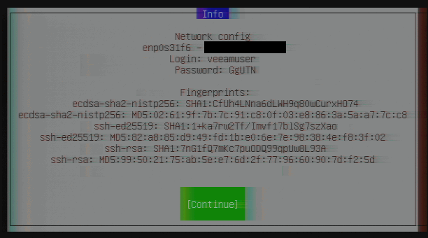
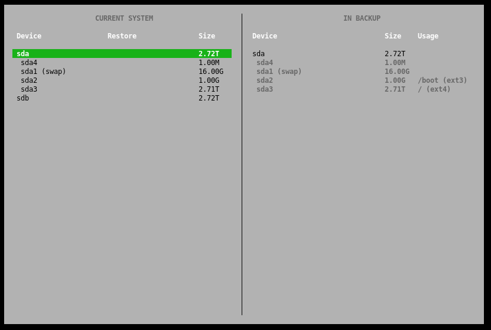

## Introduction

Due to various events, you may need to restore a Linux server to the bare-metal level.

For example, if system-relevant components are affected, and you have no possibility to use [Veeam Linux Agent for recovery](/tutorials/getting-started-with-veeam/restoring-files-with-the-veeam-agent-for-linux).

Before getting started, please also see the [series index](/tutorials/getting-started-with-veeam/) and their information.

**Prerequisites**

* A Unix/Linux server on which you have already created backups with Veeam and now want to recover it

## Step 1 - Get Started with the Veeam Recovery Image

To perform the recovery on bare-metal level, you need the Veeam Recovery Image or also known as Veeam Recovery Media.

If you do not have the image at hand, you can download it at any time from [veeam.com/linux-backup-download.html](https://www.veeam.com/linux-backup-download.html) in the "Additional Downloads" section (Veeam account required).

Then copy the image to a USB stick using a tool of your choice. For use on a dedicated Hetzner root server, you can submit the image to support when requesting a KVM console; more information can be found in the Hetzner Docs: [docs.hetzner.com/robot/dedicated-server/maintainance/kvm-console/](https://docs.hetzner.com/robot/dedicated-server/maintainance/kvm-console/#using-a-usb-stick)

Now boot directly from the USB stick at the next server start to load the live environment of the image.

## Step 2 - Accessing the Recovery Environment

Once the live image has successfully started, the first step is to automatically activate an SSH server and configure the network via DHCP. 

After this, the server will provide you random login credentials, as in the example below:



You can use these credentials to connect to the server via SSH and not have to perform control of the backup via the local screen output. Here is an example command to connect to the server:

```console
$ ssh veeamuser@<your_host>
```

## Step 3 - Restoring a Backup Point

To continue, please read and agree to Veeam's license terms, which will be displayed upon login via SSH or locally.

After that, you will see a recovery image selection menu where you should select the "Restore volumes" item. Afterwards, a selection of the storage provider on which you have stored your backups appears. Select the entry from the list that applies to your case. We use a shared folder in this case - please enter now the required credentials to access your backups.

After the connection to the storage provider is successfully established, you will get a selection of backups which are compatible with Veeam. At this step, select the appropriate backup with the *.vbm file extension.



After selecting the partitions to be restored, the restore process can be started. Similar to creating a backup, you will then receive an overview of the current status of the restore.

## Step 4 - Finalize the Recovery

Data recovery may take several hours depending on the selected storage endpoint and data size.

When the recovery is successfully completed, you can restart the computer from the selection menu. Depending on which partitions you have restored, the server will start again without problems or may need an update of the bootloader to start correctly again.

## Conclusion

Please note that successful data recovery depends on several factors and this guide is intended to demonstrate only basic recovery functionality.

### Additional Information

You can also find the official guide of the Veeam Recovery Media in the Veeam Help Center: [helpcenter.veeam.com/docs/agentforwindows/userguide/recovery_media.html](https://helpcenter.veeam.com/docs/agentforwindows/userguide/recovery_media.html?ver=50)

##### License: MIT

<!--

Contributor's Certificate of Origin

By making a contribution to this project, I certify that:

(a) The contribution was created in whole or in part by me and I have
    the right to submit it under the license indicated in the file; or

(b) The contribution is based upon previous work that, to the best of my
    knowledge, is covered under an appropriate license and I have the
    right under that license to submit that work with modifications,
    whether created in whole or in part by me, under the same license
    (unless I am permitted to submit under a different license), as
    indicated in the file; or

(c) The contribution was provided directly to me by some other person
    who certified (a), (b) or (c) and I have not modified it.

(d) I understand and agree that this project and the contribution are
    public and that a record of the contribution (including all personal
    information I submit with it, including my sign-off) is maintained
    indefinitely and may be redistributed consistent with this project
    or the license(s) involved.

Signed-off-by: Marcel Deglau <marcel.deglau@hetzner.com>

-->
