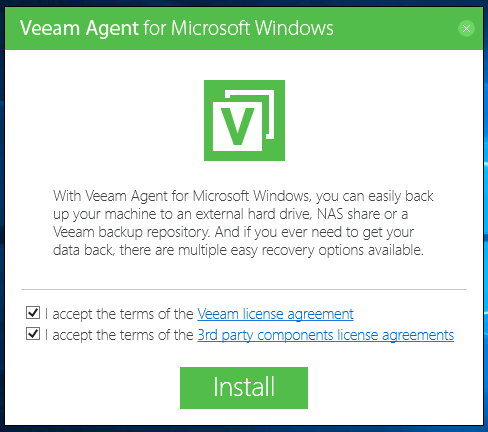
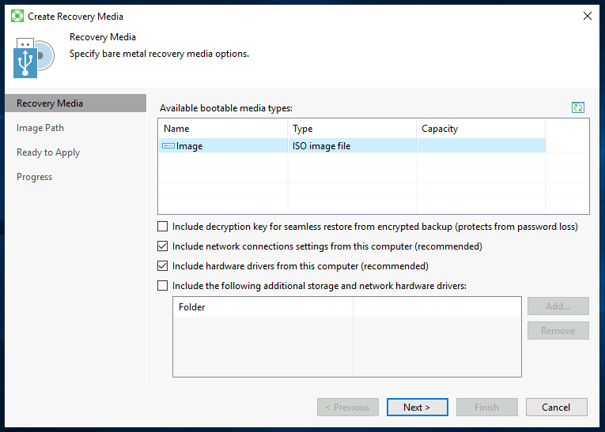
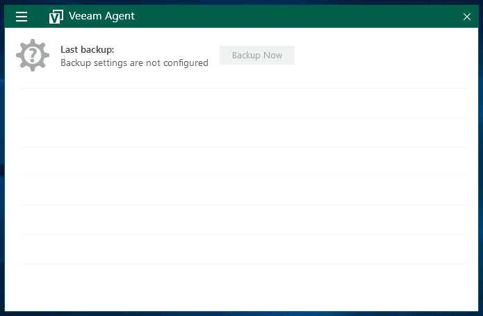
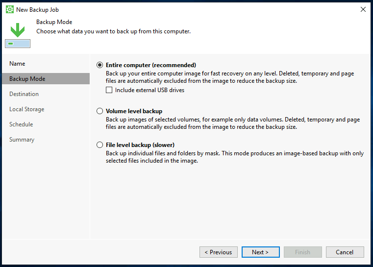
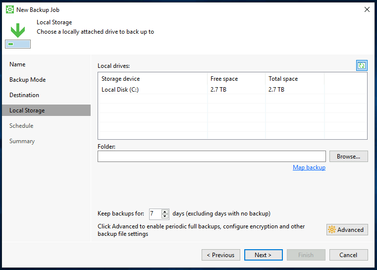
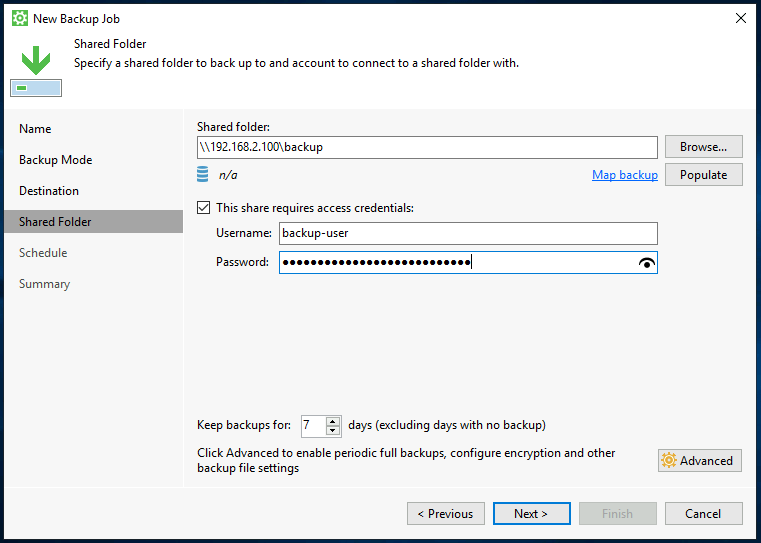
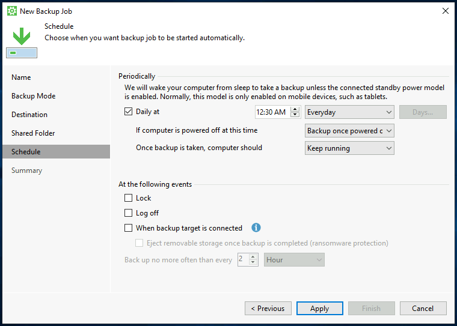
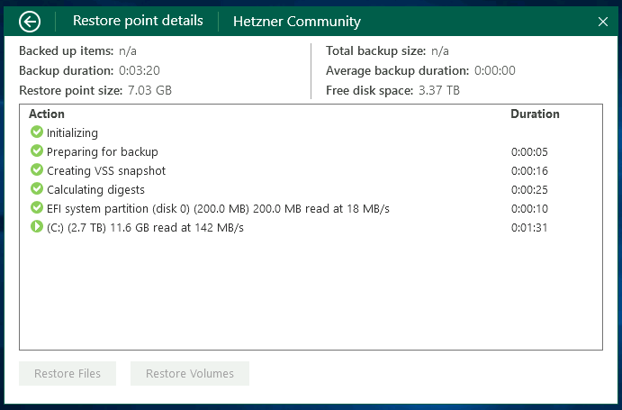

## Einführung

Der Veeam Agent für Microsoft Windows ist eine gute Option um damit zu beginnen, Backups Ihres Servers beziehungsweise Ihrer Daten zu erstellen.

Bevor Sie beginnen, werfen Sie gern auch einen Blick auf die [Übersicht dieser Artikel-Serie](/tutorials/getting-started-with-veeam/de) und dessen Informationen.

**Voraussetzungen**

* Ein Windows Gerät welches gesichert werden soll (Administrative Rechte werden benötigt)
* Anmeldung für ein kostenloses Konto bei [veeam.com](https://login.veeam.com) (zum Download von Veeam)
* Ausreichend Festplattenspeicher oder Netzwerkspeicher um Backups zu speichern

**Verfügbarkeit**

Basierend auf den Informationen im Februar 2022, ist der Veeam Agent für Linux für folgende Betriebssysteme verfügbar (x64 und x86):

* Microsoft Windows Server 2022
* Microsoft Windows Server 2019
* Microsoft Windows Server 2016
* Microsoft Windows Server Semi-Annual Channel (von Version 1803 bis Version 20H2)
* Microsoft Windows Server 2012 R2
* Microsoft Windows Server 2012
* Microsoft Windows Server 2008 R2 SP12

Veeam ist auch für Consumer-Versionen von Microsoft Windows wie Windows 10 verfügbar. Die vollständige Kompatibilitätsliste finden Sie hier: [helpcenter.veeam.com/docs/agentforwindows/userguide/system_requirements.html](https://helpcenter.veeam.com/docs/agentforwindows/userguide/system_requirements.html?ver=50)

## Schritt 1 - Anmeldung für ein Veeam-Konto

Um mit dem Download und der Installation des Veeam Agent für Linux fortzufahren, ist ein kostenloses Konto bei [veeam.com](https://login.veeam.com) erforderlich.

Sie können ein kostenloses Konto unter [veeam.com/signin.html](https://www.veeam.com/signin.html) registrieren.

Sobald Sie die Registrierung abgeschlossen haben, haben Sie Zugriff auf die Download-Seite des Veeam Agent für Microsoft Windows und können mit Schritt 2 fortfahren.

## Schritt 2 - Herunterladen des Veeam Agent für Microsoft Windows

Bitte prüfen Sie vor der Installation, dass Ihr verwendetes Betriebssystem in der oben genannten Kompatibilitätsliste aufgezählt ist.

Für die Installation von Veeam ist eine Anmeldung bei Ihrem Veeam-Konto erforderlich. Leider können die entsprechenden Dateien nur mit Authentifizierung heruntergeladen werden, ein direkter Download ist daher nicht möglich. Sie können den Veeam Agent für Microsoft Windows unter [veeam.com/backup-agent-windows-free/prm_download.html](https://www.veeam.com/backup-agent-windows-free/prm_download.html) herunterladen.

Nach dem Herunterladen können Sie das ZIP-Archiv mit den Windows-eigenen Tools entpacken.

## Schritt 3 - Installieren des Veeam Agent für Microsoft Windows

Nach dem erfolgreichen Herunterladen und Entpacken der Installationsdatei können Sie mit der Installation beginnen.

Die erforderlichen Software-Abhängigkeiten sind bereits in der Installationsroutine enthalten und müssen nicht manuell installiert werden. Folgendes wird installiert: Microsoft .NET Framework 4.5.2, Microsoft SQL Server 2012 Management Objects, Microsoft SQL Server System CLR Types und Windows Universal C Run-time Library.

Wenn Sie die Installationsroutine öffnen, werden Sie aufgefordert, dem [Veeam Endbenutzer-Lizenzvertrag (EULA)](https://www.veeam.com/eula.html) und den Bedingungen der Drittanbietersoftware zuzustimmen.

Wenn die Installation erfolgreich war, werden Sie aufgefordert, einen UBS-Stick anzuschließen, um ein Wiederherstellungsmedium zu erstellen, überspringen Sie diesen Teil, indem Sie das Kontrollkästchen "Überspringen" aktivieren.

Die Installation ist nun abgeschlossen. Bitte lassen Sie die Checkbox bei "Run Veeam Recovery Media creation wizard" aktiviert und bestätigen Sie mit Fertigstellen.

## Schritt 4 - Erste Schritte mit dem Veeam Agent für Microsoft Windows

### Schritt 4.1 - Veeam Recovery Media Creation Wizard

Unmittelbar nach der Installation öffnet sich das Programm zur Erstellung eines Veeam Recovery Media. Ich empfehle Ihnen dringend, dieses Image zu erstellen, um im Falle einer Wiederherstellung das Image parat zu haben.

Sie können "Image" oder einen angeschlossenen USB-Stick als Speichermethode auswählen. Anschließend können Sie einen Speicherort für das Image angeben.

Die Erstellung des Veeam Recovery Media kann einige Minuten dauern.

### Schritt 4.2 - Erstellen eines Backup-Jobs

Nachdem Sie die Installation wie oben beschrieben erfolgreich abgeschlossen haben, können wir mit der Erstellung unseres Backup-Jobs mit Veeam fortfahren. Starten Sie dazu die Anwendung Veeam Agent für Microsoft Windows.

**Hinweis:** _In der kostenlosen Version von Veeam (wie in diesem Artikel beschrieben) können Sie nur einen einzigen Backup-Job erstellen. Für weitere Jobs oder zusätzliche Funktionen ist eine entsprechende Lizenz erforderlich.

Disclaimer: Die folgenden Optionen können natürlich jederzeit an die eigenen Bedürfnisse und die Anwendung angepasst werden und stellen ausschließlich Empfehlungen von mir dar.

Beim ersten Start werden Sie nach einer Lizenz gefragt, dieser Dialog kann mit Nein geschlossen werden. Nun sehen Sie die Veeam-Oberfläche, um einen neuen Backup-Job zu erstellen, klicken Sie auf das Burger-Menü oben links und dann auf "Add New Job".

**Benennen eines Backup-Jobs**

Es öffnet sich ein Konfigurationsfenster für einen neuen Backup-Job, hier können Sie einen eigenen Namen für diesen Backup-Job vergeben.

**Auswählen eines Backup-Modus**

Veeam bietet verschiedene Modi zur Durchführung eines Backups. Im Folgenden finden Sie eine kurze Übersicht über diese Arten:

* **Gesamte Maschine (empfohlen)**  
Sichern Sie den gesamten Host für eine schnelle Wiederherstellung auf jeder Ebene.
* **Backup auf Volumenebene**  
Sichern Sie Images ausgewählter Partitionen und Volumes.
* **Backup auf Dateiebene**  
Sichern Sie einzelne Dateien und Verzeichnisse.

Sie sollten den Modus wählen, der für Ihren Anwendungsfall geeignet ist. Wenn Sie sich jedoch nicht sicher sind, können Sie mit dem Modus "Gesamter Rechner (empfohlen)" nichts falsch machen.

Beachten Sie auch, dass Sie je nach Sicherungsmodus entsprechend viel Speicherplatz zur Verfügung haben müssen. Eine allgemeine Empfehlung ist mindestens die Gesamtgröße der verfügbaren Festplatten.

**Auswählen eines Ziels**

In diesem Beitrag werden wir uns die folgenden beiden Storage-Optionen für Backups genauer ansehen.

Die Option "Veeam Backup & Replication" ist nicht relevant, da diese Option einen zusätzlichen Server erfordert.

**Option 1 - Verwendung eines lokalen Speichers (Sicherung auf einem lokal angeschlossenen Speichergerät)**

Wenn Sie diese Option wählen, benötigen Sie eine zusätzliche Festplatte, die entweder fest in Ihrem Server installiert oder über USB angeschlossen ist.

Diese Option sollten Sie auch wählen, wenn Ihr Backupspeicher nicht über SMB oder NFS erreichbar ist und daher von Ihnen manuell im System gemountet werden muss, z.B. Block Devices, Amazon S3 oder ähnliches. 

Bitte stellen Sie sicher, dass Sie genügend freien Speicherplatz für Ihre Backups haben. Die Anzahl der Wiederherstellungspunkte gibt an, wie viele Tage ein Punkt für die Wiederherstellung zurückgehalten wird.

**Option 2 - Netzwerkspeicher nutzen (Sicherung auf einem Netzwerkspeicher (SMB oder NFS))**

Mit dieser Option können Sie z.B. [von Hetzner gemieteten Backup-Speicherplatz oder eine StorageBox](https://www.hetzner.com/storage/storage-box) über Samba einbinden.

Natürlich ist es auch möglich, eine beliebige NFS- oder Samba-Freigabe zu verwenden.

Die Anzahl der Wiederherstellungspunkte gibt an, wie viele Tage ein Punkt zur Wiederherstellung zurückgehalten wird.

**Erweiterte Job-Einstellungen**

Wenn Sie möchten, können Sie die erweiterten Einstellungen auch anpassen, um z. B. die Verschlüsselung der Backups zu aktivieren oder das Backup-Verhalten manuell anzupassen.

**Zeitplan**

In diesem Abschnitt können Sie festlegen, zu welchem Zeitpunkt der Veeam Agent automatisch ein Backup durchführen soll (falls gewünscht).

**Zusammenfassung**

Sie haben es fast geschafft. Schließlich sehen Sie eine Übersicht mit den wichtigsten Informationen zu Ihrem Backup-Job.

Ich empfehle Ihnen, den Punkt "Job jetzt starten" ausgewählt zu lassen, damit ein erstes Backup durchgeführt werden kann. Nachdem Sie den Job-Konfigurator abgeschlossen haben, gelangen Sie zurück in die Standardübersicht der Anwendung Veeam Agent für Microsoft Windows.

Bitte beachten Sie, dass das Backup je nach Datenstand bzw. belegtem Speicherplatz eine entsprechende Zeitspanne in Anspruch nimmt.

## Step 5 - Veeam Übersicht

Nachdem nun ein Backup-Job erstellt wurde, sollte die erste Sicherung beginnen. Sie können auf den vertikalen Balken und den Backup-Job klicken, über den Sie weitere Informationen wünschen.

Wenn das Backup noch läuft, erhalten Sie einige nützliche Informationen über den Status des Backup-Jobs.

## Step 6 - Starten eines Backups

Natürlich können Sie auch jederzeit manuell ein Backup starten, um die aktuellen Daten Ihres Servers zu sichern.

Klicken Sie dazu einfach auf die Schaltfläche "Backup Now" innerhalb der Veeam Agent für Microsoft Windows Anwendung.

## Fazit

Herzlichen Glückwunsch, Sie können jetzt einfach und schnell Backups von Ihrem Microsoft Windows erstellen. Einzelheiten zur Wiederherstellung von Dateien oder eines ganzen Servers wurden aufgrund ihrer Komplexität in einem anderen Artikel behandelt.

### Zusätzliche Informationen

Sie können auch die offizielle Anleitung zur Installation von Veeam Agent für Microsoft Windows im Veeam Help Center finden: [helpcenter.veeam.com/docs/agentforwindows/userguide/installation.html](https://helpcenter.veeam.com/docs/agentforwindows/userguide/installation.html?ver=50)

##### License: MIT

<!--

Contributor's Certificate of Origin

By making a contribution to this project, I certify that:

(a) The contribution was created in whole or in part by me and I have
    the right to submit it under the license indicated in the file; or

(b) The contribution is based upon previous work that, to the best of my
    knowledge, is covered under an appropriate license and I have the
    right under that license to submit that work with modifications,
    whether created in whole or in part by me, under the same license
    (unless I am permitted to submit under a different license), as
    indicated in the file; or

(c) The contribution was provided directly to me by some other person
    who certified (a), (b) or (c) and I have not modified it.

(d) I understand and agree that this project and the contribution are
    public and that a record of the contribution (including all personal
    information I submit with it, including my sign-off) is maintained
    indefinitely and may be redistributed consistent with this project
    or the license(s) involved.

Signed-off-by: Marcel Deglau <marcel.deglau@hetzner.com>

-->
