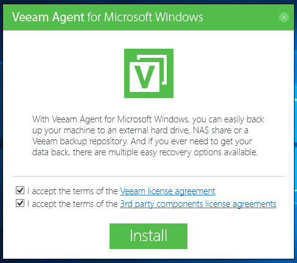
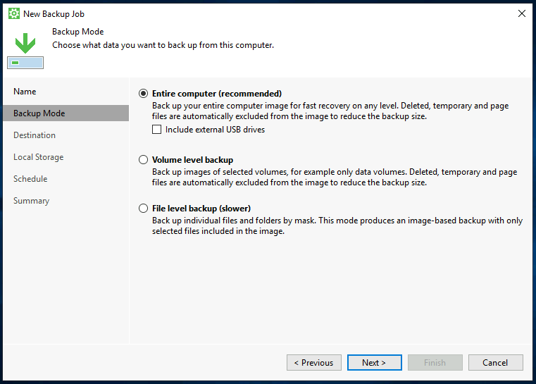
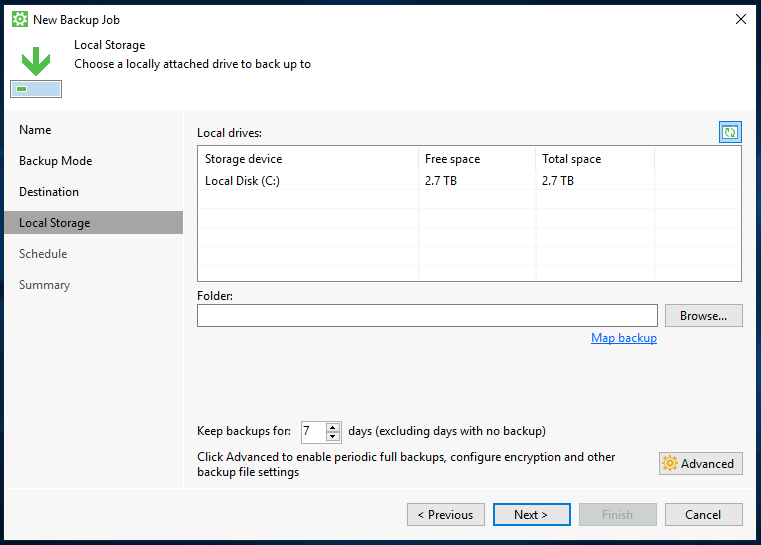
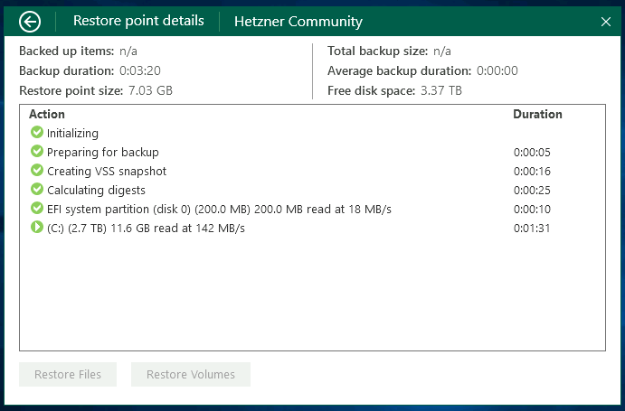

## Introduction

The Veeam Agent for Microsoft Windows is a great option to getting started with backup your data.

Before getting started, please also see the [series index](/tutorials/getting-started-with-veeam/) and their information.

**Prerequisites**

* Any Microsoft Windows device you want to backup (administrative rights are required)
* Sign-up for a free account at [veeam.com](https://login.veeam.com) (to download Veeam)
* Enough drive space or network storage for storing your Veeam backup files

**Availability**

Based on February 2022 data, Veeam Agent for Microsoft Windows is available on the following operating systems (x64 and x86):

* Microsoft Windows Server 2022
* Microsoft Windows Server 2019
* Microsoft Windows Server 2016
* Microsoft Windows Server Semi-Annual Channel (from version 1803 to version 20H2)
* Microsoft Windows Server 2012 R2
* Microsoft Windows Server 2012
* Microsoft Windows Server 2008 R2 SP12

Veeam is also available for consumer Microsoft Windows version such as Windows 10 and the full compatibility list can be found here: [helpcenter.veeam.com/docs/agentforwindows/userguide/system_requirements.html](https://helpcenter.veeam.com/docs/agentforwindows/userguide/system_requirements.html?ver=50)

## Step 1 - Sign-up for a Veeam account

In order to go on with the download and installation of the Veeam Agent for Microsoft Windows, a free account at [veeam.com](https://login.veeam.com) is required.

You can register a free account at [veeam.com/signin.html](https://www.veeam.com/signin.html).

Once you completed the registration, you have access to the download page of the Veeam Agent for Microsoft Windows and can continue with step 2.

## Step 2 - Download the Veeam Agent for Microsoft Windows

Please make sure that the operating system you are using is listed in the availability list above.

It is necessary to login to your Veeam account to install Veeam. Unfortunately, the corresponding files can only be downloaded using authentication, so a direct download is not possible. You can download the Veeam Agent for Microsoft Windows at [veeam.com/backup-agent-windows-free/prm_download.html](https://www.veeam.com/backup-agent-windows-free/prm_download.html).

After downloading, you can unpack the archive using Windows own tools.

## Step 3 - Install the Veeam Agent for Microsoft Windows

After successfully downloading and unzipping the installation file, we can start the installation.

The required software dependencies are already included in the installation routine and do not need to be installed manually. The following are installed: Microsoft .NET Framework 4.5.2, Microsoft SQL Server 2012 Management Objects, Microsoft SQL Server System CLR Types and Windows Universal C Run-time Library.

When you open the installation routine, you will be asked to agree to [Veeam End User License Agreement (EULA)](https://www.veeam.com/eula.html) and the terms of third-party software.

After the installation was successful, you will be asked to insert a UBS stick to create a recovery medium, skip this part by selecting the checkbox with "Skip".

The installation is now complete. Please leave the checkbox at "Run Veeam Recovery Media creation wizard" checked and confirm with finish.

## Step 4 - Getting Started with Veeam Agent for Microsoft Windows

### Step 4.1 - Veeam Recovery Media Creation Wizard

Immediately after the installation, the program for creating a Veeam Recovery Media opens. I highly recommend you to create this image to have the image ready in case of a recovery.

You can select "Image" or a connected USB stick as the storage method. You can then specify a storage location for the image.

The creation of the Veeam Recovery Media can take a few minutes.

### Step 4.2 Create the Backup Job

After you have successfully completed the installation as described before, we can proceed to create our backup job with Veeam. To do this, launch the Veeam Agent for Microsoft Windows application.

**Note:** _In the free version of Veeam (as described in this article) you can only create a single backup job. For more jobs or additional functionality, a corresponding license is required._

_Disclaimer: The following values can of course be adapted to your own needs and the application at any time and represent exclusively recommendations from me._

At the initial start you will be asked for a license, this dialog can be closed with No. Now you will see the Veeam interface, to create a new backup job, click on the burger menu on the top left and then click on "Add New Job".

**Naming a Backup**

A configuration window for a new backup job opens, here you can assign a custom name for this backup job.

**Selecting Backup Mode**

Veeam offers different modes to perform a backup. Below is a brief overview of these modes:

* Entire machine (recommended)  
Back up the entire host for fast recovery on any level.
* Volume level backup  
Back up images of selected partitions and volumes.
* File level backup  
Back up individual files and folders.

You should choose the mode that suits your use case. However, if you are not sure, you cannot go wrong with the "Entire machine (recommended)" mode.

Also note that depending on the backup mode, you will have enough disk space available accordingly. A general recommendation is at least the total size of the available hard disks.

**Choose a Destination**

In this post, we will take a closer look at the following two backup storage options.

The "Veeam Backup & Replication" option is not relevant, as this option requires an additional server.

**Option 1 - Using Local Storage (Back up to a locally attached storage device)**

If you choose this option, you will need an additional hard disk, which is either permanently installed in your server or connected via USB.

You should also choose this option if your backup space is not accessible via SMB or NFS and therefore has to be mounted manually by you in the system, e.g. Block Devices, Amazon S3 or similar.

Please make sure that you have enough free disk space for your backups. The number of restore points indicates how many days a point is held back for recovery.

**Option 2 - Using Network Storage (Back up to a network location (SMB or NFS))**

This option allows you to integrate [backup space rented from Hetzner or a StorageBox](https://www.hetzner.com/storage/storage-box) via Samba, for example.

Of course, it is also possible to use any kind of NFS or Samba share here.

The number of restore points indicates how many days a point is held back for recovery.

**Advanced Job Settings**

If you wish, you can also customize the Advanced Settings to enable encryption of the backups, for example, or to manually adjust the backup behavior.

**Schedule**

In this section you can specify at what time the Veeam Agent should automatically (if desired) perform a backup.

**Summary**

You have almost made it. Finally, you will see an overview with the most important information about your backup job.

I would recommend that you leave the "Start job now" item selected so that an initial backup can be performed. After you have completed the job configurator, you will end up back in the standard overview of the Veeam Agent for Microsoft Windows application.

Please note that depending on the data status or storage space used, the backup will take a corresponding amount of time.

## Step 5 - Veeam Overview

Now that a backup job has been created, the initial backup should start. You can click on the vertical bar and the backup job you want more information about.

If the backup is still running, you will get some useful information about the status of the backup job.

## Step 6 - Starting a Backup

Of course, you can also start a backup manually at any time to save the current data of your server.

To do this, just click on the button "Backup Now" within the Veeam Agent for Microsoft Windows application.

## Conclusion

Congratulations, you can now easily and quickly create backups of your Microsoft Windows. Details on how to restore files or an entire server were covered in another article due to its complexity.

### Additional Information

You can also find the official guide of Installing Veeam Agent for Microsoft Windows in the Veeam Help Center: [helpcenter.veeam.com/docs/agentforwindows/userguide/installation.html](https://helpcenter.veeam.com/docs/agentforwindows/userguide/installation.html?ver=50)

##### License: MIT

<!--

Contributor's Certificate of Origin

By making a contribution to this project, I certify that:

(a) The contribution was created in whole or in part by me and I have
    the right to submit it under the license indicated in the file; or

(b) The contribution is based upon previous work that, to the best of my
    knowledge, is covered under an appropriate license and I have the
    right under that license to submit that work with modifications,
    whether created in whole or in part by me, under the same license
    (unless I am permitted to submit under a different license), as
    indicated in the file; or

(c) The contribution was provided directly to me by some other person
    who certified (a), (b) or (c) and I have not modified it.

(d) I understand and agree that this project and the contribution are
    public and that a record of the contribution (including all personal
    information I submit with it, including my sign-off) is maintained
    indefinitely and may be redistributed consistent with this project
    or the license(s) involved.

Signed-off-by: Marcel Deglau <marcel.deglau@hetzner.com>

-->
