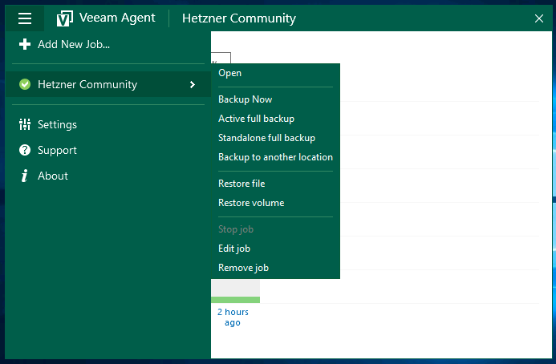
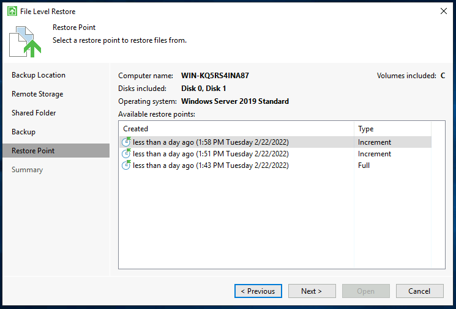

## Introduction

The Veeam Agent for Microsoft Windows is a great option to getting started with backup your data.

Before getting started, please also see the [series index](/tutorials/getting-started-with-veeam/) and their information.

Within this article I would like to introduce you how it is possible to restore files from backups you had created with Veeam.

**Prerequisites**

* Any Microsoft Windows device on which you have already created backups with Veeam and now want to restore files from it

## Step 1 - Open the Recovery Overview

To start restoring files from a backup, please open the Veeam Agent for Microsoft Windows.

After that, you need to navigate to the recovery overview. To do this, open the burger menu at the top left, click on the name of your backup job and then on Restore File or Restore Volume, depending on which operation you want to start.

## Step 2 - Selecting a Restore Point

Now that we have opened the restore overview, we can select a restore point from which we can restore or copy data.

## Step 3 - Browse Your Backups/Data

We now have the possibility to access our backup files directly via the backup browser and copy them to any location and other options (see the context menu).

You also have the possibility to open files or paths in the Windows Explorer to copy or view them.

## Step 4 - Closing the Mount-Point

After you have restored your files, you can simply close the backup browser. The mounted image will be automatically disconnected from Windows again.

## Conclusion

Congratulations, you have successfully restored files from a backup. In another article from this series, we will look at the option to restore a server on bare-metal level.

### Additional Information

You can also find the official guide of Restoring Files and Folders in the Veeam Help Center: [helpcenter.veeam.com/docs/agentforwindows/userguide/files_restore.html](https://helpcenter.veeam.com/docs/agentforwindows/userguide/files_restore.html?ver=50)

##### License: MIT

<!--

Contributor's Certificate of Origin

By making a contribution to this project, I certify that:

(a) The contribution was created in whole or in part by me and I have
    the right to submit it under the license indicated in the file; or

(b) The contribution is based upon previous work that, to the best of my
    knowledge, is covered under an appropriate license and I have the
    right under that license to submit that work with modifications,
    whether created in whole or in part by me, under the same license
    (unless I am permitted to submit under a different license), as
    indicated in the file; or

(c) The contribution was provided directly to me by some other person
    who certified (a), (b) or (c) and I have not modified it.

(d) I understand and agree that this project and the contribution are
    public and that a record of the contribution (including all personal
    information I submit with it, including my sign-off) is maintained
    indefinitely and may be redistributed consistent with this project
    or the license(s) involved.

Signed-off-by: Marcel Deglau <marcel.deglau@hetzner.com>

-->
