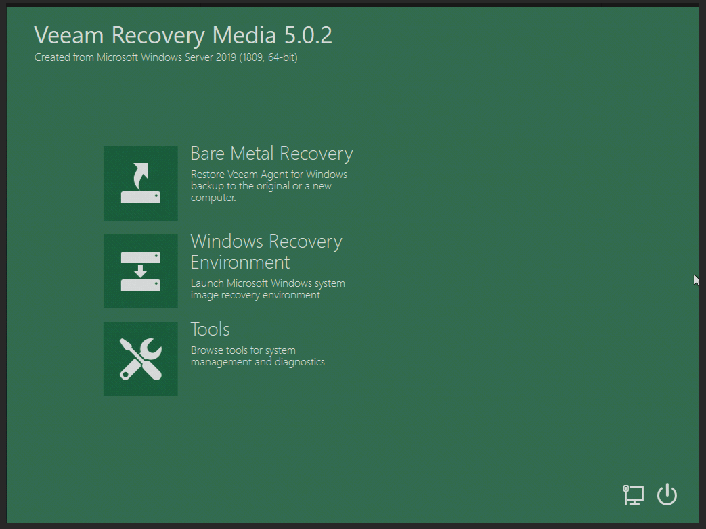
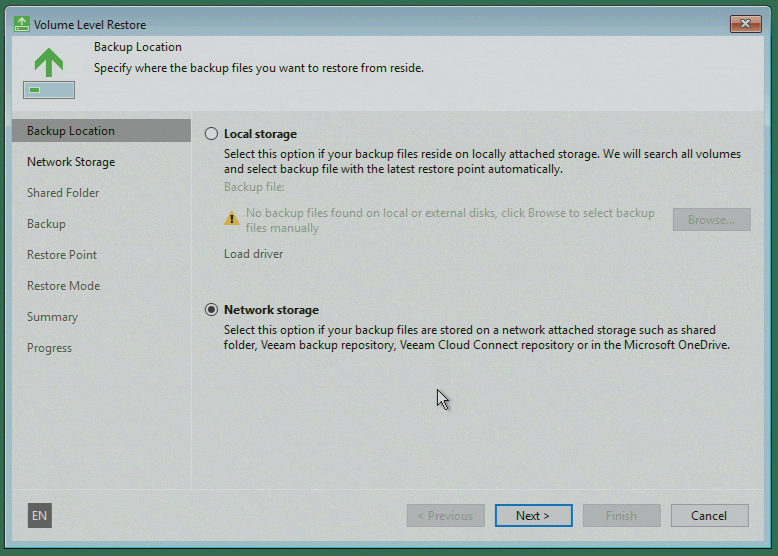
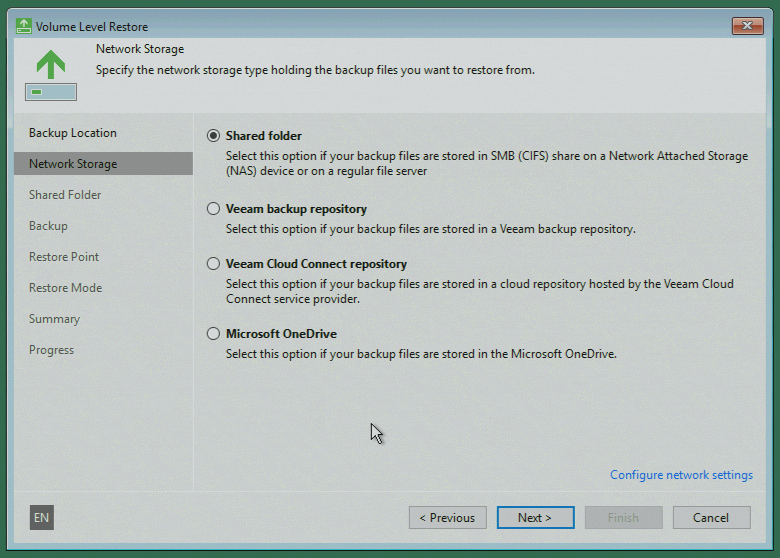
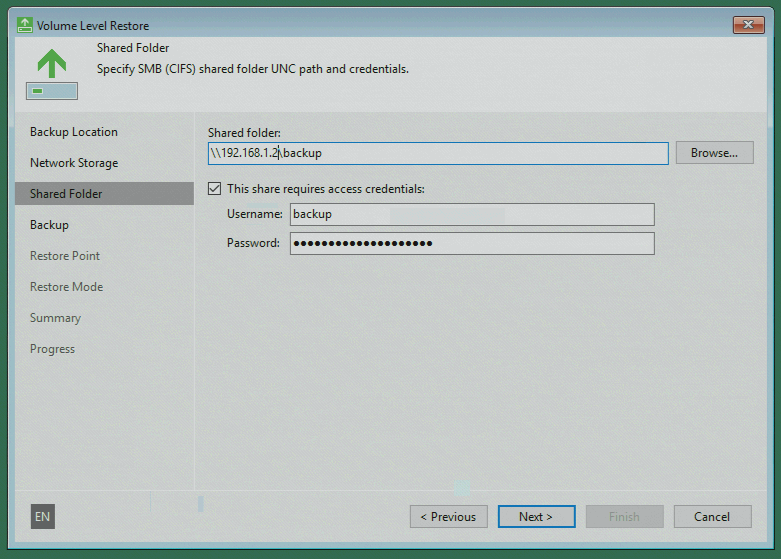
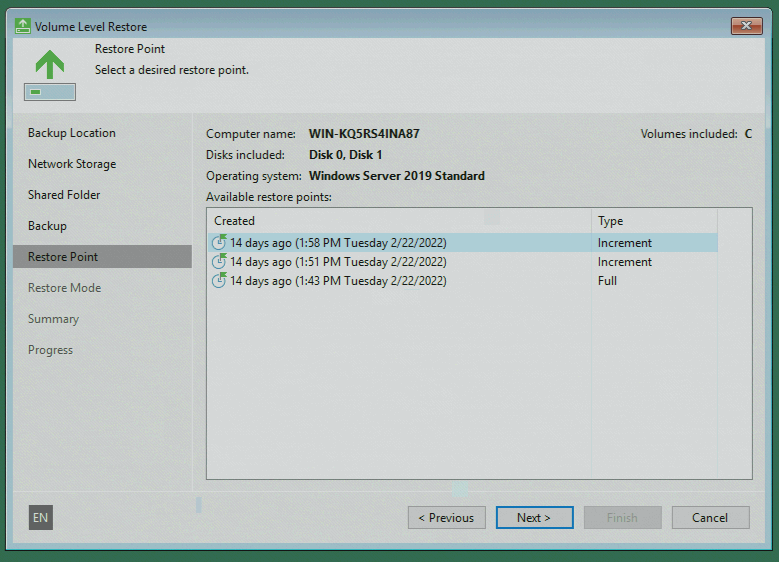
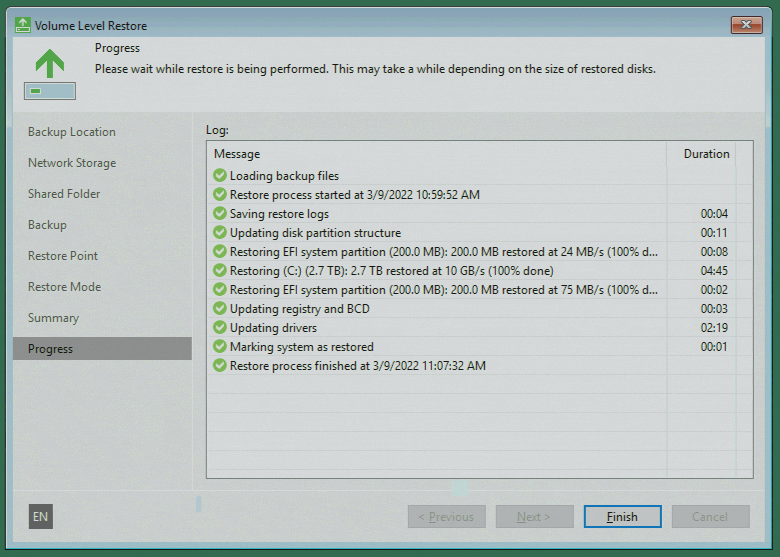

## Einführung

Aufgrund verschiedener Ereignisse kann es erforderlich sein, eine Windows Gerät auf die Bare-Metal-Ebene wiederherzustellen.

Zum Beispiel, wenn systemrelevante Komponenten betroffen sind und Sie keine Möglichkeit haben, den [Veeam Agent für Microsoft Windows](/tutorials/getting-started-with-veeam/restoring-files-with-the-veeam-agent-for-microsoft-windows/de) zu verwenden.

Bevor Sie beginnen, werfen Sie gern auch einen Blick auf die [Übersicht dieser Artikel-Serie](/tutorials/getting-started-with-veeam/de) und dessen Informationen.

**Voraussetzungen**

* Ein Windows Gerät, auf dem Sie bereits Backups mit Veeam erstellt haben und nun Dateien davon wiederherstellen möchten

## Schritt 1 - Erste Schritte mit dem Veeam Recovery Image

Um die Wiederherstellung auf Bare-Metal-Ebene durchzuführen, benötigen Sie das Veeam Recovery Image oder auch Veeam Recovery Media genannt.

Leider gibt es keinen generischen Download für das Veeam Recovery Media, wie es für Linux-Server existiert. Das Image muss auf dem Gerät erstellt werden (unter anderem wegen der Treiberkompatibilität).

Kopieren Sie dann das Image mit einem Tool Ihrer Wahl auf einen USB-Stick. Für die Verwendung auf einem dedizierten Hetzner-Root-Server können Sie das Image beim Support einreichen, wenn Sie eine KVM-Konsole anfordern; weitere Informationen finden Sie in den Hetzner Docs: [docs.hetzner.com/robot/dedicated-server/maintainance/kvm-console/](https://docs.hetzner.com/robot/dedicated-server/maintainance/kvm-console/#using-a-usb-stick)

Booten Sie nun beim nächsten Serverstart direkt vom USB-Stick, um die Live-Umgebung (Windows PE) des Images zu laden.

Um fortzufahren, wählen Sie bitte "Bare Metal Recovery".

## Schritt 2 - Die Wiederherstellungsumgebung

Nachdem Sie die Option "Bare Metal Recovery" ausgewählt haben, wird der Wiederherstellungs-Agent geöffnet. Sie kennen die Benutzeroberfläche bereits von der Verwendung des Veeam Agent für Microsoft Windows. 

Im Folgenden werde ich Sie durch die einzelnen Schritte in diesem Leitfaden führen.

**Backup-Ort**

Als Erstes müssen Sie den Speicherort für Ihre Backups auswählen. Normalerweise werden sie auf einem Netzwerkspeicher gespeichert.
Wählen Sie die Option, die auf Ihren Fall zutrifft, und fahren Sie fort.

**Speicher Provider**

Dann erhalten Sie eine Übersicht über die Option, welche Speicheranbieter zur Verfügung stehen. Wählen Sie an dieser Stelle die richtige Option aus.

In dieser Tutorial-Serie haben wir Samba-basierte Freigabeordner verwendet und wählen daher die erste Option.

**Zugangsdaten**

Nun können Sie die Zugangsdaten für Ihren Netzwerkspeicher eingeben. In den meisten Fällen verfügt die Wiederherstellungsumgebung bereits über eine Netzwerkverbindung und eine gültige IP-Adresse, da diese Informationen bei der Erstellung des Veeam Recovery Media im Image gespeichert werden.

Wenn Sie keinen Netzwerkzugang haben, können Sie die Netzwerkeinstellungen im vorherigen Punkt anpassen, indem Sie auf den kleinen blauen Link unten rechts klicken: "Configure network settings".

## Schritt 3 - Wiederherstellung eines Sicherungspunktes

Wenn die Zugangsdaten aus dem vorherigen Punkt korrekt sind, erhalten Sie nun eine Übersicht über die Backups im ausgewählten Speicheranbieter. 

Wählen Sie die Sicherung aus, die die Daten des wiederherzustellenden Computers enthält. Wenn Sie fortfahren, erhalten Sie nun eine Übersicht über alle verfügbaren Sicherungspunkte, die Sie für die Wiederherstellung auswählen können.

## Step 4 - Abschluss der Wiederherstellung

Die Datenwiederherstellung kann je nach ausgewähltem Speicherendpunkt und Datengröße mehrere Stunden dauern.

Wenn die Wiederherstellung erfolgreich abgeschlossen ist, können Sie den Computer über das Auswahlmenü neu starten. Je nachdem, welche Partitionen Sie wiederhergestellt haben, startet der Server wieder ohne Probleme oder benötigt eventuell ein Update des Bootloaders, um wieder korrekt zu starten.

## Fazit

Bitte beachten Sie, dass eine erfolgreiche Datenwiederherstellung von mehreren Faktoren abhängt und dieser Leitfaden nur grundlegende Wiederherstellungsfunktionen aufzeigen soll.

### Zusätzliche Informationen

Sie können auch das offizielle Handbuch der Veeam Recovery Media im Veeam Help Center finden: [helpcenter.veeam.com/docs/agentforwindows/userguide/image_boot.html](https://helpcenter.veeam.com/docs/agentforwindows/userguide/image_boot.html?ver=50)

##### License: MIT

<!--

Contributor's Certificate of Origin

By making a contribution to this project, I certify that:

(a) The contribution was created in whole or in part by me and I have
    the right to submit it under the license indicated in the file; or

(b) The contribution is based upon previous work that, to the best of my
    knowledge, is covered under an appropriate license and I have the
    right under that license to submit that work with modifications,
    whether created in whole or in part by me, under the same license
    (unless I am permitted to submit under a different license), as
    indicated in the file; or

(c) The contribution was provided directly to me by some other person
    who certified (a), (b) or (c) and I have not modified it.

(d) I understand and agree that this project and the contribution are
    public and that a record of the contribution (including all personal
    information I submit with it, including my sign-off) is maintained
    indefinitely and may be redistributed consistent with this project
    or the license(s) involved.

Signed-off-by: Marcel Deglau <marcel.deglau@hetzner.com>

-->
