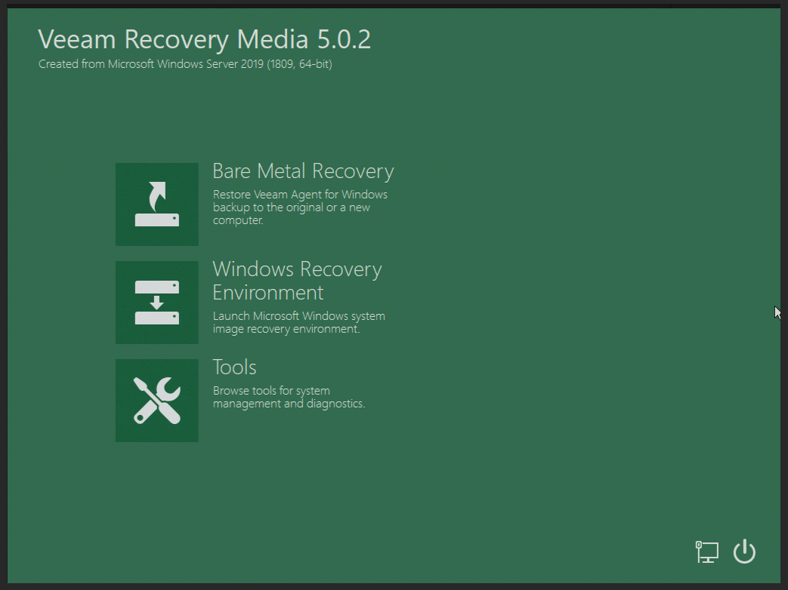
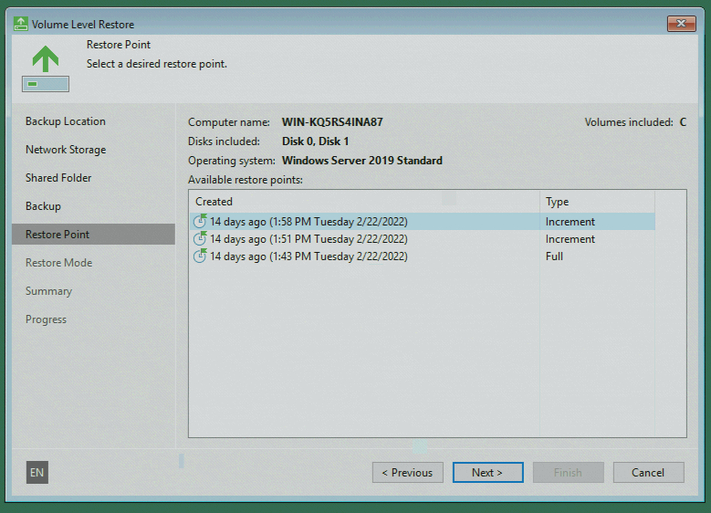

## Introduction

Due to various events, you may need to restore a Windows device to the bare-metal level.

For example, if system-relevant components are affected, and you have no possibility to use [Veeam Microsoft Windows Agent for recovery](/tutorials/getting-started-with-veeam/restoring-files-with-the-veeam-agent-for-linux).

Before getting started, please also see the [series index](/tutorials/getting-started-with-veeam/) and their information.

**Prerequisites**

* Any Microsoft Windows device on which you have already created backups with Veeam and now want to restore files from it

## Step 1 - Get Started with the Veeam Recovery Image

To perform the recovery on bare-metal level, you need the Veeam Recovery Image or also known as Veeam Recovery Media.

Unfortunately, there is no generic download for the Veeam Recovery Media, as there is for Linux servers. The image must be created on the device (among other things, for driver compatibility).

Then copy the image to a USB stick using a tool of your choice. For use on a dedicated Hetzner root server, you can submit the image to support when requesting a KVM console; more information can be found in the Hetzner Docs: [docs.hetzner.com/robot/dedicated-server/maintainance/kvm-console/](https://docs.hetzner.com/robot/dedicated-server/maintainance/kvm-console/#using-a-usb-stick)

Now boot directly from the USB stick at the next server start to load the live environment (Windows PE) of the image.

To go on, please select "Bare Metal Recovery".

## Step 2 - The Recovery Environment

After you select the "Bare Metal Recovery" option, the recovery agent will open. You already know the user interface from using Veeam Agent for Microsoft Windows. 

In the following, I will guide you through the steps in this guide.

**Backup Location**

The first thing you need to do is to choose the location where your backups are located. Usually, they are saved on a network storage.
Select the option that applies to your case and continue.

**Storage Provider**

Then you will get an overview of the option, which storage providers are available. Select the correct option at this point.

In this tutorial series, we have used Samba-based shared folders and therefore select the first option.

**Login Credentials**

Now you can enter the access data for your network storage. In most cases, the recovery environment already has a network connection and a valid IP address, as this information is stored in the image when the Veeam Recovery Media is created.

If you do not have network access, you can adjust the network settings in the previous point by clicking on the small blue link at the bottom right: "Configure network settings".

## Step 3 - Restoring a Backup Point

If the access data from the previous point is correct, you will now receive an overview of the backups in the selected storage provider. 

Select the backup that contains the data of the computer you want to restore. If you continue, you will now get an overview of all available backup points, which you can select for recovery.

## Step 4 - Finalize the Recovery

Now the recovery of the backup to bare metal level starts. Data recovery may take several hours depending on the selected storage endpoint and data size.

When the recovery is successfully completed, you will be asked to restart the computer. Depending on which partitions you have restored, the server will start again without problems or may need an update of the bootloader to start correctly again.

## Conclusion

Please note that successful data recovery depends on several factors and this guide is intended to demonstrate only basic recovery functionality.

### Additional Information

You can also find the official guide of the Veeam Recovery Media in the Veeam Help Center: [helpcenter.veeam.com/docs/agentforwindows/userguide/image_boot.html](https://helpcenter.veeam.com/docs/agentforwindows/userguide/image_boot.html?ver=50)

##### License: MIT

<!--

Contributor's Certificate of Origin

By making a contribution to this project, I certify that:

(a) The contribution was created in whole or in part by me and I have
    the right to submit it under the license indicated in the file; or

(b) The contribution is based upon previous work that, to the best of my
    knowledge, is covered under an appropriate license and I have the
    right under that license to submit that work with modifications,
    whether created in whole or in part by me, under the same license
    (unless I am permitted to submit under a different license), as
    indicated in the file; or

(c) The contribution was provided directly to me by some other person
    who certified (a), (b) or (c) and I have not modified it.

(d) I understand and agree that this project and the contribution are
    public and that a record of the contribution (including all personal
    information I submit with it, including my sign-off) is maintained
    indefinitely and may be redistributed consistent with this project
    or the license(s) involved.

Signed-off-by: Marcel Deglau <marcel.deglau@hetzner.com>

-->
