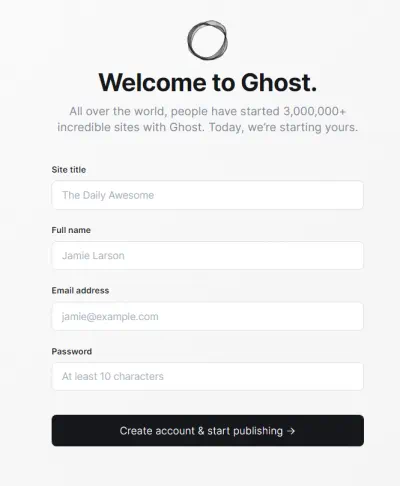

## Introduction

In this tutorial we will set up a Ghost CMS on Hetzners [Ampere Altra processors](https://amperecomputing.com/en/press/hetzner--first-european-hoster-with-ampere-altra-based-dedicated-servers).  Hosting Ghost on Hetzner smallest arm64 VPS will get you two vCPU and 4GB RAM - a very high-performance Ghost installation. 

**Prerequisites**

* Provisioned Hetzner CAX11 arm64 VPS, available in Falkenstein Datacenter, with Debian 11.
* Connected to VPS over SSH as root.
  
* A domin name, ex mysite.com, with a DNS A-record pointing to the Hetzner VPS IP-adress.
* Updated Debian 11 Linux with some additional packages..

  ```bash
  apt update ; apt upgrade
  apt-get install ca-certificates curl gnupg ufw joe nginx
  ```

## Step 1 - Create local user ghostadmin

This tutorial uses `ghostadmin` as local user

```bash
adduser ghostadmin
usermod -aG sudo ghostadmin
```

Logout `root` and log back in over SSH as user `ghostadmin`

## Step 2 - Install Docker

We will be running Ghost and mySQL in Docker containers, with a standard install of nginx as reverse proxy and web server.


 ```bash
curl -fsSL https://download.docker.com/linux/debian/gpg | sudo gpg --dearmor -o /etc/apt/keyrings/docker.gpg
sudo chmod a+r /etc/apt/keyrings/docker.gpg
echo   "deb [arch="$(dpkg --print-architecture)" signed-by=/etc/apt/keyrings/docker.gpg] https://download.docker.com/linux/debian \
"$(. /etc/os-release && echo "$VERSION_CODENAME")" stable" |   sudo tee /etc/apt/sources.list.d/docker.list > /dev/null
sudo apt-get update
sudo apt-get install docker-ce docker-ce-cli containerd.io docker-buildx-plugin docker-compose-plugin
  ```

Check Docker installation with 

```bash
  sudo docker run hello-world
```
add your user `ghostadmin` to docker group so you can run Docker commands without sudo
```bash
  sudo usermod -aG docker ghostadmin
```
Log out and log back in again to update group memberships.

## Step 2 - Launch Ghost and mySQL in Docker

Create a directory in  `/home/ghostadmin`  

```bash
mkdir ghostcms
cd ghostcms
joe docker-compose.yml  #or your favourit editor
```

In the docker-compose.yml file below notice 
- the ``volumes:`` section where ``/var/lib/ghost/content`` maps to a folder in your $HOME directory, ex ``/home/ghostadmin/ghostcms/content`` 
- the  ``[VeryLongComplexPassword]`` which must be the same in ``ghost`` and ``db`` sections.


Here's the Docker Compose file docker-compose.yml 

```yaml
version: "3.7"
 
services:
  ghost:
    image: ghost:5-alpine
    restart: always
    ports:
      -  2368:2368
    expose:
      - 2368
    environment:
      database__connection__host: db
      database__connection__user: root
      database__connection__password: [VeryLongComplexPassword]
      database__connection__datbase: ghost
      url: https://mysite.com
    links:
      -  db
    volumes:
      -  /home/ghostadmin/ghostcms/content:/var/lib/ghost/content
    depends_on:
      -  db
  db:
    image: arm64v8/mysql:8
    restart: always
    environment:
      MYSQL_ROOT_PASSWORD: [ExtremelyComplexRootPassword]
      MYSQL_DATABASE: ghost
      MYSQL_USER: ghost
      MYSQL_PASSWORD: [VeryLongComplexPassword]
    volumes:
      - mysql-data:/var/lib/mysql
 
volumes:
  mysql-data:
  ghost-data:  
 
```

Launch Ghost and mySQL and deamonize (run in background) with

```bash
docker compose up -d
```
Check that everything is OK with ``docker ps`` - you should see

```bash
CONTAINER ID   IMAGE             COMMAND                  CREATED        STATUS        PORTS                                       NAMES
4ae328d5281a   ghost:5-alpine    "docker-entrypoint.s…"   1 minute ago   Up 1 minute   0.0.0.0:2368->2368/tcp, :::2368->2368/tcp   ghost-docker-ghost-1
c47c72ae2adb   arm64v8/mysql:8   "docker-entrypoint.s…"   1 minute ago     Up 1 minute   3306/tcp, 33060/tcp                         ghost-docker-db-1
```

## Step 3 - Configure nginx as reverse proxy

```bash
cd /etc/nginx
sudo rm sites-enabled/default
sudo rm sites-available/default
sudo joe sites-available/mysite.conf #use any editor...
```

Edit `server_name` to match your domain name


```nginx
server {

 # Port 80 initally, SSL will be enabled by Certbot 

    listen 80;
    listen [::]:80;
    server_name mysite.com;

# Housekeeping

    server_tokens off;
    client_max_body_size 1g;

# Certbot stuff

   location ~ /.well-known {
        allow all;
    }
 
# Block evildoers

    location ~* \.(aspx|php|jsp|cgi)$
    {
      deny all;
    }

# Enable gzip compression

    gzip on;
    gzip_min_length  1000;
    gzip_vary on;
    gzip_comp_level 6;
    gzip_proxied any;
    gzip_types text/plain text/css application/json application/javascript application/x-javascript text/javascript image/svg+xml;
    gzip_buffers 16 4k; 
    gzip_disable "msie6";
 
 # Reverse proxy to Ghost in docker running on port 2368
  
    location / {
        proxy_set_header X-Forwarded-For $proxy_add_x_forwarded_for;
        proxy_set_header X-Forwarded-Proto $scheme;
        proxy_set_header X-Real-IP $remote_addr;
        proxy_set_header Host $http_host;
        proxy_pass http://127.0.0.1:2368;
  
    }
 
}


```

Symlink this file to `/etc/nginx/sites-enabled`

```bash
sudo ln -s /etc/nginx/sites-available/mysite.conf /etc/nginx/sites-enabled/
```

Check that everything is OK and reload nginx

```bash
sudo nginx -t
sudo systemctl reload nginx
```

Ghost should now be available at http://mysite.com on port 80, your browser may not allow non-SSL access on port 80. So we need to get a SSL certificate. 

## Enable SSL with Certbot

Certbot can provide [wildcard certificates for all domains](https://certbot.eff.org/instructions?ws=other&os=snap&tab=wildcard) under *.mysite.com, this involves creating two TXT records in your DNS domain admin. In this tutorial we will only create a certificate for single domain. 

Install Certbot as a Snap package with 

```bash
sudo apt install snapd
sudo snap install core; sudo snap refresh core
sudo snap install --classic certbot
sudo ln -s /snap/bin/certbot /usr/bin/certbot
```
Run Certbot to create a certificate for mysite.com

```bash
sudo certbot --nginx
```

If everything works out fine you will find these lines added to mysite.conf and a new server section for port 80

```bash
    listen [::]:443 ssl ipv6only=on; # managed by Certbot
    listen 443 ssl; # managed by Certbot
    ssl_certificate /etc/letsencrypt/live/mysite.com/fullchain.pem; # managed by Certbot
    ssl_certificate_key /etc/letsencrypt/live/mysite.com/privkey.pem; # managed by Certbot
    include /etc/letsencrypt/options-ssl-nginx.conf; # managed by Certbot
    ssl_dhparam /etc/letsencrypt/ssl-dhparams.pem; # managed by Certbot
```

You should now be able to access Ghost on https://mysite.com - set up an admin user on https://mysite.com/ghost and you're done!




## Post-installation security updates

* [Secure your ssh server](https://www.makeuseof.com/ways-to-secure-ssh-connections-linux/) - disabling root logins etc

* Enable UFW Firewall

```bash
sudo ufw default deny incoming
sudo ufw default allow outgoing
sudo ufw allow SSH
sudo ufw allow 'Nginx Full'
sudo ufw enable
```

## Conclusion

You now have a self-hosted Ghost blog up and running on Hetzners new arm64 platform.

Additional information can be found at [Ghost official support](https://ghost.org/docs/hosting/) pages 


##### License: MIT

<!--

Contributor's Certificate of Origin

By making a contribution to this project, I certify that:

(a) The contribution was created in whole or in part by me and I have
    the right to submit it under the license indicated in the file; or

(b) The contribution is based upon previous work that, to the best of my
    knowledge, is covered under an appropriate license and I have the
    right under that license to submit that work with modifications,
    whether created in whole or in part by me, under the same license
    (unless I am permitted to submit under a different license), as
    indicated in the file; or

(c) The contribution was provided directly to me by some other person
    who certified (a), (b) or (c) and I have not modified it.

(d) I understand and agree that this project and the contribution are
    public and that a record of the contribution (including all personal
    information I submit with it, including my sign-off) is maintained
    indefinitely and may be redistributed consistent with this project
    or the license(s) involved.

Signed-off-by: Magnus Helander (magnus@helander.stream)

-->
