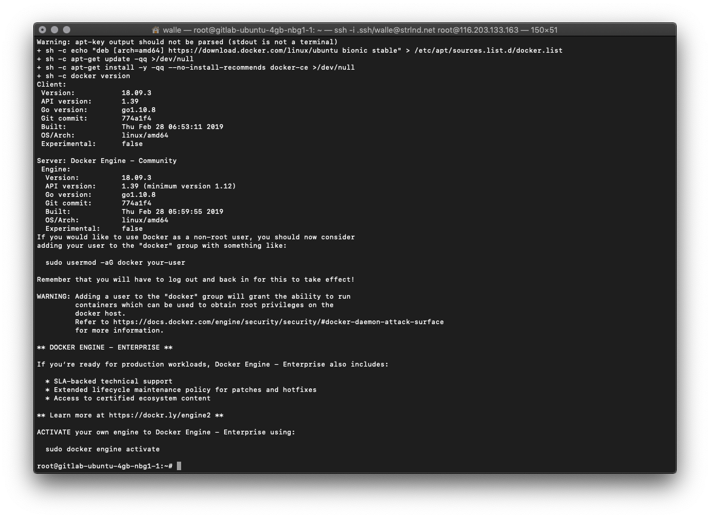
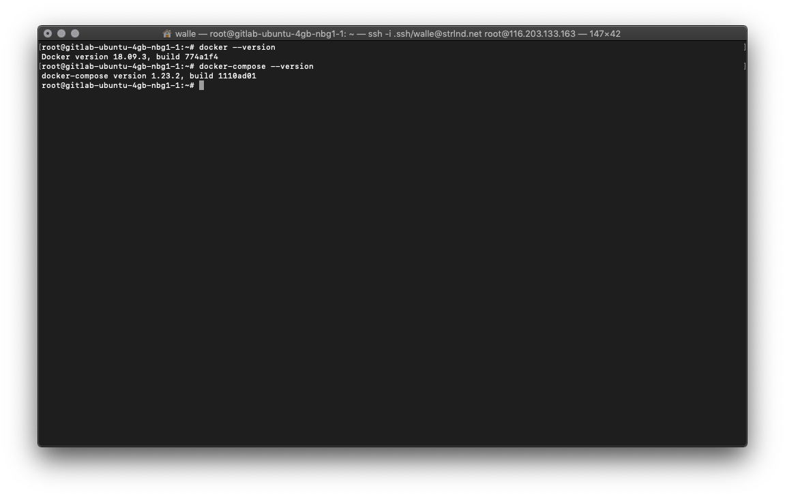
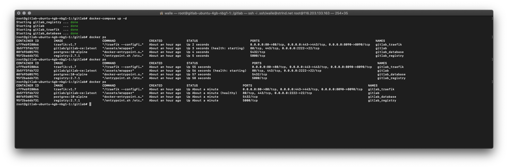

## Introduction

In this tutorial, I will show you how to set up a GitLab CE server on a Hetzner Cloud server using docker and docker-compose. As reverse proxy and to provide a LetsEncrypt certificate we use Traefik. Also, we provide a docker image registry with GitLab.

**Prerequisites**

- A Hetzner Cloud machine (I recommend at least the CX21 instance).
- A domain under which we later reach our GitLab server and the docker image registry.
- Ubuntu 18.04 as the operating system.

## Step 1 - Install docker and docker-compose

Before we start, we update the system:

```bash
apt update && apt upgrade -y
```

Now we install docker and docker-compose. For docker, there is a handy install script at get.docker.com.

First, we download the script using curl:

```bash
curl -fsSL https://get.docker.com -o get-docker.sh
```

We then execute it:

```bash
sh get-docker.sh
```

The installation should look like this:



Now we have to install `docker-compose`, for this we simply download the binary:

```bash
curl -L "https://github.com/docker/compose/releases/download/1.23.2/docker-compose-$(uname -s)-$(uname -m)" -o /usr/local/bin/docker-compose
```

Make it executable:

```bash
chmod +x /usr/local/bin/docker-compose
```

Now we can check that everything is installed correctly:

```bash
docker --version
docker-compose --version
```

It should look something like this:



If it does then we are done with the prepatory work, and we can proceed with the next step.

## Step 2 - Create a docker-compose file

To make it easier for us to manage GitLab and updates later on, we use docker-compose to run our docker containers.

For this we now create our `docker-compose.yaml` file:

```bash
mkdir gitlab
touch gitlab/docker-compose.yaml
vim gitlab/docker-compose.yaml
```
> You can also use `nano` or any other text editor, but I prefer `vim`.

In our case we use local docker volumes to persist our data. For this we use the root path `/srv/docker/volumes/`. Of course you can change this path as well as most other settings.

Now we add / edit the following content:

```yaml
version: '3'

services:
  gitlab:
    image: 'gitlab/gitlab-ce:latest'
    container_name: gitlab
    restart: unless-stopped
    hostname: 'gitlab.example.com'          # Change host here
    environment:
      GITLAB_OMNIBUS_CONFIG: |
        external_url 'https://gitlab.example.com'       # Change url here
        nginx['listen_port'] = 80
        nginx['listen_https'] = false
        nginx['proxy_set_headers'] = {
          "X-Forwarded-Proto" => "https",
          "X-Forwarded-Ssl" => "on"
        }
        # DATABASE CONNECTION SETTINGS: in our case we use postgresql as database
        gitlab_rails['db_adapter'] = "postgresql"
        gitlab_rails['db_database'] = "gitlab"
        gitlab_rails['db_username'] = "postgres"
        gitlab_rails['db_password'] = "CHANGE_TO_RANDOM_PASSWORD" # set the database password here
        gitlab_rails['db_host'] = "gitlab_database"

        # GITLAB DOCKER IMAGE REGISTRY: so that we can use our docker image registry with gitlab
        registry['enable'] = false # we do not activate this option because we provide our own registry
        gitlab_rails['registry_enabled'] = true
        gitlab_rails['registry_host'] = "registry.gitlab.example.com"                       # Change registry host here
        gitlab_rails['registry_api_url'] = "https://registry.gitlab.example.com"            # Change registry url here
        gitlab_rails['registry_issuer'] = "gitlab-issuer"

        # SMTP SETTINGS: So that gitlab can send emails. In our case we send via google mail.
        gitlab_rails['smtp_enable'] = true
        gitlab_rails['smtp_address'] = "smtp.gmail.com"
        gitlab_rails['smtp_port'] = 587
        gitlab_rails['smtp_user_name'] = "gitlab@example.com"
        gitlab_rails['smtp_password'] = "xxxx"
        gitlab_rails['smtp_domain'] = "smtp.gmail.com"
        gitlab_rails['smtp_authentication'] = "login"
        gitlab_rails['smtp_enable_starttls_auto'] = true
        gitlab_rails['smtp_tls'] = false
        gitlab_rails['smtp_openssl_verify_mode'] = "peer"
    ports:
      - "2222:22"
    networks:
      - traefik_gitlab_net
      - gitlab_net
    volumes:
      - /srv/docker/volumes/gitlab/config:/etc/gitlab
      - /srv/docker/volumes/gitlab/logs:/var/log/gitlab
      - /srv/docker/volumes/gitlab/data:/var/opt/gitlab
      - /srv/docker/volumes/registry/certs:/certs
    labels:
      - "traefik.enable=true"
      - "traefik.gitlab.port=80"
      - "traefik.gitlab.backend=gitlab"
      - "traefik.gitlab.frontend.rule=Host:gitlab.example.com"      # Change host here
      - "traefik.gitlab.frontend.entryPoints=http,https"
      - "traefik.docker.network=gitlab_traefik_gitlab_net"

  registry:
    restart: unless-stopped
    image: registry:2.7
    container_name: gitlab_registry
    volumes:
     - /srv/docker/volumes/registry/data:/registry
     - /srv/docker/volumes/registry/certs:/certs
    labels:
    - "traefik.enable=true"
    - "traefik.frontend.rule=Host:registry.gitlab.example.com"      # Change registry host here
    - "traefik.port=5000"
    - "traefik.backend=gitlab-registry"
    - "traefik.frontend.entryPoints=http,https"
    networks:
      - traefik_gitlab_net
    environment:
      REGISTRY_LOG_LEVEL: debug
      REGISTRY_STORAGE_FILESYSTEM_ROOTDIRECTORY: /registry
      REGISTRY_AUTH_TOKEN_REALM: https://gitlab.example.com/jwt/auth    # Change url here
      REGISTRY_AUTH_TOKEN_SERVICE: container_registry
      REGISTRY_AUTH_TOKEN_ISSUER: gitlab-issuer
      REGISTRY_AUTH_TOKEN_ROOTCERTBUNDLE: /certs/gitlab-registry.crt
      REGISTRY_STORAGE_DELETE_ENABLED: 'true'

  database:
    image: postgres:10-alpine
    container_name: gitlab_database
    restart: unless-stopped
    networks:
      - gitlab_net
    environment:
      POSTGRES_PASSWORD: "SAME_PASSWORD_AS_ABOVE" # use the same password as the one you used above
      POSTGRES_DB: gitlab
    volumes:
      - /srv/docker/volumes/gitlab/database:/var/lib/postgresql/data

  traefik:
    container_name: gitlab_traefik
    restart: unless-stopped
    image: traefik:v1.7
    command:
        --configFile=/var/traefik/traefik.toml
    ports:
      - "443:443"
      - "80:80"
      - "8090:8090"
    networks:
      - traefik_gitlab_net
    volumes:
      - /var/run/docker.sock:/var/run/docker.sock
      - ./traefik.toml:/var/traefik/traefik.toml:ro
      - /srv/docker/volumes/traefik/log:/log

networks:
  traefik_gitlab_net:
  gitlab_net:
```

All processed? That's it, and we can move on to the next step.

## Step 3 - Configure Traefik

Since we use traefik as a reverse proxy, we have to create a configuration file for it. All other settings for traefik are defined in `docker-compose.yaml`

```bash
vim gitlab/traefik.toml
```

Now we add the following content:

```yaml
defaultEntryPoints = ["http", "https"]

[entryPoints]
  [entryPoints.http]
  address = ":80"
  [entryPoints.http.redirect]
    entryPoint = "https"
  [entryPoints.https]
  address = ":443"
    [entryPoints.https.tls]

[acme]
email = "acme@example.com" # please change this to the email address you want to use to apply for letsencrypt certificates.
storage = "acme.json"
entryPoint = "https"
OnHostRule = true
acmeLogging = true
[acme.httpChallenge]
  entryPoint = "http"

## if you want you can activate access to the traefik dashbord here. You can then access the dashboard at http://gitlab.example.com:8090
#[web]
#address = ":8090"
#[web.auth.basic]
#users = ["user:encryped_password"]

[docker]
endpoint = "unix:///var/run/docker.sock"
watch = true
exposedbydefault = false
```

> Don't forget to make DNS entries for your domain. Otherwise, the certificate can't be issued in the next step (we use HTTP validation).

## Step 4 - Start the server

There's not much left. If the DNS entries point to our server, we can now continue with the following points.

First we switch to our `gitlab` directory, if we are not already there:

```bash
cd gitlab
```

Let's download all the docker images we need:

```bash
docker-compose pull
```

Start everything:

```bash
docker-compose up -d
```

If we configured everything correctly, the GitLab server, the database, the docker registry, and our reverse proxy should start now.

GitLab itself needs some time for the bootstrap process. We can check the status with `docker ps`


> (health: starting) should switch to (healthy)

Don't worry if the registry container is hanging in a restart loop; we'll get to that in Step 5.

When everything is ready, we should reach GitLab on gitlab.example.com. Now we can go to the next step.

## Step 5: Prepare the registry

For GitLab and our Docker Image Registry to communicate with each other, we need a shared certificate. The good thing is, GitLab creates a key for us at bootstrap, only the registry doesn't know about it yet.

What we have to do is copy the certificate key created by GitLab into the volume of the registry and create a certificate out of it. Let's do it:

```
cd /srv/docker/volumes/registry/certs/
docker cp gitlab:/var/opt/gitlab/gitlab-rails/etc/gitlab-registry.key .
openssl req  -key gitlab-registry.key -new -subj "/CN=gitlab-issuer" -x509 -days 365 -out gitlab-registry.crt
```

After a minute the docker image registry should now be available, and we can use it with GitLab.

## Conclusion

We can now reach GitLab at `gitlab.example.com`. At the beginning we are asked to assign a password, the default user is `root`. I recommend to create a new user and deactivate root after the first login.

Now have fun with your GitLab server!

#### Appendix: Updating GitLab

Since we use the image tag `:latest` in our `docker-compose.yaml` file for GitLab, we only have to perform the following steps for an update:

```bash
cd /gitlab
docker-compose pull     # download the current image from the docker hub image registry
docker-compose up -d    # replaces the containers with a new image.
```

> GitLab needs a little time to start again; then you should be working on the latest version.

##### License: MIT

<!---

Contributors's Certificate of Origin

By making a contribution to this project, I certify that:

(a) The contribution was created in whole or in part by me and I have
    the right to submit it under the license indicated in the file; or

(b) The contribution is based upon previous work that, to the best of my
    knowledge, is covered under an appropriate license and I have the
    right under that license to submit that work with modifications,
    whether created in whole or in part by me, under the same license
    (unless I am permitted to submit under a different license), as
    indicated in the file; or

(c) The contribution was provided directly to me by some other person
    who certified (a), (b) or (c) and I have not modified it.

(d) I understand and agree that this project and the contribution are
    public and that a record of the contribution (including all personal
    information I submit with it, including my sign-off) is maintained
    indefinitely and may be redistributed consistent with this project
    or the license(s) involved.

Signed-off-by: Elias Wallat <hello@strlnd.net>

-->
