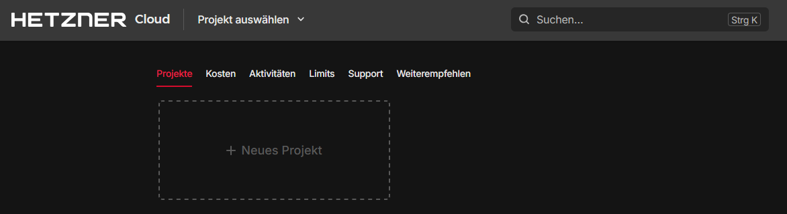

## Einführung

Manchmal braucht man schnell einen Cloud-Server für temporäre Aufgaben - sei es für Tests von einer anderen IP-Adresse aus, für kurzzeitige Rechenaufgaben oder zum Aufsetzen einer vorübergehenden Entwicklungsumgebung. Das manuelle Erstellen und Verwalten solcher temporären Server über die Benutzeroberflächen verschiedener Cloud-Anbieter kann jedoch zeitaufwendig und fehleranfällig sein.

Genau hier kommt [GMAB (Give Me A Box)](https://github.com/superfishlu/gmab) ins Spiel. GMAB ist ein praktisches Kommandozeilen-Tool, das die Erstellung, Verwaltung und Bereinigung temporärer Cloud-Instanzen bei verschiedenen Anbietern, darunter auch Hetzner Cloud, erheblich vereinfacht. Das Tool ist besonders nützlich für:

- Bug Bounty Hunting über verschiedene IP-Adressen
- Web Scraping oder Tests aus unterschiedlichen Regionen
- Ausführen temporärer Workloads ohne manuelle Aufräumarbeiten
- Entwicklungsumgebungen, die nicht dauerhaft bestehen müssen
- Schnellen Zugriff auf Rechenressourcen an verschiedenen geografischen Standorten

In diesem Tutorial liegt unser Fokus auf der Verwendung von GMAB mit Hetzner Cloud. Wir behandeln alles von der Installation und Konfiguration bis hin zu typischen Anwendungsszenarien.

## Voraussetzungen

Bevor du mit GMAB loslegen kannst, brauchst du:

* Locales System
  * [Python 3.7 oder höher](https://www.python.org/downloads/) bereits installiert
  * Pip (Python-Paketmanager)
  * Ein [SSH-Schlüsselpaar](https://community.hetzner.com/tutorials/howto-ssh-key/de) (`ed25519` wird empfohlen)

<br>

* Einen Hetzner Cloud Account

## Schritt 1 - Installation von GMAB

GMAB lässt sich direkt von PyPI (Python Package Index) mit pip installieren. Öffne das Terminal und führe einen der folgenden Befehle aus:

Für eine systemweite Installation:

```bash
pip install gmab
```

Für eine Installation nur für den aktuellen Benutzer (ohne Administratorrechte):

```bash
pip install --user gmab
```

Prüfe nach der Installation, ob GMAB korrekt eingerichtet wurde:

```bash
gmab --help
```

Wenn alles geklappt hat, sollte das Hilfemenü mit den verfügbaren Befehlen und Optionen angezeigt werden.

## Schritt 2 - Einrichtung eines Hetzner Cloud Projekts und API-Tokens

Bevor du GMAB konfigurierst, musst du Hetzner Cloud entsprechend einrichten, indem du ein dediziertes Projekt erstellst und einen API-Token generierst.

### Erstellen eines dedizierten Projekts

1. Melde dich in der Hetzner Cloud Console an unter [console.hetzner.cloud](https://console.hetzner.cloud/)

2. Klicke auf die Schaltfläche **+ Neues Projekt** :
   
   

3. Nenne das Projekt **gmab** (oder einen anderen Namen nach Wahl)
   
   

4. Klicke auf **Projekt hinzufügen**, um das Projekt zu erstellen und zu öffnen

### Generieren eines API-Tokens

Innerhalb des neuen Projekts kannst du nun einen API-Token generieren, wie in der offiziellen Dokumentation erklärt: [API-Token hinzufügen](https://docs.hetzner.com/de/cloud/api/getting-started/generating-api-token)

## Schritt 3 - Konfiguration von GMAB

Nachdem du ein Hetzner Cloud Projekt und einen API-Token hast, kannst du GMAB für die Verwendung mit Hetzner Cloud konfigurieren.

### Erste Konfiguration

Führe den Konfigurationsassistenten aus:

```bash
gmab configure
```

Das Tool führt durch einen interaktiven Konfigurationsprozess. Wenn du aufgefordert wirst Hetzner zu konfigurieren, wähle "y" und gebe deinen API-Token ein:

```shellsession
$ gmab configure
Using config directory: /home/user/.config/gmab

Configuring general settings:
SSH public key path [~/.ssh/id_ed25519.pub]: 
Default instance lifetime (minutes) [60]: 
Default provider (linode, aws, hetzner) [linode]: hetzner

Do you want to configure linode? [Y/n]: n

Do you want to configure aws? [Y/n]: n

Do you want to configure hetzner? [Y/n]: y

Configuring hetzner provider:
API Key: your-hetzner-api-token-here
Default region [nbg1]: 
Default image [ubuntu-22.04]: ubuntu-24.04
Default instance type [cpx11]: 

Configuration completed successfully!
```

### Konfigurationsoptionen verstehen

Während der Konfiguration gibt es mehrere Anpassungsmöglichkeiten:

| Option               | Beschreibung |
| -------------------- | ------------ |
| SSH-Schlüssel-Pfad   | Dies ist der Pfad zum öffentlichen SSH-Schlüssel, der auf jede neue Instanz hochgeladen wird, damit du eine sichere Verbindung herstellen kannst. Der Standardspeicherort ist `~/.ssh/id_ed25519.pub`, es kann jedoch ein anderer Schlüssel angeben werden, wenn nötig. |
| Standard-Lebensdauer | Die Standard-Lebensdauer in Minuten, bevor Instanzen als "abgelaufen" betrachtet werden. Der Standardwert beträgt 60 Minuten, der Wert kann jedoch basierend auf den typischen Nutzungsmustern höher oder niedriger einstellen. |
| Standard-Region      | Hetzner Cloud verfügt über mehrere verfügbare Regionen (siehe [diese Liste](https://docs.hetzner.com/de/cloud/general/locations/#welche-standorte-gibt-es)). Wenn du häufig mit einer bestimmten Region arbeitest, stelle diese als Standard ein. |
| Standard-Instanztyp  | Hetzner bietet verschiedene Instanztypen an (siehe [diese Liste](https://www.hetzner.com/cloud/#pricing)). |

## Schritt 4 - Erstellen Ihrer ersten Instanz

Nachdem GMAB konfiguriert ist, erstellen wir die erste Hetzner Cloud Instanz.

### Grundlegende Instanzerstellung

Um eine Hetzner Cloud Instanz mit den Standardeinstellungen zu erstellen:

```bash
gmab spawn
```

Wenn Hetzner nicht dein Standard-Anbieter ist, gebe den Anbieter mit dem Flag `-p` an:

```bash
gmab spawn -p hetzner
```

Es wird eine Ausgabe ähnlich wie diese angezeigt:

```shellsession
Spawned 'hetzner' instance:
  ID: 12345678
  Label: gmab-abc123def456
  IP: 192.168.1.100
  Connect via: ssh root@192.168.1.100
```

### Anpassen Ihrer Instanz

GMAB ermöglicht es, Standardwerte beim Erstellen einer Instanz zu überschreiben:

```bash
# Eine andere Region angeben
gmab spawn -p hetzner -r hel1

# Ein anderes Image angeben
gmab spawn -p hetzner -i ubuntu-24.04

# Instanz-Lebensdauer angeben (in Minuten)
gmab spawn -p hetzner -t 120  # 2 Stunden Lebensdauer

# Optionen kombinieren
gmab spawn -p hetzner -r fsn1 -i debian-12 -t 180
```

### Verbindung zu Ihrer Instanz herstellen

Sobald die Instanz läuft, verbinde dich über SSH:

```bash
ssh root@<ip-adresse>
```

Ersetze `<ip-adresse>` durch die IP-Adresse aus der Ausgabe des spawn-Befehls.

## Schritt 5 - Verwalten Ihrer Instanzen

GMAB bietet Befehle, die bei der Verwaltung der temporären Instanzen helfen.

### Auflisten aller Instanzen

Um alle aktiven Hetzner-Instanzen anzuzeigen:

```bash
gmab list -p hetzner
```

Beispielausgabe:

```shell
Provider    Instance ID     Label                IP Address       Status              Region    Image            Time Left
============================================================================================================
hetzner     12345678        gmab-abc123def456    192.168.1.100    running             nbg1      ubuntu-22.04     45m
hetzner     98765432        gmab-ghi789jkl012    10.0.0.100       running             hel1      ubuntu-22.04     15m
hetzner     56781234        gmab-mno345pqr678    10.0.2.200       running (expired)   fsn1      debian-11        expired
```

Die Spalte `Time Left` zeigt, wie viel Zeit verbleibt, bevor die Instanz als abgelaufen betrachtet wird.

### Den Ablaufmechanismus verstehen

Ein Hauptmerkmal von GMAB ist der Ablaufmechanismus. So funktioniert er:

1. Wenn du eine Instanz erstellt, gebe eine Lebensdauer in Minuten an (Standard ist 60)
2. GMAB verfolgt diese Lebensdauer und markiert Instanzen als "abgelaufen", sobald die Zeit abgelaufen ist
3. **Wichtig: GMAB löscht abgelaufene Instanzen NICHT automatisch**
4. Du musst explizit einen Befehl ausführen, um abgelaufene Instanzen zu löschen

Dieses Design gibt die Kontrolle darüber, wann Instanzen tatsächlich gelöscht werden, und verhindert unerwartete Unterbrechungen, während du sie noch verwendest.

### Löschen von Instanzen

Um eine bestimmte Instanz zu löschen:

```bash
gmab terminate 12345678  # Verwendung der Instanz-ID
```

Oder:

```bash
gmab terminate gmab-abc123def456  # Verwendung des Labels
```

Um mehrere Instanzen gleichzeitig zu löschen:

```bash
gmab terminate 12345678 98765432
```

#### Löschen aller Instanzen

Um alle Hetzner-Instanzen zu löschen:

```bash
gmab terminate all -p hetzner
```

Du wirst zur Bestätigung aufgefordert:

```shellsession
The following instances will be terminated:
- 12345678 (hetzner: gmab-abc123def456)
- 98765432 (hetzner: gmab-ghi789jkl012)
- 56781234 (hetzner: gmab-mno345pqr678)
Do you want to proceed? [y/N]: 
```

#### Löschen abgelaufener Instanzen

Die häufigste Bereinigungsaufgabe ist das Löschen abgelaufener Instanzen:

```bash
gmab terminate expired -p hetzner
```

Auch hier erhältst du eine Bestätigungsaufforderung:

```shellsession
The following expired instances will be terminated:
- 56781234 (hetzner: gmab-mno345pqr678)
Do you want to proceed? [y/N]: 
```

#### Verwendung des -y Flags für automatisierte Bereinigung

Für Skripte oder automatisierte Aufgaben kannst du das `-y` Flag verwenden, um Bestätigungsaufforderungen zu umgehen:

```bash
gmab terminate expired -p hetzner -y
```

Dies ist besonders nützlich für geplante Bereinigungsaufgaben, wie wir im nächsten Abschnitt sehen werden.

## Schritt 6 - Automatisieren der Bereinigung

Da GMAB abgelaufene Instanzen nicht automatisch löscht, ist es sinnvoll, eine geplante Bereinigung einzurichten, um unnötige Kosten zu vermeiden.

### Einrichten eines Cron-Jobs (Linux/macOS)

1. Öffne die crontab-Datei:
   
   ```bash
   crontab -e
   ```

2. Füge eine Zeile hinzu, um den Bereinigungsbefehl regelmäßig auszuführen:
   
   ```shellsession
   # Jede Stunde abgelaufene Instanzen löschen
   0 * * * * gmab terminate expired -y
   ```
   
   Dieser Job läuft jede Stunde zur vollen Stunde. Für eine weniger häufige Bereinigung:
   
   ```shellsession
   # Täglich um Mitternacht ausführen
   0 0 * * * gmab terminate expired -y
   ```

### Verwendung des Windows Task Schedulers

Unter Windows kannst du den Task Scheduler nutzen:

1. Erstelle eine Batch-Datei (z.B. `gmab-cleanup.bat`) mit folgendem Inhalt:
   
   ```bat
   @echo off
   gmab terminate expired -y
   ```

2. Öffne den Task Scheduler und erstelle eine neue Basisaufgabe
3. Lege fest, dass die Aufgabe nach einem Zeitplan ausgeführt wird (z.B. täglich oder stündlich)
4. Wähle als Aktion die erstellte Batch-Datei aus

## Schritt 7 - Praktische Anwendungsbeispiele

Hier sind einige konkrete Beispiele für den Einsatz von GMAB mit Hetzner Cloud.

* **Beispiel 1:** Schneller Sicherheitstest
  
  Benötigst du einen Sicherheitsscan von einer externen IP aus?
  
  ```bash
  # Erstelle eine Box mit 30 Minuten Lebensdauer
  gmab spawn -p hetzner -t 30
  
  # SSH-Verbindung zur Box herstellen
  ssh root@<ip-adresse>
  
  # Führe deine Sicherheitstools aus
  # ...
  
  # Wenn du fertig bist, lösche die Instanz
  gmab terminate <instanz-id>
  ```

<br>

* **Beispiel 2:** Regionsspezifische Tests
  
  Teste, wie die Website aus verschiedenen Regionen erscheint:
  
  ```bash
  # Instanzen in verschiedenen Regionen erstellen
  gmab spawn -p hetzner -r nbg1 -t 60
  gmab spawn -p hetzner -r hel1 -t 60
  gmab spawn -p hetzner -r ash -t 60
  
  # Führe die Tests von jeder Instanz aus
  # ...
  
  # Aufräumen, wenn du fertig bist
  gmab terminate all -p hetzner -y
  ```

<br>

* **Beispiel 3:** Geplante Aufgaben
  
  Führe regelmäßige Jobs aus, ohne den lokalen Rechner eingeschaltet zu lassen:
  
  ```bash
  # Erstelle eine Box mit längerer Lebensdauer
  gmab spawn -p hetzner -t 1440  # 24 Stunden
  
  # Richte einen geplanten Job auf der Instanz ein
  # ...
  
  # Manuell löschen, wenn du fertig bist
  gmab terminate <instanz-id>
  ```

## Fehlerbehebung

Häufige Probleme:

<table border="1" style="min-width:29rem;">
<tr><th style="text-align: center;">Problem</th>
    <th style="text-align: center;">Beschreibung</th>
    </tr>
<tr><td>Provider 'hetzner' is not configured</td>
        <td>Führe diesen Befehl aus, um die Hetzner-Zugangsdaten einzurichten:<br>
        <div class="card-header" style="margin-top:1rem;margin-bottom:1rem;font-size:14.5px;font-family:Consolas,Monaco,Andale Mono,Ubuntu Mono,monospace;display:inline-block;"> 
        <div>gmab configure -p hetzner
        </div></div></td>
        </tr>
<tr><td>Failed to create server: Invalid API token</td>
        <td>Der Hetzner API-Token ist ungültig oder abgelaufen.
        Erstelle einen neuen Token und aktualisiere die Konfiguration.<br><br></td>
        </tr>
<tr><td>Instanz wird als "abgelaufen" angezeigt, läuft aber noch</td>
        <td>Dies ist ein beabsichtigtes Verhalten. Abgelaufene Instanzen
        laufen weiter, bis sie explizit gelöscht werden.<br><br></td>
        </tr>
<tr><td>SSH key not found</td>
        <td>Überprüfe den Pfad zum öffentlichen SSH-Schlüssel
        in der GMAB-Konfiguration:<br>
        <div class="card-header" style="margin-top:1rem;margin-bottom:1rem;font-size:14.5px;font-family:Consolas,Monaco,Andale Mono,Ubuntu Mono,monospace;display:inline-block;"> 
        <div>gmab configure --print
        </div></div>
        <br><br>Aktualisiere ihn bei Bedarf:<br>
        <div class="card-header" style="margin-top:1rem;margin-bottom:1rem;font-size:14.5px;font-family:Consolas,Monaco,Andale Mono,Ubuntu Mono,monospace;display:inline-block;"> 
        <div>gmab configure -p hetzner
        </div></div>
        </td>
        </tr>
</table>

<br>

## Best Practices

<table border="1" style="min-width:29rem;">
<tr><th style="text-align: center;">Practice</th>
    <th style="text-align: center;">Beschreibung</th>
    </tr>
<tr><td>Sinnvolle Lebensdauern festlegen</td>
        <td>Wähle angemessene Ablaufzeiten entsprechend des tatsächlichen Bedarfs:<br>
        <div class="card-header" style="margin-top:1rem;margin-bottom:1rem;font-size:14.5px;font-family:Consolas,Monaco,Andale Mono,Ubuntu Mono,monospace;display:inline-block;"> 
        <div># Für kurze Tests (30 Minuten)
        <br>gmab spawn -p hetzner -t 30
        <br>
        <br># Für längere Aufgaben (4 Stunden)
        <br>gmab spawn -p hetzner -t 240
        </div></div><br><br></td>
        </tr>
<tr><td>Regelmäßige Bereinigung</td>
        <td>Entweder:
        <ul><li>Richte einen Cron-Job ein, der diesen Befehl regelmäßig ausführt:
        <div class="card-header" style="margin-top:1rem;margin-bottom:1rem;font-size:14.5px;font-family:Consolas,Monaco,Andale Mono,Ubuntu Mono,monospace;display:inline-block;"> 
        <div>gmab terminate expired -y
        </div></div>
        </li>
        <li>Gewöhne dich daran, am Ende der Arbeitssitzung manuell aufzuräumen</li>
        </ul></td>
        </tr>
<tr><td>Sicherheitsempfehlungen</td>
        <td><ul><li>Lege ein dediziertes Hetzner-Projekt speziell für GMAB an</li>
        <li>Verwende einen API-Token mit angemessenen Berechtigungen</li>
        <li>Erneuere den Hetzner API-Token in regelmäßigen Abständen</li>
        <li>Bewahre Konfigurationsdateien an einem sicheren Ort auf</li>
        </ul></td>
        </tr>
<tr><td>Regionale Auswahl</td>
        <td>Wähle Regionen aus, die näher am Zielpublikum oder
        Workload liegen, um eine bessere Leistung zu erzielen.<br></td>
        </tr>
</table>

<br>

## Ergebnis

GMAB mit Hetzner Cloud bietet eine effiziente Möglichkeit, temporäre Instanzen für verschiedene Anwendungsfälle bereitzustellen. Der Ablaufmechanismus hilft dabei, den Überblick über Ressourcen zu behalten, ohne sofortiges Löschen zu erzwingen — das gibt Flexibilität und hilft gleichzeitig, unerwartete Kosten zu vermeiden.

Wichtige Erkenntnisse:
- Instanzen werden nach Ablauf ihrer Lebensdauer als "expired" markiert, laufen aber weiter
- Die Instanzen müssen explizit mit `gmab terminate` gelöscht werden
- Das `-y` Flag umgeht Bestätigungsaufforderungen und ist nützlich für automatisierte Bereinigungen
- Das Einrichten eines Cron-Jobs für regelmäßige Bereinigungen wird dringend empfohlen

Mit diesem Wissen kannst du GMAB effektiv einsetzen, um temporäre Hetzner Cloud Instanzen für deine Projekte, Tests und Arbeitsabläufe zu verwalten.

##### Lizenz: MIT

<!---

Contributors's Certificate of Origin

By making a contribution to this project, I certify that:

(a) The contribution was created in whole or in part by me and I have
    the right to submit it under the license indicated in the file; or

(b) The contribution is based upon previous work that, to the best of my
    knowledge, is covered under an appropriate license and I have the
    right under that license to submit that work with modifications,
    whether created in whole or in part by me, under the same license
    (unless I am permitted to submit under a different license), as
    indicated in the file; or

(c) The contribution was provided directly to me by some other person
    who certified (a), (b) or (c) and I have not modified it.

(d) I understand and agree that this project and the contribution are
    public and that a record of the contribution (including all personal
    information I submit with it, including my sign-off) is maintained
    indefinitely and may be redistributed consistent with this project
    or the license(s) involved.

Signed-off-by: Steve Cannivy <steve@roudeleiw.lu>

-->
