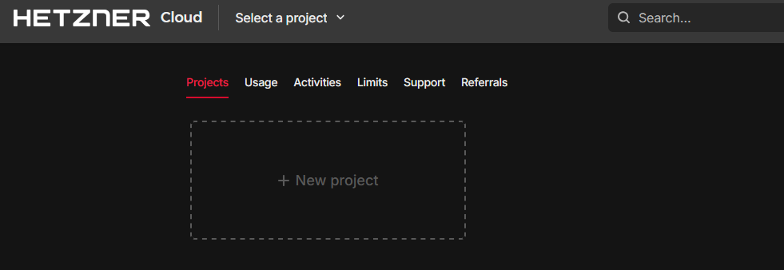
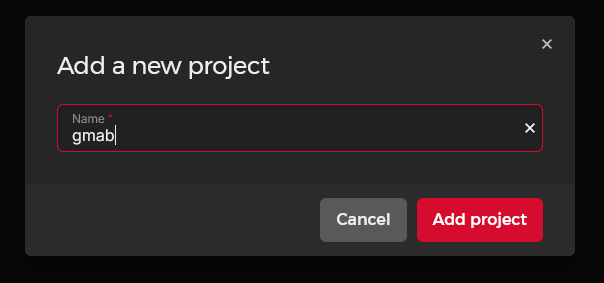

## Introduction

Sometimes you need a quick cloud server for a temporary task - maybe for testing from a different IP address, running a short computational job, or setting up a temporary development environment. Manually creating and managing these temporary servers through cloud provider UIs can become tedious and error-prone.

This is where [GMAB (Give Me A Box)](https://github.com/superfishlu/gmab) comes in. GMAB is a command-line tool that makes it easy to spawn, manage, and clean up temporary cloud instances across multiple providers, including Hetzner Cloud. The tool is particularly useful for:

- Bug bounty hunting from different IP addresses
- Web scraping or testing from various regions
- Running temporary workloads without manual cleanup
- Development environments that don't need to persist
- Quick access to computational resources in different geographic locations

In this tutorial, we'll focus on using GMAB with Hetzner Cloud, covering everything from installation and configuration to daily usage patterns.

**Prerequisites**

Before getting started with GMAB, you'll need:

* Local machine:
  * [Python 3.7 or higher installed](https://www.python.org/downloads/)
  * Pip (Python package manager)
  * An [SSH key pair](https://community.hetzner.com/tutorials/howto-ssh-key) (ed25519 recommended)

<br>

* A Hetzner Cloud account

## Step 1 - Installing GMAB

GMAB can be installed directly from PyPI (Python Package Index) using pip. Open your terminal and run one of the following commands:

For a system-wide installation:

```bash
pip install gmab
```

For a user-specific installation (without admin privileges):

```bash
pip install --user gmab
```

After installation, verify that GMAB installed correctly:

```bash
gmab --help
```

You should see the help menu displaying the available commands and options.

## Step 2 - Setting Up Hetzner Cloud Project and API Token

Before configuring GMAB, you need to set up Hetzner Cloud appropriately by creating a dedicated project and generating an API token.

### Creating a Dedicated Project

1. Log in to your Hetzner Cloud Console at [console.hetzner.cloud](https://console.hetzner.cloud/)

2. Click the **+ New project** button:
   
   

3. Name your project **gmab** (or another name of your choice)
   
   

4. Click **Add project** to create and switch to the new project.

### Generating an API Token

Now that you have a project, you can generate the API token as explained in the official documentation: [Generating an API token](https://docs.hetzner.com/cloud/api/getting-started/generating-api-token)

## Step 3 - Configuring GMAB

Now that you have your Hetzner Cloud project and API token, you can configure GMAB for use with Hetzner Cloud.

### Initial Configuration

Run the configuration wizard:

```bash
gmab configure
```

The tool will guide you through an interactive configuration process. When prompted to configure Hetzner, select "y" and enter your API token:

```shellsession
$ gmab configure
Using config directory: /home/user/.config/gmab

Configuring general settings:
SSH public key path [~/.ssh/id_ed25519.pub]: 
Default instance lifetime (minutes) [60]: 
Default provider (linode, aws, hetzner) [linode]: hetzner

Do you want to configure linode? [Y/n]: n

Do you want to configure aws? [Y/n]: n

Do you want to configure hetzner? [Y/n]: y

Configuring hetzner provider:
API Key: your-hetzner-api-token-here
Default region [nbg1]: 
Default image [ubuntu-22.04]: ubuntu-24.04
Default instance type [cpx11]: 

Configuration completed successfully!
```

### Understanding Configuration Options

During configuration, you'll have several options to customize:

| Option                | Description |
| --------------------- | ----------- |
| SSH Key Path          | This is the path to your public SSH key that will be uploaded to each new instance, allowing you to connect to it securely. The default location is `~/.ssh/id_ed25519.pub`, but you can specify a different key if needed. |
| Default Lifetime      | The default lifetime in minutes before instances are considered "expired." The default is 60 minutes, but you can set this higher or lower based on your typical usage patterns. |
| Default Region        | Hetzner Cloud has several regions available (see [this list](https://docs.hetzner.com/cloud/general/locations#what-locations-are-there)). If you frequently work with a particular region, set it as your default. |
| Default Instance Type | Hetzner offers various instance types (see [this list](https://www.hetzner.com/cloud/#pricing)). |

## Step 4 - Creating Your First Instance

Now that GMAB is configured, let's create your first Hetzner Cloud instance.

### Basic Instance Creation

To spawn a Hetzner Cloud instance using your default settings:

```bash
gmab spawn
```

If Hetzner is not your default provider, specify it with the `-p` flag:

```bash
gmab spawn -p hetzner
```

You'll see output similar to this:

```shellsession
Spawned 'hetzner' instance:
  ID: 12345678
  Label: gmab-abc123def456
  IP: 192.168.1.100
  Connect via: ssh root@192.168.1.100
```

### Customizing Your Instance

GMAB allows you to override defaults when spawning an instance:

```bash
# Specify a different region
gmab spawn -p hetzner -r hel1

# Specify a different image
gmab spawn -p hetzner -i ubuntu-24.04

# Specify instance lifetime (in minutes)
gmab spawn -p hetzner -t 120  # 2 hour lifetime

# Combine options
gmab spawn -p hetzner -r fsn1 -i debian-12 -t 180
```

### Connecting to Your Instance

Once the instance is running, connect to it using SSH:

```bash
ssh root@<ip_address>
```

Replace `<ip_address>` with the IP address shown in the spawn output.

## Step 5 - Managing Your Instances

GMAB provides commands to help you manage your temporary instances.

### Listing All Instances

To view all your active Hetzner instances:

```bash
gmab list -p hetzner
```

Example output:

```shell
Provider    Instance ID     Label                IP Address       Status              Region    Image              Time Left
=============================================================================================================
hetzner     12345678        gmab-abc123def456    192.168.1.100    running             nbg1       ubuntu-24.04      45m
hetzner     98765432        gmab-ghi789jkl012    10.0.0.100       running             hel1       ubuntu-24.04      15m
hetzner     56781234        gmab-mno345pqr678    10.0.2.200       running (expired)   fsn1       debian-12         expired
```

The `Time Left` column shows how much time remains before the instance is considered expired.

### Understanding the Expiration Mechanism

A key feature of GMAB is its expiration mechanism. Here's how it works:

1. When you spawn an instance, you specify a lifetime in minutes (default is 60)
2. GMAB tracks this lifetime and marks instances as "expired" once the time is up
3. **Important: GMAB does NOT automatically delete expired instances**
4. You must explicitly run a command to delete expired instances

This design gives you control over when instances are actually deleted, preventing unexpected disruptions while you're still using them.

### Deleting Instances

To delete a specific instance:

```bash
gmab terminate 12345678  # Using Instance ID
```

Or:

```bash
gmab terminate gmab-abc123def456  # Using Label
```

To delete multiple instances at once:

```bash
gmab terminate 12345678 98765432
```

#### Deleting All Instances

To delete all your Hetzner instances:

```bash
gmab terminate all -p hetzner
```

You'll be prompted for confirmation:

```shellsession
The following instances will be terminated:
- 12345678 (hetzner: gmab-abc123def456)
- 98765432 (hetzner: gmab-ghi789jkl012)
- 56781234 (hetzner: gmab-mno345pqr678)
Do you want to proceed? [y/N]: 
```

#### Deleting Expired Instances

The most common cleanup task is deleting expired instances:

```bash
gmab terminate expired -p hetzner
```

Again, you'll see a confirmation prompt:

```shellsession
The following expired instances will be terminated:
- 56781234 (hetzner: gmab-mno345pqr678)
Do you want to proceed? [y/N]: 
```

#### Using the -y Flag for Automated Cleanup

For scripts or automated tasks, you can use the `-y` flag to bypass confirmation prompts:

```bash
gmab terminate expired -p hetzner -y
```

This is particularly useful for scheduled cleanup jobs, as we'll see in the next section.

## Step 6 - Automating Cleanup

Since GMAB doesn't automatically delete expired instances, you can set up scheduled cleanup to avoid unnecessary costs.

### Setting up a Cron Job (Linux/macOS)

1. Open your crontab file:
   
   ```bash
   crontab -e
   ```

2. Add a line to run the cleanup command regularly:
   
   ```shellsession
   # Clean up expired instances every hour
   0 * * * * gmab terminate expired -y
   ```
   
   This will run every hour on the hour. For less frequent cleanup:
   
   ```shellsession
   # Run daily at midnight
   0 0 * * * gmab terminate expired -y
   ```

### Using Windows Task Scheduler

On Windows, you can use Task Scheduler:

1. Create a batch file (e.g., `gmab-cleanup.bat`) with the following content:
   
   ```bat
   @echo off
   gmab terminate expired -y
   ```

2. Open Task Scheduler and create a new basic task
3. Set the task to run on a schedule (e.g., daily or hourly)
4. Point the action to your batch file

## Step 7 - Practical Use Case Examples

Here are some practical examples of using GMAB with Hetzner Cloud.

* **Example 1:** Quick Security Testing
  
  Need to run a security scan from an external IP?
  
  ```bash
  # Create a box with 30 minute lifetime
  gmab spawn -p hetzner -t 30
  
  # SSH into the box
  ssh root@<ip-address>
  
  # Run your security tools
  # ...
  
  # When done, delete the instance
  gmab terminate <instance-id>
  ```

<br>

* **Example 2:** Region-Specific Testing
  
  Test how your website appears from different regions:
  
  ```bash
  # Create instances in different regions
  gmab spawn -p hetzner -r nbg1 -t 60
  gmab spawn -p hetzner -r hel1 -t 60
  gmab spawn -p hetzner -r ash -t 60
  
  # Run your tests from each instance
  # ...
  
  # Clean up when finished
  gmab terminate all -p hetzner -y
  ```

<br>

* **Example 3:** Running Cron Jobs or Scheduled Tasks
  
  Use GMAB to run regular jobs using cron (Linux) or scheduled tasks (Windows) without keeping your local machine turned on:
  
  ```bash
  # Create a box with longer lifetime
  gmab spawn -p hetzner -t 1440  # 24 hours
  
  # Connect to the instance
  ssh root@<ip-address>
  
  # Set up a cron job (Linux)
  # Example: crontab -e
  # 0 */4 * * * /path/to/script.sh
  
  # Or set up a scheduled task on Windows Server
  # ...
  
  # Manually delete when tasks are complete
  gmab terminate <instance-id>
  ```

## Troubleshooting

Common issues:

<table border="1" style="min-width:29rem;">
<tr><th style="text-align: center;">Issue</th>
    <th style="text-align: center;">Description</th>
    </tr>
<tr><td>Provider 'hetzner' is not configured</td>
        <td>Run this command to set up your Hetzner credentials:<br>
        <div class="card-header" style="margin-top:1rem;margin-bottom:1rem;font-size:14.5px;font-family:Consolas,Monaco,Andale Mono,Ubuntu Mono,monospace;display:inline-block;"> 
        <div>gmab configure -p hetzner
        </div></div></td>
        </tr>
<tr><td>Failed to create server: Invalid API token</td>
        <td>Your Hetzner API token is invalid or
        has expired. Generate a new token and
        update your configuration.<br><br></td>
        </tr>
<tr><td>Instance shows as "expired" but still running</td>
        <td>This is normal behavior. Expired instances continue
        running until explicitly deleted.<br><br></td>
        </tr>
<tr><td>SSH key not found</td>
        <td>Check the path to your SSH public key in the GMAB configuration:<br>
        <div class="card-header" style="margin-top:1rem;margin-bottom:1rem;font-size:14.5px;font-family:Consolas,Monaco,Andale Mono,Ubuntu Mono,monospace;display:inline-block;"> 
        <div>gmab configure --print
        </div></div>
        <br><br>Update if necessary:<br>
        <div class="card-header" style="margin-top:1rem;margin-bottom:1rem;font-size:14.5px;font-family:Consolas,Monaco,Andale Mono,Ubuntu Mono,monospace;display:inline-block;"> 
        <div>gmab configure -p hetzner
        </div></div>
        </td>
        </tr>
</table>

<br>

## Best Practices

<table border="1" style="min-width:29rem;">
<tr><th style="text-align: center;">Practice</th>
        <th style="text-align: center;">Description</th>
        </tr>
<tr><td>Use Meaningful Lifetimes</td>
        <td>Set reasonable expiration times based on your actual needs:<br>
        <div class="card-header" style="margin-top:1rem;margin-bottom:1rem;font-size:14.5px;font-family:Consolas,Monaco,Andale Mono,Ubuntu Mono,monospace;display:inline-block;"> 
        <div># For quick tests (30 minutes)
        <br>gmab spawn -p hetzner -t 30
        <br>
        <br># For longer running tasks (4 hours)
        <br>gmab spawn -p hetzner -t 240
        </div></div><br><br></td>
        </tr>
<tr><td>Regular Cleanup</td>
        <td>Either:
        <ul><li>Set up a cron job to run this command regularly:
        <div class="card-header" style="margin-top:1rem;margin-bottom:1rem;font-size:14.5px;font-family:Consolas,Monaco,Andale Mono,Ubuntu Mono,monospace;display:inline-block;"> 
        <div>gmab terminate expired -y
        </div></div>
        </li>
        <li>Make it a habit to run cleanup manually at the end of your work session</li>
        </ul></td>
        </tr>
<tr><td>Security Recommendations</td>
        <td><ul><li>Create a dedicated Hetzner project specifically for GMAB</li>
        <li>Use an API token with appropriate permissions</li>
        <li>Rotate your Hetzner API tokens periodically</li>
        <li>Store configuration files securely</li>
        </ul></td>
        </tr>
<tr><td>Regional Selection</td>
        <td>Choose regions close to your target audience or workload for better performance.<br></td>
        </tr>
</table>

<br>

## Conclusion

GMAB with Hetzner Cloud provides an efficient way to deploy temporary instances for various use cases. The expiration mechanism helps you keep track of resources without forcing immediate deletion, giving you flexibility while helping to avoid unexpected costs.

Key takeaways:
- Instances are marked as "expired" after their lifetime elapses but continue running
- You must explicitly delete instances with `gmab terminate`
- The `-y` flag skips confirmation prompts, useful for automated cleanup
- Setting up a cron job for regular cleanup is highly recommended

With this knowledge, you can efficiently use GMAB to manage temporary Hetzner Cloud instances for your projects, tests, and workflows.

##### License: MIT

<!---

Contributors's Certificate of Origin

By making a contribution to this project, I certify that:

(a) The contribution was created in whole or in part by me and I have
    the right to submit it under the license indicated in the file; or

(b) The contribution is based upon previous work that, to the best of my
    knowledge, is covered under an appropriate license and I have the
    right under that license to submit that work with modifications,
    whether created in whole or in part by me, under the same license
    (unless I am permitted to submit under a different license), as
    indicated in the file; or

(c) The contribution was provided directly to me by some other person
    who certified (a), (b) or (c) and I have not modified it.

(d) I understand and agree that this project and the contribution are
    public and that a record of the contribution (including all personal
    information I submit with it, including my sign-off) is maintained
    indefinitely and may be redistributed consistent with this project
    or the license(s) involved.

Signed-off-by: Steve Cannivy <steve@roudeleiw.lu>

-->
