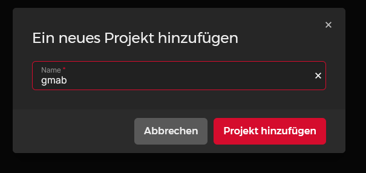

## Schritt 2 - Einrichtung eines Hetzner Cloud Projekts und API-Tokens

Bevor Sie GMAB konfigurieren, müssen Sie Hetzner Cloud entsprechend einrichten, indem Sie ein dediziertes Projekt erstellen und ein API-Token generieren.

### Erstellen eines dedizierten Projekts

1. Melden Sie sich in Ihrer Hetzner Cloud Console an unter [https://console.hetzner.cloud/](https://console.hetzner.cloud/)

2. Klicken Sie auf die Schaltfläche **+ Neues Projekt** :

3. Nennen Sie Ihr Projekt **gmab** (oder einen anderen Namen Ihrer Wahl)

4. Klicken Sie auf **Projekt hinzufügen**, um das Projekt zu erstellen und zu öffnen

### Generieren eines API-Tokens

1. Klicken Sie in Ihrem Projekt-Dashboard auf "Sicherheit" in der linken Seitenleiste

2. Klicken Sie im Bereich **API-Tokens** auf **API-Token hinzufügen** :

3. Geben Sie einen aussagekräftigen Namen wie **gmab CLI** ein und wählen Sie **Lesen & Schreiben** als Berechtigung aus :

4. Klicken Sie auf "API-TOKEN ERSTELLEN"

5. **WICHTIG**: Kopieren und speichern Sie das angezeigte API-Token sicher. Dies ist das einzige Mal, dass Sie dieses Token sehen werden. Bei Verlust müssen Sie ein neues generieren.

