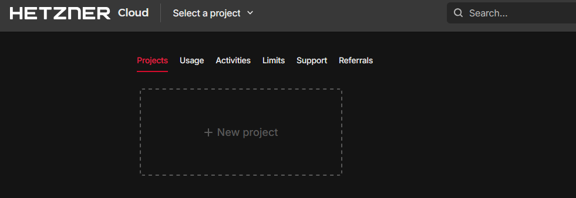
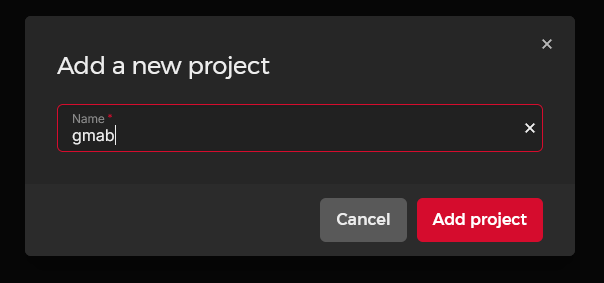

## Step 2 - Setting Up Hetzner Cloud Project and API Token

Before configuring GMAB, you need to set up Hetzner Cloud appropriately by creating a dedicated project and generating an API token.

### Creating a Dedicated Project

1. Log in to your Hetzner Cloud Console at [https://console.hetzner.cloud/](https://console.hetzner.cloud/)

2. Click the **+ New project** button :

3. Name your project **gmab** (or another name of your choice)

4. Click **Add project** to create and switch to the new project.

### Generating an API Token

1. In your project dashboard, click on "Security" in the left sidebar

2. In the "API Tokens" section, click **Genereate API token**:

3. Enter a descriptive name like "gmab CLI" and select **Read & Write** permissions and 4. Click **Generate API token**:

4. **IMPORTANT**: Copy and save the displayed API token securely. This is the only time you will see this token. If lost, you'll need to generate a new one.

