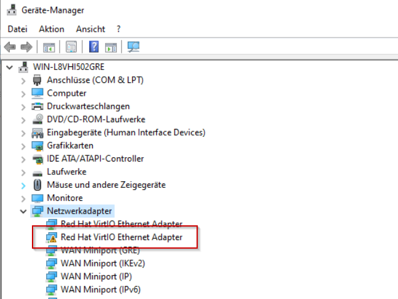
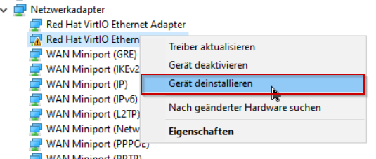
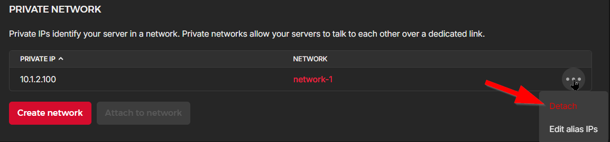
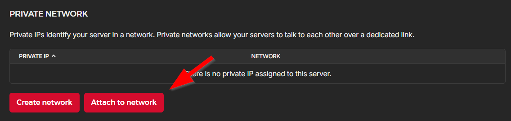
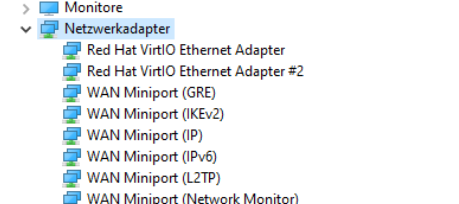
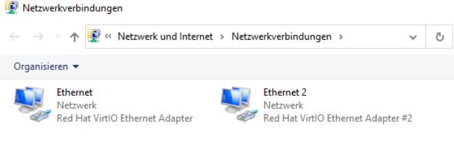

## Introduction

You installed Windows on a Hetzner Cloud machine and may experience: the second network card is not working or not shown.

Windows troubles here and it is not easy to solve that. Removing and adding it again may not work.

This how-to will enable the second network device.

**Prerequisites**

- You have installed Windows on a Hetzner Cloud instance
- You added an internal network to the virtual machine
- You enabled external IP for the server
- You already installed the network card driver using the virtio-win iso image

**Expectation**

- 2 Network cards shown up in Windows
  - One with external IP
  - One with internal IP

**Error**
- Only 1 network card is shown
- One device is shown in hardware manager with a warning (in details "Code 56")

## Preamble

The following steps look indeed very strange and may mislead you to think that it makes no sense. But
trust this tutorial. It was tested and reproduced multiple times after many different ways failed.

All seems to be caused by a strange behaviour Windows is managing the devices and drivers.

> WARNING: If you open public IP for Windows without using a firewall, you risk attacks on Windows.
> It is recommended to attach a Hetzner firewall to the server before enabling a public IP.

## Steps summary

- Remove in windows the broken network adapter from device manager
- Remove the attached private network in Hetzner console from the server
- Reboot Windows
- Re-attach the private network in Hetzner console to the server
- Wait ca. 20 seconds
- Rescan in device manager for changed hardware
- Remove in windows the broken network adapter from device manager
- Rescan in device manager for changed hardware

## Steps in detail

### Step 1

Open the Windows device manager by menu entries or run the command: `devmgmt.msc`

Right click on it and select "remove ...". Do NOT remove the drivers, as they are still in use for the first network card.

### Step 2

Open [Hetzner cloud console](https://console.hetzner.cloud/), go to your server and under "Networking", detach your private network.

### Step 3

Reboot Windows.

### Step 4

Open [Hetzner cloud console](https://console.hetzner.cloud/), go to your server and under "Networking", attach your private network.

### Step 5

Wait ca. 20 seconds. Windows may need some time to detect this device.

### Step 6

If in Windows device manager, the network card is not listed yet, run a rescan by right click and select  "find changed hardware / devices".

### Step 7

Remove the device again.

### Step 8

If in Windows device manager, run a rescan by right click and select  "find changed hardware / devices".

## Result

Now the miracle happened and the device is not listed with an warning anymore:

If you open the network cards (e.g. with command `ncpa.cpl`), you will see both network interfaces working.

If you would run now `ipconfig` on windows command console, you will see also both network interfaces with
the IPv4 addresses defined in Hetzner console - private an public.

The IPv6 is not correct, which seems to be a Windows special thing, as it generates a random IPv6.

##### License: MIT

<!--

Contributor's Certificate of Origin

By making a contribution to this project, I certify that:

(a) The contribution was created in whole or in part by me and I have
    the right to submit it under the license indicated in the file; or

(b) The contribution is based upon previous work that, to the best of my
    knowledge, is covered under an appropriate license and I have the
    right under that license to submit that work with modifications,
    whether created in whole or in part by me, under the same license
    (unless I am permitted to submit under a different license), as
    indicated in the file; or

(c) The contribution was provided directly to me by some other person
    who certified (a), (b) or (c) and I have not modified it.

(d) I understand and agree that this project and the contribution are
    public and that a record of the contribution (including all personal
    information I submit with it, including my sign-off) is maintained
    indefinitely and may be redistributed consistent with this project
    or the license(s) involved.

Signed-off-by: [Andreas Hernitscheck tech@tool.de]

-->
