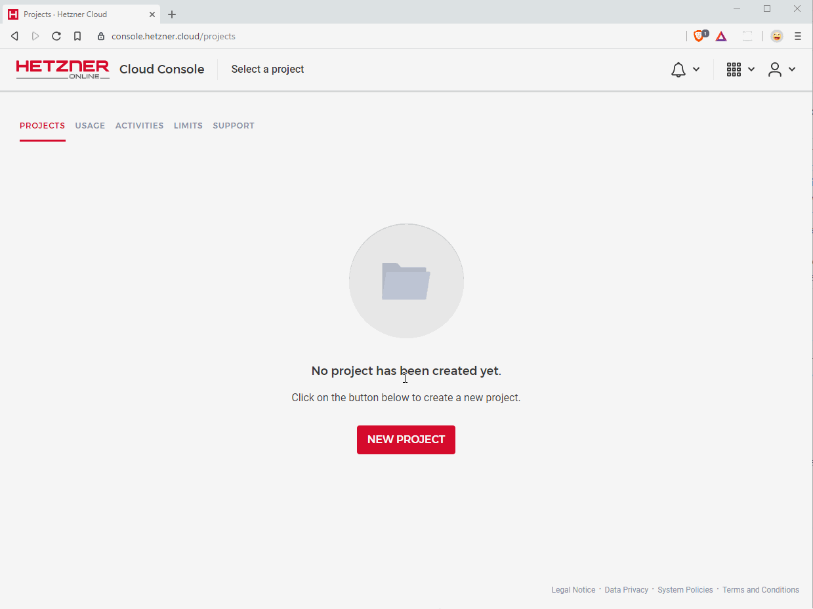
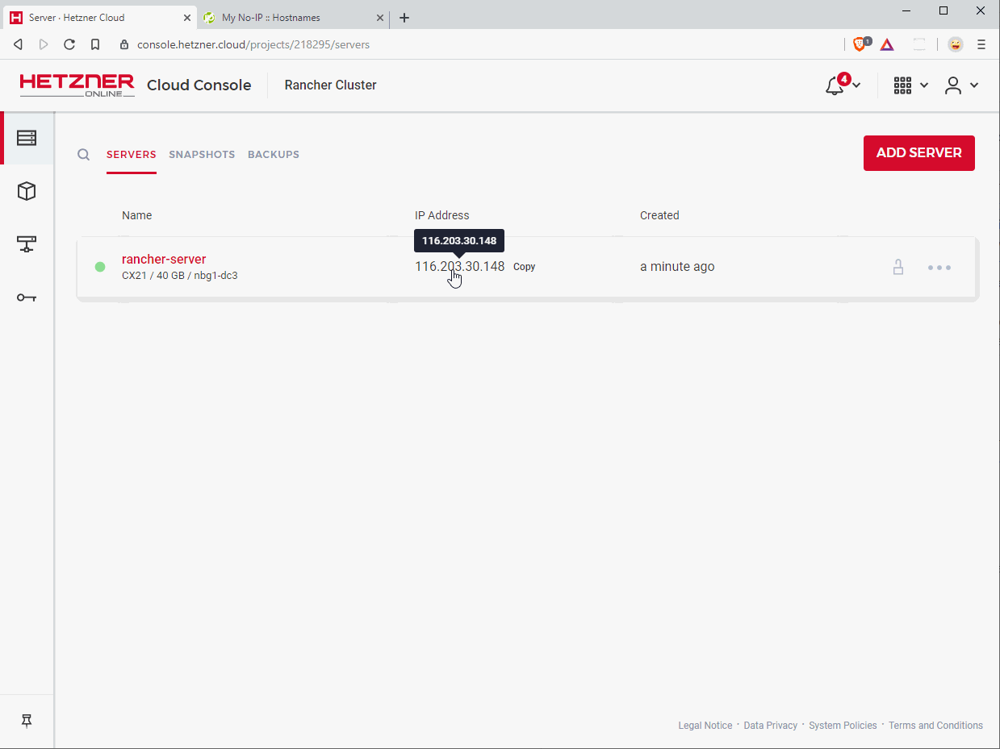
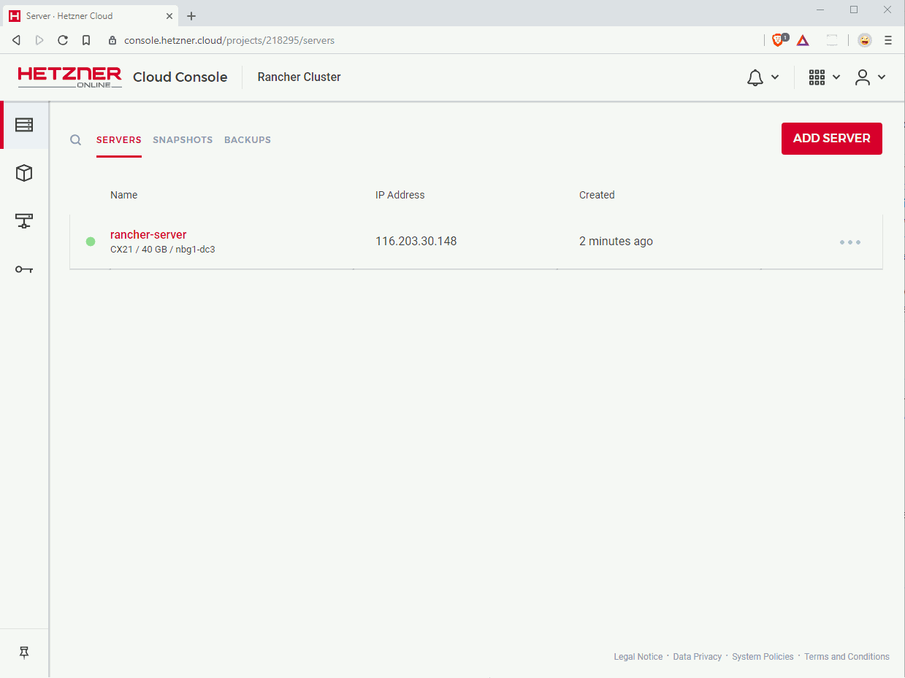
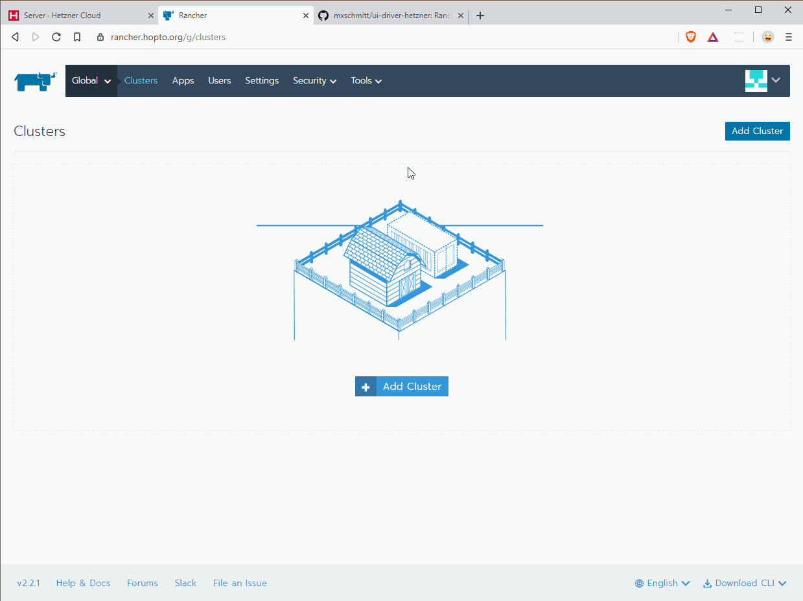

## Introduction

This tutorial will guide you through the installation of [Rancher](https://www.rancher.com), an Open Source multi-cluster management solution, based on [Kubernetes](https://www.kubernetes.io). Rancher will unleash the full power of cloud servers by easily creating and maintaining your own Kubernetes cluster through a clean and unobtrusive UI.

This tutorial guides through a "single node" installation of Rancher. This means we are only using one server for installation, which works perfectly fine for testing or development purposes. If you want to use Rancher in production, you may want a more robust and reliable "High Availability" (HA) setup, which is fault tolerant and even survives the failure of a server.

Important note: Kubernetes currently does not officially support IPv6 (development is [in the works](https://github.com/kubernetes/kubernetes/issues/62822)). If you are forced to use IPv6, please consider using a different container management engine.

This tutorial has been tested on Hetzner Cloud Servers.

**Prerequisites**

* [Hetzner Cloud](https://cloud.hetzner.com) account
* A SSH client, such as the `ssh` command on Linux/Mac/[WSL](https://docs.microsoft.com/en-us/windows/wsl/install-win10), or [PuTTY](https://www.chiark.greenend.org.uk/~sgtatham/putty/latest.html) on Windows (we'll use WSL in this tutorial)
* A domain (e.g. `example.com`)

In order to follow this tutorial, you'll need a domain. You can obtain a domain through the [Hetzner Robot](https://robot.your-server.de/order/index). In theory the cluster could be run without a domain, but this would require self signed certificates (or no security at all) which is unsecure and unnecessarily complicates the setup.

If you don't want to buy your own domain, you can use any of the free subdomain services available on the net. As we are going to use [Let's Encrypt](https://letsencrypt.org/) certificates for security, it is not recommended to skip the usage of a domain and thus continue without HTTPS security. Also, skipping security will most likely fail when adding nodes to the cluster.

## Step 1 - Create a Hetzner Cloud Server

This step will deploy a Hetzner Cloud server with CentOS and Docker installed.

Create a new project with an arbitrary name in your [Hetzner Cloud Console](https://console.hetzner.cloud) (or use an existing one). Select your project and click on "Add Server". Server properties:

##### 1. Location

Any location you like. If you plan to add more Hetzner Cloud nodes to your cluster, it's recommended to use the same location for each node for best latency (or use a different one for better availability).

##### 2. Image

In this tutorial, we are using CentOS, a production ready Linux operating system with long term support. You may use any other OS, but will need to adjust the OS-specific shell commands in this tutorial.

##### 3. Type

Any type you want, as long it has at least 4GB RAM available. The more clusters / nodes you want to manage, the more RAM / vCPU's you will need. Take a look at the official Rancher [requirements](https://rancher.com/docs/rancher/v2.x/en/installation/requirements/).

##### 4. Volume

Skip this section.

##### 5. Additional features

Click on "User data" and paste the following snippet:

```yaml
package_upgrade: true

packages:
    - yum-utils
    - device-mapper-persistent-data
    - lvm2

runcmd:
    - yum-config-manager --add-repo https://download.docker.com/linux/centos/docker-ce.repo
    - yum install -y docker-ce docker-ce-cli containerd.io
    - systemctl enable docker
    - systemctl start docker
```

It's recommended to check the "Backups" option in order to have regular snapshots of your Rancher instance.

##### 6. SSH key

For optimal security, add a SSH key here to authorize without a password against your server. See [GitHub Help](https://help.github.com/en/articles/generating-a-new-ssh-key-and-adding-it-to-the-ssh-agent) for how to generate one.

If you prefer not to setup SSH, the root password will be sent to you via email.

##### 7. Name

Enter a meaningful name for your instance or leave the default one.



## Step 2 - Setup DNS for your domain

The Hetzner Cloud Console displays the IP address of your server right at the project's servers page. Click on that IP address to copy it to the clipboard.

Now go to your domain name provider's management panel to create / change an A record that points your domain to the IP address of your server.

In this example, we are using the domain `rancher.example.com`. As mentioned in the prerequisites, you will need to buy / register your own domain to proceed. I recommend the [Hetzner Robot](https://robot.your-server.de/order/index) for that purpose.

After setting the DNS record, you'll probably need to wait some time until the DNS system recognizes your setting. The waiting time depends on the TTL setting of your provider. Run a `ping` or `nslookup` command to verify the DNS change.



## Step 3 - Start Rancher on your server

After preparing your DNS domain, you are now ready to finally start Rancher. It's provided as a Docker image, thus we'll need to SSH into your server and run that specific docker image.

Open your favourite SSH client and connect to your server:

* Username: `root`
* Hostname: `rancher.example.com` (Replace with your own domain or server IP)

If you are using Mac, Linux or the Windows Subsystem for Linux, open a Shell and enter:

```
$ ssh root@rancher.example.com
```

_Note: Don't copy the `$`, it's just a placeholder for your shell prompt._

If you did not setup a SSH key, you'll be prompted for a password at this point. You should have received it via email.

If you get a question about fingerprint authenticity, confirm it with `yes`. After successful login, run the following command:

```
$ docker run -d --restart=unless-stopped \
    -p 80:80 -p 443:443 \
    rancher/rancher:latest \
    --acme-domain rancher.example.com
```

You should now see a download progress and be back to your prompt afterwards. After a few minutes, Rancher should be available at https://rancher.example.com. You are asked to create an admin password the first time you visit your domain. Do so, and also confirm the proposed URL afterwards.

You may now disconnect from your server by entering `exit` into your shell.



## Step 4 - Setup Hetzner Cloud Node Driver

In order to easily spin up your cluster with more Hetzner Cloud servers, it's recommended to install a node driver for Hetzner Cloud. For this purpose, we are using the awesome open source project [ui-driver-hetzner](https://github.com/mxschmitt/ui-driver-hetzner) by [Max Schmitt](https://schmitt.cat) which itself makes use of the Docker Machine driver from [Jonas Stoehr](https://github.com/JonasProgrammer/).

Open your Rancher URL and go to `Tools` -> `Drivers`. On this page, click on the Tab `Node Drivers` and the button `Add Node Driver` on the right side.

A new dialog opens. Enter the following values:

* Download URL: `https://github.com/JonasProgrammer/docker-machine-driver-hetzner/releases/download/1.2.2/docker-machine-driver-hetzner_1.2.2_linux_amd64.tar.gz`
* Custom UI Url: `https://storage.googleapis.com/hcloud-rancher-v2-ui-driver/component.js`
* Checksum: Skip / leave empty
* Whitelist Domains: `storage.googleapis.com`

Click `Create`. A new entry `Hetzner` should appear and shortly afterwards shown as `Active`.



## Conclusion

Congratulations, you've successfully setup your own multi-cluster management system. You are now ready to run and maintain your own containerized applications, on every scale. See the subsequent tutorials for examples on how to run applications with Rancher and Kubernetes.

##### License: MIT

<!---

Contributors's Certificate of Origin

By making a contribution to this project, I certify that:

(a) The contribution was created in whole or in part by me and I have
    the right to submit it under the license indicated in the file; or

(b) The contribution is based upon previous work that, to the best of my
    knowledge, is covered under an appropriate license and I have the
    right under that license to submit that work with modifications,
    whether created in whole or in part by me, under the same license
    (unless I am permitted to submit under a different license), as
    indicated in the file; or

(c) The contribution was provided directly to me by some other person
    who certified (a), (b) or (c) and I have not modified it.

(d) I understand and agree that this project and the contribution are
    public and that a record of the contribution (including all personal
    information I submit with it, including my sign-off) is maintained
    indefinitely and may be redistributed consistent with this project
    or the license(s) involved.

Signed-off-by: Thomas Vollstädt <tv@engage.de>

-->
