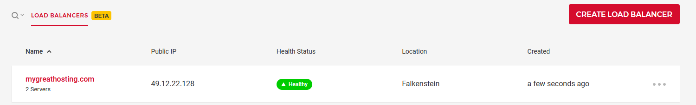

## Introduction

The goal of this tutorial is to have two servers with Plesk up and running, including a page which is load balanced between the two servers. The WordPress setup will be linked to the database of one Plesk Server. This tutorial does not include a HA MySQL Setup, but this could be part of an additional tutorial in the future. Also files, e.g. uploaded from WordPress, are not synced. The tutorial is meant to demonstrate how the Hetzner Load Balancer could be used. You should check upfront if you have other requirements (e.g. shared files or sessions) which must be kept in sync.

Previous tutorials have covered how to [install Plesk](/tutorials/install-plesk-cloud-server) and [configure Wordpress](/tutorials/wordpress-with-plesk).

## Step 1 - Setup your website

You need two servers with Plesk and WordPress Toolkit. On one server, you should create your website, in our case a WordPress page.

## Step 2 - Migrate

Assuming we have our WordPress page up and running on Server 1, we are going to import it to Server 2 with the Plesk Migrator. Therefore, login to your Plesk Server 2. Click on "Extensions", "Extensions Catalog" and search for the Plesk Migrator. Then, either install it and open it or open it directly, if already installed. Next click on "New Migration" and add your credentials of Server 1. Click on "Prepare migration". On the next page, select your domain from Server 1 and migrate it.

## Step 3 - Share the database

As said in our introduction, we are connecting the WordPress installation of Server 2 to the same database as Server 1. Therefore, we need to connect to Server 1. In the my.cnf file (normally at /etc/my.cnf) we need to change the bind-address to 0.0.0.0

```
bind-address = 0.0.0.0
```

After this, mysql / mariaDB needs to be restarted.

Now we can link the WordPress installation on Server 2 to the mySQL Database on Server 1.

For this, you have to edit the file `wp-config.php` of your imported website on Server 2. Change the entry where DB_HOST is defined to your Server 1:

```mysql
/** MySQL hostname */
define( 'DB_HOST', 'plsk01.mygreathosting.com:3306' );
```

## Step 4 - Add page to LB

Now we need to configure the Hetzner Load Balancer. Therefore, log into your Hetzner Cloud Account and select your existing project.

Now select Load Balancer and click "CREATE LOAD BALANCER". For the location, it makes sense to select the same location where your servers are located, or from where you expect the most requests.

Then click on "ADD TARGET" and select both of your servers. As Services, you should leave the first one (http) as it is and add a second one by clicking on "ADD SERVICE". Here you should select "NEW SERVICE". As protocol - TCP, Source port and Destination port both set to 443.

The algorithm can be left as it is. Last but not least, we should give it a name. After clicking on "CREATE & BUY NOW", your load balancer is created.



## Step 5 - Change DNS

Now we need to change the IP in the DNS of our domain to that of the load balancer. If you are using the DNS of Plesk on Server 1, you can do it directly from there. How to connect Plesk with the Hetzner DNS Server is available as a [separate tutorial](/tutorials/plesk-hetzner-dns). If you don't use your own Plesk Server as DNS, you have to change the IPs at the nameserver of your hoster / domain provider.

## Step 6 - Test

To see if it really works, you could edit the index.php of your WordPress installation on your Server 1 and Server 2 and add

```php
echo gethostname();
```

into the 2nd line of this file.

It could be the case that your browser caches this page, so you need to force a reload of the website to see the change. In addition, DNS Changes from Step 5 could take up to 24 hours.

## Conclusion

You're now using the Hetzner load balancer with WordPress and Plesk. And this is it - enjoy your new load balancer setup!

##### License: MIT

<!--

Contributor's Certificate of Origin

By making a contribution to this project, I certify that:

(a) The contribution was created in whole or in part by me and I have
    the right to submit it under the license indicated in the file; or

(b) The contribution is based upon previous work that, to the best of my
    knowledge, is covered under an appropriate license and I have the
    right under that license to submit that work with modifications,
    whether created in whole or in part by me, under the same license
    (unless I am permitted to submit under a different license), as
    indicated in the file; or

(c) The contribution was provided directly to me by some other person
    who certified (a), (b) or (c) and I have not modified it.

(d) I understand and agree that this project and the contribution are
    public and that a record of the contribution (including all personal
    information I submit with it, including my sign-off) is maintained
    indefinitely and may be redistributed consistent with this project
    or the license(s) involved.

Signed-off-by: Christian Hillenkötter

-->
