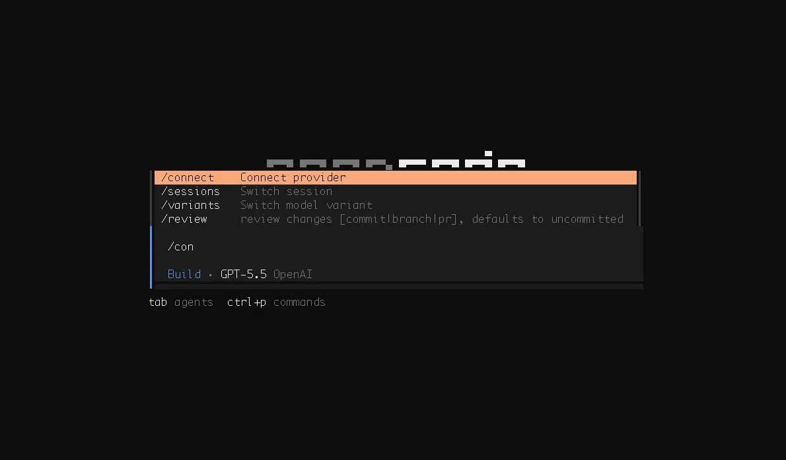
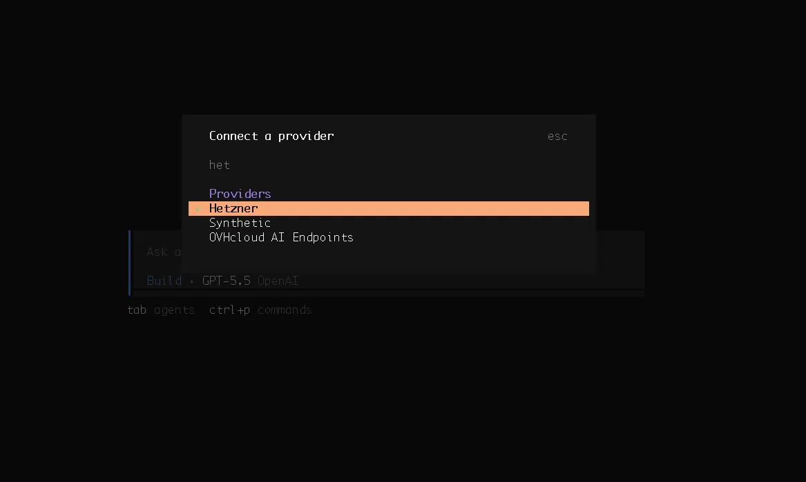
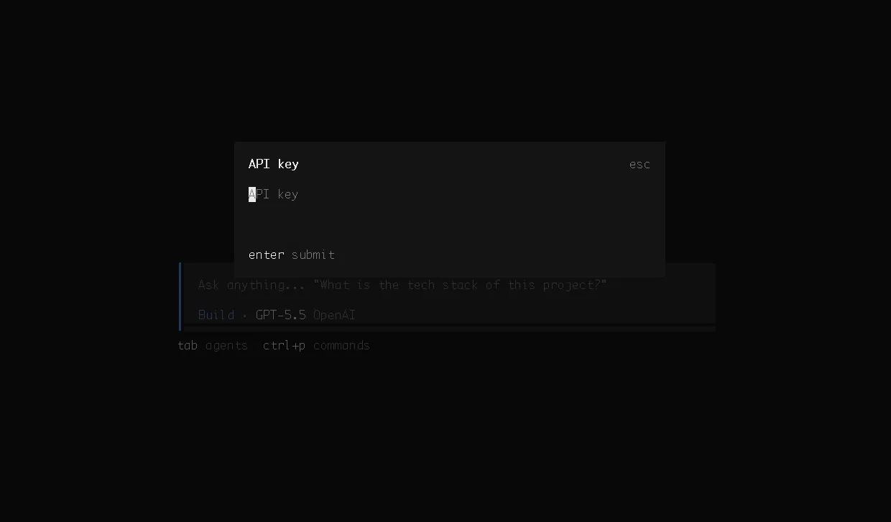
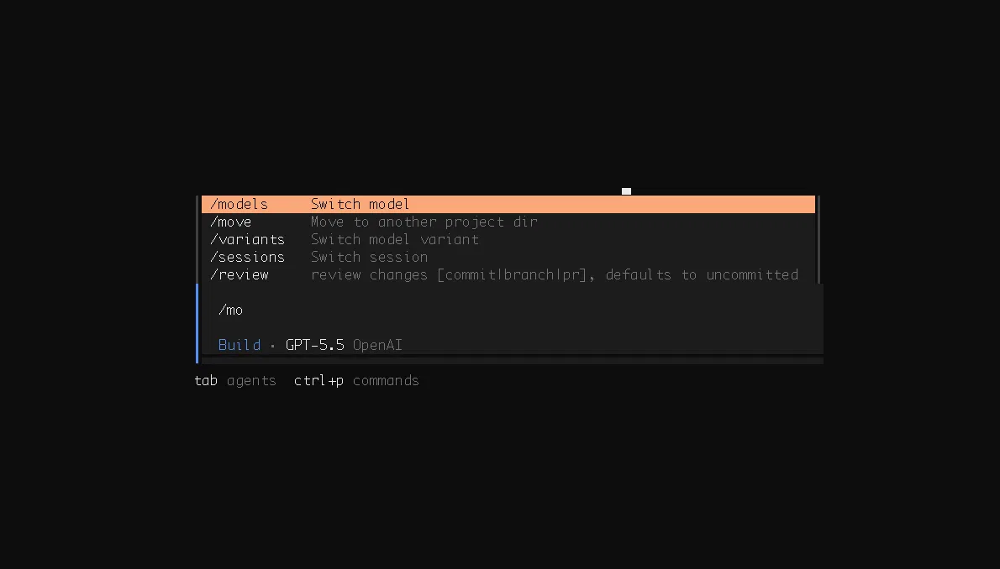
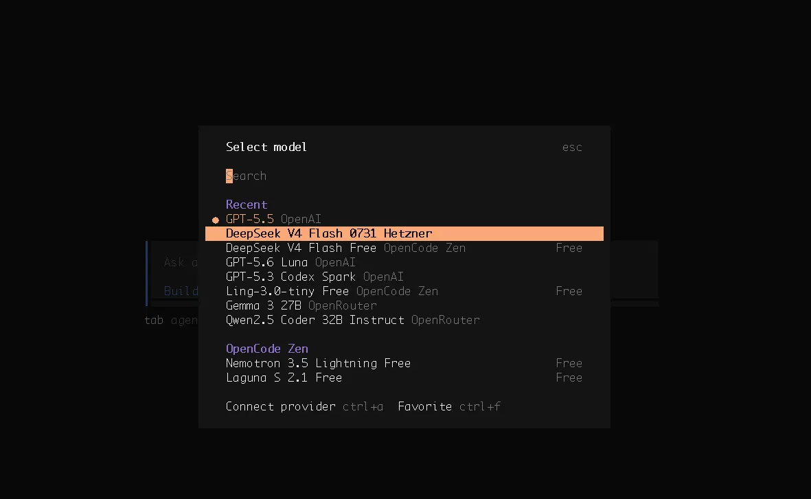

## Introduction

I wanted share this quick way of getting stated with hetzner and opencode which I tried myself and wanted to shar

**Prerequisites**

* Hetzner Cloud [API token](https://docs.hetzner.com/cloud/api/getting-started/generating-api-token) in the [Cloud Console](https://console.hetzner.cloud/)
* [opencode CLI](https://github.com/sst/opencode) installed

## Step 1 - Summary of Step

type /connect   for choosing provider

## Step 2 - Summary of Step

If your opencode is latest you will see Hetzner as provider once you type "het"

## Step 3 - Summary of Step

paste the api key you generated  from [https://experiments.hetzner.com/inference](https://)

## Step 4 - Summary of Step

once you press enter you be able to select models with /models

## Step 5 - Summary of Step

select the one the "Hetzner" at the end

## Conclusion

Now you are able to use the model , congratulations !

<!--

Contributor's Certificate of Origin

By making a contribution to this project, I certify that:

(a) The contribution was created in whole or in part by me and I have
    the right to submit it under the license indicated in the file; or

(b) The contribution is based upon previous work that, to the best of my
    knowledge, is covered under an appropriate license and I have the
    right under that license to submit that work with modifications,
    whether created in whole or in part by me, under the same license
    (unless I am permitted to submit under a different license), as
    indicated in the file; or

(c) The contribution was provided directly to me by some other person
    who certified (a), (b) or (c) and I have not modified it.

(d) I understand and agree that this project and the contribution are
    public and that a record of the contribution (including all personal
    information I submit with it, including my sign-off) is maintained
    indefinitely and may be redistributed consistent with this project
    or the license(s) involved.

Signed-off-by: [submitter's name and email address here]

-->
