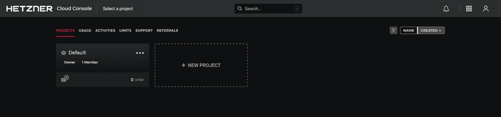
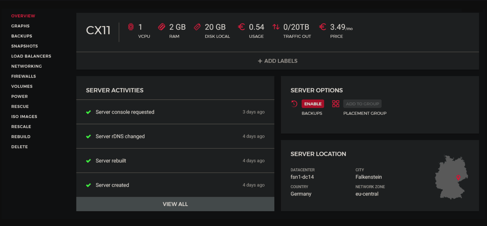

## Introduction

Importing and exporting databases is a common task in software development. You can use data dumps to back up and restore your information. You can also use them to migrate data to a new server or development environment.

In this guide, you will work with database dumps in MySQL or MariaDB. Specifically, you will export a database and then import that database from the SQL dump file.

### Prerequisites

- A Hetzner account with your preferred payment method added
- Basic knowledge of Linux & the terminal

What you should know before we start:

- Username: `root` (Your SSH user, this is the default user)
- Hostname: `<your_hostname>` (e.g. sub.domain.tld)
- IPv4 Address: `192.0.2.1` (Standard IP Address)

## Step 1 - Renting your server from Hetzner

### Choosing a project

First off, log into Hetzner's [Cloud console](https://console.hetzner.cloud) and choose the project you want to deploy the VPS in.



### Creating the server

Now you'll need to create the server, click on "Add Server" in the top-right corner.


### Choosing the server location

Choose the location you'd like your VPS to be in, this doesn't have any affect on performance at all. Keep in mind that some locations don't have all plans available due to limitations there may be in that location.

### Choosing the server's operating system

Image is basically the operating system that will be installed on your server. In this tutorial, we'll be going for Ubuntu 20.04, however, you may choose whatever operating system you'd like that is supported by [Docker](https://docker.com).

### Selecting the type of the server

If you are a Hetzner user, you probably know what the difference is, if not, it is well explained under the title of the option. I will be setting up a VPS with the Standard plan, just because that is more than enough for a reverse proxy with not that much traffic. You also need to choose how much resources your server will have, for the reverse proxy, the lowest plan should be plenty of resources. If you ever use more than the resources allocated to the server, you can simply just upgrade your server through the [Hetzner Cloud Console](https://console.hetzner.cloud.).


### Other settings

These last options are usually fine left on the default options, however, if you for example want to add an SSH key, your options will obviously look different. If you're not sure what some options are, hover over the "?" button and you should see a short description about what it is for.


## Step 2 - Exporting a MySQL or MariaDB Database

### Connecting to your server

First off, you can start by connecting to your new VPS. If you're not sure how to do that, you can open the terminal on your device and run the following command after modifying the details.

`ssh root@<IP Address>`

* Replace `<IP Address>` with your server's IPv4 address.

You should be able to find your server's IPv4 address in the server's initial page.



### Install MySQL or MariaDB Server

If you haven't installed a MySQL or MariaDB server yet, please follow [this tutorial](https://community.hetzner.com/tutorials/install-mysql-database-server-on-ubuntu).

### Exporting The MySQL or MariaDB Database

The `mysqldump` command exports databases to SQL text files. This makes it easier to transfer and move databases. You will need your database’s name and access to an account with at least full read-only access to the database, you can also use your `root` user and bypass the password input when it asks for it when by pressing tab.

Run the following command to export the database:

`mysqldump -u username -p database_name > database.sql`

* username being the username you can log in to the database with
* database_name being the name of the database to export
* database.sql being the file in the current directory that stores the output.

Prefilled Example: `mysqldump -u root -p mydatabase > mydatabase.sql`

The command will produce no visual output, but you can inspect the contents of database.sql to confirm that the database dump was successful.

Run the following command to confirm:

`head -n 5 database.sql`

The top of the file should look similar to this, showing a MySQL dump for a database named mydatabase.

```
SQL dump fragment
-- MySQL dump 10.13  Distrib 5.7.16, for Linux (x86_64)
--
-- Host: localhost    Database: mydatabase
-- ------------------------------------------------------
-- Server version       5.7.16-0ubuntu0.16.04.1
```

If any errors occur during the export process, mysqldump should print them to the screen.

## Step 3 - Importing a MySQL or MariaDB Database

To import an existing dump file into MySQL or MariaDB, you will need to have a database created.

After you create your new MySQL or MariaDB database, use the following command to import the dump file:

`mysql -u username -p new_database < database.sql`

If the command runs successfully, it won’t produce any output. If any errors occur during the process, `mysql` will print them to the terminal instead. To check if the import was successful, log into the MySQL shell or use PhpMyAdmin and inspect the data.

## Conclusion

Thank you for following my tutorial. Whilst reading this, you should already have migrated your MySQL or MariaDB Database successfully.

##### License: MIT

<!--

Contributor's Certificate of Origin

By making a contribution to this project, I certify that:

(a) The contribution was created in whole or in part by me and I have
    the right to submit it under the license indicated in the file; or

(b) The contribution is based upon previous work that, to the best of my
    knowledge, is covered under an appropriate license and I have the
    right under that license to submit that work with modifications,
    whether created in whole or in part by me, under the same license
    (unless I am permitted to submit under a different license), as
    indicated in the file; or

(c) The contribution was provided directly to me by some other person
    who certified (a), (b) or (c) and I have not modified it.

(d) I understand and agree that this project and the contribution are
    public and that a record of the contribution (including all personal
    information I submit with it, including my sign-off) is maintained
    indefinitely and may be redistributed consistent with this project
    or the license(s) involved.

Signed-off-by: Jean F. (root@techoutdev.com)

-->
