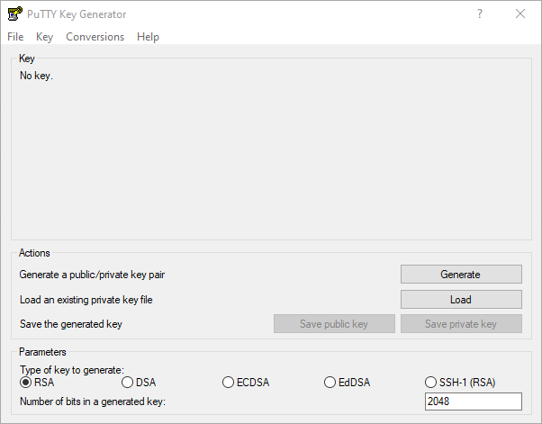

## Einführung

Dieses Tutorial zeigt wie du mit PuTTYgen einen SSH-Key auf deinem Windows PC erstellen kannst und wie du diesen Key kopierst, damit du dich mit diesem mit deinem Server verbinden kannst.

**Voraussetzungen**

* Server mit einer Linux-Distribution
* Lokaler PC mit Windows

## Schritt 1 - PuTTYgen auf Windows installieren

Bei der Installation von PuTTY ist PuTTYgen automatisch enthalten. Wenn PuTTY nicht auf deinem PC installiert ist, reicht es auch nur PuTTYgen herunterzuladen ([puttygen.exe](https://www.chiark.greenend.org.uk/~sgtatham/putty/latest.html) — wähle je nach PC die 32-Bit oder 64-Bit-Version, vermutlich 64-Bit).

## Schritt 2 - PuTTYgen ausführen

Wähle die eben heruntergeladene Datei mit einem Doppelklick aus. Das sollte das "PuTTY Key Generator"-Fenster öffnen.



## Schritt 3 - SSH-Key erstellen

1. Wähle "Generate" aus
2. Bewege deine Maus über die freie Fläche, um einen Key zu generieren
3. Ändere den Text im "Key comment"-Feld zu einem eindeutigen Namen für den Key, wie: "Zuhause", "Büro", "heim-pc-i7", usw.
4. *EMPFOHLEN*: Gebe ein Passwort für deinen Key an, um den SSH-Key zu schützen. Hinweis: Das Passwort muss jedes mal angegeben werden, wenn du dich über den SSH-Key mit deinem Server verbindest.
5. Speichere den öffentlichen/privaten Key auf deinem PC mit den Optionen "Save public key" und "Save private key". Den Speicherort kannst du selbst bestimmen. Merke dir wo du dein SSH-Key-Paar gespeichert hast.
6. Kopiere den Inhalt vom Textfeld unter "Public key for pasting into OpenSSH `authorized_keys` file".

## Schritt 4 - Öffentlichen Key auf den Server kopieren

### Option 1: Key über FTP kopieren

* Verbinde dich über einen FTP-Client deiner Wahl mit deinem Server (z.B. über [FileZilla](https://filezilla-project.org/)).
* Bearbeite die Datei `authorized_keys` (Speicherort: /home/holu/.ssh/authorized_keys mit "holu" als Benutzernamen).
* Füge den zuvor kopierten Inhalt (wurde im letzten Zwischenschritt von Schritt 3 kopiert) in die `authorized_keys`-Datei ein.
* Speicher deine Änderungen.
* Lade die `authorized_keys`-Datei hoch.

### Option 2: Key über SSH kopieren

Öffne dein Terminal / [PuTTY](https://www.chiark.greenend.org.uk/~sgtatham/putty/latest.html) und gebe Folgendes ein:

```bash
ssh-copy-id holu@your_server_ip
```
## Schritt 5 - Den Key mit PuTTY verwenden

Wenn du PuTTY nutzt, kannst du den neuen Key so auswählen:   

* Öffne PuTTY
  * Gehe zu `Connection` » `SSH` » `Auth` » `Credentials`
    * Klicke auf `Browse...` und wähle die Datei von deinem **privaten** SSH-Key aus. Die Datei endet vermutlich auf PPK (z.B. `<your-key>.ppk`).
    
    
  * Nachdem der Key hinzugefügt wurde, gehe zurück zu `Session`
    * Gebe in dem Textfeld oben links deinen Benutzernamen auf dem Server an und die IP-Adresse
    * Wähle `Open` aus, um dich mit deinem Server zu verbinden
    
    

## Ergebnis

Du hast einen neuen SSH-Key erstellt und diesen auf deinen Server kopiert. Mit diesem Key kannst du dich jetzt einfach und sicher mit deinem Server verbinden. Als nächsten Schritt könnte noch dieses Tutorial interessant sein: "[How to login to your Hetzner instance with an SSH Key](/tutorials/add-ssh-key-to-your-hetzner-cloud)".

##### License: MIT

<!--

Contributor's Certificate of Origin

By making a contribution to this project, I certify that:

(a) The contribution was created in whole or in part by me and I have
    the right to submit it under the license indicated in the file; or

(b) The contribution is based upon previous work that, to the best of my
    knowledge, is covered under an appropriate license and I have the
    right under that license to submit that work with modifications,
    whether created in whole or in part by me, under the same license
    (unless I am permitted to submit under a different license), as
    indicated in the file; or

(c) The contribution was provided directly to me by some other person
    who certified (a), (b) or (c) and I have not modified it.

(d) I understand and agree that this project and the contribution are
    public and that a record of the contribution (including all personal
    information I submit with it, including my sign-off) is maintained
    indefinitely and may be redistributed consistent with this project
    or the license(s) involved.

Signed-off-by: Aitor Andreu <foreveryo@gmail.com>

-->
