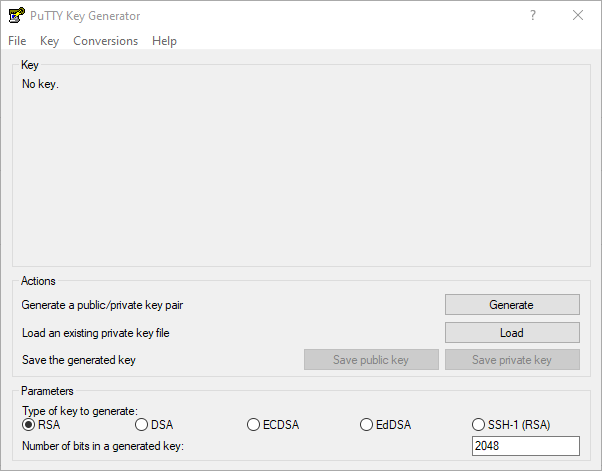
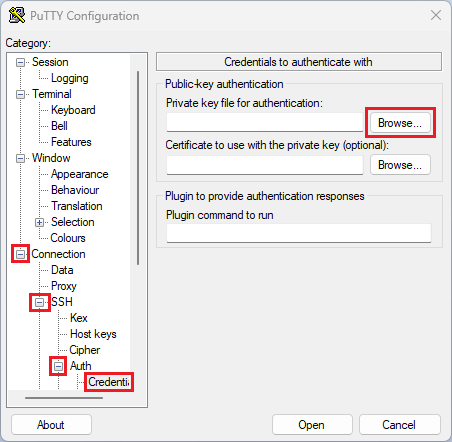
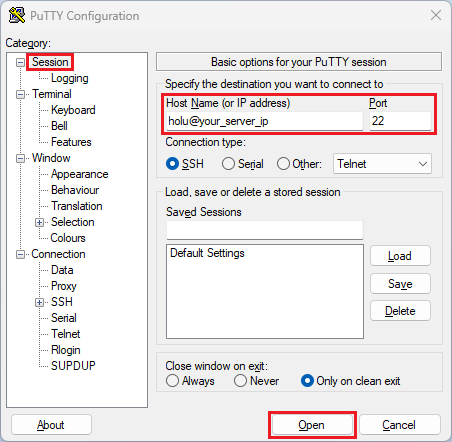

## Introduction

This tutorial will guide you on how to create an SSH key using PuTTYgen in your Windows PC and how to copy this key to connect to your server.

**Prerequisites**

* Server running a Linux distribution
* Local PC with Windows

## Step 1 - Install PuTTYgen on Windows

The installation of PuTTY automatically comes with PuTTYgen. If you don't have PuTTY installed on your PC, it is enough to just download PuTTYgen ([puttygen.exe](https://www.chiark.greenend.org.uk/~sgtatham/putty/latest.html) — select 32 / 64 bits version according your PC, most probably 64-bit).

## Step 2 - Run PuTTYgen

Double-click on the executable you just downloaded. This will open the PuTTY Key Generator window.



## Step 3 - Generate SSH key

1. Press the "Generate" button
2. Move your mouse around on the blank space to randomize your key
3. Change the "Key comment" field to give your key a meaningful name like: "home", "office", "home-pc-i7", etc.
4. *RECOMMENDED*: Enter a "Key Passphrase" to protect your SSH key. Note: This passphrase will be requested every time you try to connect using the generated SSH key.
5. Save your public/private keys safely on your PC using the buttons "Save public key" and "Save private key". Remember the location you saved your key pair in.
6. Copy the content of the field "Public key for pasting into OpenSSH `authorized_keys` file".

## Step 4 - Copy public key to your server

### Option 1: Copy key over FTP

* Connect to your server using your preferred FTP Client (eg: [FileZilla](https://filezilla-project.org/)).
* Edit file `authorized_keys` (location: /home/holu/.ssh/authorized_keys where "holu" is your username).
* Append the content from your clipboard (done in last substep of Step 3) into the `authorized_keys` file.
* Save.
* Upload `authorized_keys` file.

### Option 2: Copy key over SSH

Open your terminal / [PuTTY](https://www.chiark.greenend.org.uk/~sgtatham/putty/latest.html) client and type:

```bash
ssh-copy-id holu@your_server_ip
```

## Step 5 - Use the key with PuTTY

If you use PuTTY, this is how you can add your key:  

* Open PuTTY
  * Go to `Connection` » `SSH` » `Auth` » `Credentials`
    * Click on `Browse...` and open your **private** SSH key file. The file probably ends with PPK (e.g. `<your-key>.ppk`).
    
    
  * After the key is added, go back to `Session`
    * In the text box in the top left, enter your username and the IP address of the remote server
    * Select `Open` to connect to your server
    
    

## Conclusion

You've created a new SSH key and copied it to your server, so you can now use it to easily and securely connect to your server.
Another interesting tutorial is "[How to login to your Hetzner instance with an SSH Key](/tutorials/add-ssh-key-to-your-hetzner-cloud)".

##### License: MIT

<!--

Contributor's Certificate of Origin

By making a contribution to this project, I certify that:

(a) The contribution was created in whole or in part by me and I have
    the right to submit it under the license indicated in the file; or

(b) The contribution is based upon previous work that, to the best of my
    knowledge, is covered under an appropriate license and I have the
    right under that license to submit that work with modifications,
    whether created in whole or in part by me, under the same license
    (unless I am permitted to submit under a different license), as
    indicated in the file; or

(c) The contribution was provided directly to me by some other person
    who certified (a), (b) or (c) and I have not modified it.

(d) I understand and agree that this project and the contribution are
    public and that a record of the contribution (including all personal
    information I submit with it, including my sign-off) is maintained
    indefinitely and may be redistributed consistent with this project
    or the license(s) involved.

Signed-off-by: Aitor Andreu <foreveryo@gmail.com>

-->
