## Introduction

This article is about getting SmartOS up and running on a new Hetzner server. Remark that I intentionally avoid using the word "installing" in the previous phrase, because SmartOS is more like a live image that just gets loaded in memory to run it. It was actually one of the SmartOS design principles to not install the operating system, which has its advantages but it creates the dependancy on external media to boot.

In the past, a strict requirement for running SmartOS on a Hetzner server was the presence of a USB flash drive to boot the operating system from.
Other boot options for SmartOS are CDROM or network boot, but those aren't valid options when hosting SmartOS at Hetzner. (except if I missed something)

Today, there is another option to boot SmartOS: **booting SmartOS of a ZFS pool**.

In practice this means that the boot image will be present on the internal hard disks of the server, however the challenge remains to get it in place without the need for any external boot media as mentioned above. In other words, we still have to overcome the challenge of its very first boot, and the typical SmartOS configuration at first boot.

For me, the motivation behind this procedure was to be able to run SmartOS on a server of the **"server auctions"** at Hetzner, which don't allow you to connect a USB flash drive since nothing can be changed to these servers.

**BEWARE: this procedure will overwrite all data on the disks!**

## Pre-requisites

These are the pre-requisites in order to be able to follow this procedure:

* A SmartOS compatible Hetzner server, I believe most are compatible (maybe all).
I successfully tested SmartOS on:
    * **EX42**: Intel® Core™ i7-6700
    * **SB82**: Intel Xeon E5-1650V3
    * **PX92**: Intel Xeon W2145 Octa-Core Skylake
* A remote console ordered via a Hetzner support request
* Hetzner server networking configuration
* The knowledge to operate your server via Hetzner robot
* Basic Linux command-line knowledge

Hardware RAID is not required. ZFS eliminates the need for hardware RAID, however it might imply preliminary steps to disable it!

## Approach

In summary, the following steps are needed to prepare the system to boot SmartOS:

* Boot the Linux rescue system facilitated via the Hetzner robot
* Install Linux from the rescue boot (single command)
* Adapt the Linux grub configuration to add an entry to boot SmartOS
* Load the SmartOS media onto the Linux file system /boot
* Reboot, at boot time select "SmartOS" from the grub menu
* Complete the SmartOS configuration at first boot, and
    * prepare a bootable ZFS file system via **piadm**
    * install boot media via **piadm**
* Reboot into SmartOS (only boot option left, the Linux installation was overwritten)
* Optionally, change the root password (for increased password complexity)

This procedure might not seem the most efficient way as we first install Linux to overwrite it immediately with SmartOS, but at least this approach is close to "bullet proof". It is really easy and doesn't leave much room for mistakes.

## Step 1 - Install Linux via the Hetzner rescue system

So, to start off, we boot the server in Linux rescue mode via Hetzner Robot.

Once at the UNIX prompt, we launch the `installimage` command to start the Linux installation.

For the purpose of this procedure I always select **Ubuntu**, as shown below:

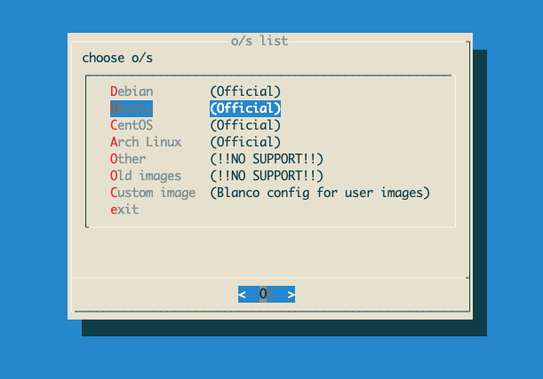

As part of the installation procedure, you will have the possibility to edit the `install.conf` file. I recommend to disable the software RAID by changing the `1` into `0` at the end of the line that starts with `SWRAID`.

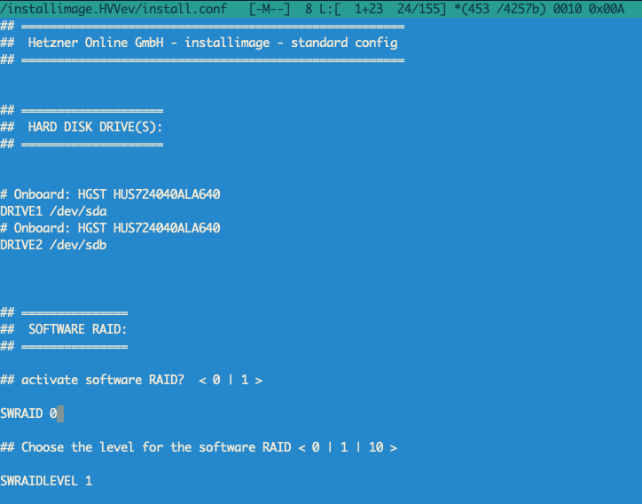

Follow along with the default options to complete installation and reboot the server. Reconnect to the console once the installation is finished and the server has rebooted.

## Step 2 - Adapt the Linux Grub configuration

At this step we will add an entry to boot SmartOS from a local copy that we will load onto the /boot directory.

Edit the grub custom entries file:

```
root@Ubuntu-2010-groovy-64-minimal ~ # vi /etc/grub.d/40_custom
```

Add a new menuentry into `/etc/grub.d/40_custom`, here I used the `root='hd0,gpt2'` parameter which refers to the third partition on the first hard disk. (indeed, we start counting from `0`)

It's easy to figure out the correct parameters, just copy the `set root='...'` line from the existing menu entries in the `/boot/grub/grub.cfg`.

```
root@Ubuntu-2010-groovy-64-minimal ~ # cat  /etc/grub.d/40_custom
#!/bin/sh
exec tail -n +3 $0
# This file provides an easy way to add custom menu entries.  Simply type the
# menu entries you want to add after this comment.  Be careful not to change
# the 'exec tail' line above.

menuentry "SmartOS" {
    insmod multiboot
    set root='hd0,gpt2'
    multiboot /platform/i86pc/kernel/amd64/unix /platform/i86pc/kernel/amd64/unix -B smartos=true
    module /platform/i86pc/amd64/boot_archive /platform/i86pc/amd64/boot_archive type=rootfs name=ramdisk
}
```

Optionally, you could also adapt some default values for grub in the `/etc/default/grub` file. 

In this file I'm setting `GRUB_DEFAULT=2` to select SmartOS as default boot option on 3rd position. (again counting from 0)

I comment out the `GRUB_TIMEOUT_STYLE=hidden` line to avoid hidden messages and I choose to set `GRUB_TIMEOUT=20` to give myself 20 seconds the time to make a selection at the grub menu.

So the `/etc/default/grub` looks like this:

```
root@Ubuntu-2010-groovy-64-minimal ~ # cat  /etc/default/grub
# If you change this file, run 'update-grub' afterwards to update
# /boot/grub/grub.cfg.
# For full documentation of the options in this file, see:
#   info -f grub -n 'Simple configuration'

GRUB_DEFAULT=2
#GRUB_TIMEOUT_STYLE=hidden
GRUB_TIMEOUT=20
GRUB_DISTRIBUTOR=`lsb_release -i -s 2> /dev/null || echo Debian`
GRUB_CMDLINE_LINUX_DEFAULT=""
GRUB_CMDLINE_LINUX=""

# Uncomment to enable BadRAM filtering, modify to suit your needs
# This works with Linux (no patch required) and with any kernel that obtains
# the memory map information from GRUB (GNU Mach, kernel of FreeBSD ...)
#GRUB_BADRAM="0x01234567,0xfefefefe,0x89abcdef,0xefefefef"

# Uncomment to disable graphical terminal (grub-pc only)
#GRUB_TERMINAL=console

# The resolution used on graphical terminal
# note that you can use only modes which your graphic card supports via VBE
# you can see them in real GRUB with the command `vbeinfo'
#GRUB_GFXMODE=640x480

# Uncomment if you don't want GRUB to pass "root=UUID=xxx" parameter to Linux
#GRUB_DISABLE_LINUX_UUID=true

# Uncomment to disable generation of recovery mode menu entries
#GRUB_DISABLE_RECOVERY="true"

# Uncomment to get a beep at grub start
#GRUB_INIT_TUNE="480 440 1"
root@Ubuntu-2010-groovy-64-minimal ~ #
```

Now we, are ready to update the grub configuration with the `update-gub2` command.

```
root@Ubuntu-2010-groovy-64-minimal ~ # update-grub2
Sourcing file `/etc/default/grub'
Sourcing file `/etc/default/grub.d/hetzner.cfg'
Sourcing file `/etc/default/grub.d/init-select.cfg'
Generating grub configuration file ...
Found linux image: /boot/vmlinuz-5.8.0-59-generic
Found initrd image: /boot/initrd.img-5.8.0-59-generic
done
```

Once the configuration is updated after a few seconds, we are ready for the next step: downloading the boot image to put it in place as documented here below:

## Step 3 - Load the SmartOS media onto the Linux file system

We will download a recent SmartOS release in the `/var/tmp` directory by using the `wget` command:

```
root@Ubuntu-2010-groovy-64-minimal ~ # cd /var/tmp
```

```
root@Ubuntu-2010-groovy-64-minimal /var/tmp # wget  \
https://us-east.manta.joyent.com/Joyent_Dev/public/SmartOS/20210408T001154Z/platform-release-20210408-20210408T001154Z.tgz

--2021-08-09 22:15:36--  https://us-east.manta.joyent.com/Joyent_Dev/public/SmartOS/20210408T001154Z/platform-release-20210408-20210408T001154Z.tgz
Resolving us-east.manta.joyent.com (us-east.manta.joyent.com)... 64.30.136.21, 64.30.136.19, 64.30.136.18, ...
Connecting to us-east.manta.joyent.com (us-east.manta.joyent.com)|64.30.136.21|:443... connected.
HTTP request sent, awaiting response... 200 OK
Length: 185240033 (177M) [application/octet-stream]
Saving to: ‘platform-release-20210408-20210408T001154Z.tgz’

platform-release-20210408-20210408T001154Z.tgz            100%[=====================================================>] 176.66M  22.6MB/s    in 9.9s

2021-08-09 22:15:47 (17.9 MB/s) - ‘platform-release-20210408-20210408T001154Z.tgz’ saved [185240033/185240033]
```

Once the image is downloaded, we will unpack the compressed tar archive into the `/boot` directory:

```
root@Ubuntu-2010-groovy-64-minimal ~ # cd /boot
```

```
root@Ubuntu-2010-groovy-64-minimal /boot # tar zxvf \
        /var/tmp/platform-release-20210408-20210408T001154Z.tgz
platform-20210408T001154Z/
platform-20210408T001154Z/i86pc/
platform-20210408T001154Z/i86pc/amd64/
platform-20210408T001154Z/i86pc/amd64/boot_archive.manifest
platform-20210408T001154Z/i86pc/amd64/boot_archive.gitstatus
platform-20210408T001154Z/i86pc/amd64/boot_archive
platform-20210408T001154Z/i86pc/amd64/boot_archive.hash
platform-20210408T001154Z/i86pc/kernel/
platform-20210408T001154Z/i86pc/kernel/amd64/
platform-20210408T001154Z/i86pc/kernel/amd64/unix
platform-20210408T001154Z/root.password
platform-20210408T001154Z/etc/
platform-20210408T001154Z/etc/version/
platform-20210408T001154Z/etc/version/platform
```

Then we have to rename the directory name. This is important, so don't skip this step or the boot will fail!

```
root@Ubuntu-2010-groovy-64-minimal /boot # mv platform-20210408T001154Z/  platform
```

We can now reboot the system, and select "SmartOS" in the grub boot menu.

```
root@Ubuntu-2010-groovy-64-minimal ~ # reboot
Connection to xeon1.globalz.one closed by remote host.
Connection to xeon1.globalz.one closed.
```

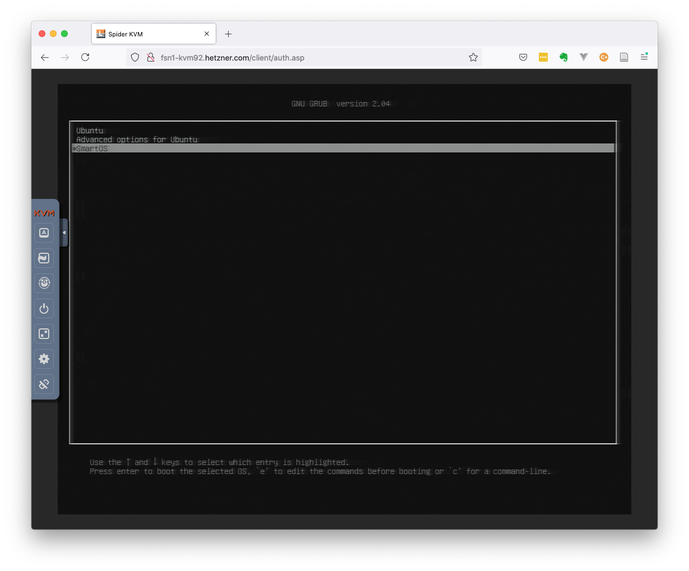

## Step 4 - Complete the SmartOS configuration

Once booted the server with SmartOS it comes up with an interactive configuration session to provide a minimum of parameters, like:

* the network and DNS configuration 
* the NTP configuration
* the zpool configuration (here ZFS software mirror), which we will make bootable upon creation
* the root password (don't make it too complex to avoid lock out at this stage)
* the system hostname

These steps are shown in the following screen captures.

To start with, two screens with some information will be shown, just pass them by pressing `Enter` twice:

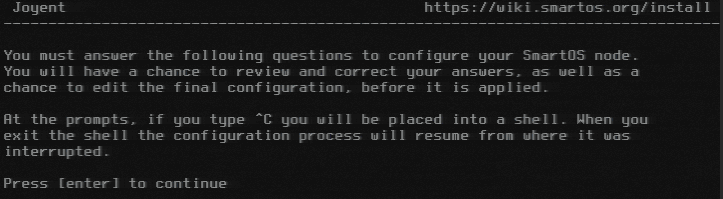

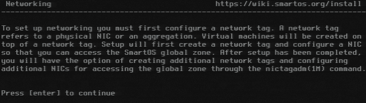

Provide the IP address and netmask for your server, this information is obtained from Hetzner Robot:

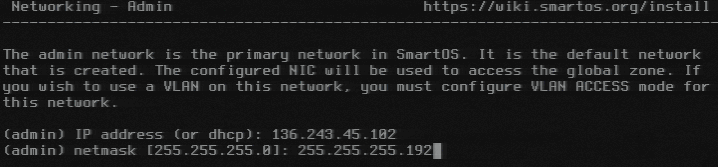

Enter the default gateway IP address for your server:

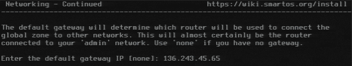

Specify DNS servers and your domain name:

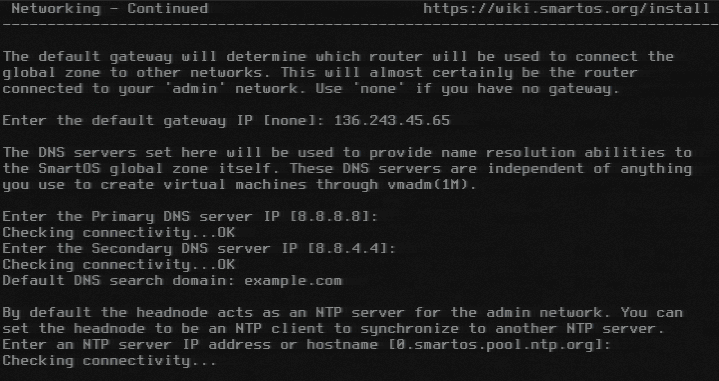

Next, type "manual" in order to initiate the manual creation of the zpool:

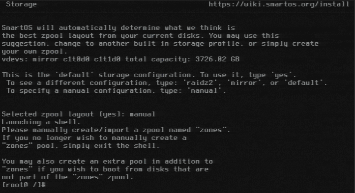

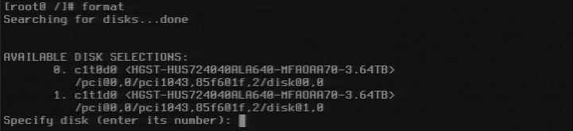

At this stage we opt to create the zpool manually, this will give us the opportunity to make it bootable. Indeed, this is the key functionality that facilitates the goal of the procedure documented on this page: "making the system bootable from the `zones` zpool".

This step is done in a shell session, where we first manually create the `zones` zpool with a mirror of two disks, the `-B` option instructs the creation of a whole disk pool with EFI System partition to support booting system with UEFI firmware. The default size is 256MB, if desired another size can be specified with the `-o` option.

*For readability, I provide the command snippets here below as text instead of the actual console screenshots.*

```
[root@ /]# zpool create -f -B zones mirror c1t0d0 c1t1d0
```

Upon success, we can list the zpools with the `zpool` command:

```
[root@ /]# zpool list
NAME    SIZE  ALLOC   FREE  CKPOINT  EXPANDSZ   FRAG    CAP  DEDUP  HEALTH  ALTROOT
zones  3.62T   104K  3.62T        -         -     0%     0%  1.00x  ONLINE  -
```

From here we will use the `piadm` command to manage the boot images on the system. At first, when we try to enable the `zones` zpools bootable status we get an error because there are no images installed yet.

```
[root@ /]# piadm bootable -e zones
cannot find install media
```

So let's install an image, but first we need to check which images are available for download:

```
[root@ /]# piadm avail
20210715T010227Z
20210729T002724Z
20210812T031946Z
```

Installing an image is as simple as the command below:

```
[root@ /]# piadm install 20210701T204427Z
```

Once installed we just need to activate the image. Activating is like selecting an image amongst all the ones that are installed.

```
[root@ /]# piadm activate 20210701T204427Z
```

This is now reflected in the output of the `piadm list` command which shows that this image will be used on next boot.

```
[root@ /]# piadm list
PI STAMP               BOOTABLE FILESYSTEM            BOOT IMAGE NOW  NEXT
20210701T204427Z       zones/boot                     available  no   yes
```

Let's attempt again to enable the bootable status for the `zones` zpool:

```
[root@ /]# piadm bootable -e zones
Pool zones appears to be bootable.
Use 'piadm install' and 'piadm active' to change PIs.
```

This time the command terminates successfully. 

Now that the `zones` zpool is created and ready to boot SmartOS we go back to the configurator by executing the `exit` command.

```
[root@ /]# exit
```

Select the zpool layout `zones`, and specify `media` as the source for the boot:

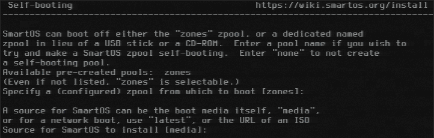

Specify a root password and a hostname:

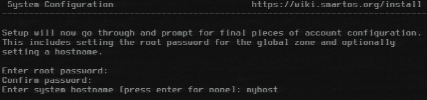

Finally, confirm the shown configuration summary with "y" and the system will reboot.

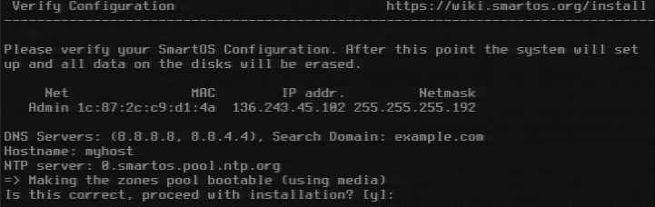

At the SmartOS boot menu, just wait a few seconds or press `Enter` and watch it booting. A few seconds later you will see the SmartOS login prompt.

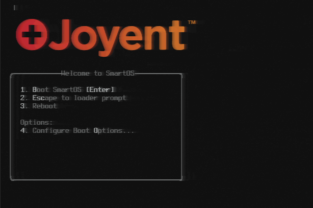

**Mission completed** -- Wait a minute... how strong is your root password? In the next step the password change is explained.

## Step 5 - Change root password (optionally)

In case the chosen password was not complex enough, we could set a new password with following command sequence.

```
[root@myhost ~]# umount /etc/shadow; cp /usbkey/shadow /etc/shadow; passwd root; cp /etc/shadow /usbkey/shadow
New Password:
Re-enter new Password:
passwd: password successfully changed for root
```

We need to do this in this manner, because `/etc` is actually on a read-only ramdisk, and `/etc/shadow` is mounted onto `/usbkey/shadow`.

The `zones/usbkey` ZFS file system is read-writable and is mounted onto `/usbkey`.

Of course, another option would be to edit the `/usbkey/shadow` directly, at least if you know how to handle the password hash.

```
[root@myhost ~]# df -h /etc/shadow
Filesystem             Size   Used  Available Capacity  Mounted on
/usbkey/shadow        1.20T   148K      1.20T     1%    /etc/shadow
```

```
stefan@macbook:~$ ssh -F /dev/null -o PubkeyAuthentication=no  root@myhost.example.com
Password:
SmartOS (build: 20210701T204427Z)
```

## Conclusion

This procedure explains the steps necessary to install SmartOS on the ZFS zpool on the local hard drives. The installation of the Linux Rescue system was only an intermediate step in order to boot **SmartOS** for the first time, thanks to an entry that we added in he Linux grub configuration.

If all went well we now have a system that automatically boots **SmartOS** without the need for any external media.

Future upgrades are as simple as installing a new image with the `piadm install` command followed by the `piadm activate` command, the new OS image will become active upon reboot.

##### License: MIT

<!--

Contributor's Certificate of Origin

By making a contribution to this project, I certify that:

(a) The contribution was created in whole or in part by me and I have
    the right to submit it under the license indicated in the file; or

(b) The contribution is based upon previous work that, to the best of my
    knowledge, is covered under an appropriate license and I have the
    right under that license to submit that work with modifications,
    whether created in whole or in part by me, under the same license
    (unless I am permitted to submit under a different license), as
    indicated in the file; or

(c) The contribution was provided directly to me by some other person
    who certified (a), (b) or (c) and I have not modified it.

(d) I understand and agree that this project and the contribution are
    public and that a record of the contribution (including all personal
    information I submit with it, including my sign-off) is maintained
    indefinitely and may be redistributed consistent with this project
    or the license(s) involved.

Signed-off-by: [Stefan Eestermans stefan@optaris.be]

-->
