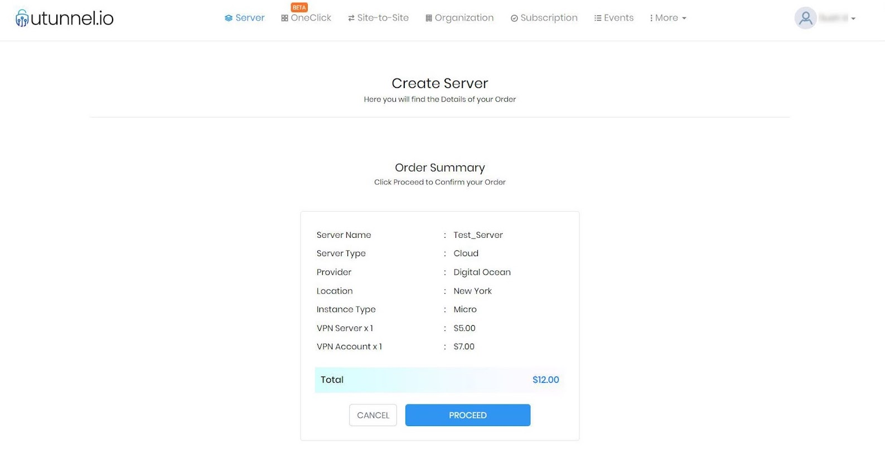

---
SPDX-License-Identifier: MIT
 path: "/tutorials/how-to-install-cloud-vpn-server-with-utunnel"
 slug: "thow-to-install-cloud-vpn-server-with-utunnel"
 date: "2023-03-28"
 title: "How to Deploy a VPN Server on Hetzner with UTunnel"
 short_description: "This tutorial explains how to install a VPN server on a Hetzner VPS using UTunnel’s cloud VPN as a service using 2 options - Integrated Cloud or BYOS." 
 tags: ["VPN", "Security",”Ubuntu”,"UTunnel"]
 author: "Dave Marques"
 Author_link: “https://github.com/utunnel”
 Author_img: “https://avatars.githubusercontent.com/u/89385187”
 author_description: "Technology enthusiast passionate about VPN and network security"
 language: "en"
 available_languages: ["en"]
 header_img: "header-2"
 cta: "cloud"
 ---

## Introduction

In this tutorial, you will learn how to deploy a Hetzner VPN server with [UTunnel](https://www.utunnel.io/) using two options - the **Integrated Cloud** option and **Bring Your Own Server** (BYOS or on-premise) option.

## 1. Integrated Cloud Option

The integrated cloud option is the easiest option to deploy your Hetzner VPN server, as the VPN deployment process is fully automated.

## Step 1 - Sign up with UTunnel and Login

* Log on to [utunnel.io](https://www.utunnel.io/) and sign up for a Personal or Organization account.

* After signing up, log in to the web dashboard/console.

## Step 2 - Choose your Server Specifications

* From the UTunnel dashboard, click on the **Create Server** button on the top right side of the page.


* Choose your preferred options below:

  * `Package` – Select your package as Basic/Standard based on your requirements
  * `Server type` – Choose your server type to be Cloud
  * `Server name` – Provide an easily identifiable name as the server name
  * `Provider` – Select the provider as Hetzner
  * `Location` – Choose a server location from the available geolocations
  * `Instance type` – Select an instance type depending on your requirements.
  * `VPN accounts` –  Choose the number of VPN user licenses required on the server.


* After configuring the options, click on the **Proceed** button to save the changes and move to the next step.

## Step 3 - Order confirmation and server deployment

* The Order Summary page lets you review your choices and confirm them by clicking on the **Proceed** button.



* You will be taken to the Payment Information page where you are required to key in your card details. After making the payment, your server in Hetzner will start deploying and be ready in a couple of minutes.

## 2. Bring Your Own Server(BYOS) / On-Premise Option

BYOS option lets you deploy a VPN server on a cloud VPS in your own Hetzner account. The prerequisite to this option is Ubuntu 20.04 running in your Hetzner VPS with a public IPv4 address.

## Step 1 - Sign up with Hetzner and deploy an instance

* Sign up with Hetzner, deploy an Ubuntu 20.04 instance, and note down its IP address.

## Step 2 - Sign up with UTunnel and Login

* Log on to utunnel.io and sign up for a Personal or Organization account.

* After signing up, log in to the web dashboard/console.

## Step 3 - Set up your Hetzner VPN server with UTunnel

* Proceed to create a new VPN server by clicking on the **Create Server** button on the UTunnel dashboard.


* You can customize your server settings by configuring the settings as follows:

  * `Select Package` – Select a package as Basic or Standard based on your requirements
  * `Server Type` – Choose the server type as on-premise
  * `Server Name` – Select an identifiable name for your server
  * `IP Address` – Input the IP address of your newly created Hetzner instance.
  * `VPN accounts` – Choose the number of VPN user licenses required on the server


* After configuring the options, click on the **Proceed** button to save the changes and move to the next step.

## Step 4 - Order confirmation and payment

* The Order Summary page lets you review your choices and confirm them by clicking on the **Proceed** button.


* You will be taken to the Payment Information page where you are required to key in your card details. After making the payment you will get a server `registration token` which is needed to register your VPN server.


## Step 5 - Registering your server

You can register your server by connecting your server via SSH and running the following commands.

* Create a directory named utunnel and make it the current working directory

```bash
sudo mkdir /utunnel && cd /utunnel
```

* Then download the required files and extract them

```bash
sudo wget https://files.utunnel.io/production/deploy/install_bundle_20.tar
```

```bash
sudo tar -xf install_bundle_20.tar
```

* Register your Hetzner VPN server after replacing YOUR_REG_TOKEN with the registration token you received earlier

```bash
sudo /utunnel/bin/utnservice register YOUR_REG_TOKEN
```

* Now start the VPN server

```bash
sudo /utunnel/bin/utnservice start
```

You have now successfully deployed a VPN server on your Hetzner VPS using the BYOS option.

## Conclusion

Once you create a Hetzner VPN server using the Integrated Cloud/BYOS option, you can install the UTunnel VPN client apps to connect to your newly created VPN server. Also, you can manage access to the VPN server for users and groups from the UTunnel web dashboard.

##### License: MIT

<!--
 
Contributor's Certificate of Origin
 
By making a contribution to this project, I certify that:
 
(a) The contribution was created in whole or in part by me and I have
 	the right to submit it under the license indicated in the file; or
 
(b) The contribution is based upon previous work that, to the best of my
 	knowledge, is covered under an appropriate license and I have the
 	right under that license to submit that work with modifications,
 	whether created in whole or in part by me, under the same license
 	(unless I am permitted to submit under a different license), as
 	indicated in the file; or
 
(c) The contribution was provided directly to me by some other person
 	who certified (a), (b) or (c) and I have not modified it.
 
(d) I understand and agree that this project and the contribution are
 	public and that a record of the contribution (including all personal
 	information I submit with it, including my sign-off) is maintained
 	indefinitely and may be redistributed consistent with this project
 	or the license(s) involved.
 
Signed-off-by: Dave Marques <dave@utunnel.io>
 
-->
