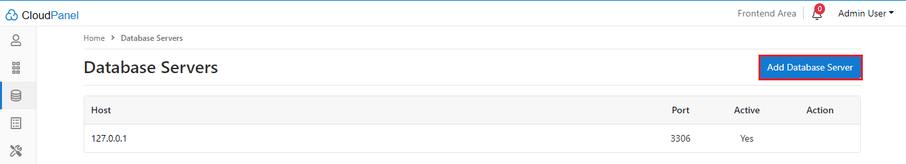

## Introduction

Welcome to the tutorial titled **How To Install CloudPanel on Debian 10**. CloudPanel is a modern server control panel with lightweight components for PHP applications with specific features for all major clouds.

**Features**

* Secure (free SSL/TLS certificates).
* High Performance.
* Ready to go within 1 minute.
* Supports all major clouds.
* Available in more than ten languages.

**Prerequisites**

For installing CloudPanel, you will need root access to your server.

CloudPanel needs very minimal system requirements for setup.

* You need an empty/fresh server with Debian 10 (Buster) with root access.
* You must have root access or access to a user with Sudo privileges.
* CPU: 2 vCores
* RAM: 2 GB
* Space: 20 GB

**Technology Stack**

The technology stack of CloudPanel consists of modern and lightweight components for maximum performance for PHP applications.

* Debian 10.
* NGINX 1.18 with PageSpeed Module.
* MySQL 5.7 (Percona).
* PHP [7.1 to 8.1].
* Redis 5
* ProFTPD 1.3
* Node.js 14
* Yarn 1.22

We are using the below terminology in this tutorial:

* Username: `root` (any root privileges user).
* Hostname: `cloudpanel-416cd680.nip.io` (you can set as you like).
* Domain: `cloudpanel-416cd680.nip.io` (you can set as you like).
* CloudPanel Username: `admin.user` (you can set as you like).

## Step 1 - Configure the hostname

**Important**: For hostname, use a sub-domain like hostname.domain.com. If you set your primary Domain (e.g. domain.com) as hostname, then you will not be able to use that Domain for the website inside the control panel.

```shell
hostnamectl set-hostname cloudpanel-416cd680.nip.io
```

for check hostname

```shell
hostnamectl
```

You can see as below output :


**Now, we will update our server using the below command.**

```shell
sudo apt update && sudo apt -y upgrade
```

**Install Wget and Curl**.

```shell
sudo apt -y install curl wget
```

Pre installations steps are completed, and now we will start CloudPanel installation.

## Step 2 - Install the latest version of CloudPanel

To start the CloudPanel installation, run the following command:

```shell
curl -sSL https://installer.cloudpanel.io/ce/v1/install.sh | sudo bash
```

Output looks like:


## Step 3 - Login CloudPanel & Create User

Your server is now set up and ready to use. You can log in at: <https://your-ip-or-URL:8443>.

CloudPanel use self signed certificate for SSL, so ignore "Your connection is not private" warning. When we log in the first time, we need to create an admin user.


Now enter all the required details like Name, User Name, Password, etc., to create an Admin account. Make sure you save this username and password.

Once your Account is successfully created, you can log in with your created admin user.


### Dashboard of CloudPanel

Your setup is now done! CloudPanel dashboard looks like this:


## Step 4 - Important Settings

* Secure server with Two-Factor authentication.

Go to **Account** under Admin User.


Click **Security** and enable **Two-Factor authentication**.


Using an authenticator app, scan the QR code. It will display a six digit code which you need to enter below.


* Block unwanted IP addresses.

Go to **Security** under navigation.


Add IP address whichever you want to block.


## Step 5 - Add Users

So, the basic setup is completed; let's add our users.

**SSH Users:**

* Go to **Users** under navigation.


Click to **Add User**, add username/password and save it.


**FTP Users:**

Go to **Users** under navigation (same as the above step). Select **FTP Users**. Fill up all Username/Password and home directory and click to **Add User**.


## Step 6 - Add a Domain

* We just created an Account. Now, Let's add Domain.

Go to **Domains** under navigation.


Fill up your domain name, select Vhost Template & PHP Version and click to **Add Domain**.


You can change domain settings; just click on the Domain link, and you will see domain setting as below:


## Step 7 - Add a Databases

Let's add our first database. For adding a new database, click the database icon.


Click on **Add Databases**, fill up database name, username, password and save it.


* PhpMyAdmin

Click on **phpMyAdmin** under databases for open PhpMyAdmin on new tab.


## Step 8 - File Manager

CloudPanel doesn't provide a File Manager; you have to use any FTP or File Manager tool (our recommendation is to use FileZilla) to manage your files.

## Step 9 - Cron Jobs

Cron Jobs are used for scheduling tasks to run on the server, with help of cron jobs, you can perform scheduling tasks to be executed sometime in the future.

* Go to **Cron Jobs** under navigation.


Click to **Add Cron Job**, add cron data and save it.


## Step 10 - Services

From here, you can check and restart services such as SQL, Nginx, PHP & Redis.


Services page looks like:


### **Admin Area**

We learned about Users, Domains, Databases, Cron, Jobs and Services. Now we look **Admin Area** of CloudPanel.

* Go to **Admin Area** to open it.


1. **Users** :

* You can Add or Delete users from here also; you can give admin roles.


2. **Vhost Templates** :

* You can Add or Delete Applications from here.


3. **database Servers** :

* You can Add or Delete Database Servers from here.



4. **Action Log** :

* You can check logs from here.


5. **Settings** :

* Last but not the least step, from here, you can change Proftpd settings.


## Conclusion

In this tutorial, we learned How To Install CloudPanel on Debian 10. Give it a try!

Cheers!!

### License: MIT

<!--
Contributor's Certificate of Origin
By making a contribution to this project, I certify that:
(a) The contribution was created in whole or in part by me and I have
    the right to submit it under the license indicated in the file; or
(b) The contribution is based upon previous work that, to the best of my
    knowledge, is covered under an appropriate license and I have the
    right under that license to submit that work with modifications,
    whether created in whole or in part by me, under the same license
    (unless I am permitted to submit under a different license), as
    indicated in the file; or
(c) The contribution was provided directly to me by some other person
    who certified (a), (b) or (c) and I have not modified it.
(d) I understand and agree that this project and the contribution are
    public and that a record of the contribution (including all personal
    information I submit with it, including my sign-off) is maintained
    indefinitely and may be redistributed consistent with this project
    or the license(s) involved.
Signed-off-by: Azad Shaikh mohd.azad.shaikh@gmail.com
-->
