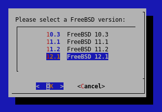
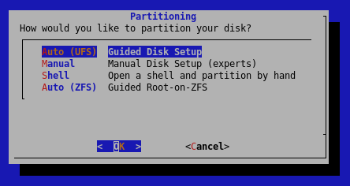
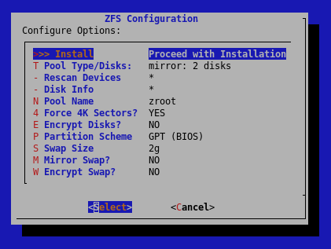

## Introduction

To install FreeBSD on one of your dedicated root servers, Hetzner Online provide some tools via the [FreeBSD Rescue System](https://docs.hetzner.com/robot/dedicated-server/operating-systems/freebsd-rescue-system).

The FreeBSD Rescue System is based on a minimal FreeBSD distribution that you can boot over the network via Hetzner Robot. This gives you the opportunity to repair your existing FreeBSD system in case of configuration errors or to install FreeBSD on your dedicated server.

**Please be aware that FreeBSD is primarily intended for advanced users.
Hetzner Online generally does not  support the FreeBSD installation and just the FreeBSD Rescue System is tested. Any problems that may arise must be solved by yourself.**

The FreeBSD images were created by the [mfsBSD image creation system](https://mfsbsd.vx.sk) developed by Martin Matuska.

### Prerequisites

A dedicated root server via Hetzner Robot is required. Also please see the official hardware requirements of FreeBSD at [https://docs.freebsd.org/en/books/handbook/bsdinstall/#bsdinstall-hardware](https://docs.freebsd.org/en/books/handbook/bsdinstall/#bsdinstall-hardware)

The FreeBSD Rescue System can currently only be started from Hetzner Robot.
If you are using the Hetzner Cloud, please use the appropriate netinstall images for installation of FreeBSD from [https://www.freebsd.org/where/](https://www.freebsd.org/where/).

## Step 1 - Activate the FreeBSD Rescue System

Log into Hetzner Robot to activate the FreeBSD Rescue System.

Click on the corresponding server in the server overview (menu "Server") and select the submenu "Rescue". Activate the FreeBSD Rescue System and restart your server (e.g. via SSH or, if the server is not available, via the "Reset" submenu with an "Automatic Hardware Reset").

You can then use the password you were given when you activated the FreeBSD Rescue System to log in to your server via SSH using the "root" user.

## Step 2 - Start the installation

In this article I would like to focus primarily on the installation using the `bsdinstallimage`.

Of course, you are free to decide for yourself which way you want to install.

### Option 1 - Using the Installation Program provided by Hetzner Online (`bsdinstallimage`)

The installation routine from the Hetzner Online program `bsdinstallimage` is based on the official `bsdinstall` of FreeBSD.

The program extends the installation routine with options like version, architecture and software packages. In addition, after installation, the root user is released for SSH login and possible security patches are applied. The source files are loaded from the official FreeBSD mirror.

To get started with the installation please execute the following command:

    bsdinstallimage

### Option 2- Using the Official Installation Program (`bsdinstall`)

I recommend that you use the installer mentioned above to install FreeBSD on your server.

If you wish to perform a manual installation, you can do so using the official installer `bsdinstall` inside the FreeBSD Rescue System.

Please refer to the official documentation of FreeBSD for instructions: [https://www.freebsd.org/doc/en/books/handbook/bsdinstall.html](https://www.freebsd.org/doc/en/books/handbook/bsdinstall.html)

## Step 3 - Pre-installation with recommended defaults

The following options and settings are created by me as of March 2021, but are only examples to explain the installation. The values should be replaced with content that meets your requirements, if necessary.

### Step 3.1 - Select FreeBSD version & architecture

First you will be asked which version of FreeBSD you wish to use, I recommend to use the **latest 12.2 release** and select **64-bit as architecture** in the next dialog.

The currently supported FreeBSD versions can be found here: [https://www.freebsd.org/security/#sup](https://www.freebsd.org/security/#sup)

### Step 3.2 - Further options for pre-installation

In the next steps you will be asked to select your keyboard layout and set a hostname for this server.

Then you can select additional system components for installation if necessary. However, for most applications, the standard selection is sufficient.

## Step 4 - Partitioning

The partitioning inside of the FreeBSD installer can be done in different ways.

### Decision finding: UFS or ZFS

Most FreeBSD users use ZFS in association with the FreeBSD operating system, but here is a summary of the differences between the two file systems.

 - **ZFS** is an open source software combined file system that supports high storage capacities and has a capacity that is so large that any limitations set on it are never reached.
 - **UFS** is a file system unique to UNIX and is a removed descendant of the original Version 7 UNIX file system it contains a collection of cylinder groups.

*Detailed information on the differences between the two file systems can be found under this useful link: [https://askanydifference.com/difference-between-zfs-and-ufs/](https://askanydifference.com/difference-between-zfs-and-ufs/)*

As mentioned before, I will use ZFS in this case since it is used in most cases with FreeBSD. After selecting "Auto (ZFS)" the installation program asks you about the ZFS pool settings. If you need to change some settings as you like, you can adjust the values.

At least I recommend to use the "mirror"-option at Pool Type to guarantee the data integrity of your servers files and avoid any data loss caused by e.g. a drive failure.

Once you have adjusted all settings to your needs, you can proceed to start the installation. Please note that the installation can take some time to finish.

## Step 5 - During the installation

### Step 5.1 - Setting the root password

After the base core was installed successfully the program asks you about setting a new root password for using SSH. I recommend you take advantage of SSH keys to secure your server. You can find some details inside of this good article: [https://community.hetzner.com/tutorials/securing-ssh](https://community.hetzner.com/tutorials/securing-ssh)

### Step 5.2 - Network settings

Later on this process may ask you about the primary network controller and about the IP address information as well. In most cases you can receive this information by DHCP directly from the installer. Alternatively you can configure the network settings also to a static configuration.

You can find the IP address information in Hetzner Robot when hovering over the single IP address.

### Step 5.3 - Additional options

Once the base core installation is done, you can go on with various changes to the installed system like adding another user account or hardening security options. Also the program will apply some post-installation processes to enable SSH for you and install the latest security patches (if available).

## Step 6 - Finishing up

After all parts of the `bsdinstallimage` are done successfully you can restart the server via the command `reboot` to load your newly installed operating system.

## Conclusion

Please note that you can adjust the settings to your needs at any time during the installation.

For more details on installing and using FreeBSD, please refer to the official documentation at [https://docs.freebsd.org/en/books/handbook/index.html](https://docs.freebsd.org/en/books/handbook/index.html).

##### License: MIT

<!--

Contributor's Certificate of Origin

By making a contribution to this project, I certify that:

(a) The contribution was created in whole or in part by me and I have
    the right to submit it under the license indicated in the file; or

(b) The contribution is based upon previous work that, to the best of my
    knowledge, is covered under an appropriate license and I have the
    right under that license to submit that work with modifications,
    whether created in whole or in part by me, under the same license
    (unless I am permitted to submit under a different license), as
    indicated in the file; or

(c) The contribution was provided directly to me by some other person
    who certified (a), (b) or (c) and I have not modified it.

(d) I understand and agree that this project and the contribution are
    public and that a record of the contribution (including all personal
    information I submit with it, including my sign-off) is maintained
    indefinitely and may be redistributed consistent with this project
    or the license(s) involved.

Signed-off-by: Marcel Deglau <marcel.deglau@hetzner.com>

-->
