## Introduction

Welcome to the tutorial titled **How To Install ISPConfig on Ubuntu 20.04 LTS**. ISPConfig is an open-source hosting control panel for Linux distributors. ISPConfig allows administrators to manage websites, email addresses, MySQL and MariaDB databases, FTP accounts, Shell accounts and DNS records through web-based UI. ISPConfig supports Linux-based operating systems like CentOS, Debian, Fedora, OpenSUSE and Ubuntu.

**Features**

Below are some of the best features supported by ISPConfig.

 * You can manage single or multiple servers from one control panel. Using Master/Slave Setup
 * Complete Web Server management for both Apache and Nginx servers.
 * Mail server management with spam and antivirus filter using Postfix (MTA) and Dovecot (IMAP).
 * BIND Server and DNS server management.
 * Administrator, Reseller, Client and Mail-user login accounts.
 * Website statistics with Webalizer and AWStats.

**Prerequisites**

ISPConfig needs very minimal system requirements for basic setup.

 * CPU: 2 vCores
 * RAM: 2 GB
 * Space: 20 GB

We are using the below terminology in this tutorial:

* Username: `root` (any root privileges user).
* Hostname: `ispconfig.example.com` (you can set as you like).
* Domain: `example.com` (you can set as you like).
* ISPConfig Username: `Admin` (default user).
   
## Step 1 - Login server as root.

For installing ISPConfig, you will need root access to your server. Log in as root or user with root access to the server. Fire below command to switch to root user.

``` su -``` OR ``` sudo su```

## Step 2 - Configure the hostname and hosts ( this is optional).

We use nano editor, but you can use your favourite.

```shell 
nano /etc/hosts
```

You can see as below output :

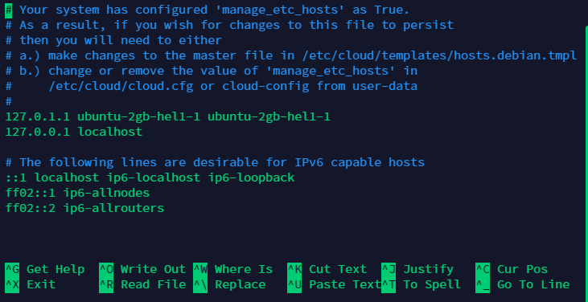

It might be a different output base of your server provider. Now edit the /etc/hosts file :

#### for an example we used ispconfig.example.com ####


To save your edits, press Ctrl + X, then Y and hit Enter.

#### now edit /etc/hostname file for setup hostname of server:

```shell
nano /etc/hostname
```

You will have to reboot the server to apply this change.

```shell
systemctl reboot
```
    
Before going further, we will check if the hostname is correct.

```shell
hostname
```

OR

```shell
hostname -f
```
    
The output shall be like this:

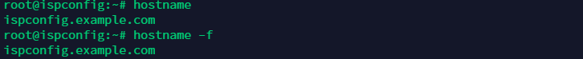
    
 Now we will update and upgrade our server using the below command.

```shell
apt update && apt upgrade
```
Pre installations steps are completed, and now we will start ISPConfig installation on Ubuntu 20.04 LTS.

## Step 3 - Run installer for ISPConfig.

For this tutorial, we will install ISPConfig with Nginx, PHP (7.4 and 8.0), MariaDB, Postfix, Dovecot, Rspamd, BIND, Jailkit, Roundcube, PHPMyAdmin, Mailman, Webalizer, AWStats and GoAcces. If you want a different configuration, then check out all the options mentioned at the end of this tutorial.

```shell
wget -O - https://get.ispconfig.org | sh -s -- --use-nginx  --use-php=7.4,8.0 --use-ftp-ports=21-22 --lang=en --no-quota --unattended-upgrades
```
     
After a few seconds, Installer will confirm about installing ISPConfig. Write "yes" and hit Enter.


* ### Save Admin and MySQL password.

Once installation is successfully completed. You will see the admin and MySQL root password. Save your ISPConfig passwords safely; you need it for login.
 


## Step 4 - Login ISPConfig

Your server is now set up and ready to use. You can log in at : 
https://your-ip-or-URL:8080

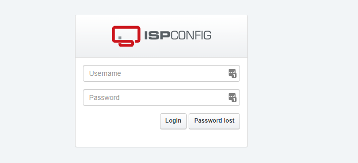

Use your credentials for login. The default username is **admin** and password displayed on Step 3.

## First view of ISPConfig.

Your setup is now done! Now you can create a user, website and host your website. ISPConfig dashboard looks like this:

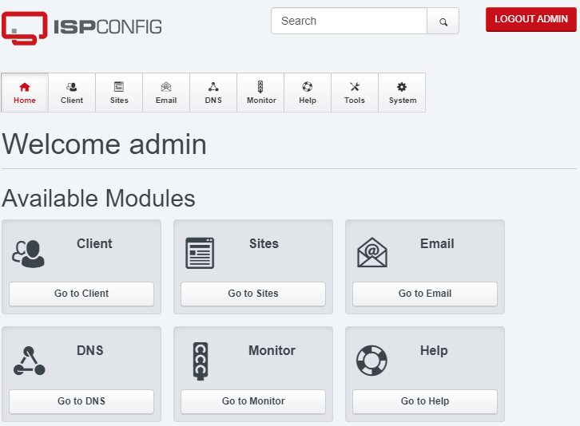

## Step 5 - Important Setting You Should Know and Do.

 * Change password under **Tools** tab.

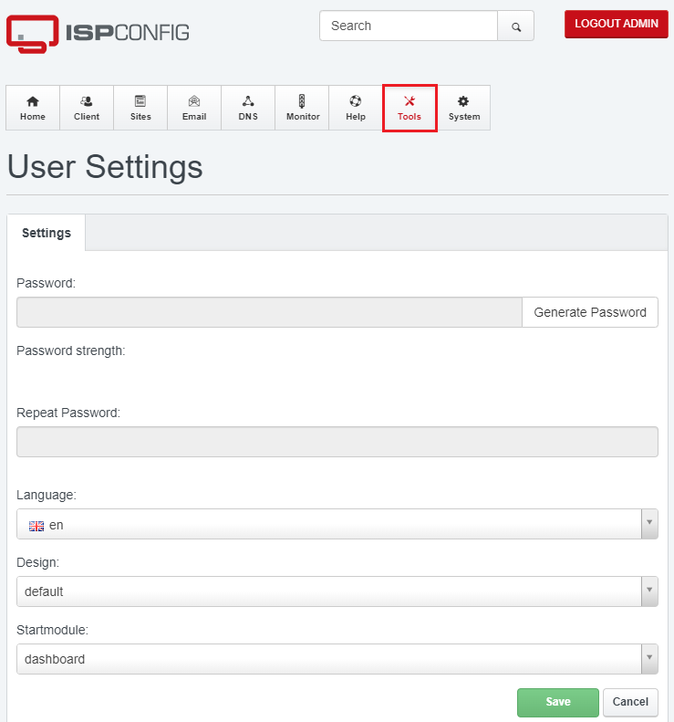

 * Setup firewall under **System** tab, click on **Add Firewall record**.

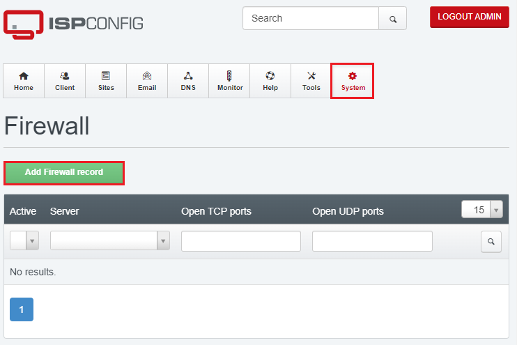

 * Change or update port as your requirement. 
 * **Note : make sure ports are open on your server before updating**.

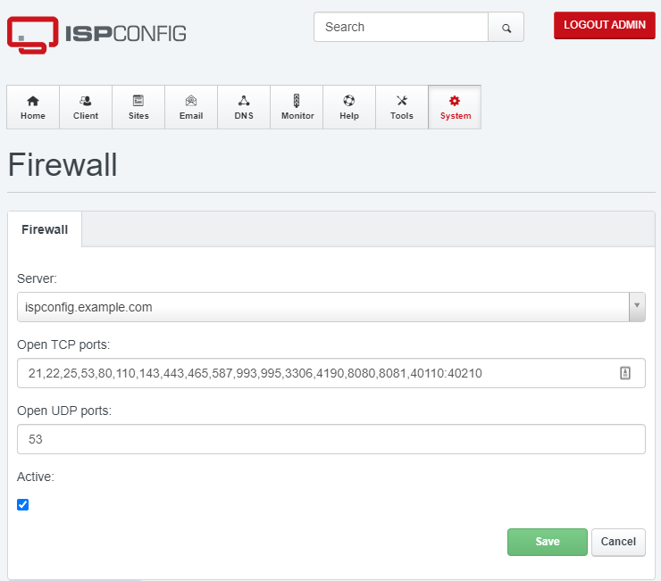


## Step 6 - Add client.

So, all are done; let's add our first Client. 

* Go to **Client**.

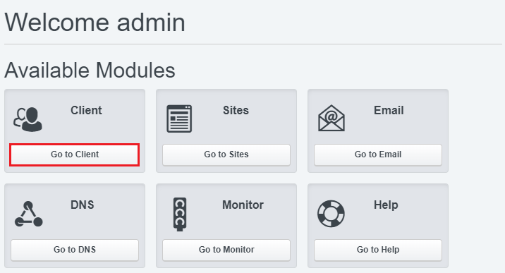

 * Now go to **Add new Client**.
 
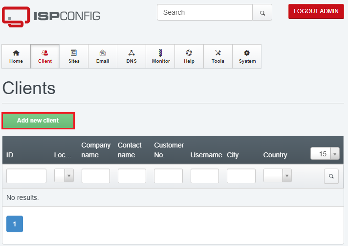

 * Fill all details like username,password & basic information about Client.

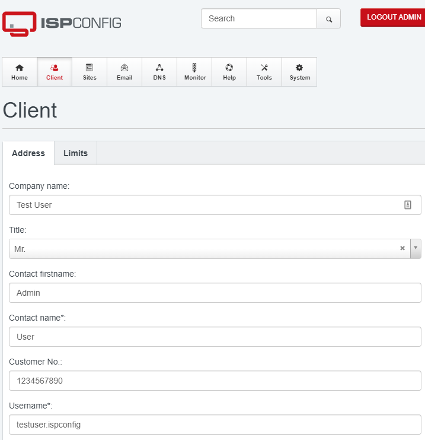

## Step 7 - Add a Site.

We just created a Client. Now, log in as the user and click **Go to Sites**.

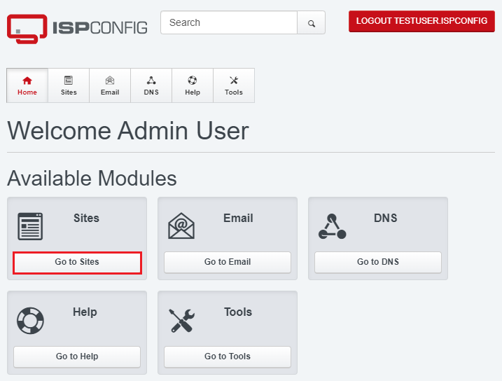

 * Fill details like Domain, Space, Traffic Quota, PHP Version and hit **Save**.

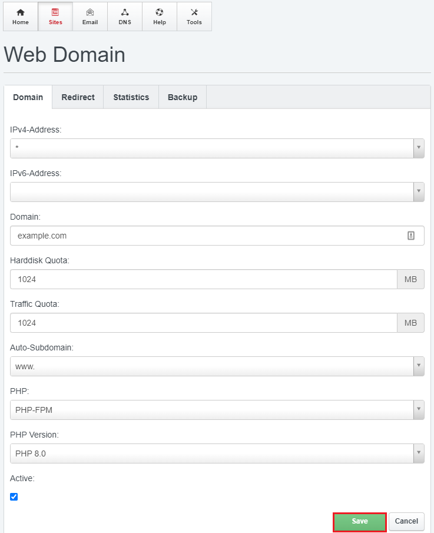

 * sites are listed under the **Go to Sites** tab. Click to view icon for the open site on a new tab.

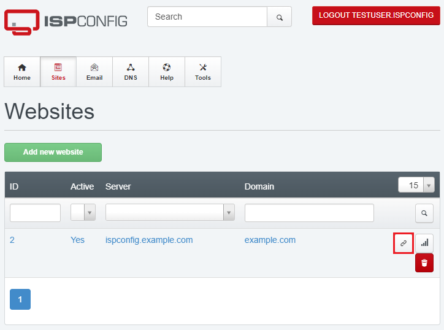

 * Your webpage will looks like this:

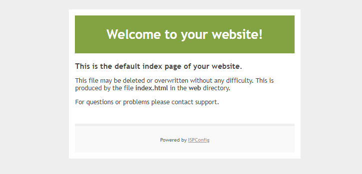


## Bonus.

* If you want to install Nginx + PHP (7.0 or older) without mail service, use this command:

```shell
wget -O - https://get.ispconfig.org | sh -s -- --use-nginx  --use-php=5.5,5.6,7.0--use-ftp-ports=21-22 --no-mail --lang=en --no-quota --unattended-upgrades
```

 * If you want to install Apache instead of Nginx, use this command:

```shell
wget -O - https://get.ispconfig.org | sh -s --  --use-php=7.4,8.0 --use-ftp-ports=21-22 --lang=en --no-quota --unattended-upgrades
```

## Command-line Arguments.

The auto-installer has various command-line options to fine-tune the setup. You can, e.g. choose between Apache and Nginx webserver and which services shall be installed on the system.

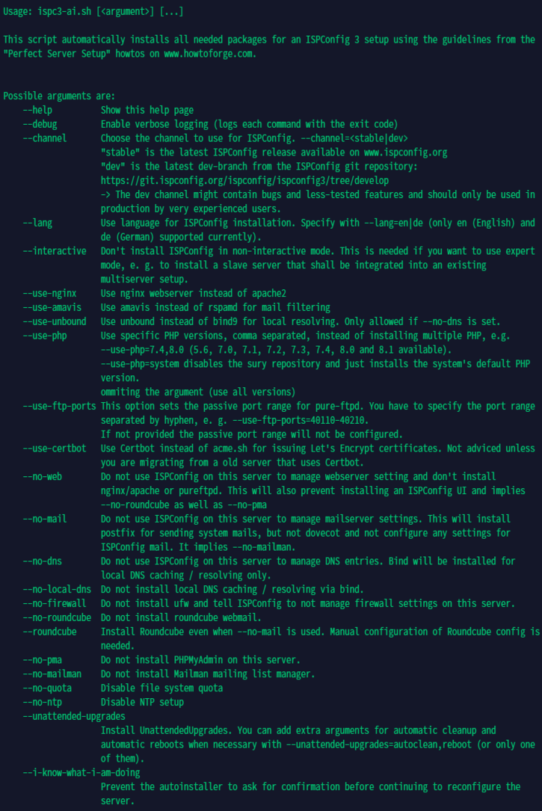

## Conclusion

In this tutorial, we learned how to install ISPConfig on Ubuntu 20.04. ISPconfig works really well with [Hetzner VPS](https://www.hetzner.com/cloud). Give it a try!

Cheers!
