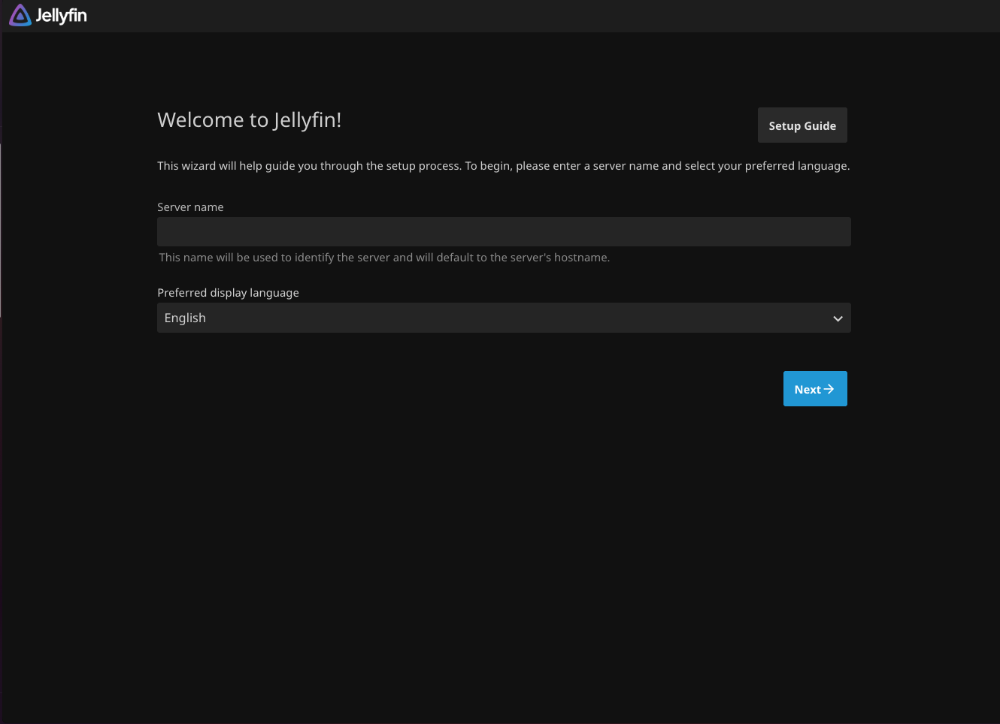

## Introduction

> Jellyfin is a free and open-source media server which allows you to organize, save, and watch your own media, movies, TV shows, music, and much more, all from a web browser or one of Jellyfin's client apps. In this tutorial, I'll be walking you through how to install Jellyfin onto your Ubuntu server, and get it up-and-running so you can access your media from anywhere in the world!

**Prerequisites**

- An user that has `sudo` privileges.
- If a firewall is enabled (e.g., [Hetzner Console's firewall](https://docs.hetzner.com/cloud/firewalls/getting-started/creating-a-firewall) or UFW), ensure that TCP port `8096` is open.
    - Hetzner Console's firewall: `<your-project>` -> Firewalls -> Add an inbound rule for the TCP port `8096`
    - UFW: `sudo ufw allow 8096/tcp`

## Installation Pathway

There are 2 different ways that you can go about installing Jellyfin, covered individually by these steps:
- **Option 1**: Using the Jellyfin `bash` script
- **Option 2**: Installing Jellyfin manually

For beginners new to Jellyfin or Linux administration, I'd personally recommend Option 1 due to its simplicity, but you can choose whichever installation method you choose!

## Option 1 - Using the Jellyfin `bash` script

From personal experience, this is the easiest way to get Jellyfin installed, by far.

To start off with, it's always good practise to go ahead and update your package index files:

```bash
sudo apt update
```

Next up, run Jellyfin's `bash` script:

```bash
curl https://repo.jellyfin.org/install-debuntu.sh | sudo bash
```

You should see something similar to this:

```bash
Found the following details from '/etc/os-release':
  Real OS:            ubuntu
  Repository OS:      ubuntu
  Repository Release: noble
  CPU Architecture:   amd64
If this looks correct, press <Enter> now to continue installing Jellyfin. 
```

Now, hit Enter on your keyboard, and Jellyfin should begin to install!

Once the installation is complete, you should be left with something like this:

```bash
-------------------------------------------------------------------------------
● jellyfin.service - Jellyfin Media Server
    Loaded: loaded (/usr/lib/systemd/system/jellyfin.service; enabled; preset: enabled)
    Drop-In: /etc/systemd/system/jellyfin.service.d
            └─jellyfin.service.conf
    Active: active (running)
    CGroup: /system.slice/jellyfin.service
            └─2073 /usr/bin/jellyfin --webdir=/usr/share/jellyfin/web --ffmpeg=/usr/lib/jellyfin-ffmpeg/ffmpeg

Nov 04 15:00:00 <your_host> jellyfin[2073]: [15:00:00] [INF] Clean Transcode Directory Completed after 0 minute(s) and 0 seconds
Nov 04 15:00:00 <your_host> jellyfin[2073]: [15:00:00] [INF] Clean up collections and playlists Completed after 0 minute(s) and 0 seconds
Nov 04 15:00:00 <your_host> jellyfin[2073]: [15:00:00] [INF] Update Plugins Completed after 0 minute(s) and 0 seconds
Nov 04 15:00:00 <your_host> jellyfin[2073]: [15:00:00] [INF] FFmpeg: /usr/lib/jellyfin-ffmpeg/ffmpeg
Nov 04 15:00:00 <your_host> jellyfin[2073]: [15:00:00] [INF] Core startup complete
Nov 04 15:00:00 <your_host> jellyfin[2073]: [15:00:00] [INF] Startup complete 0:00:07.4804623
Hint: Some lines were ellipsized, use -l to show in full.
-------------------------------------------------------------------------------

You should see the service as 'active (running)' above. If not, use https://jellyfin.org/contact to find us for troubleshooting.

You can access your new instance now at http://<10.0.0.1>:8096 in your web browser to finish setting up Jellyfin.

Thank you for installing Jellyfin, and happy watching!
```

Finally, if all looks well here, then you should be able to navigate to `http://<your-server-ip>:8096`, and be greeted with the Jellyfin setup screen!

> **Important**:
> Ensure your firewall is properly configured for Jellyfin beforehand.

> 

## Option 2 - Installing Jellyfin manually

To start off with, it's always good practise to go ahead and update your package index files:

```bash
sudo apt update
```

Next, install `curl`, as well as `gnupg`, if they aren't already installed:

```bash
sudo apt install curl gnupg
```

Now, we'll add the `universe` repository to get all the dependencies we need for FFmpeg:

```bash
sudo add-apt-repository universe
```

Next, we need to download & setup Jellyfin's GPG signing keys:

```bash
sudo mkdir -p /etc/apt/keyrings
curl -fsSL https://repo.jellyfin.org/jellyfin_team.gpg.key | sudo gpg --dearmor -o /etc/apt/keyrings/jellyfin.gpg
```

And finally, we now need to add a repository configuration for Jellyfin:

```bash
export VERSION_OS="$( awk -F'=' '/^ID=/{ print $NF }' /etc/os-release )"
export VERSION_CODENAME="$( awk -F'=' '/^VERSION_CODENAME=/{ print $NF }' /etc/os-release )"
export DPKG_ARCHITECTURE="$( dpkg --print-architecture )"
cat <<EOF | sudo tee /etc/apt/sources.list.d/jellyfin.sources
Types: deb
URIs: https://repo.jellyfin.org/${VERSION_OS}
Suites: ${VERSION_CODENAME}
Components: main
Architectures: ${DPKG_ARCHITECTURE}
Signed-By: /etc/apt/keyrings/jellyfin.gpg
EOF
```

Now, we can update our package index files once again:

```bash
sudo apt update
```

And finally, we can install Jellyfin:

```bash
sudo apt install jellyfin-server jellyfin-web
```

Now that everything's installed, we can verify that all went well by checking the status of Jellyfin's `systemd` service:

```bash
sudo systemctl status jellyfin
```

You should see something along the lines of this:

```bash
holu@<your_host>:~$ systemctl status jellyfin
● jellyfin.service - Jellyfin Media Server
    Loaded: loaded (/usr/lib/systemd/system/jellyfin.service; enabled; preset: enabled)
    Drop-In: /etc/systemd/system/jellyfin.service.d
            └─jellyfin.service.conf
    Active: active (running)
    CGroup: /system.slice/jellyfin.service
            ├─1793 /usr/bin/jellyfin --webdir=/usr/share/jellyfin/web --ffmpeg=/usr/lib/jellyfin-ffmpeg/ffmpeg
            └─1862 /usr/lib/jellyfin-ffmpeg/ffmpeg -hide_banner -f lavfi -i nullsrc=s=1x1:d=10000 -f null -

Nov 04 15:00:00 <your_host> jellyfin[1793]: [15:00:00] [WRN] The WebRootPath was not found: /var/lib/jellyfin/wwwroot. Static files may be unavailable.
Nov 04 15:00:00 <your_host> jellyfin[1793]: [15:00:00] [INF] Running startup tasks
Nov 04 15:00:00 <your_host> jellyfin[1793]: [15:00:00] [INF] Daily trigger for Generate Trickplay Images set to fire at 2025-11-05 03:00:00.000 +00:00, which is 04:06:38.7622511 from now.
Nov 04 15:00:00 <your_host> jellyfin[1793]: [15:00:00] [INF] Daily trigger for Extract Chapter Images set to fire at 2025-11-05 02:00:00.000 +00:00, which is 03:06:38.7605042 from now.
Nov 04 15:00:00 <your_host> jellyfin[1793]: [15:00:00] [INF] Found ffmpeg version 7.1.2
```

> **Important**:
> Ensure your firewall is properly configured for Jellyfin beforehand.

Finally, if all looks well here, then you should be able to navigate to `http://<your-server-ip>:8096`, and be greeted with the Jellyfin setup screen!

> 

## Conclusion

> Congratulations, you've done it! You now have Jellyfin installed and running on your server, and you're ready to load it up with all your favourite media and get watching!

**Useful resources:**

* [Jellyfin Support](https://jellyfin.org/contact)
* [Jellyfin Server](https://github.com/jellyfin/jellyfin)
* [Awesome Jellyfin](https://github.com/awesome-jellyfin/awesome-jellyfin)

##### License: MIT

<!--

Contributor's Certificate of Origin

By making a contribution to this project, I certify that:

(a) The contribution was created in whole or in part by me and I have
    the right to submit it under the license indicated in the file; or

(b) The contribution is based upon previous work that, to the best of my
    knowledge, is covered under an appropriate license and I have the
    right under that license to submit that work with modifications,
    whether created in whole or in part by me, under the same license
    (unless I am permitted to submit under a different license), as
    indicated in the file; or

(c) The contribution was provided directly to me by some other person
    who certified (a), (b) or (c) and I have not modified it.

(d) I understand and agree that this project and the contribution are
    public and that a record of the contribution (including all personal
    information I submit with it, including my sign-off) is maintained
    indefinitely and may be redistributed consistent with this project
    or the license(s) involved.

Signed-off-by: Zayaan AR - zayaanar@atomlabs.ie

-->