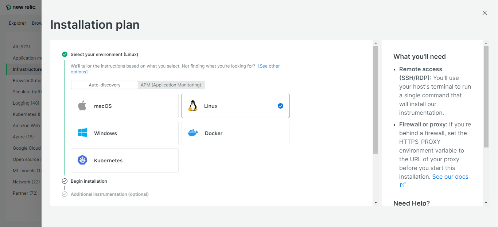
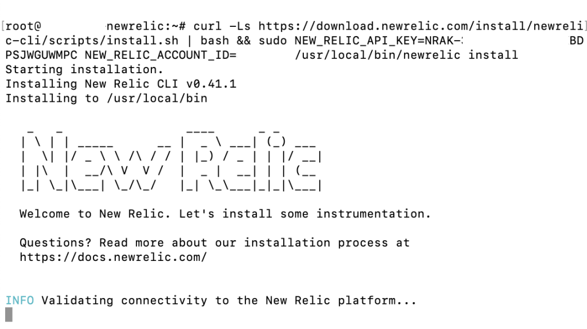
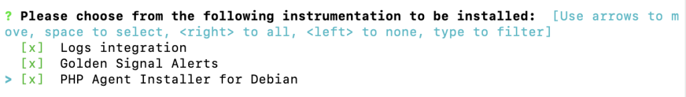
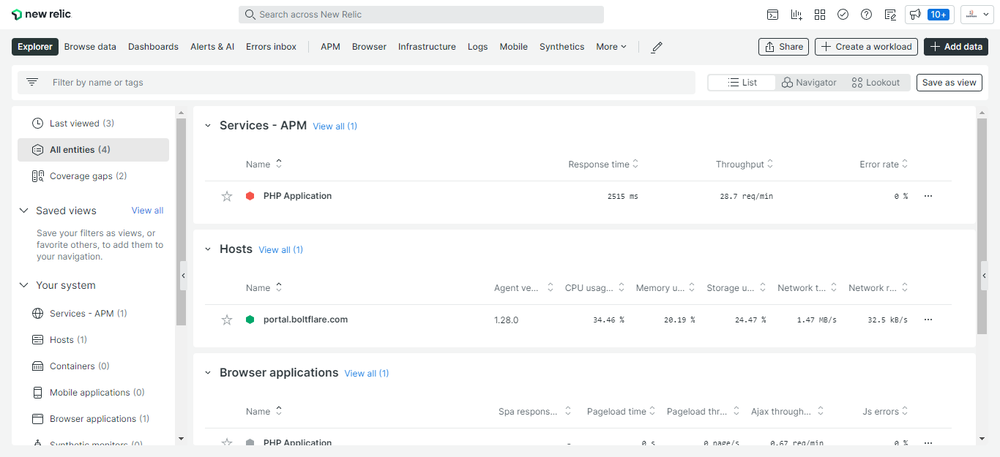

## Introduction

New Relic is an excellent tool for performance testing and monitoring. This post will teach you how to install New Relic on your Linux VPS hosted on Hetzner Cloud.


## Step 1 - `Create a New Relic Account`


Before we can install New Relic on your server, you must first register an account on their website. They understand the importance of providing a free plan so that you can get started with that plan if you're just seeking to explore with the insights that their platform can provide. 


## Step 2 - `Choose an Installation Environment`

After you complete creating and validating your account, you will be required to select a "Installation Plan." Here, you should pick Auto-discovery and Linux:



### Step 2.1 - `SSH Into Your Server`

SSH into your server now. You will need to use a user with sudo access to do so.

```shell
ssh root@<your_host>
```

When prompted enter your password. 

### Step 2.2 - `Execute the New Relic Installation Script.`

After you've successfully logged in, run the installation command from New Relic's dashboard, which will look something like this:

```shell
curl -Ls https://download.newrelic.com/install/newrelic-cli/scripts/install.sh | bash && sudo NEW_RELIC_API_KEY=NRAK-D8RRVQ--------------HC8KS8AI NEW_RELIC_ACCOUNT_ID=------ /usr/local/bin/newrelic install
```
The New Relic installation process will then begin.



Which will begin by confirming connectivity to the New Relic platform...

At this point, click Enter to begin the guided installation, which will automatically locate and propose the integrations suitable for your web application. This will also add infrastructure and log data, both of which will be very important for performance monitoring.





Respond with the keyword "all" (without the double quotation marks), as demonstrated above, and the New Relic installer will be able to locate all instances of PHP on the server.

Following that, you will receive a success message that reads as follows:

```shell
New Relic is now installed on your system. Congratulations!
```

## Conclusion

That's all there is to it - you're done! Your New Relic account is currently gathering and monitoring data from your server.



##### License: MIT

<!--

Contributor's Certificate of Origin

By making a contribution to this project, I certify that:

(a) The contribution was created in whole or in part by me and I have
    the right to submit it under the license indicated in the file; or

(b) The contribution is based upon previous work that, to the best of my
    knowledge, is covered under an appropriate license and I have the
    right under that license to submit that work with modifications,
    whether created in whole or in part by me, under the same license
    (unless I am permitted to submit under a different license), as
    indicated in the file; or

(c) The contribution was provided directly to me by some other person
    who certified (a), (b) or (c) and I have not modified it.

(d) I understand and agree that this project and the contribution are
    public and that a record of the contribution (including all personal
    information I submit with it, including my sign-off) is maintained
    indefinitely and may be redistributed consistent with this project
    or the license(s) involved.

Signed-off-by: [submitter's name and email address here]

-->