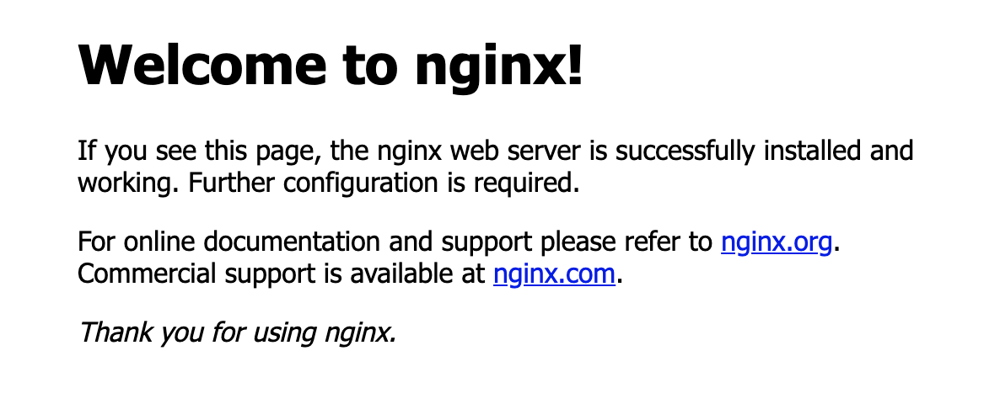

## Introduction

In this tutorial you will learn how to setup a ubuntu server. This includes how to create a non-root user, enable SSH login, disable root login and enabling a rudimentary firewall.


The first paragraph or paragraphs are there for you to explain what your tutorial will do. Please don't simply list the steps you will be following, a table of contents (TOC) with the steps will be automatically added.
Make sure users know exactly what they will end up with if they follow your tutorial, and let them know if they need any specific prerequisites.
You can link to other tutorials that your tutorial builds on, and add recommendations for what users should know.

**Prerequisites**

* [Setup Ubuntu 20.04](https://community.hetzner.com/tutorials/setup-ubuntu-20-04)


Example terminology that you can use in the tutorial:

* Username: `holu` (short for Hetzner OnLine User)
* Hostname: `<your_host>`
* Domain: `<example.com>`
* Subdomain: `<sub.example.com>`
* IP addresses (IPv4 and IPv6):
   * Server: `<10.0.0.1>` and `<2001:db8:1234::1>`
   * Gateway `<192.0.2.254>` and `<2001:db8:1234::ffff>`
   * Client private: `<198.51.100.1>` and `<2001:db8:9abc::1>`
   * Client public: `<203.0.113.1>` and `<2001:db8:5678::1>`

## Step 1 - Login to server

Now login to your server with your non-root user:

```shell
ssh holu@10.0.0.1
```

## Step 1.1 - Update your server

After a successful login, we need to update our server. 

For this we run the following command:

```shell
holu@10.0.0.1:~$ sudo apt-get update && sudo apt-get upgrade -y
```

## Step 2 - Install Nginx

We will install ```Nginx``` with the help of ```apt```.

For this execute the following command:

```shell
holu@10.0.0.1:~$ sudo apt install nginx
```

## Step 3 - Updating the firewall

In the previous tutorial we set up a firewall, which blocks all connections except the ones from ```OpenSSH```.

Now, to be able to use ```Nginx``` we need to allow it within the firewall.

## Step 3.1 - List available ufw applications

To know what to activate within ```ufw``` we will first list all available applications, which we could enable.

```shell
holu@10.0.0.1:~$ sudo ufw app list
```

This will propably lead to the following output:
```shell
Available applications:
  Nginx Full
  Nginx HTTP
  Nginx HTTPS
  OpenSSH
```

- ```Nginx HTTP``` will only allow http traffic and will open for this port 80.
- ```Nginx HTTPS``` will only allow https traffic and will open for this port 443.
- ```Nginx Full``` will allow both http and https traffic and will open port 80 and 443.

You should only allow the most restrictive option for production. But we are still testing things out and haven't setup yet ```SSL``` therefore we will choose the option ```Nginx HTTP```.

## Step 3.2 - Adapt the ufw configuration

Run the following command and set your individual option:

```shell
holu@10.0.0.1:~$ sudo ufw allow 'Nginx HTTP'
```

Confirm your changes by running the following command:

```shell
holu@10.0.0.1:~$ sudo ufw status
```

It should output the following:

```shell
Status: active

To                         Action      From
--                         ------      ----
OpenSSH                    ALLOW       Anywhere
Nginx HTTP                 ALLOW       Anywhere
OpenSSH (v6)               ALLOW       Anywhere (v6)
Nginx HTTP (v6)            ALLOW       Anywhere (v6)
```

## Step 4 - Check Nginx

Now that the firewall allows ```HTTP``` connections to ```Nginx``` we can check if everything works correct.

For this we're going to check the status of ```Nginx``` with the ```systemd``` service:

```shell
holu@10.0.0.1:~$ systemctl status nginx
```

And if everything worked out correct, this should be your output:

```shell
● nginx.service - A high performance web server and a reverse proxy server
     Loaded: loaded (/lib/systemd/system/nginx.service; enabled; vendor preset: enabled)
     Active: active (running) since Sat 2021-08-21 17:54:37 CEST; 21min ago
       Docs: man:nginx(8)
   Main PID: 6370 (nginx)
      Tasks: 2 (limit: 2280)
     Memory: 4.1M
     CGroup: /system.slice/nginx.service
             ├─6370 nginx: master process /usr/sbin/nginx -g daemon on; master_process on;
             └─6371 nginx: worker process
```

We can also verify the status by navigating to our ```IP``` adress in the browser:

```
http://10.0.0.1
```

You should be greeted by the following message:



## Step 5 - Configuring a website

#TODO

## Conclusion

A short conclusion summarizing what the user has done, and maybe suggesting different courses of action they can now take.

##### License: MIT

<!--

Contributor's Certificate of Origin

By making a contribution to this project, I certify that:

(a) The contribution was created in whole or in part by me and I have
    the right to submit it under the license indicated in the file; or

(b) The contribution is based upon previous work that, to the best of my
    knowledge, is covered under an appropriate license and I have the
    right under that license to submit that work with modifications,
    whether created in whole or in part by me, under the same license
    (unless I am permitted to submit under a different license), as
    indicated in the file; or

(c) The contribution was provided directly to me by some other person
    who certified (a), (b) or (c) and I have not modified it.

(d) I understand and agree that this project and the contribution are
    public and that a record of the contribution (including all personal
    information I submit with it, including my sign-off) is maintained
    indefinitely and may be redistributed consistent with this project
    or the license(s) involved.

Signed-off-by: Johannes Pirmann johannes.pirmann@gmail.com

-->
