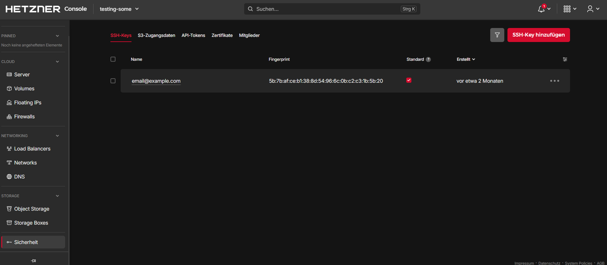
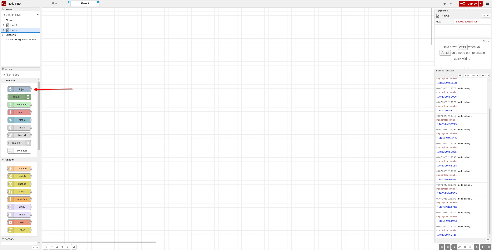
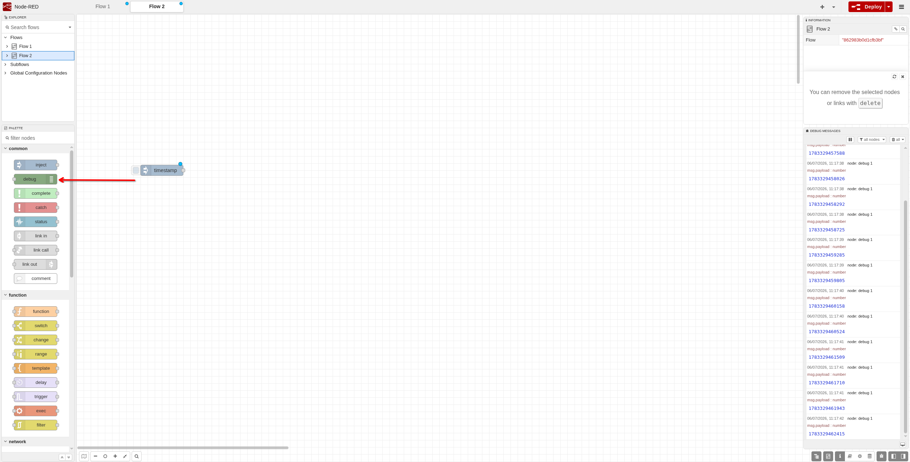
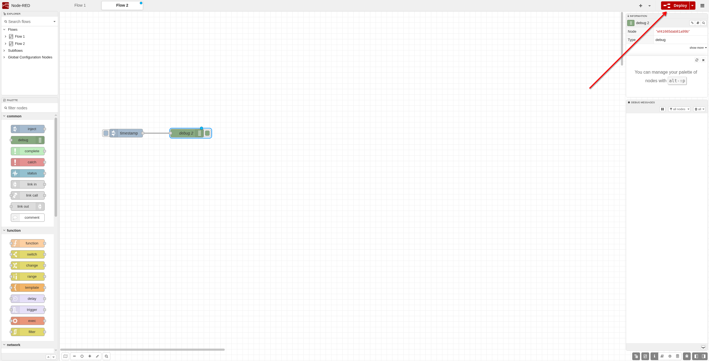
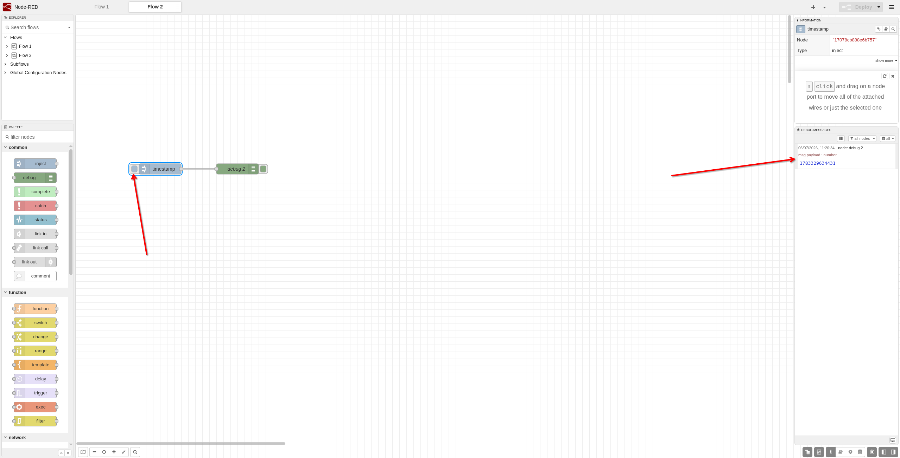

## Introduction

Node-RED is a powerful [open-source platform](https://github.com/node-red/node-red) designed for building data-driven applications and automated workflows. With its visual, low-code interface, Node-RED enables users of all skill levels to:
- Collect and transform data from various sources
- Create visual workflows without extensive coding
- Build IoT solutions, home automation systems, and industrial control applications
- Automate repetitive tasks and processes

This tutorial will guide you through installing Node-RED on a Debian server using Docker, which simplifies deployment and ensures consistent environments across different systems.

**Prerequisites**

To follow this tutorial, you'll need:
* 1 cloud server (e.g. from [Hetzner Cloud](https://docs.hetzner.com/cloud/servers/getting-started/creating-a-server))
  * Debian 13 as the operating system
  * Root access or a user account with sudo privileges
  * Basic familiarity with command-line interfaces

## Step 1 - Set Up SSH Access

SSH (Secure Shell) provides encrypted access to your server. You'll need an SSH key pair to securely connect.

### Create an SSH key pair (if you don't already have one)

On your local machine, run:

```bash
ssh-keygen -t ed25519 -C "your-email@example.com"
```

This creates:
- Private key: `~/.ssh/id_ed25519` (keep this secret!)
- Public key: `~/.ssh/id_ed25519.pub` (share this with servers)

### Add your SSH key to Hetzner Cloud

1. Open the [Hetzner Console](https://console.hetzner.com/)
2. Select a project
3. Navigate to **Security** → **SSH Keys**
4. Click **Add SSH Key**
5. Copy the contents of `~/.ssh/id_ed25519.pub` and paste it into the console
6. Give it a memorable name



### Create and connect to your server

1. In Hetzner Console, create a new server
2. Select **Debian 13** as the operating system
3. Under **SSH Keys**, select the key you just added
4. Click **Create & Buy Now**
5. Wait for the server to be created and note its IP address

### Connect via SSH

Open your terminal and run (replace `203.0.113.1` with your server's actual IP address):

```bash
ssh root@203.0.113.1
```

You should now be connected to your server.

Create a sudo user and connect to it:

```bash
adduser holu
usermod -aG sudo holu
rsync --archive --chown=holu:holu ~/.ssh /home/holu
exit
ssh holu@203.0.113.1
```

## Step 2 - Update Your System

Before installing Docker, update your system's package cache and upgrade installed packages to their latest versions:

```bash
sudo apt update
sudo apt upgrade -y
```

This ensures:
- Your package manager has the latest list of available packages
- All existing packages are updated with security patches and bug fixes
- Your system is ready for new software installation

## Step 3 - Install Docker

The easiest way to install Node-RED is via Docker to run the application in containers. Install Docker with the following commands as explained in the [official documentation](https://docs.docker.com/engine/install/debian/#install-using-the-repository):

```bash
# Add Docker's official GPG key:
sudo apt update
sudo apt install ca-certificates curl
sudo install -m 0755 -d /etc/apt/keyrings
sudo curl -fsSL https://download.docker.com/linux/debian/gpg -o /etc/apt/keyrings/docker.asc
sudo chmod a+r /etc/apt/keyrings/docker.asc

# Add the repository to Apt sources:
sudo tee /etc/apt/sources.list.d/docker.sources <<EOF
Types: deb
URIs: https://download.docker.com/linux/debian
Suites: $(. /etc/os-release && echo "$VERSION_CODENAME")
Components: stable
Architectures: $(dpkg --print-architecture)
Signed-By: /etc/apt/keyrings/docker.asc
EOF

sudo apt update
sudo apt install docker-ce docker-ce-cli containerd.io docker-buildx-plugin docker-compose-plugin -y
```

### Verify Docker Installation

After installation, verify that Docker is running correctly:

```bash
sudo systemctl status docker
```

The output should show `Active: active (running)`. Here's an example of successful output:

<details>
<summary>Expected output</summary> 

```shellsession
holu@example-server:~$ sudo systemctl status docker
● docker.service - Docker Application Container Engine
     Loaded: loaded (/usr/lib/systemd/system/docker.service; enabled; preset: enabled)
     Active: active (running) since Mon 2026-06-16 09:53:17 UTC; 16s ago
 Invocation: 0d4362e8d4fe443b82ab32bb44d415ca
TriggeredBy: ● docker.socket
       Docs: https://docs.docker.com
   Main PID: 5592 (dockerd)
      Tasks: 10
     Memory: 28.5M (peak: 30.6M)
        CPU: 312ms
     CGroup: /system.slice/docker.service
             └─5592 /usr/bin/dockerd -H fd:// --containerd=/run/containerd/containerd.sock

Jun 16 09:53:16 example-server dockerd[5592]: time="2026-06-16T09:53:16.841295340Z" level=info msg="Deleting nftabl>
Jun 16 09:53:17 example-server dockerd[5592]: time="2026-06-16T09:53:17.264163432Z" level=info msg="Daemon has comp>
Jun 16 09:53:17 example-server systemd[1]: Started docker.service - Docker Application Container Engine.
```

</details>

If Docker isn't running, you can start it with:

```bash
sudo systemctl start docker
``` 

Add your user to the docker group:

```bash
sudo usermod -aG docker holu
```

Exit the server and reconnect to update the user groups.

## Step 4 - Launch Node-RED in Docker

Now that Docker is installed, you'll run Node-RED in a Docker container using the following command:

```bash
docker run -it -p 1880:1880 -v node_red_data:/data --name mynodered nodered/node-red
```

### Understanding the Command

Each flag in the command serves a specific purpose:

| Flag | Purpose |
|------|---------|
| `docker run` | Create and run a new container |
| `-it` | Run interactively with a terminal session so you can see logs |
| `-p 1880:1880` | Map port 1880 from the container to your host machine |
| `-v node_red_data:/data` | Create a persistent volume for your flows and settings |
| `--name mynodered` | Give the container a friendly name for easy management |
| `nodered/node-red` | The Docker image to run |

**Important:** Do not expose port 1880 to the public internet without enabling authentication and restricting access (e.g. firewall allowlist, VPN, or a reverse proxy with TLS and auth).

### Expected Output

When you run the command, you should see output similar to:

```shellsession
  Welcome to Node-RED
    ===================

    10 Oct 12:57:10 - [info] Node-RED version: <version>
    10 Oct 12:57:10 - [info] Node.js  version: <version>
    10 Oct 12:57:10 - [info] Linux <kernel> <arch>
    10 Oct 12:57:11 - [info] Loading palette nodes
    10 Oct 12:57:16 - [info] Settings file  : /data/settings.js
    10 Oct 12:57:16 - [info] Context store  : 'default' [module=memory]
    10 Oct 12:57:16 - [info] User directory : /data
    10 Oct 12:57:16 - [warn] Projects disabled : editorTheme.projects.enabled=false
    10 Oct 12:57:16 - [info] Flows file     : /data/flows.json
    10 Oct 12:57:16 - [info] Creating new flow file

    Your flow credentials file is encrypted using a system-generated key.

    10 Oct 12:57:17 - [info] Starting flows
    10 Oct 12:57:17 - [info] Started flows
    10 Oct 12:57:17 - [info] Server now running at http://127.0.0.1:1880/
```

Once you see `Server now running at http://127.0.0.1:1880/`, Node-RED is ready!

### Managing Your Container

**Access the Node-RED web interface:** Open your browser and navigate to `http://{your-server-ip}:1880/`

**Detach from the container** (keep it running): Press `Ctrl` + `P`, then `Ctrl` + `Q`

**Reattach to view logs:**
```bash
docker attach mynodered
```

**Stop the container:**
```bash
docker stop mynodered
```

**Start it again:**
```bash
docker start mynodered
```

> **Note:** This setup provides basic Node-RED functionality. For advanced features like Docker Compose orchestration or custom Docker images, see the [official Node-RED Docker documentation](https://nodered.org/docs/getting-started/docker).

## Step 5 - Quick Start with Node-RED

If you are logged in to the Node-RED web interface, you can start building your first simple flow. This will help you understand how nodes work and how data moves through the system.
First, drag the “inject” node from the palette on the left side into the workspace. The inject node is used to manually trigger a flow or send test messages, which makes it invaluable for learning and testing.


Next, drag the “debug” node from the palette into the workspace as well. The debug node is used to display messages in the debug sidebar, so you can see what data is being passed through your flow.


Now connect the output of the inject node to the input of the debug node by dragging a line between them. This creates a simple flow where a manual trigger sends a message directly to the debug output.


Finally, click the Deploy button in the top right corner to activate your flow. Once the deployment is complete, click the button on the inject node to trigger the flow. You should now see a message appear in the debug panel on the right side of the screen, confirming that your flow is working correctly.


This is a very basic example of how Node-RED can be used to create a simple flow. You can now continue to the [official documentation](https://nodered.org/docs/) to learn more about Node-RED.

## Conclusion

In this tutorial, you learned how to install Node-RED on a Debian server using Docker. You also created a simple flow to understand how nodes work and how data moves through the system. Node-RED is a powerful tool for building applications that collect, transform, and visualize data, and it can be used in a wide range of scenarios, from home automation to industrial control systems.
Thank you for reading this tutorial!
If you have any questions or feedback, please feel free to reach out in the [Hetzner Community](https://community.hetzner.com/) or open an issue in the [GitHub repository](https://github.com/hetznercloud/community-content).

##### License: MIT

<!--

Contributor's Certificate of Origin

By making a contribution to this project, I certify that:

(a) The contribution was created in whole or in part by me and I have
    the right to submit it under the license indicated in the file; or

(b) The contribution is based upon previous work that, to the best of my
    knowledge, is covered under an appropriate license and I have the
    right under that license to submit that work with modifications,
    whether created in whole or in part by me, under the same license
    (unless I am permitted to submit under a different license), as
    indicated in the file; or

(c) The contribution was provided directly to me by some other person
    who certified (a), (b) or (c) and I have not modified it.

(d) I understand and agree that this project and the contribution are
    public and that a record of the contribution (including all personal
    information I submit with it, including my sign-off) is maintained
    indefinitely and may be redistributed consistent with this project
    or the license(s) involved.

Signed-off-by: Maximilian Feix <contact@maxi-test.de> 

-->
