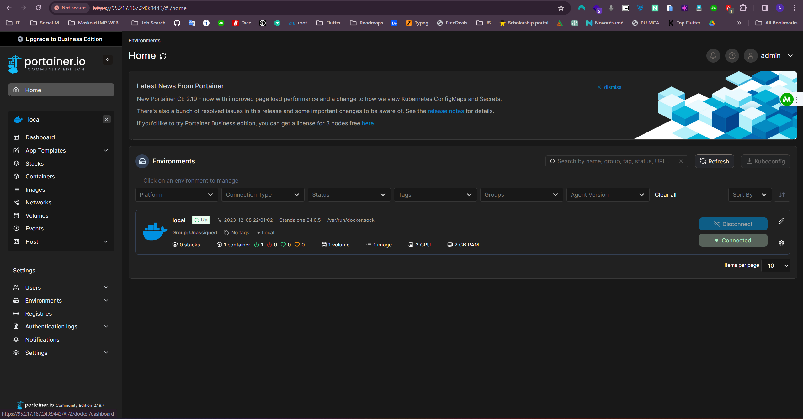
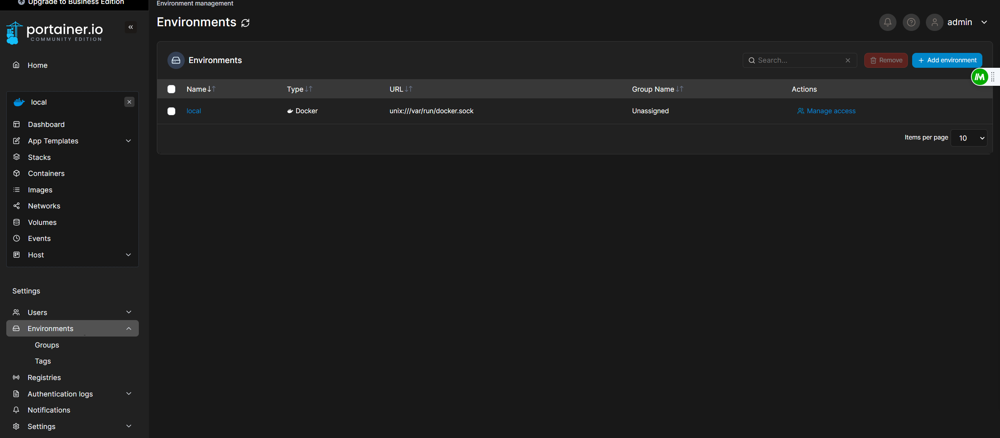

## Introduction

Welcome to the tutorial titled **How To Install Portainer on Ubuntu 22.04**. Portainer is an open-source container management tool that provides a web-based graphical user interface (GUI) for managing Docker containers, images, networks, and volumes.

Its GUI simplifies complex tasks, providing an accessible and visual approach to container management. With specific features catering to major cloud platforms, Portainer is an indispensable tool for developers and IT professionals navigating the world of container orchestration, offering a seamless and visually enriched Docker management experience.

**Features**

* Intuitive GUI for Docker
* Container Lifecycle Management
* Resource Monitoring and Usage Statistics
* Role-Based Access Control (RBAC)
* Application Templates
* Extensive Community Support
* Rapid Setup.
* Multi-Endpoint Management
* High Performance.
* Rapid Setup.
* Supports all major clouds.
* Available in more than ten languages.
* Continuous Updates and Improvements

**Prerequisites**

For installing CloudPanel, you will need install Docker.

Portainer needs very minimal system requirements for setup.

* You need an empty/fresh server with Ubuntu 22.04 with root access.
* You must have root access or access to a user with Sudo privileges.
* CPU: 2 vCores
* RAM: 2 GB
* Space: 50 GB

## Step 1 - Update Operating System 

```shell
apt-get update && apt-get upgrade
```

## Step 2 - Install Docker

To start the Docker installation, run the following command:

```shell
apt-get install docker.io
```
Start & enable Docker service 

```shell
systemctl start docker
systemctl enable docker
```
Verify the status of the docker. 

```shell
systemctl status docker
```
Output looks like:


## Step 3 - Insatll Portainer

Run following command for pull the Portainer image from Docker Hub
```shell
docker pull portainer/portainer-ce:latest
```

start the Portainer container
```shell
docker run -d -p 8000:8000 -p 9443:9443 --name portainer --restart=always -v /var/run/docker.sock:/var/run/docker.sock -v portainer_data:/data portainer/portainer-ce:latest
```
Output looks like:


* open 9443 port


## Step 4 - Access Portainer Web UI

you can now access the portainer UI by opening web browser and type http://your-IP-address:9443


You should get Portainer login page to create an **admin** password. Set your admin user and password and click on the Create user button.

Portainer DashBoard



## Step 5 - Deploy Container Using Portainer

first of change env of your portainer



now, click local & set your machine IPv4 & Click Update Environment.


Now you can test your Portainer setup by deploying a test Docker container. Follow the steps below to install an Apache web server.

Select Containers in the menu on the left side:


Click Add Container Button at top right side


Create Container using GUI after that select image and press Deploy the container.


So, the basic setup is completed; let's add our users.

Your container Coutput look like this:


Your container finally output is:


## Conclusion

In this tutorial, we learned How To Install Portainer on Ubuntu 22.04. Give it a try!

Cheers!!

### License: MIT

<!--
Contributor's Certificate of Origin
By making a contribution to this project, I certify that:
(a) The contribution was created in whole or in part by me and I have
    the right to submit it under the license indicated in the file; or
(b) The contribution is based upon previous work that, to the best of my
    knowledge, is covered under an appropriate license and I have the
    right under that license to submit that work with modifications,
    whether created in whole or in part by me, under the same license
    (unless I am permitted to submit under a different license), as
    indicated in the file; or
(c) The contribution was provided directly to me by some other person
    who certified (a), (b) or (c) and I have not modified it.
(d) I understand and agree that this project and the contribution are
    public and that a record of the contribution (including all personal
    information I submit with it, including my sign-off) is maintained
    indefinitely and may be redistributed consistent with this project
    or the license(s) involved.
Signed-off-by:Mohmad Afzal Sorathiya afzalsorathiya19@gmail.com
-->
