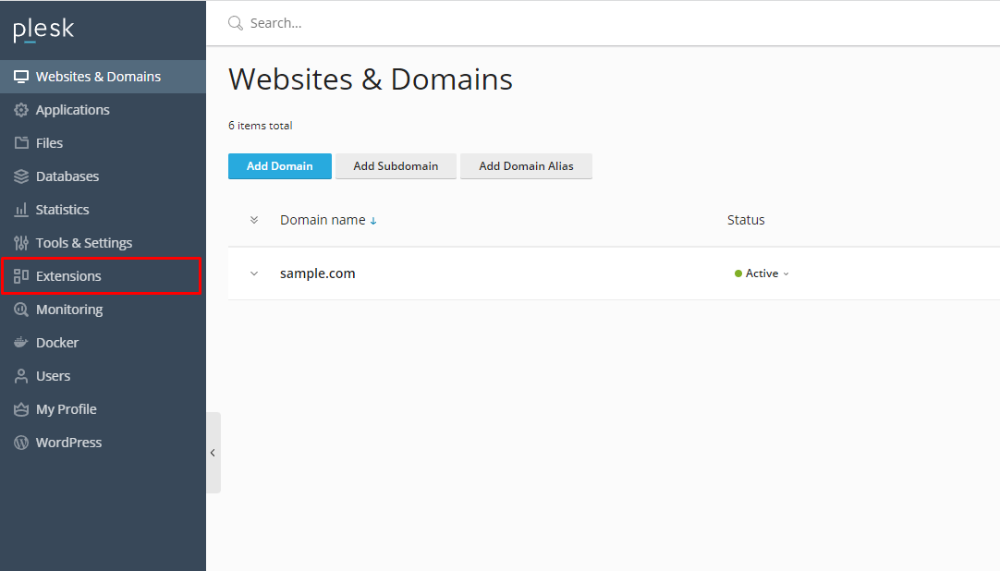
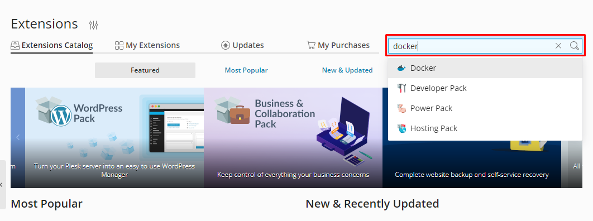
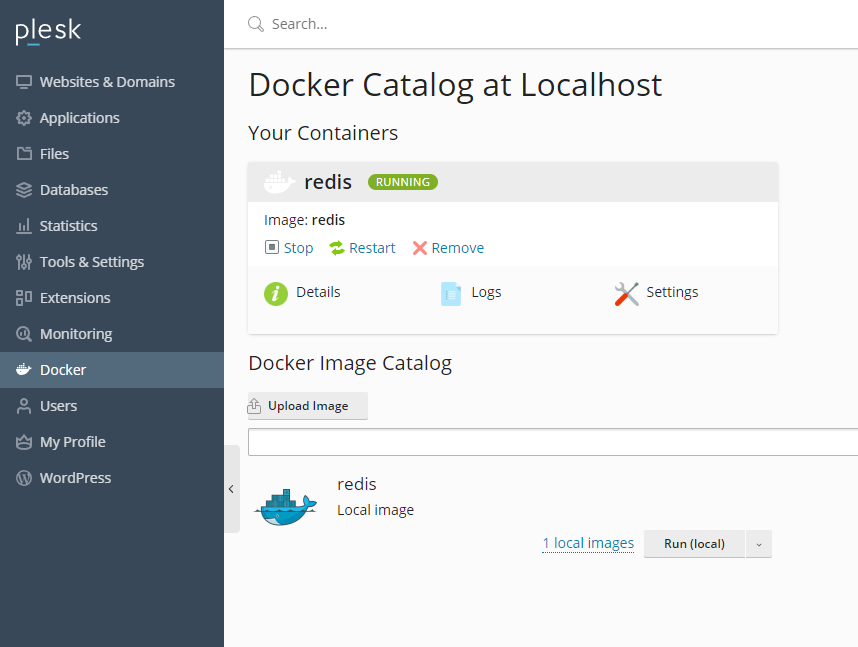

## Introduction

This tutorial explains how to install Docker via the Plesk control panel, and how to then use Docker to install Redis. This tutorial uses CentOS 7, however this should also work on other Linux systems.

**Prerequisites**

* Hetzner Cloud server with Centos 7 already installed
* Plesk control panel is installed via [Plesk installation tutorial](https://community.hetzner.com/tutorials/install-plesk-cloud-server)

## Step 1 - Installing Docker through the Plesk control panel

To get started, you must first install Plesk on your server. You can use the tutorial "[Install Plesk on a Hetzner Cloud Server](https://community.hetzner.com/tutorials/install-plesk-cloud-server)".

In the first step, enter the Plesk control panel. Then click on the menu item `Extensions`.



On the extensions page, search for "docker" in the search box, and select the Docker extensions.



Install the Docker Extensions and proceed to the second step.

## Step 2 - Installing Redis via Docker

[Connect to the server](https://docs.hetzner.com/cloud/servers/getting-started/connecting-to-the-server) via SSH. If you can't do it via the CLI, you can just use Putty software.

Then, enter the following command and press enter

```console
docker run --name redis -d -p 6379:6379 redis redis-server --requirepass "YOUR_PASSWORD"
```

In the `YOUR_PASSWORD` field, you must enter your custom password.

## Step 3 - Check if Redis was installed via Docker

Log in to the Plesk control panel again. Select the Docker tab. Here you can see the created container.



## Conclusion

Congratulations! Now you have installed Redis on Plesk control panel using Docker.

##### License: MIT

<!--

Contributor's Certificate of Origin

By making a contribution to this project, I certify that:

(a) The contribution was created in whole or in part by me and I have
    the right to submit it under the license indicated in the file; or

(b) The contribution is based upon previous work that, to the best of my
    knowledge, is covered under an appropriate license and I have the
    right under that license to submit that work with modifications,
    whether created in whole or in part by me, under the same license
    (unless I am permitted to submit under a different license), as
    indicated in the file; or

(c) The contribution was provided directly to me by some other person
    who certified (a), (b) or (c) and I have not modified it.

(d) I understand and agree that this project and the contribution are
    public and that a record of the contribution (including all personal
    information I submit with it, including my sign-off) is maintained
    indefinitely and may be redistributed consistent with this project
    or the license(s) involved.

Signed-off-by: Mohammadreza ahm <mohammadr3z@icloud.com>

-->


