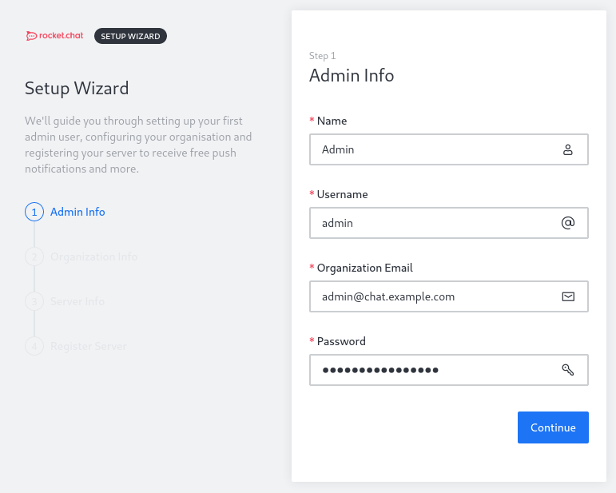
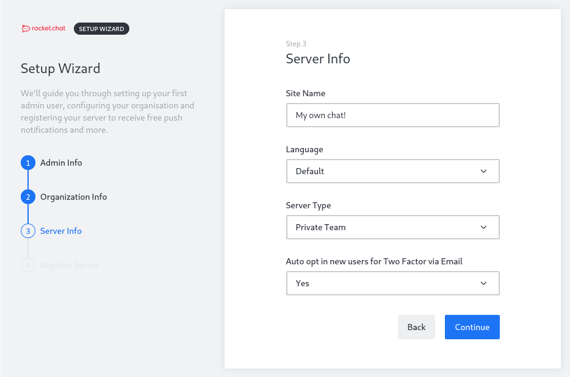
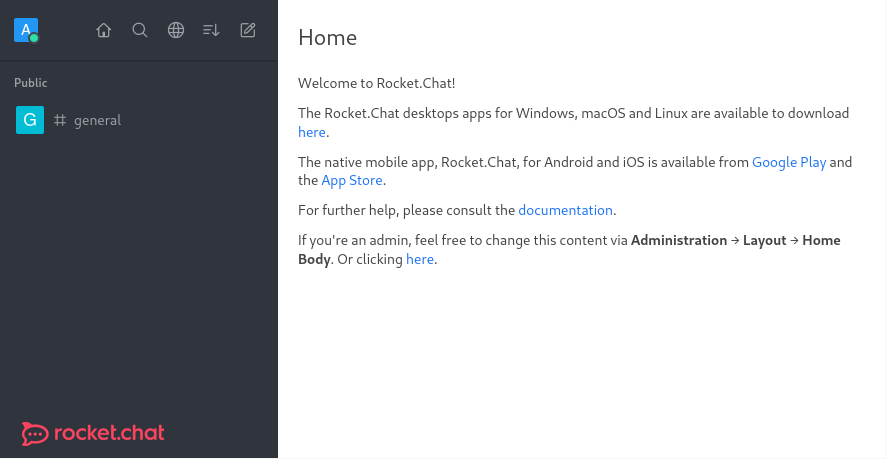

## Introduction

Rocket.Chat is an open-source communication platform which allows users to chat with each other without sending the messages to external companies.

This tutorial shows how to install and configure a basic Rocket.Chat instance on Ubuntu 20.04 using [snapd](https://snapcraft.io/docs). There are also other possibilities to install Rocket.Chat. For that the [official documentation](https://docs.rocket.chat) should be consulted.

**Prerequisites**

* Ubuntu 20.04 server with root privileges
* Domain for accessing the instance (in this tutorial `chat.example.com` is used)

## Step 1 - Configuring a firewall

First, a basic firewall should be set up so that only the desired ports are accessible from the Internet. In this case we're configuring the firewall using [UFW](https://help.ubuntu.com/community/UFW). The firewall will be configured to allow traffic via port `80` (HTTP), `443` (HTTPS) and `22` (SSH - should be changed if you use an other port!).

```bash
ufw allow 22/tcp
ufw allow 80,443/tcp
ufw enable
```

## Step 2 - Installing Rocket.Chat

Before we can start installing Rocket.Chat, we need to install snapd:

```bash
apt update
apt install snapd
```

Afterwards we can install Rocket.Chat using snap:

```bash
snap install rocketchat-server
```

**ATTENTION** If you don't use a firewall, the Rocket.Chat instance is now exposed publicly over port `3000`.

## Step 3 - Configuring SSL

The Rocket.Chat snap container already ships a reverse proxy (Caddy) which can obtain a SSL certificate via Let's Encrypt. It only needs to be configured with the domain for the chat system:

```bash
snap set rocketchat-server caddy-url=https://chat.example.com
snap set rocketchat-server caddy=enable
snap set rocketchat-server https=enable
snap run rocketchat-server.initcaddy
```

If no errors occurred, the Rocket.Chat and Caddy container can be restarted:

```bash
systemctl restart snap.rocketchat-server.rocketchat-server.service
systemctl restart snap.rocketchat-server.rocketchat-caddy.service
```

Now the Rocket.Chat instance is reachable through the configured domain and HTTP is redirected to HTTPS.

## Step 4 - Configuring Rocket.Chat

Open the web browser and navigate to the domain we have set up above. Now Rocket.Chat should automatically open the setup wizard, where it asks for the credentials for the first user which automatically gets admin permissions.



Afterwards the setup wizard will ask for some organization info, you can enter these details or just skip the step by clicking on `Continue`.

In the 3rd step you can enter the name of the chat instance, set a default language and select if new users should automatically use Two Factor via e-mail.



In the last step, you can select whether the server should be registered in the Rocket.Chat Cloud or not. This is something you need to decide depending on your guidelines.

## Step 5 - Exploring Rocket.Chat

Finally you can start using Rocket.Chat!

**ATTENTION** The registration form is enabled by default! This and much more can be changed in the admin area of your Rocket.Chat instance.



## Conclusion

You now have a working basic Rocket.Chat installation. You can now start customizing your instance or just start chatting with your friends or colleagues.

Further information can be found in the [Rocket.Chat Docs](https://docs.rocket.chat)

##### License: MIT

<!--

Contributor's Certificate of Origin

By making a contribution to this project, I certify that:

(a) The contribution was created in whole or in part by me and I have
    the right to submit it under the license indicated in the file; or

(b) The contribution is based upon previous work that, to the best of my
    knowledge, is covered under an appropriate license and I have the
    right under that license to submit that work with modifications,
    whether created in whole or in part by me, under the same license
    (unless I am permitted to submit under a different license), as
    indicated in the file; or

(c) The contribution was provided directly to me by some other person
    who certified (a), (b) or (c) and I have not modified it.

(d) I understand and agree that this project and the contribution are
    public and that a record of the contribution (including all personal
    information I submit with it, including my sign-off) is maintained
    indefinitely and may be redistributed consistent with this project
    or the license(s) involved.

Signed-off-by: Florian Voit <dev@rootsh3ll.de>

-->
