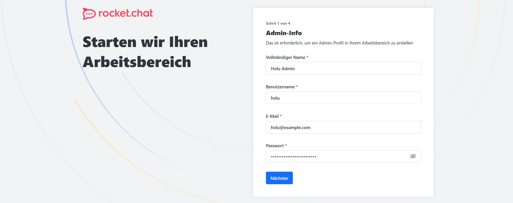

## Einleitung

Rocket.Chat ist eine Open-Source Kommunikationsplattform, welche es Benutzern erlaubt mit anderen zu chatten, ohne dass die Nachrichten an externe Firmen übertragen werden.

Dieses Tutorial zeigt wie man eine Rocket.Chat-Instanz unter Ubuntu 24.04 über [snapd](https://snapcraft.io/docs) installiert und konfiguriert. Es gibt auch andere Möglichkeiten Rocket.Chat zu installieren, dafür sollte die [offizielle Dokumentation](https://docs.rocket.chat) zu Rate gezogen werden.

**Vorraussetzungen**

* Ubuntu 24.04 Server mit root-Rechten
* Domain um auf Rocket.Chat zuzugreifen (in diesem Tutorial wird `chat.example.com` genutzt)

## Schritt 1 - Firewall einrichten

Als erstes sollte eine grundlegende Firewall eingerichtet werden, so dass nur die gewünschten Ports vom Internet aus zugänglich sind. In diesem Fall konfigurieren wir die Firewall mit [UFW](https://help.ubuntu.com/community/UFW). Die Firewall wird so konfiguriert, dass der Zugriff nur über Port `80` (HTTP), `443` (HTTPS) und `22` (SSH - sollte geändert werden, wenn ein anderer Port verwendet wird!) möglich ist.

```bash
sudo ufw allow 22/tcp
sudo ufw allow 80,443/tcp
sudo ufw enable
```

## Schritt 2 - Rocket.Chat installieren

Bevor wir mit der Installation von Rocket.Chat beginnen können, muss snapd installiert werden:

```bash
sudo apt update && upgrade
sudo apt install snapd
```

Danach kann Rocket.Chat über snap installiert werden:

```bash
sudo snap install rocketchat-server
```

**ACHTUNG** Sollte keine Firewall genutzt werden, ist die Rocket.Chat-Instanz über Port `3000` öffentlich und unverschlüsselt erreichbar!

## Schritt 3 - SSL einrichten

Der Rocket.Chat snap-Container enthält bereits einen Reverse-Proxy (Caddy), der ein SSL-Zertifikat über Let's Encrypt beziehen kann. Dieser muss nur noch mit der Domain für das Chatsystem konfiguriert werden:

```bash
sudo snap set rocketchat-server caddy=enable
sudo snap set rocketchat-server https=enable
sudo sudo snap set rocketchat-server siteurl=https://<chat.example.com>
```

Wenn keine Fehler aufgetreten sind, kann der Rocket.Chat- und Caddy-Container neu gestartet werden:

```bash
sudo systemctl restart snap.rocketchat-server.rocketchat-server.service
sudo systemctl restart snap.rocketchat-server.rocketchat-caddy.service
```

Nun ist die Rocket.Chat-Instanz über die konfigurierte Domain erreichbar und HTTP wird auf HTTPS umgeleitet.

## Schritt 4 - Rocket.Chat einrichten

Nun kann der Webbrowser geöffnet und über die Domain auf Rocket.Chat zugegriffen werden. Es sollte sich automatisch ein Einrichtungsassistent öffnen, welcher nach den Zugangsdaten des ersten Benutzers fragt. Dieser Benutzer erhält auch automatisch administrative Rechte.



Anschließend fragt der Assistent nach Informationen über die Organisation. Gebe diese Daten an und klicke anschließend auf "Nächster".

Im letzten Schritt, wird nach einer E-Mail-Adresse gefragt, um die Instanz in der Rocket.Chat Cloud zu registrieren. Dies muss entsprechend eigener Richtlinien entschieden werden.

Prüfe anschließend deine E-Mails und bestätige die Registrierung.

## Schritt 5 - Rocket.Chat erkunden

Nun kann Rocket.Chat genutzt werden!

**ACHTUNG** Das Registrierungsformular ist standardmäßig aktiviert! Dies und vieles mehr kann im Admin-Bereich der Rocket.Chat-Instanz geändert werden.


## Ergebnis

Es wurde eine funktionierende Basisinstallation von Rocket.Chat durchgeführt. Man kann nun anfangen die Instanz anzupassen oder einfach mit Freunden oder Kollegen chatten.

Weitere Informationen können in den [Rocket.Chat Docs](https://docs.rocket.chat) gefunden werden.

##### License: MIT

<!--

Contributor's Certificate of Origin

By making a contribution to this project, I certify that:

(a) The contribution was created in whole or in part by me and I have
    the right to submit it under the license indicated in the file; or

(b) The contribution is based upon previous work that, to the best of my
    knowledge, is covered under an appropriate license and I have the
    right under that license to submit that work with modifications,
    whether created in whole or in part by me, under the same license
    (unless I am permitted to submit under a different license), as
    indicated in the file; or

(c) The contribution was provided directly to me by some other person
    who certified (a), (b) or (c) and I have not modified it.

(d) I understand and agree that this project and the contribution are
    public and that a record of the contribution (including all personal
    information I submit with it, including my sign-off) is maintained
    indefinitely and may be redistributed consistent with this project
    or the license(s) involved.

Signed-off-by: Florian Voit <dev@rootsh3ll.de>

-->
