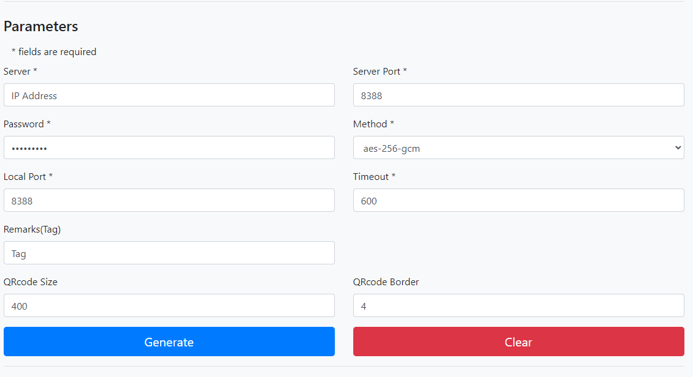

## Introduction

This tutorial explains how to install Shadowsocks via Docker with one command.

## Step 1 - Create a new Cloud server

* Login to your cloud dashboard from [https://console.hetzner.cloud]
* Create new project and name it whatever you want
* Choose your server location - it's up to you
* Click `Add Server` and select `CentOS 7` from Image
* Choose the resources you need from Type
* Click on the field `User Data` and enter `#include https://get.docker.com` (this will install docker)
* Select your SSH-Key
  * You can read [this](https://help.github.com/en/enterprise/2.16/user/articles/generating-a-new-ssh-key-and-adding-it-to-the-ssh-agent) article to know how to generate SSH key
* Write your server hostname in `name` input
* Click `Create & Buy Now`

## Step 2 - Installing Shadowsocks via Docker

[Connect to the server](https://docs.hetzner.com/cloud/servers/getting-started/connecting-to-the-server) via SSH. If you can't do it via the CLI, you can just use Putty software.

Then, enter the following command and press enter

```console
docker run -e PASSWORD=9MLSpPmNt -p 8388:8388 -p 8388:8388/udp -d --restart always shadowsocks/shadowsocks-libev
```

In the `PASSWORD` field, you must enter your custom password.

To change the port you can do this by changing the `-p` value

Here's an example to start a container that listens on `48388` (both TCP and UDP):

```console
docker run -e PASSWORD=9MLSpPmNt -p 48388:48388 -p 48388:48388/udp -d --restart always shadowsocks/shadowsocks-libev
```

## Step 3 - Generate Shadowsocks config

There are different methods to generate Shadowsocks configuration. But the easiest way is to use a free config generator.

To do this, enter the following website:

https://zhiyuan-l.github.io/SS-Config-Generator/

Enter the required parameters. Such as IP Address, Port, Password

In the Method field, you must enter the following value:



And finally, press the generate button and you will see the Shadowsocks code and qrcode.

## Conclusion

Congratulations! Now you have Shadowsocks using Docker.

##### License: MIT

<!--

Contributor's Certificate of Origin

By making a contribution to this project, I certify that:

(a) The contribution was created in whole or in part by me and I have
    the right to submit it under the license indicated in the file; or

(b) The contribution is based upon previous work that, to the best of my
    knowledge, is covered under an appropriate license and I have the
    right under that license to submit that work with modifications,
    whether created in whole or in part by me, under the same license
    (unless I am permitted to submit under a different license), as
    indicated in the file; or

(c) The contribution was provided directly to me by some other person
    who certified (a), (b) or (c) and I have not modified it.

(d) I understand and agree that this project and the contribution are
    public and that a record of the contribution (including all personal
    information I submit with it, including my sign-off) is maintained
    indefinitely and may be redistributed consistent with this project
    or the license(s) involved.

Signed-off-by: Mohammadreza ahm <mohammadr3z@icloud.com>

-->


