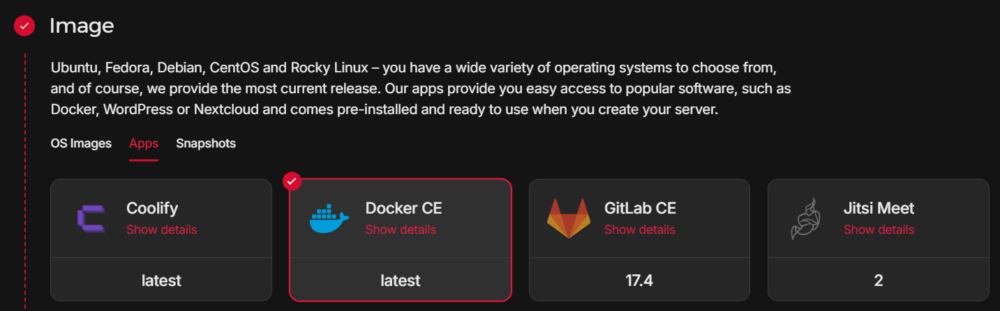
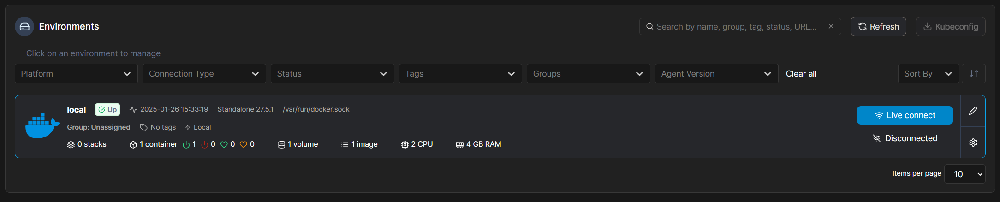
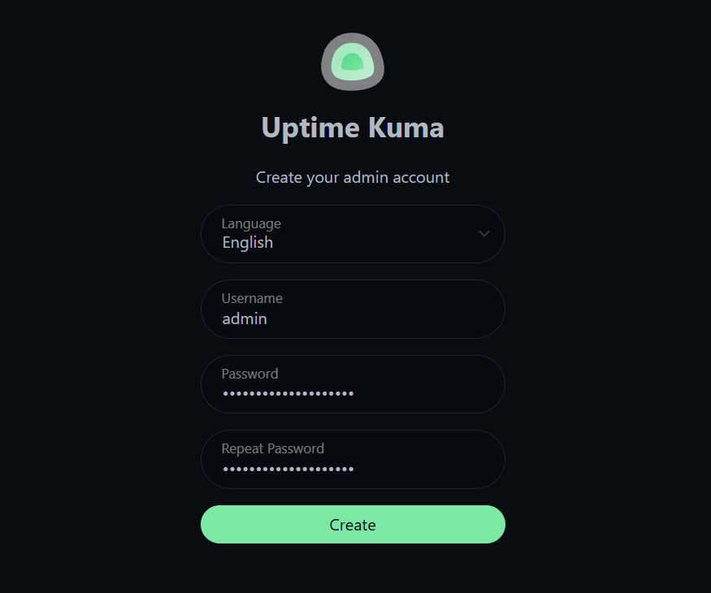
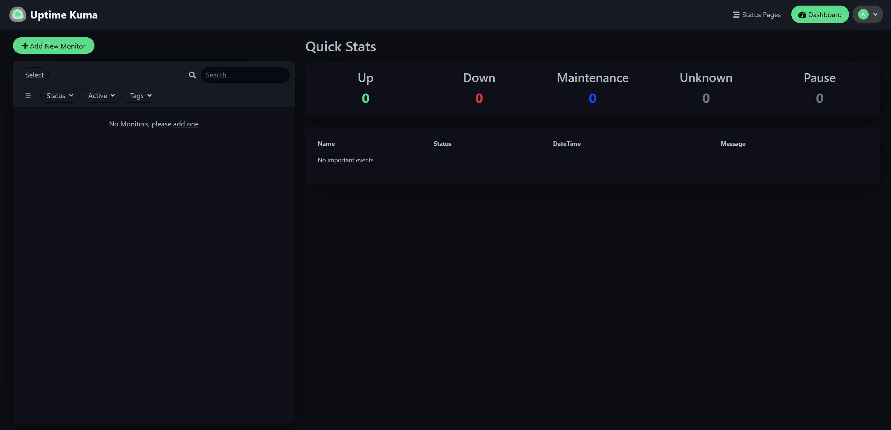
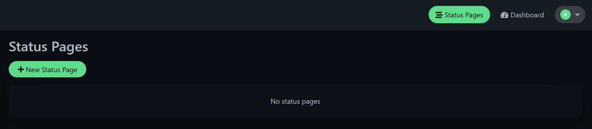

## Úvod

Uptime Kuma je bezplatný monitorovací nástroj s otevřeným zdrojovým kódem a vlastním hostingem, který vám pomůže sledovat dostupnost a výkon vašich webových stránek, aplikací a dalších služeb. Nástroj Uptime Kuma je inspirován službami, jako je UptimeRobot, a nabízí výkonné a zároveň uživatelsky přívětivé rozhraní, které vám dává plnou kontrolu nad vašimi potřebami monitorování.

V tomto tutoriálu vás seznámím s instalací služby Uptime Kuma pomocí nástroje Docker Compose na platformě Portainer.

V tomto scénáři probereme použití a příklad monitorování jiného serveru a webové stránky.

**Vyžadované součásti**

* Ubuntu server s administrátorským oprávněním.
* [Docker](https://www.docker.com/)
* Docker Compose

**Terminologie**

Vzhledem k tomu, že možnost vytvoření uživatelů je na vás a platí to i pro nastavení názvů hostitelů, jsou zde uvedeny pouze příklady IP adres a sledovaných služeb.

* IP adresy a porty:
   * Portainer: `123.1.2.3:9443`
   * Uptime Kuma `123.1.2.3:3001`
* Monitorované služby:
   * MyServer01: `123.2.3.4`
   * Website: `hetzner.com`

## Krok 1 - Příprava serveru

Pro tento příklad použiji předinstalovanou aplikaci v Hetzner Cloud - Docker CE..



Po instalaci serveru se připojte k SSH s oprávněním roota.

Před pokračováním doporučuji aktualizovat balíčky ubuntu.

```bash
apt update && apt upgrade -y
```

Nejprve vytvoříme svazek, který bude služba Portainer používat k ukládání dat.

```bash
docker volume create portainer_data
```

Níže uvedeným příkazem spustíte port 9443. Tím také otevřete port 8000 pro nezabezpečený protokol HTTP.

```bash
docker run -d -p 8000:8000 -p 9443:9443 --name portainer --restart=always -v /var/run/docker.sock:/var/run/docker.sock -v portainer_data:/data portainer/portainer-ce:2.21.5
```

Nyní můžeme navštívit náš portainer server na této adrese.

`https://123.1.2.3:9443`


### Krok 1.1 - Nastavení Portaineru

Jakmile se přihlásíme do našeho kontejneru, zobrazí se Průvodce prostředím, kde vybereme možnost `Get started`.


Vybereme `local environment`.



## Krok 2 - Vytvoření Uptime Kuma stacku

V levém ovládacím panelu aplikace Portainer vyberte možnost Stohy, v pravém horním rohu vyberte možnost `Add Stack`.

Jméno je libovolné, ale v našem případě bude `uptime-kuma`, použijeme základní `Web editor` vložíme zkopírovaný Docker Compose níže.

```yaml
version: '3.3'

services:
  uptime-kuma:
    image: louislam/uptime-kuma:1
    container_name: uptime-kuma
    volumes:
      - /docker-vol/uptime-kuma:/app/data # Předloha pro nastavení adresáře /path/to/dir/uptime-kuma:/app/data
    ports:
      - 3001:3001
    restart: always
    security_opt:
      - no-new-privileges:true
```

Jakmile vložíme, klikneme na `Deploy Stack` dole.

## Krok 3 - Přístup na Uptime Kuma

Nyní můžeme navštívit naší Uptime Kuma na portu 3001.

`http://123.1.2.3:3001/setup`



Po přihlášení se nám zobrazí ovládací panel, který si popíšeme. Nejprve se podíváme na nastavení samotné aplikace.



V pravém horním rohu klikněte na ikonu našeho profilu a klikněte na položku `Settings`.

V hlavní sekci `General` můžeme nakonfigurovat základní nastavení aplikace, doporučuji nastavit správné časové pásmo, a pokud chcete později připojit Uptime Kuma k doméně přes `Primary Base URL`, pokud použijeme IP jako v našem případě, nemusíme nic vyplňovat, ani klikat na tlačítko `Auto Get`.

## Krok 4 - Příkladné monitorování

Vezmeme si příklad monitorování jiného serveru a webové stránky Ubuntu.

### Krok 4.1 - Sledování serveru Ubuntu

Nyní si ukážeme příklad monitorování jiného serveru Ubuntu.

Server můžete sledovat například pomocí funkce ping, Uptime Kuma nabízí také možnost Push, která je komplexnější. My si zde však ukážeme monitorování pomocí pingu.


### Krok 4.2 - Monitoring Website

Nyní si ukážeme příklad webových stránek.

Pro sledování webových stránek vyberte typ sledování HTTP(s).


### Krok 4.3 - Nastavení monitoringu

Zde se budeme zabývat základními parametry, které můžeme nastavit pro naše monitory.

`Friendly Name` - Název, pod kterým lze nalézt naše monitorování.

`Heartbeat Interval` - Interval, ve kterém budou kontroly probíhat. Výchozí hodnota je 60 sekund.

`Retries` - Počet neúspěšných kontrol předtím, než se objeví výpadek služby.

Pro každý monitor můžete také vybrat upozornění, když zjistí, že služba není spuštěna. Na výběr je mnoho možností, mezi nejznámější patří E-mail (SMTP), Discord, Telegram, Webhook.

## Krok 5 - Vytvoření status stránky

Nyní si popíšeme, jak vytvořit stavovou stránku pro naše monitorování.



Po vytvoření stránky můžeme nastavit název, ikonu, vlastní CSS a další prvky. Můžeme také kliknout na `Add Monitor`, kde můžeme přidat dříve vytvořené monitory.


Nyní, když klikneme na `Save`, naše status stránka bude zveřejněna a mohou si ji prohlédnout nepřihlášení uživatelé.

## Krok 6 - Vytvoření údržby

Dalším skvělým nástrojem je možnost vytvářet údržbu. Během údržby bude monitorování webu pozastaveno a na příslušné status stránce se zobrazí banner s oznámením o údržbě, přičemž dotčené pohledy budou podsvíceny modře.


V nastavení specifické údržby lze vybrat časové okno, k dispozici je vše od konkrétního času až po opakovaný interval nebo CRON.

Po vytvoření stačí kliknout na tlačítko `Save` a údržba bude vytvořena a aktivní.

## Závěr

Doufám, že vám tento návod pomohl s nastavením status stránky. Nástroj Uptime Kuma je velmi dobře přizpůsobitelný a věřím, že si na něj rychle zvyknete a sami objevíte jeho kouzlo.

Sám používám Uptime Kuma již více než rok a vždy jsem se na tento nástroj mohl spolehnout.

##### License: MIT

<!--

Contributor's Certificate of Origin

By making a contribution to this project, I certify that:

(a) The contribution was created in whole or in part by me and I have
    the right to submit it under the license indicated in the file; or

(b) The contribution is based upon previous work that, to the best of my
    knowledge, is covered under an appropriate license and I have the
    right under that license to submit that work with modifications,
    whether created in whole or in part by me, under the same license
    (unless I am permitted to submit under a different license), as
    indicated in the file; or

(c) The contribution was provided directly to me by some other person
    who certified (a), (b) or (c) and I have not modified it.

(d) I understand and agree that this project and the contribution are
    public and that a record of the contribution (including all personal
    information I submit with it, including my sign-off) is maintained
    indefinitely and may be redistributed consistent with this project
    or the license(s) involved.

Signed-off-by: [Matyáš Folk matyfocz@gmail.com]

-->
