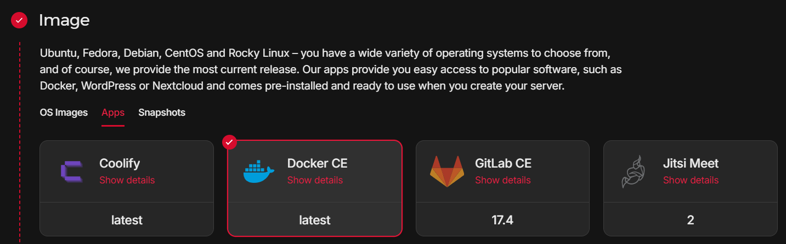
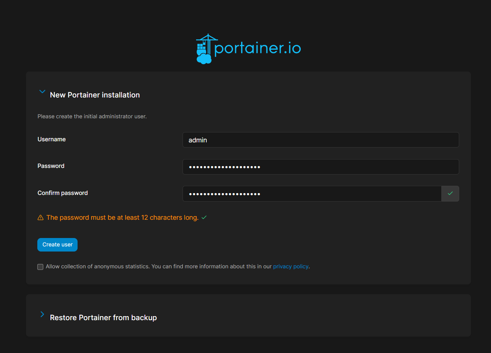
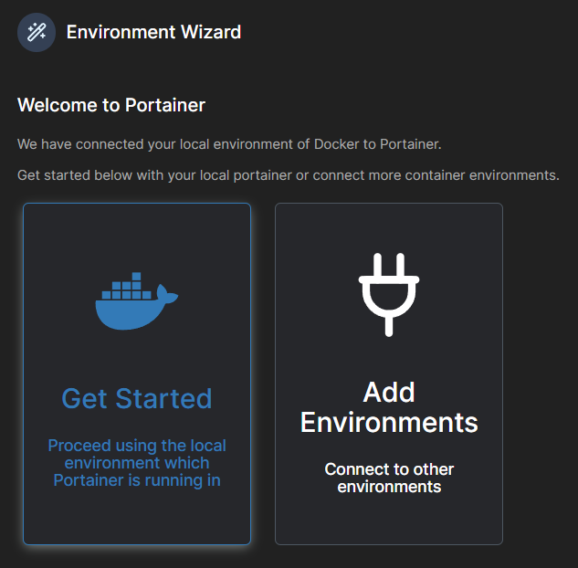
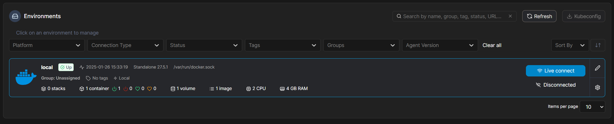
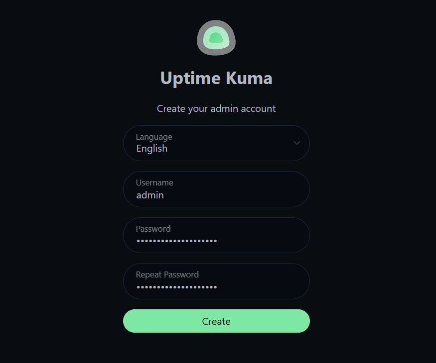
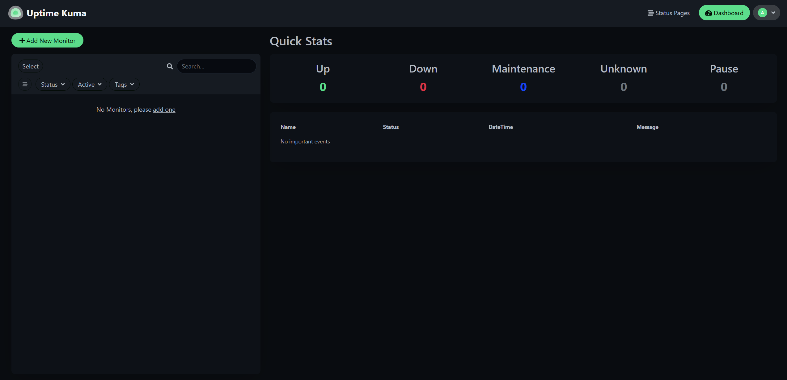
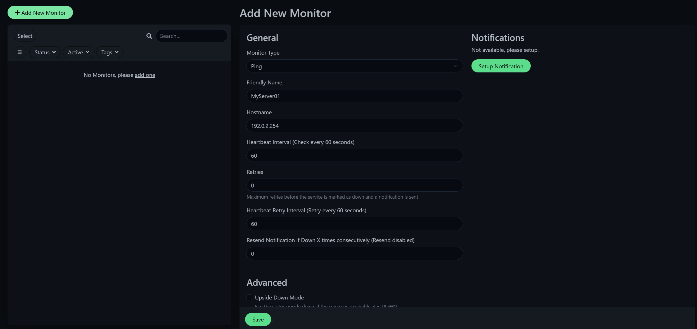
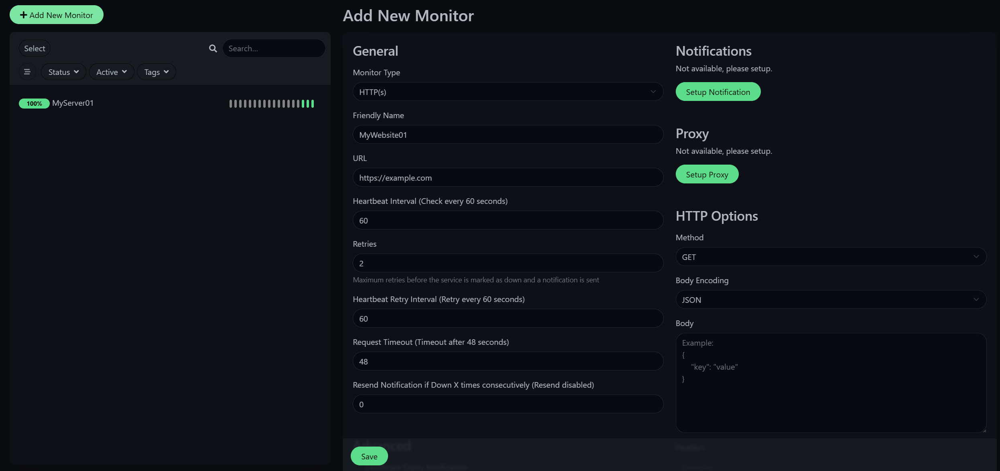
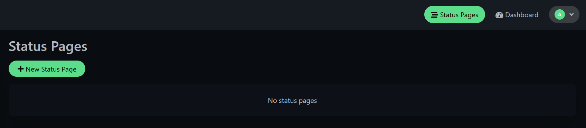
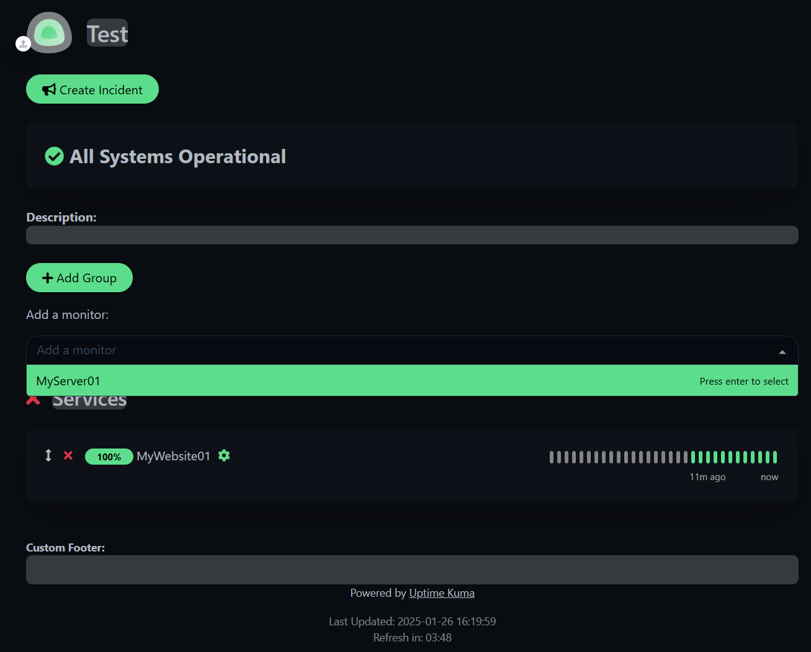

## Introduction

Uptime Kuma is a free, open-source, and self-hosted monitoring tool designed to help you track the availability and performance of your websites, applications, and other services. Inspired by services like UptimeRobot, Uptime Kuma offers a powerful yet user-friendly interface, giving you full control over your monitoring needs.

In this tutorial I will introduce you to installing uptime kuma with Docker Compose on Portainer.

In this scenario, we will discuss the use and example monitoring of another server and website.

**Prerequisites**

* A server with Ubuntu Server installed and root access.
* [Docker & Docker Compose](https://docs.docker.com/engine/install/ubuntu/#install-using-the-repository) installed

**Example terminology**

Since the option to create users is up to you and this also applies to setting up hostnames, only example IP Addresses and Monitored Services are listed here.

* IP addresses and ports:
   * Portainer: `203.0.113.1:9443`
   * Uptime Kuma `203.0.113.1:3001`
* Monitored services:
   * MyServer01: `192.0.2.254`
   * MyWebsite01: `example.com`

## Step 1 - Preparing the server

For this example, I will use the pre-installed application in Hetzner Cloud — Docker CE.



Once the server is installed, connect to SSH with root permissions.

Create a user with sudo privileges and add the new user to the Docker group.

I recommend to update Ubuntu packages before continuing.

```bash
sudo apt update && sudo apt upgrade -y
```

First, we create a volume that Portainer will use to store its data.

```bash
docker volume create portainer_data
```

Use the command below to start the portainer on port 9443. This also opens port 8000, for unsecured HTTP.

```bash
docker run -d -p 8000:8000 -p 9443:9443 --name portainer --restart=always -v /var/run/docker.sock:/var/run/docker.sock -v portainer_data:/data portainer/portainer-ce:2.21.5
```

Now we access the server using our portainer address

```
https://203.0.113.1:9443
```



### Step 1.1 - Setting up Portainer

Once we are logged into our portainer, we will be presented with the Environment Wizard where we select `Get started`.



We choose our `local environment`.



## Step 2 - Creating Uptime Kuma stack

In the left control panel of Portainer, select "Stacks". Then, in the upper right corner, select `Add Stack`.

The name can be any name, in our case `uptime-kuma`, the build method will be the default `Web editor` and we will insert the Docker Compose written below.

```yaml
version: '3.3'

services:
  uptime-kuma:
    image: louislam/uptime-kuma:1
    container_name: uptime-kuma
    volumes:
      - /docker-vol/uptime-kuma:/app/data # Here is a template for setting the directory /path/to/dir/uptime-kuma:/app/data
    ports:
      - 3001:3001
    restart: always
    security_opt:
      - no-new-privileges:true
```

Once inserted, click on `Deploy the stack` at the very bottom.

## Step 3 - Accessing Uptime Kuma

We can now visit our Uptime Kuma on port 3001.

```
http://203.0.113.1:3001/setup
```



After logging in, we will see our Dashboard, which we will then describe. First, let's take a look at the settings of the application itself.



In the top right corner, click on our profile icon and click on the `Settings` box.

In the `General` section we can configure the basic settings of the application, I recommend to set the correct time zone and if you want to connect Uptime Kuma to a domain later, the `Primary Base URL`, if we will use IP as in our case, we do not need to fill in anything, or click on `Auto Get`.

## Step 4 - Example monitoring

We'll take the example of monitoring another Ubuntu Server and Website.

Go back to the dashboard and click on `Add New Monitor` in the top left.

### Step 4.1 - Monitoring an Ubuntu server

Now we will see an example of monitoring another Ubuntu Server.

For example, you can monitor the server using ping, Uptime Kuma also offers a Push option which is more comprehensive. But we will demonstrate ping monitoring here.



### Step 4.2 - Monitoring a Website

Now we will see an example of Website.

For web page tracking, select the HTTP(s) tracking type.



### Step 4.3 - Monitoring Settings

Here we will discuss the basic parameters that we can set for our monitors.

| Parameter          | Description |
| ------------------ | ----------- |
| Friendly Name      | The name under which our monitoring can be found. |
| Heartbeat Interval | The interval at which the checks will take place. Default is 60 seconds. |
| Retries            | The number of failed checks before the service appears to have an outage. |

You can also select alerts for each monitor when it detects that the service is not running. There are many options to choose from, some of the most well-known include Email (SMTP), Discord, Telegram, Webhook.

## Step 5 - Creating a Status Page

Now we will describe how to create a Status page for our monitoring.



Click on `New Status Page`. Pick a name for the status page and enter a slug. After the status page is published, you can access it like this:

```
http://203.0.113.1:3001/status/<your_input>
```

After the page is created, we can set the title, icon, custom CSS and more. We can also click on `Add Monitor` where we can add previously created monitors.



Now, if we click `Save`, our status page will be published and can be viewed by non-logged-in users.

```
http://203.0.113.1:3001/status/test
```

## Step 6 - Creating Maintenance

Another great tool is the ability to create maintenance. During maintenance, site monitoring will be paused and a banner will be displayed on the relevant status page with a maintenance notification, the affected views will be lit in blue.

Click on your profile icon in the top right, and click on "Maintenance". Now "Schedule Maintenance".


In the specific maintenance settings, a time window can be selected, everything from a specific time to a repeated interval or CRON is available.

Once created, just click `Save` and the maintenance will be created and active.

## Conclusion

I hope this tutorial helped with setting up the status page. Uptime Kuma is very customizable and I believe you will quickly get used to and discover the magic of this monitoring tool yourself.

I have been using Uptime Kuma myself for over a year and have always relied on this tool.

##### License: MIT

<!--

Contributor's Certificate of Origin

By making a contribution to this project, I certify that:

(a) The contribution was created in whole or in part by me and I have
    the right to submit it under the license indicated in the file; or

(b) The contribution is based upon previous work that, to the best of my
    knowledge, is covered under an appropriate license and I have the
    right under that license to submit that work with modifications,
    whether created in whole or in part by me, under the same license
    (unless I am permitted to submit under a different license), as
    indicated in the file; or

(c) The contribution was provided directly to me by some other person
    who certified (a), (b) or (c) and I have not modified it.

(d) I understand and agree that this project and the contribution are
    public and that a record of the contribution (including all personal
    information I submit with it, including my sign-off) is maintained
    indefinitely and may be redistributed consistent with this project
    or the license(s) involved.

Signed-off-by: [Matyáš Folk matyfocz@gmail.com]

-->
