## Introduction

[CyberPanel](https://cyberpanel.net/get-started-with-cyberpanel/) is the next generation web hosting Control Panel developed by Usman Nasir. Lightweight, superfast [OpenLiteSpeed](https://openlitespeed.org/) as a web server with a help of the [LScache](https://wordpress.org/plugins/litespeed-cache/) WordPress plugin, your websites becomes superfast.

**Features**

* Secure (free SSL by [Let's Encrypt](https://letsencrypt.org/)).
* High Performance.
* Ready to go within 1 minute.
* Supports all major clouds.
* Easy to use Linux control panel for beginner.

**Prerequisites**

For installing CyberPanel, you will need a server with root access. CyberPanel needs very minimal system requirements for setup.

* Fresh server with Ubuntu 20.04 / 22.04 (see "[Requirements for Installation](https://cyberpanel.net/KnowledgeBase/home/install-cyberpanel/)).
* You must have root access or access to a user with sudo privileges.
* CPU: 2 vCores
* RAM: 2 GB
* Space: 20 GB

* [MobaXterm](https://mobaxterm.mobatek.net/) SSH Client with SFTP browser for Windows user or you can use your favorite one. MobaXterm is an all-in-one SSH client with many more features.

> *Note:* Later you can rescale your server both downgrade and upgrade depending on the websites traffic.

**Example terminology**

* Username: `root` (any root privileges user).
* Hostname: `cyberpanel.1337xda.me` (you can set as you like).
* Domain: `cyberpanel.1337xda.me` (you can set as you like).
* Cyberpanel Username: `admin.user` (you can set as you like).

## Step 1 - Configure DNS server of domain

* Login to your domain provider dashboard
* Change DNS to Hetzner DNS (see [this guide](https://docs.hetzner.com/dns-console/dns/general/dns-overview/#the-hetzner-online-name-servers-are))
  
  You can see as below:
  
  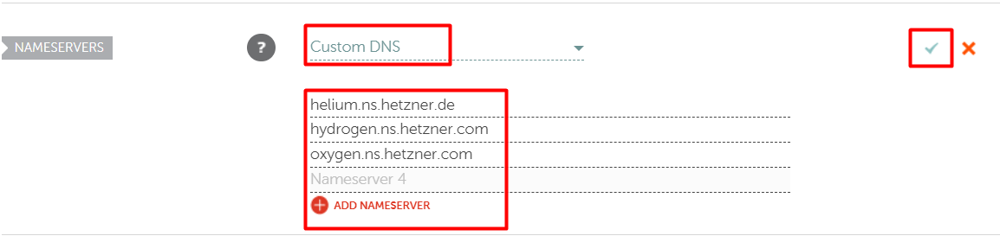

DNS propagation after changing DNS can take anywhere from several minutes up to 48-72 hours or longer to take effect. You can check with [DNS propagation tool](https://dnschecker.org/). After DNS is propagated successfully, proceed to step 2.

## Step 2 - Create project and add server

* Login to [Hetzner Cloud](https://accounts.hetzner.com/login)
* Go to [Cloud Console](https://console.hetzner.cloud/projects)
* Create a project, enter a project name of your choice.

### Step 2.1 - Add server

For a guide, see "[Creating a Server](https://docs.hetzner.com/cloud/servers/getting-started/creating-a-server)".

* Choose a location
* OS images or apps (in this tutorial we use OS only with Ubuntu 22.04)
* Type Standard or Dedicated (in this tutorial we use Standard CX23 plan)

**After creating the server, it will look like this:**

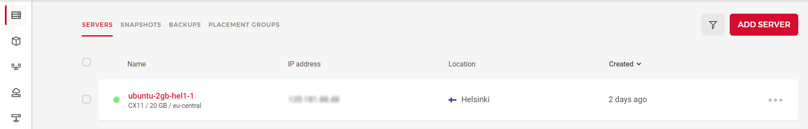

## Step 3 - Create DNS Zone

When you are done with creating a cloud server, you are ready to add relative DNS records to the Hetzner DNS Console.

* Now we are going to Hetzner [DNS Console](https://dns.hetzner.com/) and login.
* Add New Zone.
* Enter your main domain or subdomain as you like (in this tutorial I already setup proper DNS records for my domain).
* Select `Add record`. You can turn off auto scanning. If you are new here, proceed with auto scanning and click continue.
* Now you will see the output zone record as below:
  
  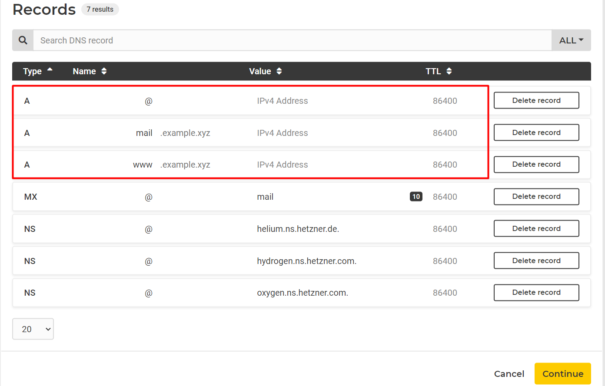

* Copy your server **IPv4 Address** and paste in to **A record** and set TTL. TTL stands for "Time To Live" in seconds. (eg. TTL 3600 = 1 hours)
* When you're done, click continue and finish.

## Step 4 - Connect server with SSH client

* As we mention above in Prerequisites, we will connect to the server using the MobaXterm SSH Client.

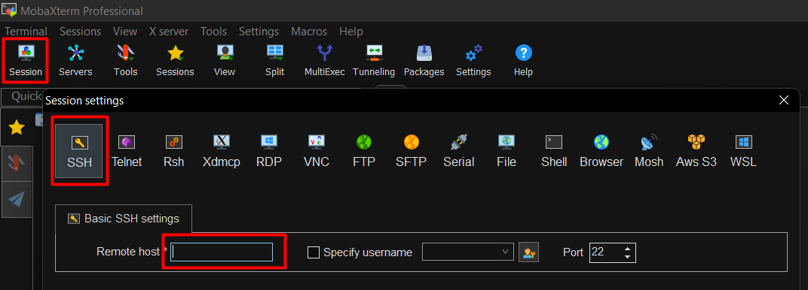

* Click Session and choose SSH.
* Enter the server **IPv4 address** in "remote host".
* Default Port **22**
* Click **OK** and you will see login as: in terminal
* **Username and password** is in your email (send from Hetzner)
* Enter the username. Copy the password from your email and paste it within the Moba terminal using the shortcut key **SHIFT + Insert** and enter.
* Now you will see a message to change your password (first time login). change as you like.

* Reboot the server
  
  ```shell
  sudo reboot
  ```

* Reconnect to the server

## Step 5 - Configure server and install CyberPanel

Set the hostname

```shell
hostnamectl set-hostname cyberpanel.1337xda.me
```

To check the hostname

```shell
hostnamectl
```

Ýou can see an output as below:

```shellsession
root@cyberpanel:~$ hostnamectl
 Static hostname: cyberpanel.1337xda.me
       Icon name: computer-vm
         Chassis: vm 🖴
      Machine ID: d806e973efd5435ba8ae41d1520e26e1
         Boot ID: ff17170201f5479a87ca0f30127a11a8
  Virtualization: kvm
Operating System: Ubuntu 22.04.5 LTS
          Kernel: Linux 5.4.0-117-generic
    Architecture: x86-64
```

**Now, we will update our server using the below command.**

```shell
sudo apt update && sudo apt -y upgrade
```

**Install Wget and Curl**

```shell
sudo apt -y install curl wget
```

Server update & upgrade steps are completed, and now we will start the CyberPanel installation.

**Install the latest version of CyberPanel**

To start the CyberPanel installation, run the following command as root:

```shell
sh <(curl https://cyberpanel.net/install.sh || wget -O - https://cyberpanel.net/install.sh)
```

During the installation, CyberPanel will ask you a series of prompts as shown below.

```shell
Checking virtualization type...

Initialized...

                CyberPanel Installer v2.3.9

1. Install CyberPanel.

2. Exit.


  Please enter the number[1-2]:
```

Select 1 to start CyberPanel installation.

```shell
                CyberPanel Installer v2.3.9

RAM check : 163/3815MB (4.27%)

Disk check : 1/38GB (5%) (Minimal 10GB free space)

1. Install CyberPanel with OpenLiteSpeed.

2. Install Cyberpanel with LiteSpeed Enterprise.

3. Exit.


  Please enter the number[1-3]:
```

We will Select 1 again to install CyberPanel with OpenLiteSpeed (free version)

```shell
Install Full service for CyberPanel? This will include PowerDNS, Postfix and Pure-FTPd.

Full installation [Y/n]: y
```

Type **Y** for full installation.

```shell
Do you want to setup Remote MySQL? (This will skip installation of local MySQL)

(Default = No) Remote MySQL [y/N]: N

Local MySQL selected...

Press Enter key to continue with latest version or Enter specific version such as: 1.9.4 , 2.0.1 , 2.0.2 ...etc

Branch name set to v2.3.9

Please choose to use default admin password 1234567, randomly generate one (recommended) or specify the admin password?
Choose [d]fault, [r]andom or [s]et password: [d/r/s] r
```

For remote MySQL, type **N** for skip.

CyberPanel will request a password for admin account. We will select **r** for random password.

Now proceed with on screen instructions. The script will take care of the rest for you after you answer every question in the installation wizard. CyberPanel installation will take some time like 15-30 minutes because it requires a lot of packages to be compiled and installed. You can drink coffee or a cup of beer and wait for it to finish.

When the installation is done, you will see the output below:

```shell
###################################################################
                CyberPanel Successfully Installed

                Current Disk usage : 8/38GB (25%)

                Current RAM  usage : 398/3815MB (10.43%)

                Installation time  : 0 hrs 18 min 0 sec

                Visit: https://<your_ip>:8090
                Panel username: admin
                Panel password: <your_password>

             Run cyberpanel help to get FAQ info
             Run cyberpanel upgrade to upgrade it to latest version.
             Run cyberpanel utility to access some handy tools .

              Website : https://www.cyberpanel.net
              Forums  : https://forums.cyberpanel.net
              Wikipage: https://docs.cyberpanel.net
              Docs    : https://cyberpanel.net/docs/

            Enjoy your accelerated Internet by
                CyberPanel & OpenLiteSpeed
###################################################################
```

Copy the panel URL, username and password from the output and save as text file. Keep this information somewhere save in your hard drive.

Reboot the server to take effect, use this command:

```shell
reboot
```

Now open the login panel via URL. You can use the server IP or domain (in this tutorial I will login via [cyberpanel.1337xda.me](https://cyberpanel.1337xda.me:8090/) instead of the server IP). You will see an SSL error, just skip and proceed to website.

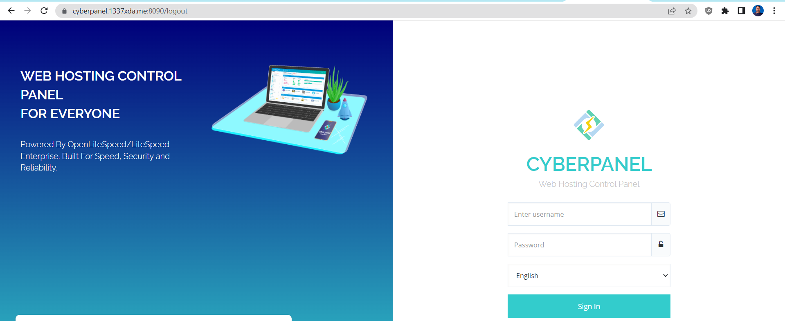

**As per the cyberpanel blacklist, you can't use a hostname to setup the website. So we will fix it. This method shows a temporary change of the hostname.**

* Login to the server
* Set the hostname
  ```shell
  hostnamectl set-hostname cyberpanel
  ```

* To check the hostname
  ```shell
  hostnamectl
  ```

* Restart the litespeed server
  ```shell
  systemctl restart lscpd
  ```

Now login to CyberPanel.

* On home screen select "WEBSITES" » "+ CREATE WEBSITE"
  
  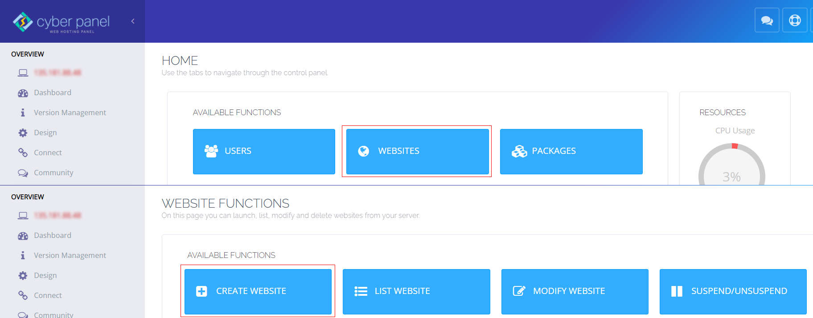
  
  Enter the following values:
  
  | Option              | Value       |
  | ------------------- | ----------- |
  | Select Package      | Default     |
  | Select Owner        | admin       |
  | Domain Name         | (cyberpanel.1337xda.me) (replace with your domain) |
  | Email               | your@email  |
  | Select PHP          | as you like |
  | Additional Features | SSL (check box) |


Output will be like below:

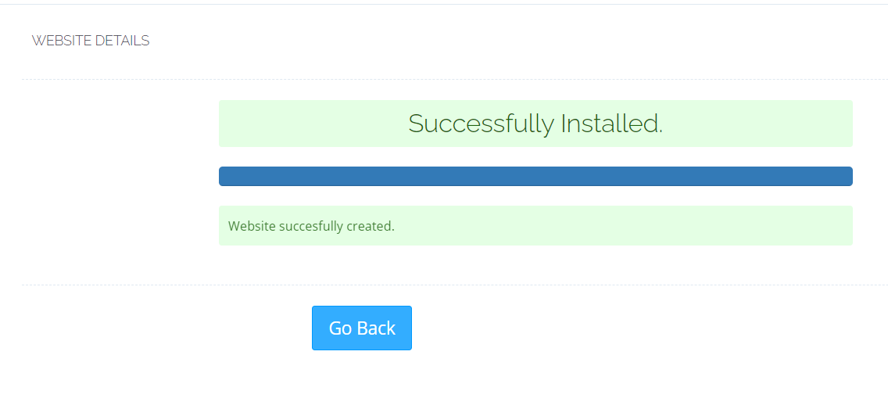

Now to issue SSL for hostname

* On left side menu > Under MAIN section > SSL > Hostname SSL.
* Select website : your website.
* Issue SSL.
  
  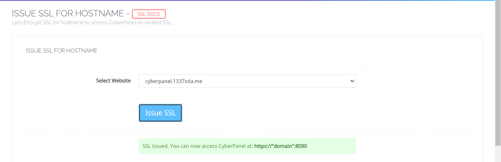

* Now you can access CyberPanel at `https://<your_domain>:8090`.

**When you're done creating the website, we will change the hostname back to the original hostname.**

* Login to the server
* Set the hostname
  ```shell
  hostnamectl set-hostname cyberpanel.1337xda.me
  ```

* To check the hostname
  ```shell
  hostnamectl
  ```

* Restart litespeed server
  ```shell
  systemctl restart lscpd
  ```

## Step 6 - Configure rewrite rules and install WordPress

On left side menu > Websites > List Websites.

Click "Manage" of your select website.


* Under CONFIGURATIONS section > Rewrite Rules > Select Template > `Force HTTP -> HTTPS` > Save Rewrite Rules.
  
  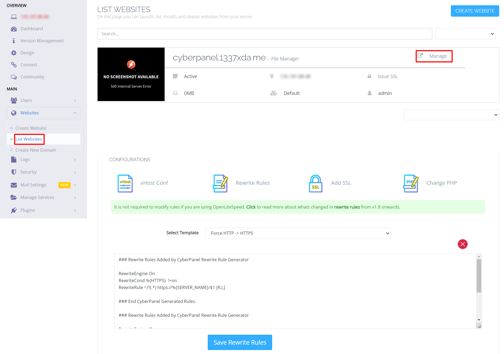

* Under APPLICATION INSTALLER section > Select "WP + LSCache" > Fill your information > Install now.
  
  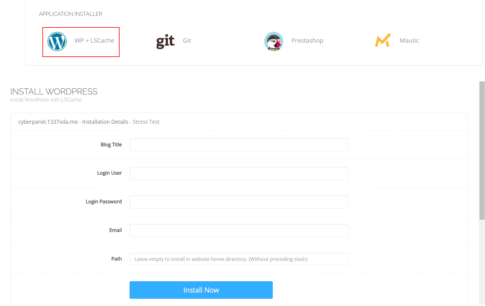
  
  It will automatically create a database .. so after WordPress is installed, we will find the database information.

* Under FILES section > open "File Manager" > Go to `public_html` > select `wp-config.php` > edit. You will see your database information. Copy and save it somewhere.
  
  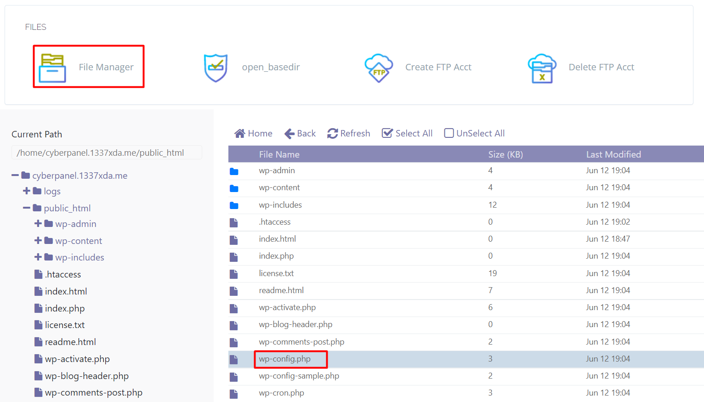

## Step 7 - Configure PHP for upload_max_filesize & post_max_size

* Go to CyberPanel home.
* On left side menu > under SERVER section > PHP > Edit PHP configs.
* Select PHP version ( our WordPress install with PHP 8.3) so select PHP 8.3.
* Edit as you like.
* Save change
* Restart PHP.

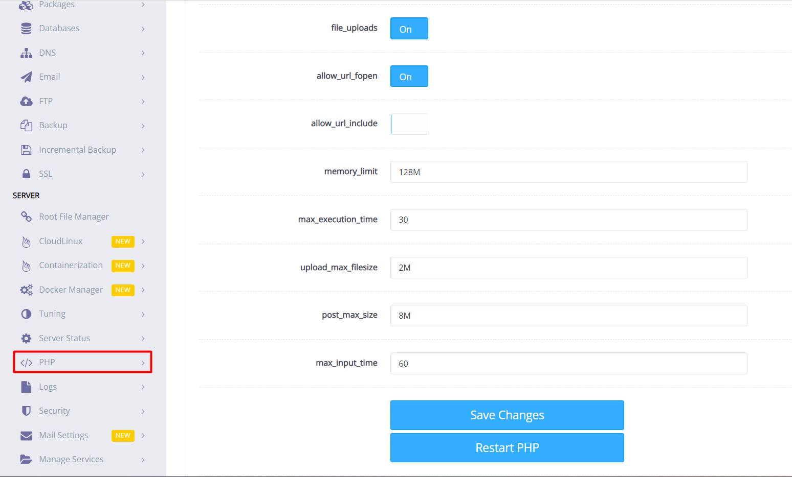

## Conclusion

Thank you for following my tutorial. While reading this, you should already be happy with your CyberPanel and WordPress installation on Ubuntu 20.04 / 22.04.

Now you can modify your WordPress site themes, plugins... etc. There are tons of great resources on the [WordPress website](https://wordpress.org/).

The free version of CyberPanel includes a lot of features you might want to use. Just explore and learn it. Be happy with Linux Server.

### License: MIT

<!--

Contributor's Certificate of Origin

By making a contribution to this project, I certify that:

(a) The contribution was created in whole or in part by me and I have
    the right to submit it under the license indicated in the file; or

(b) The contribution is based upon previous work that, to the best of my
    knowledge, is covered under an appropriate license and I have the
    right under that license to submit that work with modifications,
    whether created in whole or in part by me, under the same license
    (unless I am permitted to submit under a different license), as
    indicated in the file; or

(c) The contribution was provided directly to me by some other person
    who certified (a), (b) or (c) and I have not modified it.

(d) I understand and agree that this project and the contribution are
    public and that a record of the contribution (including all personal
    information I submit with it, including my sign-off) is maintained
    indefinitely and may be redistributed consistent with this project
    or the license(s) involved.

Signed-off-by: Minnthu Aung < rk.boy1500@gmail.com >

-->
